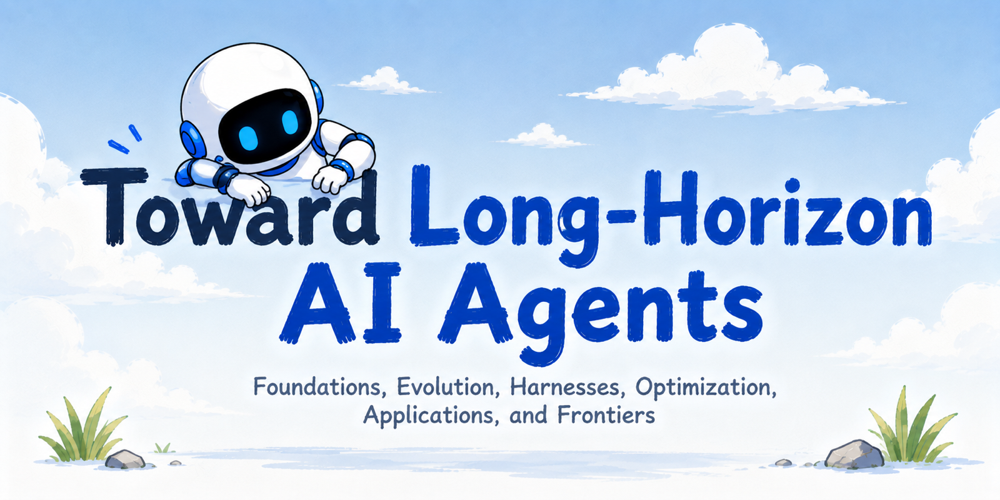
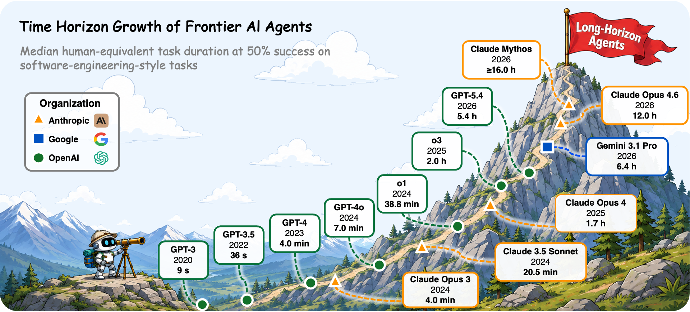

<div align="center">



[](https://github.com/RUC-NLPIR/Awesome-Long-Horizon-Agents/blob/main/Towards_Long_Horizon_Agents_A_Survey.pdf)
[](https://Long-Horizon-Agents.github.io)
[](https://github.com/RUC-NLPIR/Awesome-Long-Horizon-Agents/pulls)
[](LICENSE)
[](https://github.com/RUC-NLPIR/Awesome-Long-Horizon-Agents)


*A curated, continuously-updated reading list accompanying our paper on **long-horizon AI agents**.*

</div>

##  News
- **[2026/07]** 📄 Our paper **Toward Long-Horizon AI Agents: Foundation, Evolution, Harness, Optimization, Application, and Frontier** is available (arXiv link coming soon).
- **[2026/07]** 🚀 We released the paper list for **Toward Long-Horizon AI Agents**, restructured to mirror the paper chapter-by-chapter.
- **[2026/07]** 🙌 Contributions are welcome: add a missing work in PR (`[Venue Year] Title. [paper] [code]`).


<div align="center">

<br>
<em><b>Figure 1.</b> The <b>time horizon</b> of frontier AI agents is growing exponentially, roughly doubling every few months.</em>
</div>

---

##  Introduction


Large language models have evolved from single-turn chatbots into the decision-making core of autonomous agents. As Figure 1 shows, the time horizon of tasks they can complete unaided is growing exponentially. This surfaces one decisive requirement we call **long horizon**: persistent iteration across reasoning, tool use, observation, and revision over many interdependent steps — from tasks within a single context window to those spanning windows, sessions, or open-ended task streams.

Our survey frames **long-horizon agency** as a system-level capability jointly shaped by two forces:

- **Externalized harness engineering**: loops and workflows, context and memory, tools and skills, orchestration, hooks, and verification.
- **Internalized model optimization**: architecture, data and environment synthesis, pre-/mid-training, fine-tuning, agentic reinforcement learning, on-policy distillation, and self-evolution.

The two sides co-evolve through experience and feedback: capabilities first implemented explicitly in the harness may later be internalized into the model policy, while stronger policies in turn enable more capable harnesses. Figure 2 lays out this co-evolutionary landscape end to end.

<div align="center">

<br>
<em><b>Figure 2.</b> The landscape of long-horizon agent research, organized around externalized <b>harness</b> engineering and internalized model <b>optimization</b>.</em>
</div>


---

##  Table of Contents

- [Foundations: Formalizing Long-Horizon Agents](#foundations-formalizing-long-horizon-agents)
- [Evolution: From Prompting to Runtime](#evolution-from-prompting-to-runtime)
  - [Stage I — Prompt Engineering (2020–2023)](#stage-i--prompt-engineering-20202023)
  - [Stage II — Context Engineering (2023–2025)](#stage-ii--context-engineering-20232025)
  - [Stage III — Runtime Harnesses (2025–Present)](#stage-iii--runtime-harnesses-2025present)
- [Harnesses: Externalizing Long-Horizon Capability (Pillar I)](#harnesses-externalizing-long-horizon-capability-pillar-i)
  - [Loops and Workflows](#loops-and-workflows)
  - [Context and Memory](#context-and-memory)
  - [Tools, MCP, and Skills](#tools-mcp-and-skills)
  - [Orchestration](#orchestration)
  - [Hooks and Middleware](#hooks-and-middleware)
  - [Verification](#verification)
- [Optimization: Internalizing Long-Horizon Capability (Pillar II)](#optimization-internalizing-long-horizon-capability-pillar-ii)
  - [Architectural Substrate](#architectural-substrate)
  - [Data and Environment Synthesis](#data-and-environment-synthesis)
  - [Pre-training and Mid-training](#pre-training-and-mid-training)
  - [Fine-tuning](#fine-tuning)
  - [Agentic Reinforcement Learning](#agentic-reinforcement-learning)
  - [On-Policy Distillation](#on-policy-distillation)
  - [Self-Evolution](#self-evolution)
- [Applications: Long-Horizon Agents in Practice](#applications-long-horizon-agents-in-practice)
  - [Software Engineering](#software-engineering)
  - [Information Seeking](#information-seeking)
  - [Computer Use](#computer-use)
  - [Multimodal Agents](#multimodal-agents)
  - [General-Purpose Agents](#general-purpose-agents)
- [Benchmarks and Resources](#benchmarks-and-resources)
- [Frontiers: Open Problems](#frontiers-open-problems)
- [Citation](#citation)
- [Contributing](#contributing)

---

##  Foundations: Formalizing Long-Horizon Agents

<div align="center">

<br>
<em><b>Section figure.</b> Three levels of long-horizon tasks (H1 ⊂ H2 ⊂ H3) and their required capabilities (C1 ⊂ C2 ⊂ C3).</em>
</div>

<br>

We formalize a long-horizon agent as a base policy coupled to a surrounding harness, $\mathrm{Agent}=\pi_\theta\oplus\mathcal{H}$, and organize long-horizon difficulty into **three nested levels (H1 ⊂ H2 ⊂ H3)**, each paired with the capability it demands (C1 ⊂ C2 ⊂ C3):

| Level | Task horizon | Demanded capability |
|:---:|:---|:---|
| **H1** | Intra-context, within one window (~minutes) | **C1** — Intra-context interactive reasoning |
| **H2** | Cross-context, across windows/sessions (~hours–days) | **C2** — Cross-context state & memory |
| **H3** | Cross-task, open-ended task stream | **C3** — Cross-task experience accumulation |

To make the notion of "horizon" concrete, [METR](https://arxiv.org/abs/2503.14499) measures capability as the length of tasks an agent can complete at a fixed success rate (e.g., the 50%-task-completion time horizon), giving an empirical yardstick that separates long-horizon agency from adjacent notions such as long-running execution, autonomy, and self-evolution.


**Key references**
- **`arXiv 2025`** Levels of Autonomy for AI Agents. [[paper](https://arxiv.org/abs/2506.12469)]
- **`arXiv 2025`** Forecasting AI Time Horizon Under Compute Slowdowns. [[paper](https://arxiv.org/abs/2511.19492)]

---

##  Evolution: From Prompting to Runtime

<div align="center">

<br>
<em><b>Section figure.</b> Three stages of co-evolution: from the <b>language</b> of a prompt, to the <b>information</b> per call, to the whole <b>trajectory</b> sustained by a runtime harness.</em>
</div>

### Stage I — Prompt Engineering (2020–2023)

- **`NeurIPS 2020`** Language Models are Few-Shot Learners. [[paper](https://arxiv.org/abs/2005.14165)]
- **`NeurIPS 2022`** Chain-of-Thought Prompting Elicits Reasoning in Large Language Models. [[paper](https://arxiv.org/abs/2201.11903)]
- **`NeurIPS 2022`** Large Language Models are Zero-Shot Reasoners. [[paper](https://arxiv.org/abs/2205.11916)]
- **`ICLR 2023`** Self-Consistency Improves Chain of Thought Reasoning in Language Models. [[paper](https://arxiv.org/abs/2203.11171)]
- **`ICLR 2023`** Least-to-Most Prompting Enables Complex Reasoning in Large Language Models. [[paper](https://arxiv.org/abs/2205.10625)]
- **`ICLR 2023`** ReAct: Synergizing Reasoning and Acting in Language Models. [[paper](https://arxiv.org/abs/2210.03629)] [[code](https://github.com/ysymyth/ReAct)]
- **`ICML 2023`** PAL: Program-aided Language Models. [[paper](https://arxiv.org/abs/2211.10435)] [[code](https://github.com/reasoning-machines/pal)]
- **`TMLR 2023`** Program of Thoughts Prompting: Disentangling Computation from Reasoning for Numerical Reasoning Tasks. [[paper](https://arxiv.org/abs/2211.12588)] [[code](https://github.com/TIGER-AI-Lab/Program-of-Thoughts)]
- **`NeurIPS 2023`** Tree of Thoughts: Deliberate Problem Solving with Large Language Models. [[paper](https://arxiv.org/abs/2305.10601)] [[code](https://github.com/princeton-nlp/tree-of-thought-llm)]
- **`CoRL 2022`** Do As I Can, Not As I Say: Grounding Language in Robotic Affordances. [[paper](https://arxiv.org/abs/2204.01691)] [[code](https://github.com/google-research/google-research/tree/master/saycan)]
- **`NeurIPS 2022`** Training Language Models to Follow Instructions with Human Feedback. [[paper](https://arxiv.org/abs/2203.02155)]
- **`ICLR 2023`** Large Language Models Are Human-Level Prompt Engineers. [[paper](https://arxiv.org/abs/2211.01910)] [[code](https://github.com/keirp/automatic_prompt_engineer)]
- **`EMNLP 2023`** Automatic Prompt Optimization with “Gradient Descent” and Beam Search. [[paper](https://arxiv.org/abs/2305.03495)]
- **`arXiv 2021`** Show Your Work: Scratchpads for Intermediate Computation with Language Models. [[paper](https://arxiv.org/abs/2112.00114)]
- **`EMNLP-IJCNLP 2019`** Language Models as Knowledge Bases?. [[paper](https://arxiv.org/abs/1909.01066)]
- **`NeurIPS 2023`** Describe, Explain, Plan and Select: Interactive Planning with LLMs Enables Open-World Multi-Task Agents. [[paper](https://arxiv.org/abs/2302.01560)]

### Stage II — Context Engineering (2023–2025)

- **`NeurIPS 2020`** Retrieval-Augmented Generation for Knowledge-Intensive NLP Tasks. [[paper](https://arxiv.org/abs/2005.11401)]
- **`ACL 2023`** Precise Zero-Shot Dense Retrieval without Relevance Labels. [[paper](https://arxiv.org/abs/2212.10496)]
- **`ICLR 2024`** RAPTOR: Recursive Abstractive Processing for Tree-Organized Retrieval. [[paper](https://arxiv.org/abs/2401.18059)] [[code](https://github.com/parthsarthi03/raptor)]
- **`ICLR 2024`** Self-RAG: Learning to Retrieve, Generate, and Critique through Self-Reflection. [[paper](https://arxiv.org/abs/2310.11511)] [[code](https://github.com/AkariAsai/self-rag)]
- **`NeurIPS 2023`** Toolformer: Language Models Can Teach Themselves to Use Tools. [[paper](https://arxiv.org/abs/2302.04761)]
- **`NeurIPS 2024`** Gorilla: Large Language Model Connected with Massive APIs. [[paper](https://arxiv.org/abs/2305.15334)] [[code](https://github.com/ShishirPatil/gorilla)]
- **`ICLR 2024`** ToolLLM: Facilitating Large Language Models to Master 16000+ Real-world APIs. [[paper](https://arxiv.org/abs/2307.16789)] [[code](https://github.com/OpenBMB/ToolBench)]
- **`arXiv 2021`** WebGPT: Browser-assisted Question-answering with Human Feedback. [[paper](https://arxiv.org/abs/2112.09332)]
- **`NeurIPS 2023`** HuggingGPT: Solving AI Tasks with ChatGPT and its Friends in Hugging Face. [[paper](https://arxiv.org/abs/2303.17580)] [[code](https://github.com/microsoft/JARVIS)]
- **`NeurIPS 2022`** FlashAttention: Fast and Memory-Efficient Exact Attention with IO-Awareness. [[paper](https://arxiv.org/abs/2205.14135)] [[code](https://github.com/Dao-AILab/flash-attention)]
- **`TACL 2024`** Lost in the Middle: How Language Models Use Long Contexts. [[paper](https://arxiv.org/abs/2307.03172)]
- **`arXiv 2023`** MemGPT: Towards LLMs as Operating Systems. [[paper](https://arxiv.org/abs/2310.08560)] [[code](https://github.com/letta-ai/letta)]
- **`UIST 2023`** Generative Agents: Interactive Simulacra of Human Behavior. [[paper](https://arxiv.org/abs/2304.03442)] [[code](https://github.com/joonspk-research/generative_agents)]
- **`EMNLP 2023`** LLMLingua: Compressing Prompts for Accelerated Inference of Large Language Models. [[paper](https://arxiv.org/abs/2310.05736)] [[code](https://github.com/microsoft/LLMLingua)]
- **`arXiv 2023`** Retrieval-Augmented Generation for Large Language Models: A Survey. [[paper](https://arxiv.org/abs/2312.10997)]
- **`ICML 2020`** REALM: Retrieval-Augmented Language Model Pre-Training. [[paper](https://arxiv.org/abs/2002.08909)]
- **`arXiv 2024`** RULER: What's the Real Context Size of Your Long-Context Language Models?. [[paper](https://arxiv.org/abs/2404.06654)]
- **`arXiv 2025`** ACON: Optimizing Context Compression for Long-horizon LLM Agents. [[paper](https://arxiv.org/abs/2510.00615)]
- **`arXiv 2025`** A Survey of Context Engineering for Large Language Models. [[paper](https://arxiv.org/abs/2507.13334)]
- **`arXiv 2023`** ToolAlpaca: Generalized Tool Learning for Language Models with 3000 Simulated Cases. [[paper](https://arxiv.org/abs/2306.05301)]
- **`TACL 2022`** ♫ MuSiQue: Multihop Questions via Single-hop Question Composition. [[paper](https://arxiv.org/abs/2108.00573)]
- **`ACL 2024`** ∞Bench: Extending Long Context Evaluation Beyond 100K Tokens. [[paper](https://arxiv.org/abs/2402.13718)]

### Stage III — Runtime Harnesses (2025–Present)

- **`NeurIPS 2023`** Reflexion: Language Agents with Verbal Reinforcement Learning. [[paper](https://arxiv.org/abs/2303.11366)] [[code](https://github.com/noahshinn/reflexion)]
- **`NeurIPS 2023`** Self-Refine: Iterative Refinement with Self-Feedback. [[paper](https://arxiv.org/abs/2303.17651)] [[code](https://github.com/madaan/self-refine)]
- **`ICML 2024`** Executable Code Actions Elicit Better LLM Agents. [[paper](https://arxiv.org/abs/2402.01030)] [[code](https://github.com/xingyaoww/code-act)]
- **`ICLR 2024`** MetaGPT: Meta Programming for A Multi-Agent Collaborative Framework. [[paper](https://arxiv.org/abs/2308.00352)] [[code](https://github.com/FoundationAgents/MetaGPT)]
- **`COLM 2024`** AutoGen: Enabling Next-Gen LLM Applications via Multi-Agent Conversation. [[paper](https://arxiv.org/abs/2308.08155)] [[code](https://github.com/microsoft/autogen)]
- **`ACL 2024`** ChatDev: Communicative Agents for Software Development. [[paper](https://arxiv.org/abs/2307.07924)] [[code](https://github.com/OpenBMB/ChatDev)]
- **`arXiv 2024`** Magentic-One: A Generalist Multi-Agent System for Solving Complex Tasks. [[paper](https://arxiv.org/abs/2411.04468)] [[code](https://github.com/microsoft/autogen)]
- **`Open standard 2024`** Model Context Protocol. [[paper](https://modelcontextprotocol.io/)] [[code](https://github.com/modelcontextprotocol)]
- **`ICLR 2025`** OpenHands: An Open Platform for AI Software Developers as Generalist Agents. [[paper](https://arxiv.org/abs/2407.16741)] [[code](https://github.com/All-Hands-AI/OpenHands)]
- **`NeurIPS 2024`** SWE-agent: Agent-Computer Interfaces Enable Automated Software Engineering. [[paper](https://arxiv.org/abs/2405.15793)] [[code](https://github.com/SWE-agent/SWE-agent)]
- **`ICLR 2026`** Darwin Gödel Machine: Open-Ended Evolution of Self-Improving Agents. [[paper](https://arxiv.org/abs/2505.22954)]
- **`COLM 2025`** Search-R1: Training LLMs to Reason and Leverage Search Engines with Reinforcement Learning. [[paper](https://arxiv.org/abs/2503.09516)] [[code](https://github.com/PeterGriffinJin/Search-R1)]
- **`Web specification 2025`** AGENTS.md. [[paper](https://agents.md/)]
- **`arXiv 2024`** AutoFlow: Automated Workflow Generation for Large Language Model Agents. [[paper](https://arxiv.org/abs/2407.12821)]
- **`arXiv 2026`** Agents' Last Exam. [[paper](https://arxiv.org/abs/2606.05405)]
- **`arXiv 2026`** Before the Tool Call: Deterministic Pre-Action Authorization for Autonomous AI Agents. [[paper](https://arxiv.org/abs/2603.20953)]
- **`arXiv 2026`** Claw-R1: A Step-Level Data Middleware System for Agentic Reinforcement Learning. [[paper](https://arxiv.org/abs/2606.09138)]
- **`arXiv 2025`** SEW: Self-Evolving Agentic Workflows for Automated Code Generation. [[paper](https://arxiv.org/abs/2505.18646)]
- **`arXiv 2026`** RLAnything: Forge Environment, Policy, and Reward Model in Completely Dynamic RL System. [[paper](https://arxiv.org/abs/2602.02488)]
- **`FSE 2026`** AgentBound: Securing Execution Boundaries of AI Agents. [[paper](https://arxiv.org/abs/2510.21236)]
- **`arXiv 2025`** UI-TARS-2 Technical Report: Advancing GUI Agent with Multi-Turn Reinforcement Learning. [[paper](https://arxiv.org/abs/2509.02544)]

---

##  Harnesses: Externalizing Long-Horizon Capability (Pillar I)

<div align="center">

<br>
<em><b>Section figure.</b> An agent harness in action: six components sustain a single goal across many dependent steps.</em>
</div>

### Loops and Workflows

**Linear Workflows**
- **`ICLR 2023`** ReAct: Synergizing Reasoning and Acting in Language Models. [[paper](https://arxiv.org/abs/2210.03629)] [[code](https://github.com/ysymyth/ReAct)]
- **`NeurIPS 2023`** Reflexion: Language Agents with Verbal Reinforcement Learning. [[paper](https://arxiv.org/abs/2303.11366)] [[code](https://github.com/noahshinn/reflexion)]
- **`NeurIPS 2023`** Self-Refine: Iterative Refinement with Self-Feedback. [[paper](https://arxiv.org/abs/2303.17651)] [[code](https://github.com/madaan/self-refine)]
- **`ICLR 2024`** Self-RAG: Learning to Retrieve, Generate, and Critique through Self-Reflection. [[paper](https://arxiv.org/abs/2310.11511)] [[code](https://github.com/AkariAsai/self-rag)]
- **`TMLR 2024`** Cognitive Architectures for Language Agents. [[paper](https://arxiv.org/abs/2309.02427)] [[code](https://github.com/ysymyth/awesome-language-agents)]
- **`IEEE ICAIBD 2025`** A Survey on Agent Workflow - Status and Future. [[paper](https://arxiv.org/abs/2508.01186)]

**Plan-Execute Workflows**
- **`ACL 2023`** Plan-and-Solve Prompting: Improving Zero-Shot Chain-of-Thought Reasoning by Large Language Models. [[paper](https://arxiv.org/abs/2305.04091)] [[code](https://github.com/AGI-Edgerunners/Plan-and-Solve-Prompting)]
- **`arXiv 2023`** ReWOO: Decoupling Reasoning from Observations for Efficient Augmented Language Models. [[paper](https://arxiv.org/abs/2305.18323)] [[code](https://github.com/billxbf/ReWOO)]
- **`Findings of NAACL 2024`** ADaPT: As-Needed Decomposition and Planning with Language Models. [[paper](https://arxiv.org/abs/2311.05772)] [[code](https://github.com/archiki/ADaPT)]
- **`arXiv 2026`** O-Researcher: An Open Ended Deep Research Model via Multi-Agent Distillation and Agentic RL. [[paper](https://arxiv.org/abs/2601.03743)]
- **`arXiv 2026`** Toward Generalist Autonomous Research via Hypothesis-Tree Refinement. [[paper](https://arxiv.org/abs/2606.11926)]
- **`arXiv 2026`** Verified Multi-Agent Orchestration: A Plan-Execute-Verify-Replan Framework for Complex Query Resolution. [[paper](https://arxiv.org/abs/2603.11445)]

**Branching Workflows**
- **`NeurIPS 2023`** Tree of Thoughts: Deliberate Problem Solving with Large Language Models. [[paper](https://arxiv.org/abs/2305.10601)] [[code](https://github.com/princeton-nlp/tree-of-thought-llm)]
- **`ICLR 2023`** Self-Consistency Improves Chain of Thought Reasoning in Language Models. [[paper](https://arxiv.org/abs/2203.11171)]
- **`ICML 2024`** Language Agent Tree Search Unifies Reasoning Acting and Planning in Language Models. [[paper](https://arxiv.org/abs/2310.04406)] [[code](https://github.com/lapisrocks/LanguageAgentTreeSearch)]
- **`NAACL 2025`** CodeTree: Agent-guided Tree Search for Code Generation with Large Language Models. [[paper](https://arxiv.org/abs/2411.04329)]
- **`AAMAS 2026`** ReAcTree: Hierarchical LLM Agent Trees with Control Flow for Long-Horizon Task Planning. [[paper](https://arxiv.org/abs/2511.02424)]
- **`AAAI 2024`** Graph of Thoughts: Solving Elaborate Problems with Large Language Models. [[paper](https://doi.org/10.1609/AAAI.V38I16.29720)]
- **`TMLR 2025`** Tree Search for Language Model Agents. [[paper](https://openreview.net/forum?id=QF0N3x2XVm)]
- **`Findings of ACL 2026`** Chain-in-Tree: Back to Sequential Reasoning in LLM Tree Search. [[paper](https://aclanthology.org/2026.findings-acl.214/)]
- **`arXiv 2025`** Sherlock: Reliable and Efficient Agentic Workflow Execution. [[paper](https://arxiv.org/abs/2511.00330)]

### Context and Memory

**Working Context (discard / compress / select)**
- **`Anthropic Blog 2025`** Effective Context Engineering for AI Agents. [[paper](https://www.anthropic.com/engineering/effective-context-engineering-for-ai-agents)]
- **`arXiv 2025`** ReSum: Unlocking Long-Horizon Search Intelligence via Context Summarization. [[paper](https://arxiv.org/abs/2509.13313)] [[code](https://github.com/Alibaba-NLP/DeepResearch)]
- **`ICLR 2026`** MemAgent: Reshaping Long-Context LLM with Multi-Conv RL-based Memory Agent. [[paper](https://arxiv.org/abs/2507.02259)] [[code](https://github.com/BytedTsinghua-SIA/MemAgent)]
- **`ICLR 2026`** MEM1: Learning to Synergize Memory and Reasoning for Efficient Long-Horizon Agents. [[paper](https://arxiv.org/abs/2506.15841)] [[code](https://github.com/MIT-MI/MEM1)]
- **`ACL 2025`** HiAgent: Hierarchical Working Memory Management for Solving Long-Horizon Agent Tasks with Large Language Model. [[paper](https://arxiv.org/abs/2408.09559)] [[code](https://github.com/HiAgent2024/HiAgent)]
- **`ICLR 2026`** Agentic Context Engineering: Evolving Contexts for Self-Improving Language Models. [[paper](https://arxiv.org/abs/2510.04618)]
- **`ACL Findings 2026`** Memory-as-Action: Autonomous Context Curation for Long-Horizon Agentic Tasks. [[paper](https://arxiv.org/abs/2510.12635)] [[code](https://github.com/ADaM-BJTU/MemAct)]
- **`arXiv 2025`** DeepSeek-V3.2: Pushing the Frontier of Open Large Language Models. [[paper](https://arxiv.org/abs/2512.02556)]
- **`arXiv 2026`** MiroThinker-1.7 & H1: Towards Heavy-Duty Research Agents via Verification. [[paper](https://arxiv.org/abs/2603.15726)]
- **`arXiv 2025`** IterResearch: Rethinking Long-Horizon Agents with Interaction Scaling. [[paper](https://arxiv.org/abs/2511.07327)]
- **`arXiv 2026`** AgentFugue: Agent Scaling for Long-Horizon Tasks through Collective Reasoning. [[paper](https://arxiv.org/abs/2605.24486)]
- **`arXiv 2026`** ContextBudget: Budget-Aware Context Management for Long-Horizon Search Agents. [[paper](https://arxiv.org/abs/2604.01664)]
- **`AAMAS 2026`** LEGOMem: Modular Procedural Memory for Multi-agent LLM Systems for Workflow Automation. [[paper](https://arxiv.org/abs/2510.04851)]
- **`arXiv 2026`** Memex(RL): Scaling Long-Horizon LLM Agents via Indexed Experience Memory. [[paper](https://arxiv.org/abs/2603.04257)]
- **`arXiv 2026`** SAM: State-Adaptive Memory for Long-Horizon Reasoning Agent. [[paper](https://arxiv.org/abs/2605.24468)]
- **`arXiv 2025`** Agent KB: Leveraging Cross-Domain Experience for Agentic Problem Solving. [[paper](https://arxiv.org/abs/2507.06229)]

**Persistent Memory (factual / experiential)**
- **`ECAI 2025`** Mem0: Building Production-Ready AI Agents with Scalable Long-Term Memory. [[paper](https://arxiv.org/abs/2504.19413)] [[code](https://github.com/mem0ai/mem0)]
- **`NeurIPS 2024`** HippoRAG: Neurobiologically Inspired Long-Term Memory for Large Language Models. [[paper](https://arxiv.org/abs/2405.14831)] [[code](https://github.com/OSU-NLP-Group/HippoRAG)]
- **`NeurIPS 2025`** A-Mem: Agentic Memory for LLM Agents. [[paper](https://arxiv.org/abs/2502.12110)] [[code](https://github.com/agiresearch/A-mem)]
- **`EMNLP 2025`** Memory OS of AI Agent. [[paper](https://arxiv.org/abs/2506.06326)] [[code](https://github.com/BAI-LAB/MemoryOS)]
- **`AAAI 2024`** ExpeL: LLM Agents Are Experiential Learners. [[paper](https://arxiv.org/abs/2308.10144)] [[code](https://github.com/LeapLabTHU/ExpeL)]
- **`ICML 2025`** Agent Workflow Memory. [[paper](https://arxiv.org/abs/2409.07429)] [[code](https://github.com/zorazrw/agent-workflow-memory)]
- **`ICLR 2026`** ReasoningBank: Scaling Agent Self-Evolving with Reasoning Memory. [[paper](https://arxiv.org/abs/2509.25140)]
- **`TMLR 2024`** Voyager: An Open-Ended Embodied Agent with Large Language Models. [[paper](https://arxiv.org/abs/2305.16291)] [[code](https://github.com/MineDojo/Voyager)]
- **`arXiv 2025`** Zep: A Temporal Knowledge Graph Architecture for Agent Memory. [[paper](https://arxiv.org/abs/2501.13956)]
- **`Findings of ACL 2026`** From Storage to Experience: A Survey on the Evolution of LLM Agent Memory Mechanisms. [[paper](https://aclanthology.org/2026.findings-acl.2069/)]
- **`NeurIPS 2025`** G-Memory: Tracing Hierarchical Memory for Multi-Agent Systems. [[paper](https://arxiv.org/abs/2506.07398)]
- **`arXiv 2026`** Trace2Skill: Distill Trajectory-Local Lessons into Transferable Agent Skills. [[paper](https://arxiv.org/abs/2603.25158)]
- **`arXiv 2025`** MIRIX: Multi-Agent Memory System for LLM-Based Agents. [[paper](https://arxiv.org/abs/2507.07957)]
- **`AAAI 2026`** PRIME: Planning and Retrieval-Integrated Memory for Enhanced Reasoning. [[paper](https://doi.org/10.1609/AAAI.V40I39.40612)]
- **`EACL 2026`** H-MEM: Hierarchical Memory for High-Efficiency Long-Term Reasoning in LLM Agents. [[paper](https://doi.org/10.18653/v1/2026.eacl-long.15)]
- **`WWW 2025`** MemoRAG: Boosting Long Context Processing with Global Memory-Enhanced Retrieval Augmentation. [[paper](https://doi.org/10.1145/3696410.3714805)]
- **`ACL 2026`** EverMemOS: A Self-Organizing Memory Operating System for Structured Long-Horizon Reasoning. [[paper](https://doi.org/10.18653/v1/2026.acl-long.2125)]
- **`arXiv 2026`** MemoryArena: Benchmarking Agent Memory in Interdependent Multi-Session Agentic Tasks. [[paper](https://arxiv.org/abs/2602.16313)]
- **`arXiv 2025`** Memory in the Age of AI Agents. [[paper](https://arxiv.org/abs/2512.13564)]
- **`arXiv 2026`** Anatomy of Agentic Memory: Taxonomy and Empirical Analysis of Evaluation and System Limitations. [[paper](https://arxiv.org/abs/2602.19320)]
- **`arXiv 2026`** From Player to Master: Enhancing Test-Time Learning of LLM Agents via Reinforcement Learning over Memory. [[paper](https://arxiv.org/abs/2606.08656)]
- **`arXiv 2026`** Rethinking Memory Mechanisms of Foundation Agents in the Second Half: A Survey. [[paper](https://arxiv.org/abs/2602.06052)]
- **`arXiv 2026`** MemSifter: Offloading LLM Memory Retrieval via Outcome-Driven Proxy Reasoning. [[paper](https://arxiv.org/abs/2603.03379)]
- **`arXiv 2025`** From Human Memory to AI Memory: A Survey on Memory Mechanisms in the Era of LLMs. [[paper](https://arxiv.org/abs/2504.15965)]
- **`arXiv 2026`** Externalization in LLM Agents: A Unified Review of Memory, Skills, Protocols and Harness Engineering. [[paper](https://arxiv.org/abs/2604.08224)]

### Tools, MCP, and Skills

**Tool interfaces & protocols**
- **`NeurIPS 2023`** Toolformer: Language Models Can Teach Themselves to Use Tools. [[paper](https://arxiv.org/abs/2302.04761)]
- **`ICLR 2024`** ToolLLM: Facilitating Large Language Models to Master 16000+ Real-world APIs. [[paper](https://arxiv.org/abs/2307.16789)] [[code](https://github.com/OpenBMB/ToolBench)]
- **`2024`** Model Context Protocol (MCP) Specification. [[paper](https://modelcontextprotocol.io/)] [[code](https://github.com/modelcontextprotocol)]
- **`ICML 2025`** The Berkeley Function Calling Leaderboard (BFCL): From Tool Use to Agentic Evaluation of Large Language Models. [[paper](https://gorilla.cs.berkeley.edu/leaderboard.html)] [[code](https://github.com/ShishirPatil/gorilla)]
- **`ICLR 2025`** τ-bench: A Benchmark for Tool-Agent-User Interaction in Real-World Domains. [[paper](https://arxiv.org/abs/2406.12045)] [[code](https://github.com/sierra-research/tau-bench)]
- **`arXiv 2025`** MCP-Universe: Benchmarking Large Language Models with Real-World Model Context Protocol Servers. [[paper](https://arxiv.org/abs/2508.14704)] [[code](https://github.com/SalesforceAIResearch/MCP-Universe)]
- **`ICML 2026`** ComplexMCP: Evaluation of LLM Agents in Dynamic, Interdependent, and Large-Scale Tool Sandbox. [[paper](https://arxiv.org/abs/2605.10787)]
- **`ICLR 2026`** VitaBench: Benchmarking LLM Agents with Versatile Interactive Tasks in Real-world Applications. [[paper](https://arxiv.org/abs/2509.26490)]
- **`arXiv 2026`** Schema First Tool APIs for LLM Agents: A Controlled Study of Tool Misuse, Recovery, and Budgeted Performance. [[paper](https://arxiv.org/abs/2603.13404)]
- **`arXiv 2026`** AutomationBench. [[paper](https://arxiv.org/abs/2604.18934)]
- **`ICML 2026`** UltraHorizon: Benchmarking LLM-Agent Capabilities in Ultra Long-Horizon Scenarios. [[paper](https://arxiv.org/abs/2509.21766)]
- **`arXiv 2026`** The Evolution of Tool Use in LLM Agents: From Single-Tool Call to Multi-Tool Orchestration. [[paper](https://arxiv.org/abs/2603.22862)]
- **`ICLR 2026`** Benchmarking LLM Tool-Use in the Wild. [[paper](https://arxiv.org/abs/2604.06185)]

**Active tool discovery**
- **`arXiv 2025`** RAG-MCP: Mitigating Prompt Bloat in LLM Tool Selection via Retrieval-Augmented Generation. [[paper](https://arxiv.org/abs/2505.03275)]
- **`ICML 2024`** AnyTool: Self-Reflective, Hierarchical Agents for Large-Scale API Calls. [[paper](https://arxiv.org/abs/2402.04253)] [[code](https://github.com/dyabel/AnyTool)]
- **`arXiv 2025`** MCP-Zero: Active Tool Discovery for Autonomous LLM Agents. [[paper](https://arxiv.org/abs/2506.01056)]
- **`ICLR 2025`** ToolGen: Unified Tool Retrieval and Calling via Generation. [[paper](https://arxiv.org/abs/2410.03439)] [[code](https://github.com/Reason-Wang/ToolGen)]
- **`WWW 2026`** DeepAgent: A General Reasoning Agent with Scalable Toolsets. [[paper](https://arxiv.org/abs/2510.21618)] [[code](https://github.com/RUC-NLPIR/DeepAgent)]
- **`arXiv 2026`** From Tool Orchestration to Code Execution: A Study of MCP Design Choices. [[paper](https://arxiv.org/abs/2602.15945)]
- **`arXiv 2026`** Beyond Semantic Similarity: Rethinking Retrieval for Agentic Search via Direct Corpus Interaction. [[paper](https://arxiv.org/abs/2605.05242)]
- **`arXiv 2025`** From REST to MCP: An Empirical Study of API Wrapping and Automated Server Generation for LLM Agents. [[paper](https://arxiv.org/abs/2507.16044)]
- **`arXiv 2025`** Keyword search is all you need: Achieving RAG-Level Performance without vector databases using agentic tool use. [[paper](https://arxiv.org/abs/2602.23368)]
- **`arXiv 2026`** CodeScout: An Effective Recipe for Reinforcement Learning of Code Search Agents. [[paper](https://arxiv.org/abs/2603.17829)]
- **`arXiv 2026`** Agent Skills for Large Language Models: Architecture, Acquisition, Security, and the Path Forward. [[paper](https://arxiv.org/abs/2602.12430)]

**Skill libraries**
- **`TMLR 2024`** Voyager: An Open-Ended Embodied Agent with Large Language Models. [[paper](https://arxiv.org/abs/2305.16291)] [[code](https://github.com/MineDojo/Voyager)]
- **`2025`** Introducing Agent Skills. [[paper](https://www.anthropic.com/news/agent-skills)]

- **`arXiv 2026`** SKILL0: In-Context Agentic Reinforcement Learning for Skill Internalization. [[paper](https://arxiv.org/abs/2604.02268)]
- **`arXiv 2025`** Alita: Generalist Agent Enabling Scalable Agentic Reasoning with Minimal Predefinition and Maximal Self-Evolution. [[paper](https://arxiv.org/abs/2505.20286)]
- **`COLM 2025`** Agent S2: A Compositional Generalist-Specialist Framework for Computer Use Agents. [[paper](https://arxiv.org/abs/2504.00906)]
- **`arXiv 2026`** SkillCraft: Can LLM Agents Learn to Use Tools Skillfully?. [[paper](https://arxiv.org/abs/2603.00718)]
- **`arXiv 2026`** Organizing, Orchestrating, and Benchmarking Agent Skills at Ecosystem Scale. [[paper](https://arxiv.org/abs/2603.02176)]
- **`arXiv 2026`** When Single-Agent with Skills Replace Multi-Agent Systems and When They Fail. [[paper](https://arxiv.org/abs/2601.04748)]
- **`arXiv 2026`** SkillGraph: Skill-Augmented Reinforcement Learning for Agents via Evolving Skill Graphs. [[paper](https://arxiv.org/abs/2605.12039)]
- **`arXiv 2025`** Memento: Fine-tuning LLM Agents without Fine-tuning LLMs. [[paper](https://arxiv.org/abs/2508.16153)]
- **`ICML 2026`** Skill-Pro: Learning Reusable Skills from Experience via Non-Parametric PPO for LLM Agents. [[paper](https://arxiv.org/abs/2602.01869)]
- **`ICML 2026`** SEAgent: Self-Evolving Computer Use Agent with Autonomous Learning from Experience. [[paper](https://arxiv.org/abs/2508.04700)]
- **`arXiv 2026`** Beyond Static Tools: Test-Time Tool Evolution for Scientific Reasoning. [[paper](https://arxiv.org/abs/2601.07641)]
- **`arXiv 2026`** GraSP: Graph-Structured Skill Compositions for LLM Agents. [[paper](https://arxiv.org/abs/2604.17870)]
- **`arXiv 2026`** From Chatbot to Digital Colleague: The Paradigm Shift Toward Persistent Autonomous AI. [[paper](https://arxiv.org/abs/2606.14502)]
- **`arXiv 2026`** A Comprehensive Survey on Agent Skills: Taxonomy, Techniques, and Applications. [[paper](https://arxiv.org/abs/2605.07358)]
- **`arXiv 2026`** SkillNet: Create, Evaluate, and Connect AI Skills. [[paper](https://arxiv.org/abs/2603.04448)]

### Orchestration

**Decomposition & roles**
- **`ICLR 2024`** MetaGPT: Meta Programming for A Multi-Agent Collaborative Framework. [[paper](https://arxiv.org/abs/2308.00352)] [[code](https://github.com/FoundationAgents/MetaGPT)]
- **`NeurIPS 2023`** CAMEL: Communicative Agents for "Mind" Exploration of Large Language Model Society. [[paper](https://arxiv.org/abs/2303.17760)] [[code](https://github.com/camel-ai/camel)]
- **`ACL 2024`** ChatDev: Communicative Agents for Software Development. [[paper](https://arxiv.org/abs/2307.07924)] [[code](https://github.com/OpenBMB/ChatDev)]
- **`COLM 2024`** AutoGen: Enabling Next-Gen LLM Applications via Multi-Agent Conversations. [[paper](https://arxiv.org/abs/2308.08155)] [[code](https://github.com/microsoft/autogen)]
- **`Neural Networks 2025`** TDAG: A Multi-Agent Framework based on Dynamic Task Decomposition and Agent Generation. [[paper](https://arxiv.org/abs/2402.10178)]
- **`ICLR 2025`** Agent-Oriented Planning in Multi-Agent Systems. [[paper](https://arxiv.org/abs/2410.02189)]

**Coordination topologies**
- **`arXiv 2024`** Magentic-One: A Generalist Multi-Agent System for Solving Complex Tasks. [[paper](https://arxiv.org/abs/2411.04468)] [[code](https://github.com/microsoft/autogen)]
- **`ICLR 2024`** AgentVerse: Facilitating Multi-Agent Collaboration and Exploring Emergent Behaviors. [[paper](https://arxiv.org/abs/2308.10848)] [[code](https://github.com/OpenBMB/AgentVerse)]
- **`ICLR 2025`** Mixture-of-Agents Enhances Large Language Model Capabilities. [[paper](https://arxiv.org/abs/2406.04692)] [[code](https://github.com/togethercomputer/MoA)]
- **`arXiv 2023`** A Dynamic LLM-Powered Agent Network for Task-Oriented Agent Collaboration. [[paper](https://arxiv.org/abs/2310.02170)] [[code](https://github.com/SALT-NLP/DyLAN)]
- **`ICLR 2025`** Scaling Large Language Model-based Multi-Agent Collaboration. [[paper](https://arxiv.org/abs/2406.07155)] [[code](https://github.com/OpenBMB/ChatDev)]
- **`ICLR 2026`** Flash-Searcher: Fast and Effective Web Agents via DAG-Based Parallel Execution. [[paper](https://arxiv.org/abs/2509.25301)]
- **`NeurIPS 2024`** Self-playing Adversarial Language Game Enhances LLM Reasoning. [[paper](http://papers.nips.cc/paper_files/paper/2024/hash/e4be7e9867ef163563f4a5e90cec478f-Abstract-Conference.html)]
- **`NeurIPS 2025`** Agint: Agentic Graph Compilation for Software Engineering Agents. [[paper](https://arxiv.org/abs/2511.19635)]
- **`arXiv 2025`** Multi-Agent Collaboration Mechanisms: A Survey of LLMs. [[paper](https://arxiv.org/abs/2501.06322)]

**Orchestration optimization**
- **`ICLR 2025`** AFlow: Automating Agentic Workflow Generation. [[paper](https://arxiv.org/abs/2410.10762)] [[code](https://github.com/FoundationAgents/AFlow)]
- **`ICML 2024`** GPTSwarm: Language Agents as Optimizable Graphs. [[paper](https://arxiv.org/abs/2402.16823)] [[code](https://github.com/metauto-ai/gptswarm)]
- **`ACL 2025`** MasRouter: Learning to Route LLMs for Multi-Agent Systems. [[paper](https://arxiv.org/abs/2502.11133)] [[code](https://github.com/yanweiyue/masrouter)]
- **`EMNLP 2025`** SwarmAgentic: Towards Fully Automated Agentic System Generation via Swarm Intelligence. [[paper](https://arxiv.org/abs/2506.15672)]
- **`NeurIPS 2025`** Multi-Agent Collaboration via Evolving Orchestration. [[paper](http://papers.nips.cc/paper_files/paper/2025/hash/f1320d2e2842169c6fc89dcbd80e94d0-Abstract-Conference.html)]
- **`arXiv 2025`** AgentOrchestra: Orchestrating Multi-Agent Intelligence with the Tool-Environment-Agent (TEA) Protocol. [[paper](https://arxiv.org/abs/2506.12508)]
- **`ICML 2026`** AOrchestra: Automating Sub-Agent Creation for Agentic Orchestration. [[paper](https://arxiv.org/abs/2602.03786)]
- **`arXiv 2026`** CORAL: Towards Autonomous Multi-Agent Evolution for Open-Ended Discovery. [[paper](https://arxiv.org/abs/2604.01658)]
- **`arXiv 2026`** Drop the Hierarchy and Roles: How Self-Organizing LLM Agents Outperform Designed Structures. [[paper](https://arxiv.org/abs/2603.28990)]

**Agent protocols**
- **`2025`** Agent2Agent (A2A) Protocol Specification. [[paper](https://a2a-protocol.org/latest/specification/)] [[code](https://github.com/a2aproject/A2A)]
- **`2025`** Agent Communication Protocol (ACP, IBM). [[paper](https://agentcommunicationprotocol.dev/)]
- **`2024`** Model Context Protocol (MCP) Specification. [[paper](https://modelcontextprotocol.io/)] [[code](https://github.com/modelcontextprotocol)]
- **`arXiv 2025`** A Survey of AI Agent Protocols. [[paper](https://arxiv.org/abs/2504.16736)]
- **`arXiv 2025`** A Survey of Agent Interoperability Protocols: Model Context Protocol (MCP), Agent Communication Protocol (ACP), Agent-to-Agent Protocol (A2A), and Agent Network Protocol (ANP). [[paper](https://arxiv.org/abs/2505.02279)]
- **`arXiv 2024`** A Scalable Communication Protocol for Networks of Large Language Models. [[paper](https://arxiv.org/abs/2410.11905)]
- **`IBM Research 2025`** Agent Communication Protocol (ACP). [[paper](https://research.ibm.com/projects/agent-communication-protocol)]
- **`arXiv 2026`** Agentic Aggregation for Parallel Scaling of Long-Horizon Agentic Tasks. [[paper](https://arxiv.org/abs/2604.11753)]
- **`arXiv 2026`** Agentic Test-Time Scaling for WebAgents. [[paper](https://arxiv.org/abs/2602.12276)]
- **`arXiv 2025`** LOKA Protocol: A Decentralized Framework for Trustworthy and Ethical AI Agent Ecosystems. [[paper](https://arxiv.org/abs/2504.10915)]

### Hooks and Middleware

**Pre-defined rule-based hooks**
- **`ICSA 2025`** Swiss Cheese Model for AI Safety: A Taxonomy and Reference Architecture for Multi-Layered Guardrails of Foundation Model Based Agents. [[paper](https://doi.org/10.1109/ICSA65012.2025.00014)]
- **`arXiv 2026`** AEGIS: No Tool Call Left Unchecked — A Pre-Execution Firewall and Audit Layer for AI Agents. [[paper](https://arxiv.org/abs/2603.12621)]
- **`arXiv 2026`** Authenticated Workflows: A Systems Approach to Protecting Agentic AI. [[paper](https://arxiv.org/abs/2602.10465)]
- **`arXiv 2025`** Magentic-UI: Towards Human-in-the-loop Agentic Systems. [[paper](https://arxiv.org/abs/2507.22358)]
- **`NDSS 2025`** IsolateGPT: An Execution Isolation Architecture for LLM-Based Agentic Systems. [[paper](https://www.ndss-symposium.org/ndss-paper/isolategpt-an-execution-isolation-architecture-for-llm-based-agentic-systems/)]

**Custom user-defined hooks**
- **`EMNLP 2023`** NeMo Guardrails: A Toolkit for Controllable and Safe LLM Applications with Programmable Rails. [[paper](https://arxiv.org/abs/2310.10501)] [[code](https://github.com/NVIDIA/NeMo-Guardrails)]
- **`ICSE 2026`** AgentSpec: Customizable Runtime Enforcement for Safe and Reliable LLM Agents. [[paper](https://arxiv.org/abs/2503.18666)]
- **`arXiv 2025`** Progent: Securing AI Agents with Privilege Control. [[paper](https://arxiv.org/abs/2504.11703)]
- **`ICML 2025`** GuardAgent: Safeguard LLM Agents via Knowledge-Enabled Reasoning. [[paper](https://arxiv.org/abs/2406.09187)]
- **`ICML 2025`** ShieldAgent: Shielding Agents via Verifiable Safety Policy Reasoning. [[paper](https://arxiv.org/abs/2503.22738)]
- **`arXiv 2023`** Llama Guard: LLM-based Input-Output Safeguard for Human-AI Conversations. [[paper](https://arxiv.org/abs/2312.06674)] [[code](https://github.com/meta-llama/PurpleLlama)]
- **`arXiv 2025`** LlamaFirewall: An open source guardrail system for building secure AI agents. [[paper](https://arxiv.org/abs/2505.03574)]
- **`SaTML 2026`** Defeating Prompt Injections by Design. [[paper](https://arxiv.org/abs/2503.18813)]
- **`ICLR 2026 Workshop (VerifAI-2)`** Enforcing Temporal Constraints for LLM Agents. [[paper](https://arxiv.org/abs/2512.23738)]
- **`NeurIPS 2025 Workshop (RegML)`** Policy-as-Prompt: Turning AI Governance Rules into Guardrails for AI Agents. [[paper](https://arxiv.org/abs/2509.23994)]
- **`arXiv 2026`** Formal Policy Enforcement for Real-World Agentic Systems. [[paper](https://arxiv.org/abs/2602.16708)]
- **`arXiv 2025`** VeriGuard: Enhancing LLM Agent Safety via Verified Code Generation. [[paper](https://arxiv.org/abs/2510.05156)]

**Runtime-adaptive hooks**
- **`Nature 2024`** Detecting hallucinations in large language models using semantic entropy. [[paper](https://doi.org/10.1038/s41586-024-07421-0)]
- **`arXiv 2025`** SentinelAgent: Graph-based Anomaly Detection in Multi-Agent Systems. [[paper](https://arxiv.org/abs/2505.24201)]
- **`ACL 2025`** AGrail: A Lifelong Agent Guardrail with Effective and Adaptive Safety Detection. [[paper](https://arxiv.org/abs/2502.11448)]
- **`ASE 2025`** AdaptiveGuard: Towards Adaptive Runtime Safety for LLM-Powered Software. [[paper](https://doi.org/10.1109/ASE63991.2025.00279)]
- **`AAAI 2026 Workshop (TrustAgent)`** Agent-SafetyBench: Evaluating the Safety of LLM Agents. [[paper](https://arxiv.org/abs/2412.14470)] [[code](https://github.com/thu-coai/Agent-SafetyBench)]
- **`AISTATS 2026`** Enhancing LLM Safety Through a Theoretical Minimax Game Lens. [[paper](https://arxiv.org/abs/2502.05163)]
- **`arXiv 2026`** Quantifying Frontier LLM Capabilities for Container Sandbox Escape. [[paper](https://arxiv.org/abs/2603.02277)]
- **`arXiv 2026`** Neuro-Symbolic Verification on Instruction Following of LLMs. [[paper](https://arxiv.org/abs/2601.17789)]
- **`ACL 2025`** Uncertainty Propagation on LLM Agent. [[paper](https://arxiv.org/abs/2412.01033)]
- **`arXiv 2026`** TrajAD: Trajectory Anomaly Detection for Trustworthy LLM Agents. [[paper](https://arxiv.org/abs/2602.06443)]
- **`arXiv 2025`** ProbGuard: Probabilistic Runtime Monitoring for LLM Agent Safety. [[paper](https://arxiv.org/abs/2508.00500)]
- **`arXiv 2026`** Agentic Uncertainty Quantification. [[paper](https://arxiv.org/abs/2601.15703)]

### Verification

**Assessment targets**
- **`EMNLP 2023`** SelfCheckGPT: Zero-Resource Black-Box Hallucination Detection for Generative Large Language Models. [[paper](https://arxiv.org/abs/2303.08896)] [[code](https://github.com/potsawee/selfcheckgpt)]
- **`ICML 2024`** Improving Factuality and Reasoning in Language Models through Multiagent Debate. [[paper](https://arxiv.org/abs/2305.14325)] [[code](https://github.com/composable-models/llm_multiagent_debate)]
- **`ICLR 2025 Workshop (MCDC)`** Multi-Agent Verification: Scaling Test-Time Compute with Multiple Verifiers. [[paper](https://arxiv.org/abs/2502.20379)]
- **`ICLR 2025`** AgentHarm: A Benchmark for Measuring Harmfulness of LLM Agents. [[paper](https://arxiv.org/abs/2410.09024)]
- **`AAAI 2026 Workshop (TrustAgent)`** Agent-SafetyBench: Evaluating the Safety of LLM Agents. [[paper](https://arxiv.org/abs/2412.14470)] [[code](https://github.com/thu-coai/Agent-SafetyBench)]
- **`arXiv 2026`** AgentDoG: A Diagnostic Guardrail Framework for AI Agent Safety and Security. [[paper](https://arxiv.org/abs/2601.18491)]
- **`arXiv 2026`** AgentDoG 1.5: A Lightweight and Scalable Alignment Framework for AI Agent Safety and Security. [[paper](https://arxiv.org/abs/2605.29801)]

**Verification levels**
- **`ICLR 2024`** Let's Verify Step by Step. [[paper](https://arxiv.org/abs/2305.20050)] [[code](https://github.com/openai/prm800k)]
- **`ICLR 2024`** CRITIC: Large Language Models Can Self-Correct with Tool-Interactive Critiquing. [[paper](https://arxiv.org/abs/2305.11738)] [[code](https://github.com/microsoft/ProphetNet/tree/master/CRITIC)]
- **`NeurIPS 2023`** Judging LLM-as-a-Judge with MT-Bench and Chatbot Arena. [[paper](https://arxiv.org/abs/2306.05685)] [[code](https://github.com/lm-sys/FastChat)]
- **`ICML 2025`** Agent-as-a-Judge: Evaluate Agents with Agents. [[paper](https://arxiv.org/abs/2410.10934)] [[code](https://github.com/metauto-ai/agent-as-a-judge)]
- **`NeurIPS 2025`** Web-Shepherd: Advancing PRMs for Reinforcing Web Agents. [[paper](https://arxiv.org/abs/2505.15277)]
- **`arXiv 2021`** Training Verifiers to Solve Math Word Problems. [[paper](https://arxiv.org/abs/2110.14168)]
- **`arXiv 2022`** Solving math word problems with process- and outcome-based feedback. [[paper](https://arxiv.org/abs/2211.14275)]
- **`ICLR 2025`** Generative Verifiers: Reward Modeling as Next-Token Prediction. [[paper](https://openreview.net/forum?id=Ccwp4tFEtE)]
- **`arXiv 2026`** SWE-TRACE: Optimizing Long-Horizon SWE Agents Through Rubric Process Reward Models and Heuristic Test-Time Scaling. [[paper](https://arxiv.org/abs/2604.14820)]
- **`arXiv 2026`** CollabEval: Enhancing LLM-as-a-Judge via Multi-Agent Collaboration. [[paper](https://arxiv.org/abs/2603.00993)]
- **`arXiv 2026`** Agentic Reward Modeling: Verifying GUI Agent via Online Proactive Interaction. [[paper](https://arxiv.org/abs/2602.00575)]
- **`arXiv 2026`** Agent-as-a-Judge. [[paper](https://arxiv.org/abs/2601.05111)]
- **`COLM 2025`** Putting the Value Back in RL: Better Test-Time Scaling by Unifying LLM Reasoners With Verifiers. [[paper](https://arxiv.org/abs/2505.04842)]

**Verifier strategies**
- **`ACL 2024`** Math-Shepherd: Verify and Reinforce LLMs Step-by-step without Human Annotations. [[paper](https://arxiv.org/abs/2312.08935)]
- **`ICML 2025`** Free Process Rewards without Process Labels. [[paper](https://arxiv.org/abs/2412.01981)] [[code](https://github.com/PRIME-RL/ImplicitPRM)]
- **`ICML 2024`** Language Agent Tree Search Unifies Reasoning, Acting, and Planning in Language Models. [[paper](https://arxiv.org/abs/2310.04406)] [[code](https://github.com/lapisrocks/LanguageAgentTreeSearch)]
- **`NeurIPS 2024`** ReST-MCTS*: LLM Self-Training via Process Reward Guided Tree Search. [[paper](https://arxiv.org/abs/2406.03816)] [[code](https://github.com/THUDM/ReST-MCTS)]
- **`ICLR 2025`** Scaling LLM Test-Time Compute Optimally Can be More Effective than Scaling Parameters for Reasoning. [[paper](https://arxiv.org/abs/2408.03314)]
- **`arXiv 2025`** MCTS-Judge: Test-Time Scaling in LLM-as-a-Judge for Code Correctness Evaluation. [[paper](https://arxiv.org/abs/2502.12468)]
- **`arXiv 2026`** Scaling Medical Reasoning Verification via Tool-Integrated Reinforcement Learning. [[paper](https://arxiv.org/abs/2601.20221)]
- **`NeurIPS 2025`** Wider or Deeper? Scaling LLM Inference-Time Compute with Adaptive Branching Tree Search. [[paper](https://arxiv.org/abs/2503.04412)]

---

##  Optimization: Internalizing Long-Horizon Capability (Pillar II)

<div align="center">

<br>
<em><b>Section figure.</b> The agentic training pipeline: an architectural substrate plus six training stages for internalizing long-horizon capability.</em>
</div>

### Architectural Substrate

- **`arXiv 2020`** Longformer: The Long-Document Transformer. [[paper](https://arxiv.org/abs/2004.05150)] [[code](https://github.com/allenai/longformer)]
- **`NeurIPS 2020`** Big Bird: Transformers for Longer Sequences. [[paper](https://arxiv.org/abs/2007.14062)]
- **`COLM 2024`** Mamba: Linear-Time Sequence Modeling with Selective State Spaces. [[paper](https://arxiv.org/abs/2312.00752)] [[code](https://github.com/state-spaces/mamba)]
- **`ICML 2024`** Transformers are SSMs: Generalized Models and Efficient Algorithms Through Structured State Space Duality. [[paper](https://arxiv.org/abs/2405.21060)] [[code](https://github.com/state-spaces/mamba)]
- **`EMNLP 2023`** GQA: Training Generalized Multi-Query Transformer Models from Multi-Head Checkpoints. [[paper](https://arxiv.org/abs/2305.13245)]
- **`arXiv 2024`** DeepSeek-V3 Technical Report. [[paper](https://arxiv.org/abs/2412.19437)] [[code](https://github.com/deepseek-ai/DeepSeek-V3)]
- **`ICLR 2025`** Jamba: Hybrid Transformer-Mamba Language Models. [[paper](https://arxiv.org/abs/2403.19887)]
- **`arXiv 2025`** Kimi Linear: An Expressive, Efficient Attention Architecture. [[paper](https://arxiv.org/abs/2510.26692)]
- **`ICML 2024`** EAGLE: Speculative Sampling Requires Rethinking Feature Uncertainty. [[paper](https://arxiv.org/abs/2401.15077)] [[code](https://github.com/SafeAILab/EAGLE)]
- **`ICML 2023`** Fast Inference from Transformers via Speculative Decoding. [[paper](https://arxiv.org/abs/2211.17192)]
- **`arXiv 2025`** MoBA: Mixture of Block Attention for Long-Context LLMs. [[paper](https://arxiv.org/abs/2502.13189)]
- **`arXiv 2025`** Seed Diffusion: A Large-Scale Diffusion Language Model with High-Speed Inference. [[paper](https://arxiv.org/abs/2508.02193)]
- **`arXiv 2019`** Fast Transformer Decoding: One Write-Head is All You Need. [[paper](https://arxiv.org/abs/1911.02150)]
- **`arXiv 2020`** Linformer: Self-Attention with Linear Complexity. [[paper](https://arxiv.org/abs/2006.04768)]
- **`arXiv 2023`** Retentive Network: A Successor to Transformer for Large Language Models. [[paper](https://arxiv.org/abs/2307.08621)]
- **`arXiv 2023`** Mistral 7B. [[paper](https://arxiv.org/abs/2310.06825)]
- **`arXiv 2024`** ChatGLM: A Family of Large Language Models from GLM-130B to GLM-4 All Tools. [[paper](https://arxiv.org/abs/2406.12793)]
- **`arXiv 2024`** Gemma 2: Improving Open Language Models at a Practical Size. [[paper](https://arxiv.org/abs/2408.00118)]
- **`arXiv 2025`** Gemma 3 Technical Report. [[paper](https://arxiv.org/abs/2503.19786)]
- **`arXiv 2024`** DeepSeek-V2: A Strong, Economical, and Efficient Mixture-of-Experts Language Model. [[paper](https://arxiv.org/abs/2405.04434)]
- **`arXiv 2025`** GLM-4.5: Agentic, Reasoning, and Coding (ARC) Foundation Models. [[paper](https://arxiv.org/abs/2508.06471)]
- **`arXiv 2025`** Qwen3 Technical Report. [[paper](https://arxiv.org/abs/2505.09388)]

### Data and Environment Synthesis

- **`ICLR 2026`** TaskCraft: Automated Generation of Agentic Tasks. [[paper](https://arxiv.org/abs/2506.10055)] [[code](https://github.com/OPPO-PersonalAI/TaskCraft)]
- **`ICLR 2026`** WebShaper: Agentically Data Synthesizing via Information-Seeking Formalization. [[paper](https://arxiv.org/abs/2507.15061)] [[code](https://github.com/Alibaba-NLP/DeepResearch)]
- **`ICLR 2026`** Expanding the Capability Frontier of LLM Agents with ZPD-Guided Data Synthesis. [[paper](https://arxiv.org/abs/2510.24695)]
- **`ICML 2025`** Training Software Engineering Agents and Verifiers with SWE-Gym. [[paper](https://arxiv.org/abs/2412.21139)] [[code](https://github.com/SWE-Gym/SWE-Gym)]
- **`ICLR 2024`** WebArena: A Realistic Web Environment for Building Autonomous Agents. [[paper](https://arxiv.org/abs/2307.13854)] [[code](https://github.com/web-arena-x/webarena)]
- **`NeurIPS 2024`** OSWorld: Benchmarking Multimodal Agents for Open-Ended Tasks in Real Computer Environments. [[paper](https://arxiv.org/abs/2404.07972)] [[code](https://github.com/xlang-ai/OSWorld)]
- **`TMLR 2025`** Is Your LLM Secretly a World Model of the Internet? Model-Based Planning for Web Agents. [[paper](https://arxiv.org/abs/2411.06559)] [[code](https://github.com/OSU-NLP-Group/WebDreamer)]
- **`arXiv 2025`** TOUCAN: Synthesizing 1.5M Tool-Agentic Data from Real-World MCP Environments. [[paper](https://arxiv.org/abs/2510.01179)]
- **`ICLR 2026`** AgentGym-RL: An Open-Source Framework to Train LLM Agents for Long-Horizon Decision Making via Multi-Turn RL. [[paper](https://arxiv.org/abs/2509.08755)] [[code](https://github.com/WooooDyy/AgentGym-RL)]
- **`arXiv 2026`** Agent-World: Scaling Real-World Environment Synthesis for Evolving General Agent Intelligence. [[paper](https://arxiv.org/abs/2604.18292)]
- **`arXiv 2026`** GameWorld: Towards Standardized and Verifiable Evaluation of Multimodal Game Agents. [[paper](https://arxiv.org/abs/2604.07429)]
- **`NeurIPS 2022`** MineDojo: Building Open-Ended Embodied Agents with Internet-Scale Knowledge. [[paper](http://papers.nips.cc/paper_files/paper/2022/hash/74a67268c5cc5910f64938cac4526a90-Abstract-Datasets_and_Benchmarks.html)]
- **`arXiv 2026`** AOI: Turning Failed Trajectories into Training Signals for Autonomous Cloud Diagnosis. [[paper](https://arxiv.org/abs/2603.03378)]
- **`arXiv 2026`** ASTRA: Automated Synthesis of agentic Trajectories and Reinforcement Arenas. [[paper](https://arxiv.org/abs/2601.21558)]
- **`NeurIPS 2025 Workshop (MTI-LLM)`** Beyond Ten Turns: Unlocking Long-Horizon Agentic Search with Large-Scale Asynchronous RL. [[paper](https://arxiv.org/abs/2508.07976)]
- **`ICLR 2026`** AgentFold: Long-Horizon Web Agents with Proactive Context Folding. [[paper](https://arxiv.org/abs/2510.24699)]
- **`arXiv 2026`** AgentHER: Hindsight Experience Replay for LLM Agent Trajectory Relabeling. [[paper](https://arxiv.org/abs/2603.21357)]
- **`arXiv 2025`** AgentRL: Scaling Agentic Reinforcement Learning with a Multi-Turn, Multi-Task Framework. [[paper](https://arxiv.org/abs/2510.04206)]
- **`COLM 2025`** AgentRewardBench: Evaluating Automatic Evaluations of Web Agent Trajectories. [[paper](https://arxiv.org/abs/2504.08942)]
- **`ICLR 2026`** AgentSynth: Scalable Task Generation for Generalist Computer-Use Agents. [[paper](https://arxiv.org/abs/2506.14205)]
- **`arXiv 2026`** AutoWebWorld: Synthesizing Infinite Verifiable Web Environments via Finite State Machines. [[paper](https://arxiv.org/abs/2602.14296)]
- **`arXiv 2026`** CLI-Gym: Scalable CLI Task Generation via Agentic Environment Inversion. [[paper](https://arxiv.org/abs/2602.10999)]
- **`arXiv 2026`** Code2World: A GUI World Model via Renderable Code Generation. [[paper](https://arxiv.org/abs/2602.09856)]
- **`arXiv 2025`** Scaling Long-Horizon LLM Agent via Context-Folding. [[paper](https://arxiv.org/abs/2510.11967)]
- **`arXiv 2025`** Cosmos World Foundation Model Platform for Physical AI. [[paper](https://arxiv.org/abs/2501.03575)]
- **`arXiv 2025`** CuES: A Curiosity-driven and Environment-grounded Synthesis Framework for Agentic RL. [[paper](https://arxiv.org/abs/2512.01311)]
- **`arXiv 2025`** Back to the Features: DINO as a Foundation for Video World Models. [[paper](https://arxiv.org/abs/2507.19468)]
- **`arXiv 2026`** DIVE: Scaling Diversity in Agentic Task Synthesis for Generalizable Tool Use. [[paper](https://arxiv.org/abs/2603.11076)]
- **`CoRL 2025`** DreamGen: Unlocking Generalization in Robot Learning through Video World Models. [[paper](https://arxiv.org/abs/2505.12705)]
- **`arXiv 2026`** World Action Models are Zero-shot Policies. [[paper](https://arxiv.org/abs/2602.15922)]
- **`arXiv 2026`** FinMTM: A Multi-Turn Multimodal Benchmark for Financial Reasoning and Agent Evaluation. [[paper](https://arxiv.org/abs/2602.03130)]
- **`arXiv 2026`** GEAR: Granularity-Adaptive Advantage Reweighting for LLM Agents via Self-Distillation. [[paper](https://arxiv.org/abs/2605.11853)]
- **`arXiv 2025`** GenEnv: Difficulty-Aligned Co-Evolution Between LLM Agents and Environment Simulators. [[paper](https://arxiv.org/abs/2512.19682)]
- **`CVPR 2026`** HATS: Hardness-Aware Trajectory Synthesis for GUI Agents. [[paper](https://arxiv.org/abs/2603.12138)]
- **`arXiv 2026`** From Failed Trajectories to Reliable LLM Agents: Diagnosing and Repairing Harness Flaws. [[paper](https://arxiv.org/abs/2606.06324)]
- **`arXiv 2026`** Computer Environments Elicit General Agentic Intelligence in LLMs. [[paper](https://arxiv.org/abs/2601.16206)]
- **`arXiv 2026`** The Long-Horizon Task Mirage? Diagnosing Where and Why Agentic Systems Break. [[paper](https://arxiv.org/abs/2604.11978)]
- **`ICML 2026`** On Training Large Language Models for Long-Horizon Tasks: An Empirical Study of Horizon Length. [[paper](https://arxiv.org/abs/2605.02572)]
- **`NeurIPS 2025 Workshop (SEA)`** MCP-Bench: Benchmarking Tool-Using LLM Agents with Complex Real-World Tasks via MCP Servers. [[paper](https://arxiv.org/abs/2508.20453)]
- **`arXiv 2025`** MCPVerse: An Expansive, Real-World Benchmark for Agentic Tool Use. [[paper](https://arxiv.org/abs/2508.16260)]
- **`arXiv 2025`** Matrix-Game: Interactive World Foundation Model. [[paper](https://arxiv.org/abs/2506.18701)]
- **`arXiv 2025`** MedAgentGym: A Scalable Agentic Training Environment for Code-Centric Reasoning in Biomedical Data Science. [[paper](https://arxiv.org/abs/2506.04405)]
- **`arXiv 2025`** MineWorld: a Real-Time and Open-Source Interactive World Model on Minecraft. [[paper](https://arxiv.org/abs/2504.08388)]
- **`arXiv 2026`** MobileDreamer: Generative Sketch World Model for GUI Agent. [[paper](https://arxiv.org/abs/2601.04035)]
- **`ICLR 2026`** OSWorld-MCP: Benchmarking MCP Tool Invocation In Computer-Use Agents. [[paper](https://arxiv.org/abs/2510.24563)]
- **`arXiv 2026`** OpenResearcher: A Fully Open Pipeline for Long-Horizon Deep Research Trajectory Synthesis. [[paper](https://arxiv.org/abs/2603.20278)]
- **`arXiv 2026`** PIVOT: Bridging Planning and Execution in LLM Agents via Trajectory Refinement. [[paper](https://arxiv.org/abs/2605.11225)]
- **`arXiv 2025`** PaperArena: An Evaluation Benchmark for Tool-Augmented Agentic Reasoning on Scientific Literature. [[paper](https://arxiv.org/abs/2510.10909)]
- **`arXiv 2026`** SWE-Hub: A Unified Production System for Scalable, Executable Software Engineering Tasks. [[paper](https://arxiv.org/abs/2603.00575)]
- **`arXiv 2026`** SWE-World: Building Software Engineering Agents in Docker-Free Environments. [[paper](https://arxiv.org/abs/2602.03419)]
- **`arXiv 2026`** Immersion in the GitHub Universe: Scaling Coding Agents to Mastery. [[paper](https://arxiv.org/abs/2602.09892)]
- **`arXiv 2026`** SciAgentGym: Benchmarking Multi-Step Scientific Tool-use in LLM Agents. [[paper](https://arxiv.org/abs/2602.12984)]
- **`arXiv 2026`** A Matter of TASTE: Improving Coverage and Difficulty of Agent Benchmarks. [[paper](https://arxiv.org/abs/2605.28556)]
- **`arXiv 2026`** Terminal-Bench: Benchmarking Agents on Hard, Realistic Tasks in Command Line Interfaces. [[paper](https://arxiv.org/abs/2601.11868)]
- **`arXiv 2026`** Terminal-World: Scaling Terminal-Agent Environments via Agent Skills. [[paper](https://arxiv.org/abs/2605.20876)]
- **`arXiv 2025`** LLMs as Scalable, General-Purpose Simulators For Evolving Digital Agent Training. [[paper](https://arxiv.org/abs/2510.14969)]
- **`arXiv 2026`** Verifiable Process Rewards for Agentic Reasoning. [[paper](https://arxiv.org/abs/2605.10325)]
- **`arXiv 2026`** Safe and Scalable Web Agent Learning via Recreated Websites. [[paper](https://arxiv.org/abs/2603.10505)]
- **`arXiv 2025`** WebSailor: Navigating Super-human Reasoning for Web Agent. [[paper](https://arxiv.org/abs/2507.02592)]
- **`arXiv 2025`** WebSailor-V2: Bridging the Chasm to Proprietary Agents via Synthetic Data and Scalable Reinforcement Learning. [[paper](https://arxiv.org/abs/2509.13305)]
- **`arXiv 2026`** WebWorld: A Large-Scale World Model for Web Agent Training. [[paper](https://arxiv.org/abs/2602.14721)]
- **`arXiv 2026`** Agentic Environment Engineering for Large Language Models: A Survey of Environment Modeling, Synthesis, Evaluation, and Application. [[paper](https://arxiv.org/abs/2606.12191)]
- **`NeurIPS 2025 Workshop (SEA)`** Environment Scaling for Interactive Agentic Experience Collection: A Survey. [[paper](https://arxiv.org/abs/2511.09586)]
- **`arXiv 2026`** Memory-R2: Fair Credit Assignment for Long-Horizon Memory-Augmented LLM Agents. [[paper](https://arxiv.org/abs/2605.21768)]
- **`NeurIPS 2025`** seq-JEPA: Autoregressive Predictive Learning of Invariant-Equivariant World Models. [[paper](https://arxiv.org/abs/2505.03176)]
- **`ICLR 2026`** MCPMark: A Benchmark for Stress-Testing Realistic and Comprehensive MCP Use. [[paper](https://arxiv.org/abs/2509.24002)]
- **`arXiv 2026`** Qwen-AgentWorld: Language World Models for General Agents. [[paper](https://arxiv.org/abs/2606.24597)]

### Pre-training and Mid-training

- **`arXiv 2024`** Qwen2.5 Technical Report. [[paper](https://arxiv.org/abs/2412.15115)] [[code](https://github.com/QwenLM/Qwen2.5)]
- **`arXiv 2024`** DeepSeek-V3 Technical Report. [[paper](https://arxiv.org/abs/2412.19437)] [[code](https://github.com/deepseek-ai/DeepSeek-V3)]
- **`arXiv 2025`** Kimi K2: Open Agentic Intelligence. [[paper](https://arxiv.org/abs/2507.20534)] [[code](https://github.com/MoonshotAI/Kimi-K2)]
- **`ICLR 2024`** YaRN: Efficient Context Window Extension of Large Language Models. [[paper](https://arxiv.org/abs/2309.00071)] [[code](https://github.com/jquesnelle/yarn)]
- **`ICLR 2024`** LongLoRA: Efficient Fine-tuning of Long-Context Large Language Models. [[paper](https://arxiv.org/abs/2309.12307)] [[code](https://github.com/dvlab-research/LongLoRA)]
- **`ACL 2025`** How to Train Long-Context Language Models (Effectively). [[paper](https://arxiv.org/abs/2410.02660)] [[code](https://github.com/princeton-nlp/ProLong)]
- **`arXiv 2024`** Qwen2-VL: Enhancing Vision-Language Model's Perception of the World at Any Resolution. [[paper](https://arxiv.org/abs/2409.12191)] [[code](https://github.com/QwenLM/Qwen2-VL)]
- **`arXiv 2025`** InternVL3: Exploring Advanced Training and Test-Time Recipes for Open-Source Multimodal Models. [[paper](https://arxiv.org/abs/2504.10479)] [[code](https://github.com/OpenGVLab/InternVL)]
- **`NeurIPS 2023`** DoReMi: Optimizing Data Mixtures Speeds Up Language Model Pretraining. [[paper](https://arxiv.org/abs/2305.10429)]

- **`arXiv 2026`** BabyVision: Visual Reasoning Beyond Language. [[paper](https://arxiv.org/abs/2601.06521)]
- **`ICLR 2026`** Vision Language Models are Biased. [[paper](https://arxiv.org/abs/2505.23941)]
- **`ACCV 2024`** Vision language models are blind. [[paper](https://arxiv.org/abs/2407.06581)]
- **`CVPR 2024`** Eyes Wide Shut? Exploring the Visual Shortcomings of Multimodal LLMs. [[paper](https://doi.org/10.1109/CVPR52733.2024.00914)]
- **`NeurIPS 2024`** Cambrian-1: A Fully Open, Vision-Centric Exploration of Multimodal LLMs. [[paper](http://papers.nips.cc/paper_files/paper/2024/hash/9ee3a664ccfeabc0da16ac6f1f1cfe59-Abstract-Conference.html)]
- **`arXiv 2024`** Michelangelo: Long Context Evaluations Beyond Haystacks via Latent Structure Queries. [[paper](https://arxiv.org/abs/2409.12640)]
- **`arXiv 2026`** CL-bench: A Benchmark for Context Learning. [[paper](https://arxiv.org/abs/2602.03587)]
- **`arXiv 2026`** GLM-5: from Vibe Coding to Agentic Engineering. [[paper](https://arxiv.org/abs/2602.15763)]
- **`arXiv 2023`** Extending Context Window of Large Language Models via Positional Interpolation. [[paper](https://arxiv.org/abs/2306.15595)]
- **`arXiv 2025`** MiMo: Unlocking the Reasoning Potential of Language Model -- From Pretraining to Posttraining. [[paper](https://arxiv.org/abs/2505.07608)]
- **`arXiv 2025`** MiMo-VL Technical Report. [[paper](https://arxiv.org/abs/2506.03569)]
- **`arXiv 2025`** Seed1.5-VL Technical Report. [[paper](https://arxiv.org/abs/2505.07062)]
- **`arXiv 2026`** Kimi K2.5: Visual Agentic Intelligence. [[paper](https://arxiv.org/abs/2602.02276)]
- **`arXiv 2026`** Qwen3.5-Omni Technical Report. [[paper](https://arxiv.org/abs/2604.15804)]
- **`arXiv 2026`** Qwen3-Coder-Next Technical Report. [[paper](https://arxiv.org/abs/2603.00729)]
- **`arXiv 2025`** InternVL3.5: Advancing Open-Source Multimodal Models in Versatility, Reasoning, and Efficiency. [[paper](https://arxiv.org/abs/2508.18265)]
- **`ICML 2026`** OPUS: Towards Efficient and Principled Data Selection in Large Language Model Pre-training in Every Iteration. [[paper](https://arxiv.org/abs/2602.05400)]
- **`NeurIPS 2022`** Training Compute-Optimal Large Language Models. [[paper](https://arxiv.org/abs/2203.15556)]

### Fine-tuning

- **`ACL Findings 2024`** AgentTuning: Enabling Generalized Agent Abilities for LLMs. [[paper](https://arxiv.org/abs/2310.12823)] [[code](https://github.com/THUDM/AgentTuning)]
- **`arXiv 2025`** LIMI: Less is More for Agency. [[paper](https://arxiv.org/abs/2509.17567)] [[code](https://github.com/GAIR-NLP/LIMI)]
- **`ACL Findings 2025`** ATLaS: Agent Tuning via Learning Critical Steps. [[paper](https://arxiv.org/abs/2503.02197)]
- **`COLM 2025`** LIMO: Less is More for Reasoning. [[paper](https://arxiv.org/abs/2502.03387)] [[code](https://github.com/GAIR-NLP/LIMO)]
- **`EMNLP 2025`** s1: Simple Test-Time Scaling. [[paper](https://arxiv.org/abs/2501.19393)] [[code](https://github.com/simplescaling/s1)]
- **`ICML 2024`** Executable Code Actions Elicit Better LLM Agents. [[paper](https://arxiv.org/abs/2402.01030)] [[code](https://github.com/xingyaoww/code-act)]
- **`NeurIPS 2024`** APIGen: Automated Pipeline for Generating Verifiable and Diverse Function-Calling Datasets. [[paper](https://arxiv.org/abs/2406.18518)] [[code](https://github.com/SalesforceAIResearch/xLAM)]

- **`arXiv 2025`** Agent-R: Training Language Model Agents to Reflect via Iterative Self-Training. [[paper](https://arxiv.org/abs/2501.11425)] [[code](https://github.com/bytedance/Agent-R)]
- **`NeurIPS 2025`** Distilling LLM Agent into Small Models with Retrieval and Code Tools. [[paper](https://arxiv.org/abs/2505.17612)] [[code](https://github.com/Nardien/agent-distillation)]
- **`arXiv 2023`** FireAct: Toward Language Agent Fine-tuning. [[paper](https://arxiv.org/abs/2310.05915)]
- **`arXiv 2025`** LIMR: Less is More for RL Scaling. [[paper](https://arxiv.org/abs/2502.11886)]
- **`arXiv 2026`** Unified Data Selection for LLM Reasoning. [[paper](https://arxiv.org/abs/2605.22389)]
- **`AAMAS 2026`** Structured Agent Distillation for Large Language Model Agents. [[paper](https://arxiv.org/abs/2505.13820)]
- **`arXiv 2026`** HERO: Hindsight-Enhanced Reflection from Environment Observations for Agentic Self-Distillation. [[paper](https://arxiv.org/abs/2606.11559)]
- **`arXiv 2026`** AgentArk: Distilling Multi-Agent Intelligence into a Single LLM Agent. [[paper](https://arxiv.org/abs/2602.03955)]
- **`ICLR 2026`** Curriculum Reinforcement Learning from Easy to Hard Tasks Improves LLM Reasoning. [[paper](https://arxiv.org/abs/2506.06632)]
- **`ICLR 2026`** Agent Data Protocol: Unifying Datasets for Diverse, Effective Fine-tuning of LLM Agents. [[paper](https://arxiv.org/abs/2510.24702)]
- **`arXiv 2026`** Learning with Rare Success but Rich Feedback via Reflection-Enhanced Self-Distillation. [[paper](https://arxiv.org/abs/2605.12741)]

### Agentic Reinforcement Learning

*Credit assignment · policy optimization · sampling strategy · interaction patterns. GitHub links follow the paper's Table (Agentic RL).*

**Credit Assignment**
- **`arXiv 2024`** DeepSeekMath: Pushing the Limits of Mathematical Reasoning in Open Language Models. [[paper](https://arxiv.org/abs/2402.03300)] [[code](https://github.com/deepseek-ai/DeepSeek-Math)]
- **`COLM 2025`** Search-R1: Training LLMs to Reason and Leverage Search Engines with Reinforcement Learning. [[paper](https://arxiv.org/abs/2503.09516)] [[code](https://github.com/PeterGriffinJin/Search-R1)]
- **`arXiv 2025`** DeepRetrieval: Hacking Real Search Engines and Retrievers with Large Language Models via Reinforcement Learning. [[paper](https://arxiv.org/abs/2503.00223)] [[code](https://github.com/pat-jj/DeepRetrieval)]
- **`NeurIPS 2025`** ToolRL: Reward is All Tool Learning Needs. [[paper](https://arxiv.org/abs/2504.13958)] [[code](https://github.com/qiancheng0/ToolRL)]
- **`SIGIR 2026`** Tool-Star: Empowering LLM-Brained Multi-Tool Reasoner via Reinforcement Learning. [[paper](https://arxiv.org/abs/2505.16410)] [[code](https://github.com/RUC-NLPIR/Tool-Star)]
- **`arXiv 2026`** Breaking the Exploration Bottleneck: Rubric-Scaffolded Reinforcement Learning for General LLM Reasoning. [[paper](https://arxiv.org/abs/2508.16949)] [[code](https://github.com/IANNXANG/RuscaRL)]
- **`arXiv 2025`** DR Tulu: Reinforcement Learning with Evolving Rubrics for Deep Research. [[paper](https://arxiv.org/pdf/2511.19399)] [[code](https://github.com/rlresearch/dr-tulu)]
- **`ACL 2026`** OpenRubrics: Towards Scalable Synthetic Rubric Generation for Reward Modeling and LLM Alignment. [[paper](https://aclanthology.org/2026.acl-long.791.pdf)] [[code](https://huggingface.co/OpenRubrics/models)]
- **`ACL 2026`** CriticSearch: Fine-Grained Credit Assignment for Search Agents via a Retrospective Critic. [[paper](https://aclanthology.org/2026.findings-acl.596.pdf)]
- **`arXiv 2025`** ResearchRubrics: A Benchmark of Prompts and Rubrics For Evaluating Deep Research Agents. [[paper](https://arxiv.org/abs/2511.07685)]
- **`arXiv 2025`** R3: Robust Rubric-Agnostic Reward Models. [[paper](https://arxiv.org/abs/2505.13388)]
- **`arXiv 2025`** Rubrics as Rewards: Reinforcement Learning Beyond Verifiable Domains. [[paper](https://arxiv.org/abs/2507.17746)]
- **`arXiv 2026`** AdaTIR: Adaptive Tool-Integrated Reasoning via Difficulty-Aware Policy Optimization. [[paper](https://arxiv.org/abs/2601.14696)]
- **`arXiv 2025`** Chasing the Tail: Effective Rubric-based Reward Modeling for Large Language Model Post-Training. [[paper](https://arxiv.org/abs/2509.21500)]
- **`arXiv 2025`** Reinforcement Learning for Long-Horizon Interactive LLM Agents. [[paper](https://arxiv.org/abs/2502.01600)]
- **`arXiv 2025`** DeepSeek-R1: Incentivizing Reasoning Capability in LLMs via Reinforcement Learning. [[paper](https://arxiv.org/abs/2501.12948)]
- **`arXiv 2025`** EAPO: Enhancing Policy Optimization with On-Demand Expert Assistance. [[paper](https://arxiv.org/abs/2509.23730)]
- **`arXiv 2025`** Reinforcement Learning with Rubric Anchors. [[paper](https://arxiv.org/abs/2508.12790)]
- **`arXiv 2026`** SmartSearch: Process Reward-Guided Query Refinement for Search Agents. [[paper](https://arxiv.org/abs/2601.04888)]
- **`arXiv 2025`** Tool-R1: Sample-Efficient Reinforcement Learning for Agentic Tool Use. [[paper](https://arxiv.org/abs/2509.12867)]
- **`arXiv 2025`** ToRL: Scaling Tool-Integrated RL. [[paper](https://arxiv.org/abs/2503.23383)]

**Policy Optimization**
- **`arXiv 2025`** REINFORCE++: A Simple and Efficient Approach for Aligning Large Language Models. [[paper](https://arxiv.org/abs/2501.03262)] [[code](https://github.com/OpenRLHF/OpenRLHF)]
- **`NeurIPS 2025`** DAPO: An Open-Source LLM Reinforcement Learning System at Scale. [[paper](https://arxiv.org/abs/2503.14476)] [[code](https://github.com/BytedTsinghua-SIA/DAPO)]
- **`arXiv 2025`** Understanding R1-Zero-Like Training: A Critical Perspective. [[paper](https://arxiv.org/abs/2503.20783)] [[code](https://github.com/sail-sg/understand-r1-zero)]
- **`arXiv 2025`** Group Sequence Policy Optimization. [[paper](https://arxiv.org/abs/2507.18071)]
- **`NIPS 2025`** Group-in-Group Policy Optimization for LLM Agent Training. [[paper](https://arxiv.org/abs/2505.10978)] [[code](https://github.com/langfengQ/verl-agent)]
- **`EACL 2026`** Turn-PPO: Turn-Level Advantage Estimation with PPO for Improved Multi-Turn RL in Agentic LLMs. [[paper](https://aclanthology.org/2026.findings-eacl.328.pdf)] 
- **`arXiv 2026`** StepPO: Step-Aligned Policy Optimization for Agentic Reinforcement Learning. [[paper](https://arxiv.org/pdf/2604.18401)] 
- **`arXiv 2025`** CURE: Critical-Token-Guided Re-Concatenation for Entropy-Collapse Prevention. [[paper](https://arxiv.org/pdf/2508.11016)] [[code](https://github.com/bytedance/CURE)]
- **`arXiv 2025`** EPO: Entropy-regularized Policy Optimization for LLM Agents Reinforcement Learning. [[paper](https://arxiv.org/pdf/2509.22576)] [[code](https://github.com/WujiangXu/EPO)]
- **`EMNLP 2025`** EIFBENCH: Extremely Complex Instruction Following Benchmark for Large Language Models. [[paper](https://doi.org/10.18653/V1/2025.EMNLP-MAIN.1059)]
- **`arXiv 2025`** Agentic Reinforced Policy Optimization. [[paper](https://arxiv.org/abs/2507.19849)]
- **`arXiv 2025`** On Entropy Control in LLM-RL Algorithms. [[paper](https://arxiv.org/abs/2509.03493)]
- **`arXiv 2025`** Agentic Entropy-Balanced Policy Optimization. [[paper](https://arxiv.org/abs/2510.14545)]
- **`arXiv 2025`** BNPO: Beta Normalization Policy Optimization. [[paper](https://arxiv.org/abs/2506.02864)]
- **`arXiv 2025`** The Entropy Mechanism of Reinforcement Learning for Reasoning Language Models. [[paper](https://arxiv.org/abs/2505.22617)]
- **`arXiv 2025`** CPGD: Toward Stable Rule-based Reinforcement Learning for Language Models. [[paper](https://arxiv.org/abs/2505.12504)]
- **`arXiv 2026`** When Denser Credit Is Not Enough: Evidence-Calibrated Policy Optimization for Long-Horizon LLM Agent Training. [[paper](https://arxiv.org/abs/2606.05885)]
- **`arXiv 2025`** GPG: A Simple and Strong Reinforcement Learning Baseline for Model Reasoning. [[paper](https://arxiv.org/abs/2504.02546)]
- **`arXiv 2026`** Hindsight Credit Assignment for Long-Horizon LLM Agents. [[paper](https://arxiv.org/abs/2603.08754)]
- **`arXiv 2026`** Hierarchy-of-Groups Policy Optimization for Long-Horizon Agentic Tasks. [[paper](https://arxiv.org/abs/2602.22817)]
- **`arXiv 2026`** HiPER: Hierarchical Reinforcement Learning with Explicit Credit Assignment for Large Language Model Agents. [[paper](https://arxiv.org/abs/2602.16165)]
- **`arXiv 2025`** MiniMax-M1: Scaling Test-Time Compute Efficiently with Lightning Attention. [[paper](https://arxiv.org/abs/2506.13585)]
- **`arXiv 2025`** On-Policy RL with Optimal Reward Baseline. [[paper](https://arxiv.org/abs/2505.23585)]
- **`arXiv 2025`** PORTool: Tool-Use LLM Training with Rewarded Tree. [[paper](https://arxiv.org/abs/2510.26020)]
- **`arXiv 2017`** Proximal Policy Optimization Algorithms. [[paper](https://arxiv.org/abs/1707.06347)]

**Sampling Strategy**
- **`NeurIPS 2025`** WebDancer: Towards Autonomous Information Seeking Agency. [[paper](https://arxiv.org/abs/2505.22648)] [[code](https://github.com/Alibaba-NLP/DeepResearch)]
- **`ICLR 2025`** WebRL: Training LLM Web Agents via Self-Evolving Online Curriculum Reinforcement Learning. [[paper](https://arxiv.org/abs/2411.02337)] [[code](https://github.com/THUDM/WebRL)]
- **`ICLR 2026`** Tree Search for LLM Agent Reinforcement Learning. [[paper](https://arxiv.org/pdf/2509.21240)] [[code](https://github.com/AMAP-ML/Tree-GRPO)]
- **`arXiv 2025`** TreePO: Bridging the Gap of Policy Optimization and Efficacy and Inference Efficiency with Heuristic Tree-based Modeling. [[paper](https://arxiv.org/pdf/2508.17445)] [[code](https://github.com/multimodal-art-projection/TreePO)]
- **`EMNLP 2023`** Reasoning with Language Model is Planning with World Model. [[paper](https://arxiv.org/pdf/2305.14992)] [[code](https://github.com/Ber666/RAP)]
- **`arXiv 2026`** LiteResearcher: A Scalable Agentic RL Training Framework for Deep Research Agent. [[paper](https://arxiv.org/pdf/2604.17931)] [[code](https://github.com/simplexai-labs/LiteResearcher)]
- **`COLM 2026`** TCOD: Exploring Temporal Curriculum in On-Policy Distillation for Multi-turn Autonomous Agents. [[paper](https://arxiv.org/pdf/2604.24005)] [[code](https://github.com/kokolerk/TCOD)]
- **`arXiv 2025`** A Survey of Reinforcement Learning for Large Reasoning Models. [[paper](https://arxiv.org/abs/2509.08827)]
- **`arXiv 2026`** AT$^2$PO: Agentic Turn-based Policy Optimization via Tree Search. [[paper](https://arxiv.org/abs/2601.04767)]
- **`arXiv 2025`** R1-Searcher: Incentivizing the Search Capability in LLMs via Reinforcement Learning. [[paper](https://arxiv.org/abs/2503.05592)]
- **`arXiv 2025`** Toward Effective Tool-Integrated Reasoning via Self-Evolved Preference Learning. [[paper](https://arxiv.org/abs/2509.23285)]
- **`arXiv 2025`** Reinforcement Learning Optimization for Large-Scale Learning: An Efficient and User-Friendly Scaling Library. [[paper](https://arxiv.org/abs/2506.06122)]
- **`arXiv 2025`** WebResearcher: Unleashing unbounded reasoning capability in Long-Horizon Agents. [[paper](https://arxiv.org/abs/2509.13309)]
- **`arXiv 2026`** Training Multi-Turn Search Agent via Contrastive Dynamic Branch Sampling. [[paper](https://arxiv.org/abs/2602.03719)]

**Interaction Patterns**
- **`ICML 2025`** Divide and Conquer: Grounding LLMs as Efficient Decision-Making Agents via Offline Hierarchical Reinforcement Learning. [[paper](https://arxiv.org/pdf/2505.19761)] [[code](https://github.com/NJU-RL/GLIDER)]
- **`arXiv 2026`** SkillRL: Evolving Agents via Recursive Skill-Augmented Reinforcement Learning. [[paper](https://arxiv.org/pdf/2602.08234)] [[code](https://github.com/aiming-lab/SkillRL)]
- **`ICLR 2026`** THOR: Tool-Integrated Hierarchical Optimization via RL for Mathematical Reasoning. [[paper](https://arxiv.org/pdf/2509.13761)] [[code](https://github.com/JingMog/THOR)]
- **`arXiv 2025`** Multi-Agent Tool-Integrated Policy Optimization. [[paper](https://arxiv.org/pdf/2510.04678)] [[code](https://github.com/mzf666/MATPO)]
- **`arXiv 2025`** Stronger-MAS: Multi-Agent Reinforcement Learning for Collaborative LLMs. [[paper](https://arxiv.org/pdf/2510.11062)] [[code](https://github.com/pettingllms-ai/PettingLLMs)]
- **`ACL 2026`** Memory-R1: Enhancing Large Language Model Agents to Manage and Utilize Memories via Reinforcement Learning. [[paper](https://aclanthology.org/2026.acl-long.583.pdf)] [[code](https://github.com/yansikuan/memory-r1)]
- **`arXiv 2025`** Agent Lightning: Train ANY AI Agents with Reinforcement Learning. [[paper](https://arxiv.org/abs/2508.03680)] [[code](https://github.com/microsoft/agent-lightning)]
- **`arXiv 2025`** MARS: Optimizing Dual-System Deep Research via Multi-Agent Reinforcement Learning. [[paper](https://arxiv.org/abs/2510.04935)]
- **`arXiv 2025`** Multi-Agent Deep Research: Training Multi-Agent Systems with M-GRPO. [[paper](https://arxiv.org/abs/2511.13288)]
- **`arXiv 2025`** SPIRAL: Self-Play on Zero-Sum Games Incentivizes Reasoning via Multi-Agent Multi-Turn Reinforcement Learning. [[paper](https://arxiv.org/abs/2506.24119)]
- **`arXiv 2025`** Unlocking the Power of Multi-Agent LLM for Reasoning: From Lazy Agents to Deliberation. [[paper](https://arxiv.org/abs/2511.02303)]
- **`arXiv 2026`** FlowSteer: Interactive Agentic Workflow Orchestration via End-to-End Reinforcement Learning. [[paper](https://arxiv.org/abs/2602.01664)]

### On-Policy Distillation

- **`IJCNN 2024`** Online Policy Distillation with Decision-Attention. [[paper](https://doi.org/10.1109/IJCNN60899.2024.10651412)]
- **`arXiv 2026`** MAD-OPD: Breaking the Ceiling in On-Policy Distillation via Multi-Agent Debate. [[paper](https://arxiv.org/abs/2605.01347)] [[code](https://github.com/chiefovoavicii/MAD-OPD)]
- **`arXiv 2026`** KAT-Coder-V2 Technical Report. [[paper](https://arxiv.org/abs/2603.27703)]
- **`arXiv 2026`** LiteGUI: Distilling Compact GUI Agents with Reinforcement Learning. [[paper](https://arxiv.org/abs/2605.07505)]
- **`arXiv 2026`** Revisiting DAgger in the Era of LLM-Agents. [[paper](https://arxiv.org/abs/2605.12913)]
- **`arXiv 2026`** SOD: Step-wise On-policy Distillation for Small Language Model Agents. [[paper](https://arxiv.org/abs/2605.07725)] [[code](https://github.com/YoungZ365/SOD)]
- **`arXiv 2026`** StepOPSD: Step-Aware Online Preference Distillation for Agent Reinforcement Learning. [[paper](https://arxiv.org/abs/2605.27140)]
- **`arXiv 2026`** Vision-OPD: Learning to See Fine Details for Multimodal LLMs via On-Policy Self-Distillation. [[paper](https://arxiv.org/abs/2605.18740)] [[code](https://github.com/VisionOPD/Vision-OPD)]
- **`arXiv 2026`** Skill-SD: Skill-Conditioned Self-Distillation for Multi-turn LLM Agents. [[paper](https://arxiv.org/abs/2604.10674)] [[code](https://k1xe.github.io/skill-sd/)]
- **`arXiv 2026`** π-Play: Multi-Agent Self-Play via Privileged Self-Distillation without External Data. [[paper](https://arxiv.org/abs/2604.14054)] [[code](https://github.com/zhyaoch/pi-play)]
- **`arXiv 2026`** f-OPD: Stabilizing Long-Horizon On-Policy Distillation with Freshness-Aware Control. [[paper](https://arxiv.org/abs/2605.17862)]
- **`arXiv 2026`** Self-Distillation Zero: Self-Revision Turns Binary Rewards into Dense Supervision. [[paper](https://arxiv.org/abs/2604.12002)] [[code](https://github.com/princeton-pli/Self-Distillation-Zero)]
- **`arXiv 2026`** Revisiting On-Policy Distillation: Empirical Failure Modes and Simple Fixes. [[paper](https://arxiv.org/abs/2603.25562)] [[code](https://github.com/hhh675597/revisiting_opd)]
- **`arXiv 2026`** TIP: Token Importance in On-Policy Distillation. [[paper](https://arxiv.org/abs/2604.14084)]
- **`arXiv 2026`** Reinforcement Learning via Self-Distillation. [[paper](https://arxiv.org/abs/2601.20802)]

### Self-Evolution

- **`NeurIPS 2022`** STaR: Bootstrapping Reasoning with Reasoning. [[paper](https://arxiv.org/abs/2203.14465)] [[code](https://github.com/ezelikman/STaR)]
- **`ICML 2025`** Self-Improving Language Models for Evolutionary Program Synthesis: A Case Study on ARC-AGI. [[paper](https://arxiv.org/abs/2507.14172)] [[code](https://github.com/flowersteam/SOAR)]
- **`EMNLP 2025`** SAMULE: Self-Learning Agents Enhanced by Multi-level Reflection. [[paper](https://doi.org/10.18653/v1/2025.emnlp-main.839)]
- **`ICML 2025`** rStar-Math: Small LLMs Can Master Math Reasoning with Self-Evolved Deep Thinking. [[paper](https://arxiv.org/abs/2501.04519)] [[code](https://github.com/microsoft/rStar)]
- **`ICLR 2026`** R-Zero: Self-Evolving Reasoning LLM from Zero Data. [[paper](https://arxiv.org/abs/2508.05004)] [[code](https://github.com/Chengsong-Huang/R-Zero)]
- **`NeurIPS 2025`** Absolute Zero: Reinforced Self-play Reasoning with Zero Data. [[paper](https://arxiv.org/abs/2505.03335)] [[code](https://github.com/LeapLabTHU/Absolute-Zero-Reasoner)]
- **`ICLR 2026 Workshop (RSI Oral)`** Agent0: Unleashing Self-Evolving Agents from Zero Data via Tool-Integrated Reasoning. [[paper](https://arxiv.org/abs/2511.16043)]

- **`ICLR 2026`** CoMAS: Co-Evolving Multi-Agent Systems via Interaction Rewards. [[paper](https://arxiv.org/abs/2510.08529)]
- **`ICML 2026`** RLVE: Scaling Up Reinforcement Learning for Language Models with Adaptive Verifiable Environments. [[paper](https://arxiv.org/abs/2511.07317)]
- **`arXiv 2026`** Agent-World: Scaling Real-World Environment Synthesis for Evolving General Agent Intelligence. [[paper](https://arxiv.org/abs/2604.18292)]
- **`ICLR 2026`** Don't Just Fine-tune the Agent, Tune the Environment. [[paper](https://arxiv.org/abs/2510.10197)]
- **`arXiv 2025`** A Comprehensive Survey of Self-Evolving AI Agents: A New Paradigm Bridging Foundation Models and Lifelong Agentic Systems. [[paper](https://arxiv.org/abs/2508.07407)]
- **`ICLR 2025 Workshop (Self-Improving Foundation Models Oral)`** A Self-Improving Coding Agent. [[paper](https://arxiv.org/abs/2504.15228)]
- **`NeurIPS 2025`** Self-Adapting Language Models. [[paper](https://arxiv.org/abs/2506.10943)]
- **`arXiv 2025`** RAGEN: Understanding Self-Evolution in LLM Agents via Multi-Turn Reinforcement Learning. [[paper](https://arxiv.org/abs/2504.20073)]
- **`arXiv 2025`** Socratic-Zero : Bootstrapping Reasoning via Data-Free Agent Co-evolution. [[paper](https://arxiv.org/abs/2509.24726)]
- **`arXiv 2025`** AgentEvolver: Towards Efficient Self-Evolving Agent System. [[paper](https://arxiv.org/abs/2511.10395)]

---

##  Applications: Long-Horizon Agents in Practice

<div align="center">

<br>
<em><b>Section figure.</b> Representative long-horizon agent applications grouped by the agent–environment interface.</em>
</div>

### Software Engineering
- **`arXiv 2026`** ProgramBench: Can Language Models Rebuild Programs From Scratch? [[paper](https://arxiv.org/abs/2605.03546)]
- **`arXiv 2025`** CyberGym: Evaluating AI Agents' Real-World Cybersecurity Capabilities at Scale. [[paper](https://arxiv.org/abs/2506.02548)]
- **`arXiv 2025`** ArtifactsBench: Bridging the Visual-Interactive Gap in LLM Code Generation Evaluation. [[paper](https://arxiv.org/abs/2507.04952)]

- **`arXiv 2026`** SWE Atlas: Benchmarking Coding Agents Beyond Issue Resolution. [[paper](https://arxiv.org/abs/2605.08366)]

**Repository grounding**
- **`NeurIPS 2024`** SWE-agent: Agent-Computer Interfaces Enable Automated Software Engineering. [[paper](https://arxiv.org/abs/2405.15793)] [[code](https://github.com/SWE-agent/SWE-agent)]
- **`ISSTA 2024`** AutoCodeRover: Autonomous Program Improvement. [[paper](https://arxiv.org/abs/2404.05427)] [[code](https://github.com/AutoCodeRoverSG/auto-code-rover)]
- **`ICLR 2025`** OpenHands: An Open Platform for AI Software Developers as Generalist Agents. [[paper](https://arxiv.org/abs/2407.16741)] [[code](https://github.com/All-Hands-AI/OpenHands)]
- **`2023`** aider is AI pair programming in your terminal. [[code](https://github.com/Aider-AI/aider)]
- **`ICLR 2024`** SWE-bench: Can Language Models Resolve Real-World GitHub Issues? [[paper](https://arxiv.org/abs/2310.06770)] [[code](https://github.com/SWE-bench/SWE-bench)]
- **`ICML 2026`** NL2Repo-Bench: Towards Long-Horizon Repository Generation Evaluation of Coding Agents. [[paper](https://arxiv.org/abs/2512.12730)] [[code](https://github.com/multimodal-art-projection/NL2RepoBench)] [[paper](https://icml.cc/virtual/2026/poster/60772)]

**Workflow-level planning**
- **`2025`** Claude Code. [[code](https://github.com/anthropics/claude-code)]
- **`2025`** Deep Agents: The Batteries-Included Agent Harness. [[code](https://github.com/langchain-ai/deepagents)]
- **`arXiv 2025`** Trae Agent: An LLM-based Agent for Software Engineering with Test-time Scaling. [[paper](https://arxiv.org/abs/2507.23370)] [[code](https://github.com/bytedance/trae-agent)]
- **`ICML 2026`** SWE-Bench Pro: Can AI Agents Solve Long-Horizon Software Engineering Tasks?. [[paper](https://arxiv.org/abs/2509.16941)] [[code](https://github.com/scaleapi/SWE-bench_Pro-os)]
- **`Anthropic Engineering 2026`** Scaling Managed Agents: Decoupling the brain from the hands. [[paper](https://www.anthropic.com/engineering/managed-agents)]
- **`arXiv 2025`** AInsteinBench: Benchmarking Coding Agents on Scientific Repositories. [[paper](https://arxiv.org/abs/2512.21373)]
- **`ICML 2025`** SWE-Lancer: Can Frontier LLMs Earn $1 Million from Real-World Freelance Software Engineering? [[paper](https://proceedings.mlr.press/v267/miserendino25a.html)]

**Feedback-driven repair**
- **`ICML 2025`** Training Software Engineering Agents and Verifiers with SWE-Gym. [[paper](https://arxiv.org/abs/2412.21139)] [[code](https://github.com/SWE-Gym/SWE-Gym)]
- **`NeurIPS 2025`** SWE-smith: Scaling Data for Software Engineering Agents. [[paper](https://arxiv.org/abs/2504.21798)] [[code](https://github.com/SWE-bench/SWE-smith)]
- **`FSE 2025`** Demystifying LLM-Based Software Engineering Agents. [[paper](https://arxiv.org/abs/2407.01489)] [[code](https://github.com/OpenAutoCoder/Agentless)]
- **`NeurIPS 2025 Workshop (SEA Poster)`** When Agents go Astray: Course-Correcting SWE Agents with PRMs. [[paper](https://arxiv.org/abs/2509.02360)]
- **`arXiv 2025`** SWE-RM: Execution-free Feedback for Software Engineering Agents. [[paper](https://arxiv.org/abs/2512.21919)]

### Information Seeking
- **`NAACL 2025`** Fact, Fetch, and Reason: A Unified Evaluation of Retrieval-Augmented Generation. [[paper](https://doi.org/10.18653/V1/2025.NAACL-LONG.243)]

**Deep search**
- **`EMNLP 2025`** Search-o1: Agentic Search-Enhanced Large Reasoning Models. [[paper](https://arxiv.org/abs/2501.05366)] [[code](https://github.com/sunnynexus/Search-o1)]
- **`COLM 2025`** Search-R1: Training LLMs to Reason and Leverage Search Engines with Reinforcement Learning. [[paper](https://arxiv.org/abs/2503.09516)] [[code](https://github.com/PeterGriffinJin/Search-R1)]
- **`NeurIPS 2025`** WebDancer: Towards Autonomous Information Seeking Agency. [[paper](https://arxiv.org/abs/2505.22648)] [[code](https://github.com/Alibaba-NLP/DeepResearch)]
- **`arXiv 2025`** WebSeer: Training Deeper Search Agents through RL with Self-Reflection. [[paper](https://arxiv.org/abs/2510.18798)] [[code](https://github.com/99hgz/WebSeer)]
- **`ICLR 2026`** ReSum: Unlocking Long-Horizon Search Intelligence via Context Summarization. [[paper](https://arxiv.org/abs/2509.13313)] [[code](https://github.com/Alibaba-NLP/DeepResearch)]
- **`arXiv 2025`** Tongyi DeepResearch Technical Report. [[paper](https://arxiv.org/abs/2510.24701)] [[code](https://github.com/Alibaba-NLP/DeepResearch)]
- **`arXiv 2025`** MiroThinker: Pushing the Performance Boundaries of Open-Source Research Agents via Model, Context, and Interactive Scaling. [[paper](https://arxiv.org/abs/2511.11793)] [[code](https://github.com/MiroMindAI/MiroThinker)]
- **`ICLR 2026`** FinSearchComp: Towards a Realistic, Expert-Level Evaluation of Financial Search and Reasoning. [[paper](https://arxiv.org/abs/2509.13160)]
- **`arXiv 2025`** BrowseComp-ZH: Benchmarking Web Browsing Ability of Large Language Models in Chinese. [[paper](https://arxiv.org/abs/2504.19314)]
- **`arXiv 2026`** Retrieval-Infused Reasoning Sandbox: A Benchmark for Decoupling Retrieval and Reasoning Capabilities. [[paper](https://arxiv.org/abs/2601.21937)]
- **`ICLR 2026`** SealQA: Raising the Bar for Reasoning in Search-Augmented Language Models. [[paper](https://arxiv.org/abs/2506.01062)]
- **`arXiv 2025`** EviNote-RAG: Enhancing RAG Models via Answer-Supportive Evidence Notes. [[paper](https://arxiv.org/abs/2509.00877)]
- **`arXiv 2025`** Deep Research Agents: A Systematic Examination And Roadmap. [[paper](https://arxiv.org/abs/2506.18096)]
- **`arXiv 2025`** Atom-Searcher: Enhancing Agentic Deep Research via Fine-Grained Atomic Thought Reward. [[paper](https://arxiv.org/abs/2508.12800)]
- **`arXiv 2025`** FoldAct: Efficient and Stable Context Folding for Long-Horizon Search Agents. [[paper](https://arxiv.org/abs/2512.22733)]
- **`arXiv 2025`** A Comprehensive Survey on Reinforcement Learning-based Agentic Search: Foundations, Roles, Optimizations, Evaluations, and Applications. [[paper](https://arxiv.org/abs/2510.16724)]
- **`ICML 2026`** ReSeek: A Self-Correcting Framework for Search Agents with Instructive Rewards. [[paper](https://arxiv.org/abs/2510.00568)]
- **`arXiv 2025`** Beyond Turn Limits: Training Deep Search Agents with Dynamic Context Window. [[paper](https://arxiv.org/abs/2510.08276)]

**Wide search**
- **`ICLR 2026`** WideSearch: Benchmarking Agentic Broad Info-Seeking. [[paper](https://arxiv.org/abs/2508.07999)] [[code](https://github.com/ByteDance-Seed/WideSearch)]
- **`2025`** Open Deep Research. [[paper](https://www.langchain.com/blog/open-deep-research)] [[code](https://github.com/langchain-ai/open_deep_research)]
- **`ACL 2026`** FlowSearch: Advancing Deep Research with Dynamic Structured Knowledge Flow. [[paper](https://aclanthology.org/2026.acl-long.971/)] [[code](https://github.com/Alpha-Innovator/InternAgent)]
- **`arXiv 2025`** Laser: Governing Long-Horizon Agentic Search via Structured Protocol and Context Register. [[paper](https://arxiv.org/abs/2512.20458)]
- **`arXiv 2025`** GraphSearch: An Agentic Deep Searching Workflow for Graph Retrieval-Augmented Generation. [[paper](https://arxiv.org/abs/2509.22009)]
- **`EMNLP 2024`** AssistantBench: Can Web Agents Solve Realistic and Time-Consuming Tasks? [[paper](https://arxiv.org/abs/2407.15711)] [[code](https://github.com/oriyor/assistantbench)]
- **`arXiv 2026`** WebSwarm: Recursive Multi-Agent Orchestration for Deep-and-Wide Web Search. [[paper](https://arxiv.org/abs/2607.08662)]

- **`arXiv 2026`** WideSeek: Advancing Wide Research via Multi-Agent Scaling. [[paper](https://arxiv.org/abs/2602.02636)]
- **`arXiv 2026`** InfoSeeker: A Scalable Hierarchical Parallel Agent Framework for Web Information Seeking. [[paper](https://arxiv.org/abs/2604.02971)]
- **`arXiv 2026`** WideSeek-R1: Exploring Width Scaling for Broad Information Seeking via Multi-Agent Reinforcement Learning. [[paper](https://arxiv.org/abs/2602.04634)]

**Multimodal grounding**
- **`ACL 2024`** WebVoyager: Building an End-to-End Web Agent with Large Multimodal Models. [[paper](https://arxiv.org/abs/2401.13919)] [[code](https://github.com/MinorJerry/WebVoyager)]
- **`ICLR 2025`** Benchmarking Multimodal Retrieval Augmented Generation with Dynamic VQA Dataset and Self-adaptive Planning Agent. [[paper](https://arxiv.org/abs/2411.02937)]
- **`ICLR 2026`** WebWatcher: Breaking New Frontiers of Vision-Language Deep Research Agent. [[paper](https://arxiv.org/abs/2508.05748)] [[code](https://github.com/Alibaba-NLP/DeepResearch)]
- **`arXiv 2025`** MM-BrowseComp: A Comprehensive Benchmark for Multimodal Browsing Agents. [[paper](https://arxiv.org/abs/2508.13186)]
- **`arXiv 2026`** VSearcher: Long-Horizon Multimodal Search Agent via Reinforcement Learning. [[paper](https://arxiv.org/abs/2603.02795)]
- **`arXiv 2026`** Towards Long-Horizon Agentic Multimodal Search. [[paper](https://arxiv.org/abs/2604.12890)]
- **`Findings of ACL 2025`** MTVQA: Benchmarking Multilingual Text-Centric Visual Question Answering. [[paper](https://doi.org/10.18653/V1/2025.FINDINGS-ACL.404)]
- **`CVPR 2025`** OmniDocBench: Benchmarking Diverse PDF Document Parsing with Comprehensive Annotations. [[paper](https://doi.org/10.1109/CVPR52734.2025.02313)]
- **`ICCV 2023`** Document Understanding Dataset and Evaluation (DUDE). [[paper](https://doi.org/10.1109/ICCV51070.2023.01789)]
- **`NeurIPS 2025`** OCRBench v2: An Improved Benchmark for Evaluating Large Multimodal Models on Visual Text Localization and Reasoning. [[paper](http://papers.nips.cc/paper_files/paper/2025/hash/8c2e6bb15be1894b8fb4e0f9bcad1739-Abstract-Datasets_and_Benchmarks_Track.html)]
- **`NeurIPS 2024`** MMLONGBENCH-DOC: Benchmarking Long-context Document Understanding with Visualizations. [[paper](http://papers.nips.cc/paper_files/paper/2024/hash/ae0e43289bffea0c1fa34633fc608e92-Abstract-Datasets_and_Benchmarks_Track.html)]
- **`ACL 2025`** LongDocURL: a Comprehensive Multimodal Long Document Benchmark Integrating Understanding, Reasoning, and Locating. [[paper](https://doi.org/10.18653/V1/2025.ACL-LONG.57)]
- **`arXiv 2026`** OpenSearch-VL: An Open Recipe for Frontier Multimodal Search Agents. [[paper](https://arxiv.org/abs/2605.05185)]
- **`arXiv 2025`** Agentic Keyframe Search for Video Question Answering. [[paper](https://arxiv.org/abs/2503.16032)]
- **`arXiv 2026`** Video-Browser: Towards Agentic Open-web Video Browsing. [[paper](https://arxiv.org/abs/2512.23044)]
- **`arXiv 2026`** Watching, Reasoning, and Searching: A Video Deep Research Benchmark on Open Web for Agentic Video Reasoning. [[paper](https://arxiv.org/abs/2601.06943)]
- **`Visual Intelligence 2025`** Large multimodal agents: a survey. [[paper](https://arxiv.org/abs/2402.15116)]
- **`SIGIR 2026`** Towards Mixed-Modal Retrieval for Universal Retrieval-Augmented Generation. [[paper](https://arxiv.org/abs/2510.17354)]

**Research synthesis**
- **`ICLR 2026`** WebWeaver: Structuring Web-Scale Evidence with Dynamic Outlines for Open-Ended Deep Research. [[paper](https://arxiv.org/abs/2509.13312)] [[code](https://github.com/Alibaba-NLP/DeepResearch)]
- **`NeurIPS 2025`** WebThinker: Empowering Large Reasoning Models with Deep Research Capability. [[paper](https://arxiv.org/abs/2504.21776)] [[code](https://github.com/RUC-NLPIR/WebThinker)]
- **`arXiv 2025`** BrowseComp: A Simple Yet Challenging Benchmark for Browsing Agents. [[paper](https://arxiv.org/abs/2504.12516)] [[code](https://github.com/openai/simple-evals)]
- **`ICLR 2026`** Towards Personalized Deep Research: Benchmarks and Evaluations. [[paper](https://arxiv.org/abs/2509.25106)]

- **`ICLR 2026`** DeepResearch Bench: A Comprehensive Benchmark for Deep Research Agents. [[paper](https://arxiv.org/abs/2506.11763)] [[code](https://github.com/Ayanami0730/deep_research_bench)]
- **`NeurIPS 2024`** Long-form factuality in large language models. [[paper](http://papers.nips.cc/paper_files/paper/2024/hash/937ae0e83eb08d2cb8627fe1def8c751-Abstract-Conference.html)]
- **`EMNLP 2023`** FActScore: Fine-grained Atomic Evaluation of Factual Precision in Long Form Text Generation. [[paper](https://doi.org/10.18653/V1/2023.EMNLP-MAIN.741)]
- **`ACL 2026`** FS-Researcher: Test-Time Scaling for Long-Horizon Research Tasks with File-System-Based Agents. [[paper](https://aclanthology.org/2026.acl-long.288/)]
- **`arXiv 2025`** DeepTRACE: Auditing Deep Research AI Systems for Tracking Reliability Across Citations and Evidence. [[paper](https://arxiv.org/abs/2509.04499)]
- **`arXiv 2026`** AgentCPM-Report: Interleaving Drafting and Deepening for Open-Ended Deep Research. [[paper](https://arxiv.org/abs/2602.06540)]
- **`arXiv 2025`** Deep Research: A Survey of Autonomous Research Agents. [[paper](https://arxiv.org/abs/2508.12752)]
- **`arXiv 2026`** Toward Generalist Autonomous Research via Hypothesis-Tree Refinement. [[paper](https://arxiv.org/abs/2606.11926)]

### Computer Use
- **`arXiv 2026`** Workspace-Bench 1.0: Benchmarking AI Agents on Workspace Tasks with Large-Scale File Dependencies. [[paper](https://arxiv.org/abs/2605.03596)]
- **`arXiv 2026`** WildClawBench: A Benchmark for Real-World, Long-Horizon Agent Evaluation. [[paper](https://arxiv.org/abs/2605.10912)]

**Browser agents**
- **`ICLR 2024`** WebArena: A Realistic Web Environment for Building Autonomous Agents. [[paper](https://arxiv.org/abs/2307.13854)] [[code](https://github.com/web-arena-x/webarena)]
- **`NeurIPS 2023`** Mind2Web: Towards a Generalist Agent for the Web. [[paper](https://arxiv.org/abs/2306.06070)] [[code](https://github.com/OSU-NLP-Group/Mind2Web)]
- **`ACL 2024`** WebVoyager: Building an End-to-End Web Agent with Large Multimodal Models. [[paper](https://arxiv.org/abs/2401.13919)] [[code](https://github.com/MinorJerry/WebVoyager)]
- **`2024`** browser-use: Make Websites Accessible for AI Agents. [[code](https://github.com/browser-use/browser-use)]
- **`TMLR 2026`** BrowserAgent: Building Web Agents with Human-Inspired Web Browsing Actions. [[paper](https://openreview.net/forum?id=X4CfZPSEHE)] [[code](https://github.com/TIGER-AI-Lab/BrowserAgent)]
- **`EMNLP 2024`** AssistantBench: Can Web Agents Solve Realistic and Time-Consuming Tasks?. [[paper](https://arxiv.org/abs/2407.15711)] [[code](https://github.com/oriyor/assistantbench)]
- **`arXiv 2026`** ClawBench: Can AI Agents Complete Everyday Online Tasks? [[paper](https://arxiv.org/abs/2604.08523)]
- **`arXiv 2025`** Recon-Act: A Self-Evolving Multi-Agent Browser-Use System via Web Reconnaissance, Tool Generation, and Task Execution. [[paper](https://arxiv.org/abs/2509.21072)]
- **`arXiv 2025`** WEBSERV: A Full-Stack and RL-Ready Web Environment for Training Web Agents at Scale. [[paper](https://arxiv.org/abs/2510.16252)]
- **`ICLR 2025 Workshop (SSI-FM Poster)`** NNetNav: Unsupervised Learning of Browser Agents Through Environment Interaction in the Wild. [[paper](https://arxiv.org/abs/2410.02907)]
- **`ACL 2026 Industry Track`** ColorBrowserAgent: Complex Long-Horizon Browser Agent with Adaptive Knowledge Evolution. [[paper](https://arxiv.org/abs/2601.07262)]

**Desktop GUI agents**
- **`NeurIPS 2024`** OSWorld: Benchmarking Multimodal Agents for Open-Ended Tasks in Real Computer Environments. [[paper](https://arxiv.org/abs/2404.07972)] [[code](https://github.com/xlang-ai/OSWorld)]
- **`arXiv 2025`** UI-TARS: Pioneering Automated GUI Interaction with Native Agents. [[paper](https://arxiv.org/abs/2501.12326)] [[code](https://github.com/bytedance/UI-TARS)]
- **`CVPR 2024`** CogAgent: A Visual Language Model for GUI Agents. [[paper](https://arxiv.org/abs/2312.08914)] [[code](https://github.com/THUDM/CogAgent)]
- **`ACM MM 2025`** ScreenSpot-Pro: GUI Grounding for Professional High-Resolution Computer Use. [[paper](https://doi.org/10.1145/3746027.3755688)] [[code](https://github.com/likaixin2000/ScreenSpot-Pro-GUI-Grounding)]
- **`2024`** Anthropic Computer Use (Quickstarts). [[code](https://github.com/anthropics/anthropic-quickstarts)]
- **`ICLR 2025`** Navigating the Digital World as Humans Do: Universal Visual Grounding for GUI Agents. [[paper](https://arxiv.org/abs/2410.05243)] [[code](https://github.com/OSU-NLP-Group/UGround)]
- **`arXiv 2026`** Workflow-GYM: Towards Long-Horizon Evaluation of Computer-use Agentic tasks in Real-World Professional Fields. [[paper](https://arxiv.org/abs/2606.11042)]
- **`arXiv 2026`** VISUALSKILL: Multimodal Skills for Computer-Use Agents. [[paper](https://arxiv.org/abs/2606.18448)]
- **`arXiv 2026`** AliyunConsoleAgent: Training Web Agents in Real-World Cloud Environments via Distillation and Reinforcement Learning. [[paper](https://arxiv.org/abs/2606.09447)]
- **`NeurIPS 2025`** GUI-Actor: Coordinate-Free Visual Grounding for GUI Agents. [[paper](https://arxiv.org/abs/2506.03143)]

**Mobile agents**
- **`ICLR 2024 Workshop`** Mobile-Agent: Autonomous Multi-Modal Mobile Device Agent with Visual Perception. [[paper](https://arxiv.org/abs/2401.16158)] [[code](https://github.com/X-PLUG/MobileAgent)]
- **`ICLR 2025`** AndroidWorld: A Dynamic Benchmarking Environment for Autonomous Agents. [[paper](https://arxiv.org/abs/2405.14573)] [[code](https://github.com/google-research/android_world)]
- **`ACL 2024`** SeeClick: Harnessing GUI Grounding for Advanced Visual GUI Agents. [[paper](https://arxiv.org/abs/2401.10935)] [[code](https://github.com/njucckevin/SeeClick)]
- **`arXiv 2025`** Mobile-Agent-v3: Fundamental Agents for GUI Automation. [[paper](https://arxiv.org/abs/2508.15144)] [[code](https://github.com/X-PLUG/MobileAgent)]
- **`NeurIPS 2025 Workshop (SEA Oral)`** Mobile-Agent-E: Self-Evolving Mobile Assistant for Complex Tasks. [[paper](https://arxiv.org/abs/2501.11733)] [[code](https://github.com/X-PLUG/MobileAgent)]
- **`ACL 2026`** MobileWorld: Benchmarking Autonomous Mobile Agents in Agent-User Interactive and MCP-Augmented Environments. [[paper](https://aclanthology.org/2026.acl-long.278/)]
- **`MobiCom 2026`** V-Droid: Advancing Mobile GUI Agent Through Generative Verifiers. [[paper](https://arxiv.org/abs/2503.15937)]
- **`arXiv 2025`** MobileGUI-RL: Advancing Mobile GUI Agent through Reinforcement Learning in Online Environment. [[paper](https://arxiv.org/abs/2507.05720)]
- **`arXiv 2025`** AutoEval: A Practical Framework for Autonomous Evaluation of Mobile Agents. [[paper](https://arxiv.org/abs/2503.02403)]
- **`arXiv 2026`** Mobile-Agent-v3.5: Multi-platform Fundamental GUI Agents. [[paper](https://arxiv.org/abs/2602.16855)]

### Multimodal Agents
- **`arXiv 2024`** Vibe-Eval: A hard evaluation suite for measuring progress of multimodal language models. [[paper](https://arxiv.org/abs/2405.02287)]
- **`ICCV 2025`** SimpleVQA: Multimodal Factuality Evaluation for Multimodal Large Language Models. [[paper](https://doi.org/10.1109/ICCV51701.2025.00441)]
- **`CVPR 2024`** HallusionBench: An Advanced Diagnostic Suite for Entangled Language Hallucination and Visual Illusion in Large Vision-Language Models. [[paper](https://doi.org/10.1109/CVPR52733.2024.01363)]
- **`NeurIPS 2025`** MMLongBench: Benchmarking Long-Context Vision-Language Models Effectively and Thoroughly. [[paper](http://papers.nips.cc/paper_files/paper/2025/hash/9c8712a9e6d34d60edb8c4c980d4a0f2-Abstract-Datasets_and_Benchmarks_Track.html)]
- **`AAAI 2026`** Video SimpleQA: Towards Factuality Evaluation in Large Video Language Models. [[paper](https://doi.org/10.1609/AAAI.V40I4.37249)]
- **`ICLR 2025`** CG-Bench: Clue-grounded Question Answering Benchmark for Long Video Understanding. [[paper](https://openreview.net/forum?id=le4IoZZHy1)]
- **`TMLR 2026`** VideoEval-Pro: Robust and Realistic Long Video Understanding Evaluation. [[paper](https://arxiv.org/abs/2505.14640)]
- **`AAAI 2026`** CrossVid: A Comprehensive Benchmark for Evaluating Cross-Video Reasoning in Multimodal Large Language Models. [[paper](https://doi.org/10.1609/AAAI.V40I8.37550)]
- **`CVPR 2024 Workshop (SynData4CV; Best Short Paper)`** GenAI-Bench: Evaluating and Improving Compositional Text-to-Visual Generation. [[paper](https://arxiv.org/abs/2406.13743)]
- **`arXiv 2024`** Agent AI: Surveying the Horizons of Multimodal Interaction. [[paper](https://arxiv.org/abs/2401.03568)]

**Multimodal understanding**
- **`ECCV 2024`** VideoAgent: Long-form Video Understanding with Large Language Model as Agent. [[paper](https://arxiv.org/abs/2403.10517)] [[code](https://github.com/wxh1996/VideoAgent)]
- **`NeurIPS 2025`** Deep Video Discovery: Agentic Search with Tool Use for Long-form Video Understanding. [[code](https://github.com/microsoft/DeepVideoDiscovery)] [[paper](https://arxiv.org/abs/2505.18079)]
- **`KDD 2026`** VideoRAG: Retrieval-Augmented Generation with Extreme Long-Context Videos. [[paper](https://arxiv.org/abs/2502.01549)]
- **`CVPR 2025`** Video-MME: The First-Ever Comprehensive Evaluation Benchmark of Multi-modal LLMs in Video Analysis. [[paper](https://arxiv.org/abs/2405.21075)] [[code](https://github.com/BradyFU/Video-MME)]
- **`arXiv 2025`** Qwen2.5-VL Technical Report. [[paper](https://arxiv.org/abs/2502.13923)] [[code](https://github.com/QwenLM/Qwen2.5-VL)]
- **`CVPR 2026`** VideoSeek: Long-Horizon Video Agent with Tool-Guided Seeking. [[paper](https://arxiv.org/abs/2603.20185)] [[code](https://github.com/jylins/videoseek)]
- **`NeurIPS 2025`** StreamForest: Efficient Online Video Understanding with Persistent Event Memory. [[paper](http://papers.nips.cc/paper_files/paper/2025/hash/6dd91fec726dbed8915a1fbadd91d1d2-Abstract-Conference.html)]
- **`NeurIPS 2025`** AdaVideoRAG: Omni-Contextual Adaptive Retrieval-Augmented Efficient Long Video Understanding. [[paper](https://arxiv.org/abs/2506.13589)]
- **`ICLR 2026`** A.I.R.: Enabling Adaptive, Iterative, and Reasoning-based Frame Selection For Video Question Answering. [[paper](https://arxiv.org/abs/2510.04428)]
- **`arXiv 2026`** AgentVista: Evaluating Multimodal Agents in Ultra-Challenging Realistic Visual Scenarios. [[paper](https://arxiv.org/abs/2602.23166)]
- **`arXiv 2026`** LVOmniBench: Pioneering Long Audio-Video Understanding Evaluation for Omnimodal LLMs. [[paper](https://arxiv.org/abs/2603.19217)]

**Multimodal generation**
- **`arXiv 2025`** MM-StoryAgent: Immersive Narrated Storybook Video Generation with a Multi-Agent Paradigm across Text, Image and Audio. [[paper](https://arxiv.org/abs/2503.05242)] [[code](https://github.com/X-PLUG/MM_StoryAgent)]
- **`arXiv 2026`** Qwen-Image-2.0 Technical Report. [[paper](https://arxiv.org/abs/2605.10730)]
- **`arXiv 2025`** Seedream 3.0 Technical Report. [[paper](https://arxiv.org/abs/2504.11346)]
- **`arXiv 2026`** MUSE: A Multi-agent Framework for Unconstrained Story Envisioning via Closed-Loop Cognitive Orchestration. [[paper](https://arxiv.org/abs/2602.03028)]
- **`arXiv 2026`** Mind-Brush: Integrating Agentic Cognitive Search and Reasoning into Image Generation. [[paper](https://arxiv.org/abs/2602.01756)]
- **`arXiv 2026`** Towards Verifiable Multimodal Deep Research: A Multi-Agent Harness for Interleaved Report Generation. [[paper](https://arxiv.org/abs/2605.29861)] [[code](https://github.com/SnowNation101/Ptah)]
- **`arXiv 2025`** Generative Universal Verifier as Multimodal Meta-Reasoner. [[paper](https://arxiv.org/abs/2510.13804)]
- **`arXiv 2025`** SeedEdit 3.0: Fast and High-Quality Generative Image Editing. [[paper](https://arxiv.org/abs/2506.05083)]
- **`arXiv 2026`** GenAgent: Scaling Text-to-Image Generation via Agentic Multimodal Reasoning. [[paper](https://arxiv.org/abs/2601.18543)]
- **`arXiv 2025`** Janus-Pro: Unified Multimodal Understanding and Generation with Data and Model Scaling. [[paper](https://arxiv.org/abs/2501.17811)]
- **`arXiv 2026`** MemoGen: Can Past Experience Improve Future Text-to-Image Generation?. [[paper](https://arxiv.org/abs/2606.03243)]
- **`arXiv 2026`** Unify-Agent: A Unified Multimodal Agent for World-Grounded Image Synthesis. [[paper](https://arxiv.org/abs/2603.29620)]
- **`arXiv 2025`** Emerging Properties in Unified Multimodal Pretraining. [[paper](https://arxiv.org/abs/2505.14683)]
- **`arXiv 2026`** Seedance 2.0: Advancing Video Generation for World Complexity. [[paper](https://arxiv.org/abs/2604.14148)]
- **`arXiv 2026`** Crayotter: Traceable Multi-Agent Workflows for Long-Form Video Editing. [[paper](https://arxiv.org/abs/2606.07636)]

**Omnimodal agency**
- **`arXiv 2025`** Qwen3-Omni Technical Report. [[paper](https://arxiv.org/abs/2509.17765)] [[code](https://github.com/QwenLM/Qwen3-Omni)]
- **`arXiv 2025`** Agent-Omni: Test-Time Multimodal Reasoning via Model Coordination for Understanding Anything. [[paper](https://arxiv.org/abs/2511.02834)] [[code](https://github.com/huawei-lin/Agent-Omni)]
- **`arXiv 2026`** OmniGAIA: Towards Native Omni-Modal AI Agents. [[code](https://github.com/RUC-NLPIR/OmniGAIA)]
- **`TrustCom 2025`** OmniNova: A General Multimodal Agent Framework. [[paper](https://arxiv.org/abs/2503.20028)]
- **`arXiv 2026`** Orchestra-o1: Omnimodal Agent Orchestration. [[paper](https://arxiv.org/abs/2606.13707)] [[code](https://github.com/zfkarl/Orchestra-o1)]
- **`arXiv 2026`** Agentic Active Omni-Modal Perception for Multi-Hop Audio-Visual Reasoning. [[paper](https://arxiv.org/abs/2605.28192)]
- **`ICML 2026`** Native Active Perception as Reasoning for Omni-Modal Understanding. [[paper](https://arxiv.org/abs/2606.19341)]
- **`arXiv 2025`** Qwen2.5-Omni Technical Report. [[paper](https://arxiv.org/abs/2503.20215)]

### General-Purpose Agents

**Personal assistants**
- **`2023`** AutoGPT: Autonomous Goal Pursuit. [[code](https://github.com/Significant-Gravitas/AutoGPT)]
- **`2025`** Manus: A General Autonomous Agent Product. [[paper](https://manus.im)]
- **`ICLR 2024`** GAIA: a benchmark for General AI Assistants. [[paper](https://arxiv.org/abs/2311.12983)]
- **`arXiv 2026`** SemaClaw: A Step Towards General-Purpose Personal AI Agents through Harness Engineering. [[paper](https://arxiv.org/abs/2604.11548)]
- **`arXiv 2026`** APEX-Agents. [[paper](https://arxiv.org/abs/2601.14242)]
- **`2025`** OpenManus: An Open-Source Framework for Building General AI Agents. [[code](https://github.com/FoundationAgents/OpenManus)]
- **`2025`** Claude Code overview. [[paper](https://code.claude.com/docs/en/overview)]
- **`2025`** Introducing Codex. [[paper](https://openai.com/index/introducing-codex/)]
- **`arXiv 2026`** PresentBench: A Fine-Grained Rubric-Based Benchmark for Slide Generation. [[paper](https://arxiv.org/abs/2603.07244)]
- **`NeurIPS 2024`** SpreadsheetBench: Towards Challenging Real World Spreadsheet Manipulation. [[paper](http://papers.nips.cc/paper_files/paper/2024/hash/ac840df270ac537dd74530a15c332684-Abstract-Datasets_and_Benchmarks_Track.html)]
- **`arXiv 2026`** Claw-Eval: Towards Trustworthy Evaluation of Autonomous Agents. [[paper](https://arxiv.org/abs/2604.06132)]
- **`arXiv 2026`** ClawMark: A Living-World Benchmark for Multi-Turn, Multi-Day, Multimodal Coworker Agents. [[paper](https://arxiv.org/abs/2604.23781)]
- **`arXiv 2026`** MCP-Atlas: A Large-Scale Benchmark for Tool-Use Competency with Real MCP Servers. [[paper](https://arxiv.org/abs/2602.00933)]
- **`arXiv 2026`** OfficeQA Pro: An Enterprise Benchmark for End-to-End Grounded Reasoning. [[paper](https://arxiv.org/abs/2603.08655)]
- **`ICLR 2026`** The Tool Decathlon: Benchmarking Language Agents for Diverse, Realistic, and Long-Horizon Task Execution. [[paper](https://arxiv.org/abs/2510.25726)]

**Embodied agents and world models**
- **`arXiv 2025`** Gemini Robotics: Bringing AI into the Physical World. [[paper](https://arxiv.org/abs/2503.20020)]
- **`arXiv 2025`** GR00T N1: An Open Foundation Model for Generalist Humanoid Robots. [[paper](https://arxiv.org/abs/2503.14734)] [[code](https://github.com/NVIDIA/Isaac-GR00T)]
- **`CoRL 2024`** OpenVLA: An Open-Source Vision-Language-Action Model. [[paper](https://arxiv.org/abs/2406.09246)] [[code](https://github.com/openvla/openvla)]
- **`arXiv 2025`** π₀.₅: a Vision-Language-Action Model with Open-World Generalization. [[paper](https://arxiv.org/abs/2504.16054)] [[code](https://github.com/Physical-Intelligence/openpi)]
- **`arXiv 2025`** V-JEPA 2: Self-Supervised Video Models Enable Understanding, Prediction and Planning. [[paper](https://arxiv.org/abs/2506.09985)] [[code](https://github.com/facebookresearch/vjepa2)]
- **`ICML 2025`** DINO-WM: World Models on Pre-trained Visual Features enable Zero-shot Planning. [[paper](https://arxiv.org/abs/2411.04983)] [[code](https://github.com/gaoyuezhou/dino_wm)]
- **`AAAI 2026`** Seeing from Another Perspective: Evaluating Multi-View Understanding in MLLMs. [[paper](https://doi.org/10.1609/AAAI.V40I14.38188)]
- **`ICLR 2026`** MMSI-Bench: A Benchmark for Multi-Image Spatial Intelligence. [[paper](https://arxiv.org/abs/2505.23764)]
- **`NeurIPS 2025`** RoboRefer: Towards Spatial Referring with Reasoning in Vision-Language Models for Robotics. [[paper](https://arxiv.org/abs/2506.04308)]
- **`arXiv 2025`** PhyX: Does Your Model Have the "Wits" for Physical Reasoning? [[paper](https://arxiv.org/abs/2505.15929)]
- **`ICML 2024`** ContPhy: Continuum Physical Concept Learning and Reasoning from Videos. [[paper](https://proceedings.mlr.press/v235/zheng24l.html)]
- **`ICLR 2025`** PhysBench: Benchmarking and Enhancing Vision-Language Models for Physical World Understanding. [[paper](https://openreview.net/forum?id=Q6a9W6kzv5)]
- **`ACL 2024`** EmbSpatial-Bench: Benchmarking Spatial Understanding for Embodied Tasks with Large Vision-Language Models. [[paper](https://doi.org/10.18653/V1/2024.ACL-SHORT.33)]
- **`arXiv 2025`** World Simulation with Video Foundation Models for Physical AI. [[paper](https://arxiv.org/abs/2511.00062)]
- **`arXiv 2026`** Qwen-RobotManip Technical Report: Alignment Unlocks Scale for Robotic Manipulation Foundation Models. [[paper](https://arxiv.org/abs/2606.17846)]
- **`arXiv 2026`** Qwen-RobotNav Technical Report: A Scalable Navigation Model Designed for an Agentic Navigation System. [[paper](https://arxiv.org/abs/2606.18112)]
- **`arXiv 2026`** Qwen-VLA: Unifying Vision-Language-Action Modeling across Tasks, Environments, and Robot Embodiments. [[paper](https://arxiv.org/abs/2605.30280)]
- **`arXiv 2025`** A Survey of Robotic Navigation and Manipulation with Physics Simulators in the Era of Embodied AI. [[paper](https://arxiv.org/abs/2505.01458)]
- **`arXiv 2026`** OSCAR: Omni-Embodiment Action-Conditioned World Model for Robotics. [[paper](https://arxiv.org/abs/2606.04463)]
- **`arXiv 2026`** $\tau_0\text{-}\mathbf{WM}$: A Unified Video-Action World Model for Robotic Manipulation. [[paper](https://arxiv.org/abs/2606.01027)]
- **`ICML 2025`** EmbodiedBench: Comprehensive Benchmarking Multi-modal Large Language Models for Vision-Driven Embodied Agents. [[paper](https://arxiv.org/abs/2502.09560)]

**Productive agents**
- **`arXiv 2024`** The AI Scientist: Towards Fully Automated Open-Ended Scientific Discovery. [[paper](https://arxiv.org/abs/2408.06292)] [[code](https://github.com/SakanaAI/AI-Scientist)]
- **`arXiv 2025`** AlphaEvolve: A Coding Agent for Scientific and Algorithmic Discovery. [[paper](https://arxiv.org/abs/2506.13131)] [[code](https://github.com/google-deepmind/alphaevolve_results)]
- **`arXiv 2025`** Kosmos: An AI Scientist for Autonomous Discovery. [[paper](https://arxiv.org/abs/2511.02824)] [[code](https://github.com/EdisonScientific/kosmos-figures)]
- **`ICAIF 2024 Workshop`** FinRobot: AI Agent for Equity Research and Valuation with Large Language Models. [[paper](https://arxiv.org/abs/2411.08804)] [[code](https://github.com/AI4Finance-Foundation/FinRobot)]
- **`ACL 2025`** LegalAgentBench: Evaluating LLM Agents in Legal Domain. [[paper](https://arxiv.org/abs/2412.17259)] [[code](https://github.com/CSHaitao/LegalAgentBench)]
- **`NEJM AI 2025`** MedAgentBench: A Virtual EHR Environment to Benchmark Medical LLM Agents. [[paper](https://arxiv.org/abs/2501.14654)] [[code](https://github.com/stanfordmlgroup/MedAgentBench)]
- **`arXiv 2026`** OneMillion-Bench: How Far are Language Agents from Human Experts?
- **`arXiv 2025`** GDPval: Evaluating AI Model Performance on Real-World Economically Valuable Tasks. [[paper](https://arxiv.org/abs/2510.04374)]
- **`arXiv 2026`** PostTrainBench: Can LLM Agents Automate LLM Post-Training? [[paper](https://arxiv.org/abs/2603.08640)]
- **`arXiv 2026`** HorizonMath: Measuring AI Progress Toward Mathematical Discovery with Automatic Verification. [[paper](https://arxiv.org/abs/2603.15617)]
- **`arXiv 2026`** FrontierScience: Evaluating AI's Ability to Perform Expert-Level Scientific Tasks. [[paper](https://arxiv.org/abs/2601.21165)]
- **`arXiv 2026`** BABE: Biology Arena BEnchmark. [[paper](https://arxiv.org/abs/2602.05857)]
- **`ICLR 2022`** miniF2F: a cross-system benchmark for formal Olympiad-level mathematics. [[paper](https://openreview.net/forum?id=9ZPegFuFTFv)]
- **`NeurIPS 2024`** PutnamBench: Evaluating Neural Theorem-Provers on the Putnam Mathematical Competition. [[paper](http://papers.nips.cc/paper_files/paper/2024/hash/1582eaf9e0cf349e1e5a6ee453100aa1-Abstract-Datasets_and_Benchmarks_Track.html)]
- **`arXiv 2025`** HealthBench: Evaluating Large Language Models Towards Improved Human Health. [[paper](https://arxiv.org/abs/2505.08775)]
- **`ICML 2025`** MedXpertQA: Benchmarking Expert-Level Medical Reasoning and Understanding. [[paper](https://proceedings.mlr.press/v267/zuo25a.html)]
- **`arXiv 2025`** Robin: A multi-agent system for automating scientific discovery. [[paper](https://arxiv.org/abs/2505.13400)]
- **`arXiv 2025`** InternAgent: When Agent Becomes the Scientist -- Building Closed-Loop System from Hypothesis to Verification. [[paper](https://arxiv.org/abs/2505.16938)]
- **`arXiv 2025`** Prover Agent: An Agent-Based Framework for Formal Mathematical Proofs. [[paper](https://arxiv.org/abs/2506.19923)]
- **`arXiv 2025`** Seed-Prover 1.5: Mastering Undergraduate-Level Theorem Proving via Learning from Experience. [[paper](https://arxiv.org/abs/2512.17260)]
- **`arXiv 2026`** LawThinker: A Deep Research Legal Agent in Dynamic Environments. [[paper](https://arxiv.org/abs/2602.12056)]
- **`arXiv 2026`** MedCTA: A Benchmark for Clinical Tool Agents. [[paper](https://arxiv.org/abs/2606.11702)]
- **`arXiv 2025`** Finance Agent Benchmark: Benchmarking LLMs on Real-world Financial Research Tasks. [[paper](https://arxiv.org/abs/2508.00828)]
- **`arXiv 2026`** Parthenon Law: A Self-Evolving Legal-Agent Framework. [[paper](https://arxiv.org/abs/2606.04602)]
- **`arXiv 2026`** Benchmark Test-Time Scaling of General LLM Agents. [[paper](https://arxiv.org/abs/2602.18998)]
- **`arXiv 2026`** PhysicianBench: Evaluating LLM Agents in Real-World EHR Environments. [[paper](https://arxiv.org/abs/2605.02240)]
- **`arXiv 2025`** From AI for Science to Agentic Science: A Survey on Autonomous Scientific Discovery. [[paper](https://arxiv.org/abs/2508.14111)]
- **`ICML 2026`** APE-Bench: Evaluating Automated Proof Engineering for Formal Math Libraries. [[paper](https://arxiv.org/abs/2504.19110)]
- **`arXiv 2025`** The AI Scientist-v2: Workshop-Level Automated Scientific Discovery via Agentic Tree Search. [[paper](https://arxiv.org/abs/2504.08066)]

---

##  Benchmarks and Resources

*A consolidated set of open-source benchmarks and reusable systems, organized by application domain (matching the paper's resource table). Links point to public code repositories.*

### Software Engineering
- **`OpenAI 2024`** SWE-bench Verified. [[code](https://github.com/SWE-bench/SWE-bench)]
- **`arXiv 2025`** SWE-Bench Pro: Can AI Agents Solve Long-Horizon Software Engineering Tasks?. [[code](https://github.com/scaleapi/SWE-bench_Pro-os)]
- **`arXiv 2026`** Terminal-Bench: Benchmarking Agents on Hard, Realistic Tasks in Command Line Interfaces. [[code](https://github.com/laude-institute/terminal-bench)]
- **`ACL 2026`** OctoBench: Benchmarking Scaffold-Aware Instruction Following in Repository-Grounded Agentic Coding. [[code](https://github.com/MiniMax-AI/mini-vela)]
- **`Findings of ACL 2024`** DebugBench: Evaluating Debugging Capability of Large Language Models. [[code](https://github.com/thunlp/DebugBench)]

### Information Seeking
- **`EMNLP 2024`** AssistantBench: Can Web Agents Solve Realistic and Time-Consuming Tasks?. [[code](https://github.com/oriyor/assistantbench)]
- **`arXiv 2025`** BrowseComp: A Simple Yet Challenging Benchmark for Browsing Agents. [[code](https://github.com/openai/simple-evals)]
- **`ICLR 2026`** WideSearch: Benchmarking Agentic Broad Info-Seeking. [[code](https://github.com/ByteDance-Seed/WideSearch)]
- **`ICLR 2026`** DeepResearch Bench: A Comprehensive Benchmark for Deep Research Agents. [[code](https://github.com/Ayanami0730/deep_research_bench)]
- **`arXiv 2025`** Tongyi DeepResearch Technical Report. [[code](https://arxiv.org/abs/2510.24701)]
- **`GitHub Resource 2025`** DeepConsult: A Deep Research Benchmark for Consulting / Business Queries [[code](https://github.com/youdotcom-oss/ydc-deep-research-evals)]
- **`Findings of ACL 2025`** MMInA: Benchmarking Multihop Multimodal Internet Agents. [[code](https://doi.org/10.18653/v1/2025.findings-acl.703)]
- **`arXiv 2026`** GISA: A Benchmark for General Information-Seeking Assistant. [[code](https://arxiv.org/abs/2602.08543)]

### Computer Use
- **`ICLR 2024`** WebArena: A Realistic Web Environment for Building Autonomous Agents. [[code](https://github.com/web-arena-x/webarena)]
- **`NeurIPS 2024`** OSWorld: Benchmarking Multimodal Agents for Open-Ended Tasks in Real Computer Environments. [[code](https://github.com/xlang-ai/OSWorld)]
- **`ACL 2024`** SeeClick: Harnessing GUI Grounding for Advanced Visual GUI Agents. [[code](https://github.com/njucckevin/SeeClick)]
- **`ICLR 2025`** AndroidWorld: A Dynamic Benchmarking Environment for Autonomous Agents. [[code](https://github.com/google-research/android_world)]
- **`ACL 2025`** AndroidLab: Training and Systematic Benchmarking of Android Autonomous Agents. [[code](https://github.com/THUDM/Android-Lab)]
- **`arXiv 2025`** PointArena: Probing Multimodal Grounding Through Language-Guided Pointing. [[code](https://arxiv.org/abs/2505.09990)]


### Multimodal Agents
- **`CVPR 2025`** Video-MME: The First-Ever Comprehensive Evaluation Benchmark of Multi-modal LLMs in Video Analysis. [[code](https://github.com/BradyFU/Video-MME)]
- **`NeurIPS 2024`** LongVideoBench: A Benchmark for Long-context Interleaved Video-Language Understanding. [[code](https://github.com/longvideobench/LongVideoBench)]
- **`NeurIPS 2023`** EgoSchema: A Diagnostic Benchmark for Very Long-form Video Language Understanding. [[code](https://github.com/egoschema/EgoSchema)]
- **`CVPR 2024 Workshop`** Evaluating and Improving Compositional Text-to-Visual Generation. [[code](https://github.com/TIGER-AI-Lab/GenAI-Bench)]
- **`arXiv 2026`** OmniGAIA: Towards Native Omni-Modal AI Agents. [[code](https://github.com/RUC-NLPIR/OmniGAIA)]
- **`CVPR 2024`** MVBench: A Comprehensive Multi-modal Video Understanding Benchmark. [[code](https://doi.org/10.1109/CVPR52733.2024.02095)]
- **`ICASSP 2026`** StreamingBench: Assessing the Gap for MLLMs to Achieve Streaming Video Understanding. [[code](https://arxiv.org/abs/2411.03628)]
- **`ICLR 2026`** OmniVideoBench: Towards Audio-Visual Understanding Evaluation for Omni MLLMs. [[code](https://arxiv.org/abs/2510.10689)]

### General-Purpose Agents
- **`ICLR 2025`** τ-bench: A Benchmark for Tool-Agent-User Interaction in Real-World Domains. [[code](https://github.com/sierra-research/tau-bench)]
- **`ACL 2024`** AppWorld: A Controllable World of Apps and People for Benchmarking Interactive Coding Agents. [[code](https://github.com/StonyBrookNLP/appworld)]
- **`ICML 2025`** EmbodiedBench: Comprehensive Benchmarking Multi-modal Large Language Models for Vision-Driven Embodied Agents. [[code](https://github.com/EmbodiedBench/EmbodiedBench)]
- **`NeurIPS 2025`** WorldModelBench: Judging Video Generation Models As World Models. [[code](https://github.com/WorldModelBench-Team/WorldModelBench)]
- **`ACL 2025`** LegalAgentBench: Evaluating LLM Agents in Legal Domain. [[code](https://github.com/CSHaitao/LegalAgentBench)]
- **`NEJM AI 2025`** MedAgentBench: A Virtual EHR Environment to Benchmark Medical LLM Agents. [[code](https://github.com/stanfordmlgroup/MedAgentBench)]
- **`arXiv 2026`** OneMillion-Bench: How Far are Language Agents from Human Experts?
- **`arXiv 2026`** YC-Bench: Benchmarking AI Agents for Long-Term Planning and Consistent Execution. [[code](https://arxiv.org/abs/2604.01212)]
- **`arXiv 2026`** Seed2.0 Model Card: Towards Intelligence Frontier for Real-World Complexity. [[code](https://arxiv.org/abs/2607.00248)]
- **`ECCV 2020`** Beyond the Nav-Graph: Vision-and-Language Navigation in Continuous Environments. [[code](https://doi.org/10.1007/978-3-030-58604-1_7)]
- **`Nature Machine Intelligence 2024`** Augmenting large language models with chemistry tools. [[code](https://doi.org/10.1038/s42256-024-00832-8)]

> Additional autonomy-stressing suites: **MLE-bench** (ML engineering) [[code](https://github.com/openai/mle-bench)], **PaperBench** (paper replication) [[code](https://github.com/openai/preparedness)], and the **METR time-horizon** measurements [[code](https://github.com/METR/eval-analysis-public)].

---

##  Frontiers: Open Problems

We group open problems into **four axes** spanning nine concrete directions. A recurring thread: the *harness*, not the model alone, is where much of the next advance must happen.

| Axis | Frontier | Core open challenge |
|:---|:---|:---|
| **I. Evolution** | Self-evolving harness & agents | Objective is a hand-set metric; gains stay in-distribution; long runs overfit/drift |
| | Harness transferability | Models bind to one harness; rankings swing across providers; no standard protocol |
| | Continual & lifelong learning | External memory is shallow; internal updates risk forgetting |
| **II. Effectiveness** | Real-world environment interaction | No direct training in live systems; synthesis & world-models face a fidelity test |
| | From digital to embodied agents | Timescale conflict; physics/dimensionality gap; coarse-vs-fine feedback |
| **III. Efficiency** | Cost- & budget-aware agency | Budget-blind; no calibrated cost sense; no runtime ceilings; no budget↔success law |
| | Multimodal & omni harness | Multimodality bolted on; heuristic visual-token budgeting; unreliable cross-modal verification |
| **IV. Trustworthiness** | Reflection & error robustness | Late failure detection; unreliable intrinsic self-correction; errors compound into goal drift |
| | Safety & governance | Injected error/hazardous experience reuse; no unified safety standard; self-evolution erodes invariants |

Representative references for the frontiers:
- **`ICLR 2024`** Large Language Models Cannot Self-Correct Reasoning Yet. [[paper](https://arxiv.org/abs/2310.01798)]
- **`ICLR 2025`** Scaling LLM Test-Time Compute Optimally. [[paper](https://arxiv.org/abs/2408.03314)]
- **`ICLR 2025`** RouteLLM: Learning to Route LLMs with Preference Data. [[paper](https://arxiv.org/abs/2406.18665)] [[code](https://github.com/lm-sys/RouteLLM)]
- **`NeurIPS 2025`** TheAgentCompany: Benchmarking LLM Agents on Consequential Real World Tasks. [[paper](https://arxiv.org/abs/2412.14161)] [[code](https://github.com/TheAgentCompany/TheAgentCompany)]
- **`ICLR 2026`** Darwin Gödel Machine: Open-Ended Evolution of Self-Improving Agents. [[paper](https://arxiv.org/abs/2505.22954)]

---

##  Citation

If you find this survey and repository useful for your research, please consider citing:

```bibtex
@misc{dong2026longhorizon,
  title  = {Toward Long-Horizon AI Agents: A Survey},
  author = {Dong, Guanting and Song, Xiaoshuai and Hu, Yuyang and Jin, Jiajie and
            Zhang, Chenghao and Chen, Yifei and Li, Xiaoxi and Yuan, Huaying and
            Yang, Xinyu and Wen, Tongyu and Tan, Jiejun and Qian, Hongjin and
            Huang, Shijue and Lu, Junting and Li, Zhenyu and Zhong, Wanjun and
            Zhu, Yutao and Chua, Tat-Seng and Dou, Zhicheng and Wen, Ji-Rong},
  year   = {2026},
  url    = {https://github.com/RUC-NLPIR/Awesome-Long-Horizon-Agents},
  note   = {GitHub repository}
}
```

---

##  Contributing

Contributions are very welcome! Please open a Pull Request to add a missing paper or fix a link. When adding a work, keep the per-line format consistent:

```
- **`Venue Year`** Title. [[paper](URL)] [[code](URL)]
```

Guidelines:
- Prefer the **acceptance venue** (e.g., `ICML 2024`, `NeurIPS 2023`, `ICLR 2025`); use `arXiv YYYY` only when a work has no conference venue.
- Place each paper under the subsection that best matches its **primary** contribution.
- Prioritize representative, high-impact works to keep each list readable.

---

<div align="center">

**Toward Long-Horizon AI Agents** — maintained by the RUC-NLPIR group and collaborators.

⭐ Star us if you find this useful!

</div>
