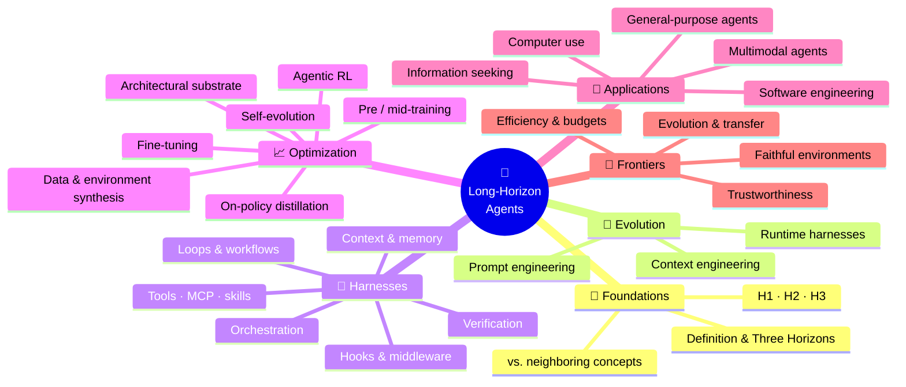

<p align="center">
  
</p>

<h1 align="center">🧭 Awesome Long-Horizon Agents</h1>

<h3 align="center">A curated reading list for <a href="#-citation"><b>Toward Long-Horizon AI Agents: A Survey</b></a><br>
<sub>Foundations · Evolution · Harnesses · Optimization · Applications · Frontiers</sub></h3>

<p align="center">
  <a href="https://github.com/RUC-NLPIR/Awesome-Long-Horizon-Agents"></a>
  <a href="https://github.com/RUC-NLPIR/Awesome-Long-Horizon-Agents"></a>
  <a href="https://github.com/RUC-NLPIR/Awesome-Long-Horizon-Agents/pulls"></a>
  <a href="#-contributing"></a>
  <a href="LICENSE"></a>
</p>

<p align="center">
  
  &nbsp;
  
  &nbsp;
  
</p>

<p align="center">
  <i>Expectations for AI agents are shifting from single-turn tasks to <b>long-horizon</b> work in real
  environments — planning, acting, recovering from mistakes, and adapting mid-execution.
  This list tracks the papers, systems, and benchmarks behind that shift, organized exactly like the survey.</i>
</p>

> [!NOTE]
> We define **long-horizon agency** as the co-evolving recipe of an **externalized harness** and an **internalized optimization**:
> <p align="center"><b>Long-Horizon Agency</b> &nbsp;=&nbsp; Model Policy &nbsp;⊕&nbsp; <b><a href="#-4--harnesses-externalizing-long-horizon-capability">Harness</a></b> &nbsp;⊕&nbsp; <b><a href="#-5--optimization-internalizing-long-horizon-capability">Optimization</a></b>, &nbsp;bridged by <b>Experience</b>.</p>

---

## 📣 News

- **2026-07** — 🎉 The survey **_Toward Long-Horizon AI Agents_** and this reading list are released.
- **2026-07** — 📚 Initial taxonomy across **six perspectives** with representative papers is online. *Contributions welcome — this is a living list!*

<sub>🚧 This list is seeded with a **representative** slice of each category. It is meant to grow — [open a PR](#-contributing) to add the papers we missed.</sub>

---

## 🗺️ The Taxonomy at a Glance

> The whole survey in one map — then use the **colored board below to jump** to any topic.



<div align="center">
<h3>🖱️ Click any topic to jump to its section</h3>
<table>
<tr>
  <td valign="top" align="center">
    <a href="#-1--foundations-formalizing-long-horizon-agents"></a><br>
    <sub><i>what is it, formally?</i></sub><br><br>
    <a href="#-1--foundations-formalizing-long-horizon-agents"></a>
    <a href="#-1--foundations-formalizing-long-horizon-agents"></a>
    <a href="#-1--foundations-formalizing-long-horizon-agents"></a>
  </td>
</tr>
<tr>
  <td valign="top" align="center">
    <a href="#-2--evolution-from-prompting-to-runtime"></a><br>
    <sub><i>prompts → runtimes</i></sub><br><br>
    <a href="#-2--evolution-from-prompting-to-runtime"></a>
    <a href="#-2--evolution-from-prompting-to-runtime"></a>
    <a href="#-2--evolution-from-prompting-to-runtime"></a>
  </td>
</tr>
<tr>
  <td valign="top" align="center">
    <a href="#-4--harnesses-externalizing-long-horizon-capability"></a><br>
    <sub><i>runtime structure around the model</i></sub><br><br>
    <a href="#loops--workflows"></a>
    <a href="#context--memory"></a>
    <a href="#tools-mcp--skills"></a>
    <a href="#orchestration"></a>
    <a href="#hooks--middleware"></a>
    <a href="#verification"></a>
  </td>
</tr>
<tr>
  <td valign="top" align="center">
    <a href="#-5--optimization-internalizing-long-horizon-capability"></a><br>
    <sub><i>training competence into the weights</i></sub><br><br>
    <a href="#architectural-substrate"></a>
    <a href="#data--environment-synthesis"></a>
    <a href="#premid-training"></a>
    <a href="#fine-tuning"></a>
    <a href="#agentic-reinforcement-learning"></a>
    <a href="#on-policy-distillation"></a>
    <a href="#self-evolution"></a>
  </td>
</tr>
<tr>
  <td valign="top" align="center">
    <a href="#-6--applications-long-horizon-agents-in-practice"></a><br>
    <sub><i>where long-horizon pressure recurs</i></sub><br><br>
    <a href="#-software-engineering"></a>
    <a href="#-information-seeking"></a>
    <a href="#-computer-use"></a>
    <a href="#-multimodal-agents"></a>
    <a href="#-general-purpose-agents"></a>
  </td>
</tr>
<tr>
  <td valign="top" align="center">
    <a href="#-7--frontiers-open-problems"></a><br>
    <sub><i>what is still open</i></sub><br><br>
    <a href="#-7--frontiers-open-problems"></a>
    <a href="#-7--frontiers-open-problems"></a>
    <a href="#-7--frontiers-open-problems"></a>
    <a href="#-7--frontiers-open-problems"></a>
  </td>
</tr>
</table>

</div>

---

## 📖 Table of Contents

- [1 · 🧱 Foundations: Formalizing Long-Horizon Agents](#-1--foundations-formalizing-long-horizon-agents)
- [2 · 🧬 Evolution: From Prompting to Runtime](#-2--evolution-from-prompting-to-runtime)
- [3 · 🔧 Harnesses: Externalizing Long-Horizon Capability](#-4--harnesses-externalizing-long-horizon-capability)
  - [Loops & Workflows](#loops--workflows) · [Context & Memory](#context--memory) · [Tools, MCP & Skills](#tools-mcp--skills) · [Orchestration](#orchestration) · [Hooks & Middleware](#hooks--middleware) · [Verification](#verification)
- [4 · 📈 Optimization: Internalizing Long-Horizon Capability](#-5--optimization-internalizing-long-horizon-capability)
  - [Architectural Substrate](#architectural-substrate) · [Data & Environment Synthesis](#data--environment-synthesis) · [Pre/Mid-training](#premid-training) · [Fine-tuning](#fine-tuning) · [Agentic RL](#agentic-reinforcement-learning) · [On-Policy Distillation](#on-policy-distillation) · [Self-Evolution](#self-evolution)
- [5 · 🚀 Applications: Long-Horizon Agents in Practice](#-6--applications-long-horizon-agents-in-practice)
- [6 · 🔭 Frontiers: Open Problems](#-7--frontiers-open-problems)
- [🧪 Benchmarks & Resources](#-benchmarks--resources)
- [🤝 Contributing](#-contributing)
- [📚 Citation](#-citation)

<sub>🔖 Each entry carries a **venue** tag, a red **arXiv** (or 🌐 Website / Docs) badge, and a live **★ GitHub-stars** badge wherever code exists. &nbsp;·&nbsp; ⭐ before a title = milestone / highly-cited.</sub>

---

## 🧱 1 · Foundations: Formalizing Long-Horizon Agents

> Long-horizon agency is formalized as a **harness-closed decision process**, then distinguished from adjacent notions (long-context, long-running, autonomy, self-evolution). Tasks are organized by **three horizons**.

<div align="center">

| Horizon | Scope | The capability it demands |
|:-:|:--|:--|
| **H1** | *intra-task* — within one context window | coherent reasoning + acting over a single episode |
| **H2** | *inter-context* — across windows / sessions | memory, compression, state carried across resets |
| **H3** | *inter-task* — lifelong / cross-task | skill accumulation, transfer, continual improvement |

</div>

**Setting the frame**
- ⭐ **Measuring AI Ability to Complete Long Software Tasks** — the empirical "time-horizon" trend: task-completion horizon has doubled roughly every 7 months.<br/> [](https://arxiv.org/abs/2503.14499)
- **Cognitive Architectures for Language Agents (CoALA)** — a memory/action/decision framework for language agents.<br/> [](https://arxiv.org/abs/2309.02427)
- **A Survey on Large Language Model based Autonomous Agents** — construction, application, and evaluation of LLM agents.<br/> [](https://arxiv.org/abs/2308.11432)


<details>
<summary>📚 <b>More from the survey</b> — 20 papers</summary>

- **The Landscape of Agentic Reinforcement Learning for LLMs: A Survey** — a survey mapping agentic RL for LLMs across algorithms, agent roles, and open challenges. `arXiv 2025` [](https://arxiv.org/abs/2509.02547) [](https://dblp.org/rec/journals/tmlr/ZhangGYYZTZLXLZCZFWHVLW26.html)
- **Symbolic learning enables self-evolving agents** — treats prompts, tools, and pipelines as learnable symbols so an agent can optimize itself. `2025` [](https://arxiv.org/abs/2406.18532) [](https://dblp.org/rec/journals/aiopen/OuZDLWWCWXZCJ25.html)
- **ReAct: Synergizing Reasoning and Acting in Language Models** — interleaves chain-of-thought reasoning with tool actions in a single loop. `ICLR 2023` [](https://arxiv.org/abs/2210.03629) [](https://dblp.org/rec/conf/iclr/YaoZYDSN023.html)
- **Memory in the Age of AI Agents** — a position piece on why persistent memory is central to capable agents. `2025` [](https://arxiv.org/abs/2512.13564)
- **Effective Harnesses for Long-Running Agents** — engineering guidance for building harnesses that keep long-running agents on track. `2025`
- **Reflexion: language agents with verbal reinforcement learning** — agents improve by writing verbal self-reflections after failures and retrying. `2023` [](http://papers.nips.cc/paper_files/paper/2023/hash/1b44b878bb782e6954cd888628510e90-Abstract-Conference.html) [](https://dblp.org/rec/conf/nips/ShinnCGNY23.html)
- **Lost in the Middle: How Language Models Use Long Contexts** — shows LLMs use information best at the start and end of context and miss the middle. `2024` [](https://dblp.org/rec/journals/corr/abs-2307-03172.html)
- **Context Rot: When Long Contexts Hurt LLM Performance** — documents how model performance degrades as context grows longer and noisier. `2025`
- **Welcome to the Era of Experience** — a position arguing the next advance comes from agents learning from their own experience.
- **A Survey of Self-Evolving Agents: What, When, How, and Where to Evolve on the Path to Artificial Super Intelligence** — a survey organizing self-evolving agents by what, when, how, and where they evolve. [](https://arxiv.org/abs/2507.21046)
- **From Human Memory to AI Memory: A Survey on Memory Mechanisms in the Era of LLMs** — a survey linking human-memory theory to LLM memory mechanisms. `arXiv 2025` [](https://arxiv.org/abs/2504.15965)
- **Voyager: An Open-Ended Embodied Agent with Large Language Models** — an LLM agent that autonomously grows a skill library through open-ended Minecraft play. `2024` [](https://openreview.net/forum?id=ehfRiF0R3a) [](https://dblp.org/rec/journals/tmlr/WangX0MXZFA24.html)
- **ReasoningBank: Scaling Agent Self-Evolving with Reasoning Memory** — stores reusable reasoning strategies as memory to guide future decisions. `arXiv 2025` [](https://arxiv.org/abs/2509.25140)
- **Time Horizon 1.1** — an update to METR's measurement of the agent task-completion time horizon. `2026`
- **Training Compute-Optimal Large Language Models** — the Chinchilla study on optimally balancing model size against training tokens. `NeurIPS 2022`
- **Forecasting AI Time Horizon Under Compute Slowdowns** — forecasts how agent task horizons grow if compute scaling slows. `arXiv 2025` [](https://arxiv.org/abs/2511.19492)
- **A Comprehensive Survey on Long Context Language Modeling** — a survey of methods for extending and using long context in LLMs. `arXiv 2025` [](https://arxiv.org/abs/2503.17407)
- **Levels of Autonomy for AI Agents** — proposes a taxonomy of autonomy levels for AI agents. `2025` [](https://arxiv.org/abs/2506.12469)
- **Introducing Operator** — OpenAI's computer-use agent that browses and clicks on the user's behalf. `2024`
- **Agent AI: Surveying the Horizons of Multimodal Interaction** — a survey of multimodal agent AI across perception, action, and interaction. `arXiv 2024` [](https://arxiv.org/abs/2401.03568)

</details>

<sub>📌 *Foundations are conceptual — the papers above anchor the framing; the horizon labels (H1–H3) recur throughout the sections below.*</sub>

---

## 🧬 2 · Evolution: From Prompting to Runtime

> Three stages trace how control of the model moved outward: **prompt → context → runtime**.

### Stage I — Prompt Engineering *(≈2020–2022)*
- ⭐ **Chain-of-Thought Prompting** — elicits intermediate reasoning steps.<br/> [](https://arxiv.org/abs/2201.11903)
- **Least-to-Most Prompting** — decompose then solve subproblems in order.<br/> [](https://arxiv.org/abs/2205.10625)
- ⭐ **ReAct: Synergizing Reasoning and Acting** — interleaves reasoning traces with tool actions.<br/> [](https://arxiv.org/abs/2210.03629) [](https://github.com/ysymyth/ReAct) [](https://dblp.org/rec/conf/iclr/YaoZYDSN023.html)


<details>
<summary>📚 <b>More from the survey</b> — 42 papers</summary>

- **Language Models are Few-Shot Learners** — GPT-3: shows large LMs perform new tasks from just a few in-context examples. `NeurIPS 2020` [](https://proceedings.neurips.cc/paper/2020/hash/1457c0d6bfcb4967418bfb8ac142f64a-Abstract.html)
- **Pre-train, Prompt, and Predict: A Systematic Survey of Prompting Methods in Natural Language Processing** — a systematic survey of prompting paradigms in NLP. `2023`
- **A Survey on In-context Learning** — a survey of in-context learning methods, mechanisms, and open questions. `2024` [](https://aclanthology.org/2024.emnlp-main.64)
- **Show your work: Scratchpads for intermediate computation with language models** — lets models write intermediate steps on a scratchpad before answering. `arXiv 2021`
- **Chain-of-Thought Prompting Elicits Reasoning in Large Language Models** — prompting step-by-step reasoning sharply improves multi-step accuracy. `NeurIPS 2022`
- **Large Language Models are Zero-Shot Reasoners** — adding 'let's think step by step' elicits zero-shot chain-of-thought. `NeurIPS 2022`
- **Automatic Chain of Thought Prompting in Large Language Models** — automatically constructs diverse chain-of-thought demonstrations. `ICLR 2023` [](https://openreview.net/forum?id=5NTt8GFjUHkr)
- **Complexity-Based Prompting for Multi-step Reasoning** — selects more complex exemplars to improve multi-step reasoning. `ICLR 2023` [](https://openreview.net/forum?id=yf1icZHC-l9)
- **Decomposed Prompting: A Modular Approach for Solving Complex Tasks** — solves complex tasks by decomposing them into modular sub-prompts. `ICLR 2023` [](https://openreview.net/forum?id=_nGgzQjzaRy)
- **Self-Consistency Improves Chain of Thought Reasoning in Language Models** — samples multiple reasoning paths and majority-votes the final answer. `ICLR 2023` [](https://openreview.net/forum?id=1PL1NIMMrw) [](https://dblp.org/rec/conf/iclr/0002WSLCNCZ23.html)
- **Least-to-Most Prompting Enables Complex Reasoning in Large Language Models** — decomposes a problem into easier subproblems solved in sequence. `ICLR 2023` [](https://openreview.net/forum?id=WZH7099tgfM)
- **Plan-and-Solve Prompting: Improving Zero-Shot Chain-of-Thought Reasoning by Large Language Models** — plans first then executes to cut zero-shot chain-of-thought errors. `2023`
- **PAL: Program-aided Language Models** — offloads computation to LM-generated Python programs. `ICML 2023` [](https://proceedings.mlr.press/v202/gao23f.html) [](https://dblp.org/rec/conf/icml/GaoMZ00YCN23.html)
- **Program of Thoughts Prompting: Disentangling Computation from Reasoning for Numerical Reasoning Tasks** — separates reasoning from computation by generating executable programs. `2023` [](https://openreview.net/forum?id=YfZ4ZPt8zd) [](https://dblp.org/rec/journals/tmlr/ChenM0C23.html)
- **Tree of Thoughts: Deliberate Problem Solving with Large Language Models** — explores and backtracks over a search tree of reasoning steps. `NeurIPS 2023`
- **Do As I Can, Not As I Say: Grounding Language in Robotic Affordances** — SayCan: grounds LLM plans in a robot's affordances and skills. `2022` [](https://arxiv.org/abs/2204.01691)
- **Inner Monologue: Embodied Reasoning through Planning with Language Models** — feeds environment feedback back into the LLM's planning loop. `2022` [](https://arxiv.org/abs/2207.05608)
- **ALFWorld: Aligning Text and Embodied Environments for Interactive Learning** — aligns text and embodied environments for interactive agent learning. `ICLR 2021`
- **AdaPlanner: Adaptive Planning from Feedback with Language Models** — adaptively refines LLM plans from environment feedback. `NeurIPS 2023` [](https://arxiv.org/abs/2305.16653)
- **ADaPT: As-Needed Decomposition and Planning with Language Models** — decomposes and re-plans only as needed when subtasks fail. `2024`
- **Describe, Explain, Plan and Select: Interactive Planning with Large Language Models Enables Open-World Multi-Task Agents** — interactive LLM planning for open-world multi-task agents. `NeurIPS 2023` [](https://arxiv.org/abs/2302.01560)
- **Fantastically Ordered Prompts and Where to Find Them: Overcoming Few-Shot Prompt Order Sensitivity** — shows few-shot example ordering strongly affects performance. `ACL 2022`
- **Quantifying Language Models' Sensitivity to Spurious Features in Prompt Design or: How I learned to start worrying about prompt formatting** — shows prompt formatting alone can swing LLM performance widely. `ICLR 2024` [](https://arxiv.org/abs/2310.11324)
- **Calibrate Before Use: Improving Few-Shot Performance of Language Models** — calibrates few-shot predictions to remove prompt-induced bias. `ICML 2021` [](https://proceedings.mlr.press/v139/zhao21c.html)
- **Rethinking the Role of Demonstrations: What Makes In-Context Learning Work?** — finds demo format matters more than gold-label correctness. `2022` [](https://doi.org/10.18653/v1/2022.emnlp-main.759) [](https://dblp.org/rec/conf/emnlp/MinLHALHZ22.html)
- **$\textPromptAgent$: Strategic Planning with Language Models Enables Expert-level Prompt Optimization** — plans strategically to discover expert-level prompts automatically. `ICLR 2024`
- **Promptbreeder: Self-Referential Self-Improvement via Prompt Evolution** — evolves prompts through self-referential mutation. `ICML 2024`
- **Reprompting: Automated Chain-of-Thought Prompt Inference Through Gibbs Sampling** — infers chain-of-thought prompts automatically via Gibbs sampling. `ICML 2024`
- **PromptWizard: Task-Aware Prompt Optimization Framework** — a task-aware framework that optimizes prompts automatically. `arXiv 2024`
- **Large Language Models as Optimizers** — OPRO: uses the LLM itself to iteratively optimize prompts. `ICLR 2024`
- **Large Language Models are Human-Level Prompt Engineers** — APE: automatically generates and selects instruction prompts. `ICLR 2023`
- **Automatic Prompt Optimization with "Gradient Descent" and Beam Search** — edits prompts using textual 'gradients' and beam search. `EMNLP 2023`
- **Optimizing Instructions and Demonstrations for Multi-Stage Language Model Programs** — MIPRO: jointly optimizes instructions and demos for LM pipelines. `2024`
- **Prompt Programming for Large Language Models: Beyond the Few-Shot Paradigm** — an early study of prompt programming beyond few-shot. `2021` [](https://doi.org/10.1145/3411763.3451760) [](https://dblp.org/rec/conf/chi/ReynoldsM21.html)
- **DSPy: Compiling Declarative Language Model Calls into Self-Improving Pipelines** — compiles declarative LM calls into self-improving pipelines. `ICLR 2024` [](https://arxiv.org/abs/2310.03714)
- **APPL: A Prompt Programming Language for Harmonious Integration of Programs and Large Language Model Prompts** — a language that integrates code and prompts for LM programming. `ACL 2025` [](https://aclanthology.org/2025.acl-long.63/)
- **SGLang: Efficient Execution of Structured Language Model Programs** — a system for efficiently executing structured LM programs. `NeurIPS 2024`
- **Training Language Models to Follow Instructions with Human Feedback** — InstructGPT: aligns LMs to instructions via RLHF. `NeurIPS 2022`
- **Learning to Reason with LLMs** — OpenAI's o1 report on scaling inference-time reasoning with RL. `2024`
- **Language Models as Knowledge Bases?** — probes how much relational knowledge LMs store in their weights. `2019` [](https://doi.org/10.18653/v1/D19-1250) [](https://dblp.org/rec/conf/emnlp/PetroniRRLBWM19.html)
- **How Much Knowledge Can You Pack Into the Parameters of a Language Model?** — measures closed-book QA knowledge held in LM parameters. `2020` [](https://doi.org/10.18653/v1/2020.emnlp-main.437) [](https://dblp.org/rec/conf/emnlp/RobertsRS20.html)
- **Large Language Models Struggle to Learn Long-Tail Knowledge** — shows LMs fail on rare, long-tail factual knowledge. `ICML 2023` [](https://proceedings.mlr.press/v202/kandpal23a.html) [](https://dblp.org/rec/conf/icml/KandpalDRWR23.html)

</details>

### Stage II — Context Engineering *(≈2023–2024)*
- ⭐ **Retrieval-Augmented Generation (RAG)** — condition generation on retrieved evidence.<br/> [](https://arxiv.org/abs/2005.11401)
- **Self-RAG** — learns to retrieve, generate, and critique on demand.<br/> [](https://arxiv.org/abs/2310.11511) [](https://github.com/AkariAsai/self-rag)
- ⭐ **MemGPT: LLMs as Operating Systems** — virtual-memory–style context paging.<br/> [](https://arxiv.org/abs/2310.08560) [](https://github.com/letta-ai/letta)


<details>
<summary>📚 <b>More from the survey</b> — 48 papers</summary>

- **Retrieval-Augmented Generation for Knowledge-Intensive NLP Tasks** — the original RAG paper, conditioning generation on retrieved passages. `NeurIPS 2020` [](https://dblp.org/rec/conf/nips/RAG2020.html)
- **Generalization through Memorization: Nearest Neighbor Language Models** — kNN-LM: augments an LM with nearest-neighbor retrieval over a datastore. `ICLR 2020` [](https://openreview.net/forum?id=HklBjCEKvH)
- **REALM: Retrieval-Augmented Language Model Pre-Training** — pretrains a language model jointly with a learned retriever. `ICML 2020` [](https://arxiv.org/abs/2002.08909)
- **Dense Passage Retrieval for Open-Domain Question Answering** — DPR: dense dual-encoder retrieval for open-domain QA. `2020` [](https://aclanthology.org/2020.emnlp-main.550)
- **Leveraging Passage Retrieval with Generative Models for Open Domain Question Answering** — Fusion-in-Decoder: fuses many retrieved passages in the decoder for QA. `2021` [](https://aclanthology.org/2021.eacl-main.74)
- **Improving Language Models by Retrieving from Trillions of Tokens** — RETRO: augments an LM with retrieval over a trillion-token database. `ICML 2022` [](https://arxiv.org/abs/2112.04426)
- **Atlas: Few-shot Learning with Retrieval Augmented Language Models** — a retrieval-augmented LM strong at few-shot knowledge tasks. `2023` [](http://jmlr.org/papers/v24/23-0037.html)
- **Retrieval-Augmented Generation for Large Language Models: A Survey** — a survey of RAG techniques for LLMs. `2023` [](https://arxiv.org/abs/2312.10997)
- **Precise Zero-Shot Dense Retrieval without Relevance Labels** — HyDE: generates a hypothetical document to drive zero-shot retrieval. `2023` [](https://doi.org/10.18653/v1/2023.acl-long.99) [](https://dblp.org/rec/conf/acl/HyDE23.html)
- **RAPTOR: Recursive Abstractive Processing for Tree-Organized Retrieval** — builds a recursive tree of summaries for tree-organized retrieval. `2024`
- **MuSiQue: Multihop Questions via Single-hop Question Composition** — a multi-hop QA benchmark composed from single-hop questions. `2022`
- **Active Retrieval Augmented Generation** — FLARE: retrieves on the fly whenever the model becomes uncertain. `2023` [](https://doi.org/10.18653/v1/2023.emnlp-main.495) [](https://dblp.org/rec/conf/emnlp/JiangXGSLDYCN23.html)
- **Agentic Retrieval-Augmented Generation: A Survey on Agentic RAG** — a survey of agentic RAG systems. `2025` [](https://arxiv.org/abs/2501.09136)
- **Toolformer: Language Models Can Teach Themselves to Use Tools** — an LM that teaches itself when and how to call external tools. `NeurIPS 2023` [](http://papers.nips.cc/paper_files/paper/2023/hash/d842425e4bf79ba039352da0f658a906-Abstract-Conference.html) [](https://dblp.org/rec/conf/nips/SchickDDRLHZCS23.html)
- **Toolalpaca: Generalized tool learning for language models with 3000 simulated cases** — generalized tool learning from thousands of simulated tool-use cases. `arXiv 2023`
- **ToolLLM: Facilitating Large Language Models to Master 16000+ Real-world APIs** — trains LLMs to discover and call 16000+ real-world APIs. `ICLR 2024` [](https://openreview.net/forum?id=dHng2O0Jjr) [](https://dblp.org/rec/conf/iclr/QinLYZYLLCTQZHT24.html)
- **StableToolBench: Towards Stable Large-Scale Benchmarking on Tool Learning of Large Language Models** — a stable large-scale benchmark for LLM tool learning. `2024` [](https://doi.org/10.18653/v1/2024.findings-acl.664) [](https://dblp.org/rec/conf/acl/GuoCWLQLL0L24.html)
- **Gorilla: Large Language Model Connected with Massive APIs** — an LLM fine-tuned to reliably call massive real-world APIs. `2024` [](http://papers.nips.cc/paper_files/paper/2024/hash/e4c61f578ff07830f5c37378dd3ecb0d-Abstract-Conference.html) [](https://dblp.org/rec/conf/nips/PatilZ0G24.html)
- **WebGPT: Browser-assisted question-answering with human feedback** — browser-assisted long-form QA trained with human feedback. `arXiv 2021` [](https://arxiv.org/abs/2112.09332) [](https://dblp.org/rec/journals/corr/abs-2112-09332.html)
- **ToolACE: Winning the Points of LLM Function Calling** — generates accurate, diverse data to improve LLM function calling. `ICLR 2025` [](https://openreview.net/forum?id=8EB8k6DdCU) [](https://dblp.org/rec/conf/iclr/Liu0ZHYL0GLY0WN25.html)
- **The Berkeley Function Calling Leaderboard (BFCL): From Tool Use to Agentic Evaluation of Large Language Models** — a leaderboard evaluating tool use and agentic function calling. `ICML 2025` [](https://proceedings.mlr.press/v267/patil25a.html) [](https://dblp.org/rec/conf/icml/PatilMYJSSG25.html)
- **Tool Learning with Foundation Models** — a survey of tool learning with foundation models. `arXiv 2023` [](https://arxiv.org/abs/2304.08354)
- **Tool Learning with Large Language Models: A Survey** — a survey of LLM tool-learning methods and challenges. `arXiv 2024` [](https://arxiv.org/abs/2405.17935) [](https://dblp.org/rec/journals/fcsc/QuDWCWYXW25.html)
- **ReAct: Synergizing Reasoning and Acting in Language Models** — interleaves chain-of-thought reasoning with tool actions in a single loop. `ICLR 2023` [](https://arxiv.org/abs/2210.03629) [](https://dblp.org/rec/conf/iclr/YaoZYDSN023.html)
- **FlashAttention: Fast and Memory-Efficient Exact Attention with IO-Awareness** — an IO-aware exact-attention kernel that speeds up long-context training. `NeurIPS 2022`
- **Rethinking Attention with Performers** — Performer: linear-complexity attention via random-feature maps. `ICLR 2021` [](https://arxiv.org/abs/2009.14794) [](https://dblp.org/rec/conf/iclr/ChoromanskiLDSG21.html)
- **Big Bird: Transformers for Longer Sequences** — sparse attention that scales transformers to much longer sequences. `NeurIPS 2020` [](https://arxiv.org/abs/2007.14062) [](https://dblp.org/rec/conf/nips/ZaheerGDAAOPRWY20.html)
- **Longformer: The Long-Document Transformer** — sliding-window plus global attention for long documents. `2020` [](https://arxiv.org/abs/2004.05150) [](https://dblp.org/rec/journals/corr/abs-2004-05150.html)
- **Gemini 1.5: Unlocking Multimodal Understanding Across Millions of Tokens of Context** — a model handling multimodal understanding across million-token contexts. `2024` [](https://arxiv.org/abs/2403.05530)
- **Mamba: Linear-Time Sequence Modeling with Selective State Spaces** — a selective state-space model with linear-time sequence modeling. `arXiv 2024` [](https://arxiv.org/abs/2312.00752) [](https://dblp.org/rec/journals/corr/abs-2312-00752.html)
- **LongBench: A Bilingual, Multitask Benchmark for Long Context Understanding** — a bilingual multitask benchmark for long-context understanding. `ACL 2024` [](https://aclanthology.org/2024.acl-long.172/) [](https://dblp.org/rec/conf/acl/BaiLZL0HDLZHDTL24.html)
- **RULER: What's the Real Context Size of Your Long-Context Language Models?** — probes the real usable context length of long-context LLMs. `arXiv 2024`
- **L-Eval: Instituting Standardized Evaluation for Long Context Language Models** — standardized evaluation for long-context language models. `2024` [](https://aclanthology.org/2024.acl-long.776)
- **$\infty$Bench: Extending Long Context Evaluation Beyond 100K Tokens** — extends long-context evaluation beyond 100K tokens. `2024` [](https://aclanthology.org/2024.acl-long.814)
- **Generative Agents: Interactive Simulacra of Human Behavior** — believable sandbox agents that simulate human behavior with memory. `2023`
- **Lost in the Middle: How Language Models Use Long Contexts** — shows LLMs use information best at the start and end of context and miss the middle. `2024` [](https://dblp.org/rec/journals/corr/abs-2307-03172.html)
- **Large Language Models Can Be Easily Distracted by Irrelevant Context** — shows irrelevant context markedly degrades LLM reasoning. `ICML 2023`
- **Context Rot: When Long Contexts Hurt LLM Performance** — documents how model performance degrades as context grows longer and noisier. `2025`
- **Effective Context Engineering for AI Agents** — practical engineering guidance for curating an agent's context. `2025`
- **A Survey of Context Engineering for Large Language Models** — a survey of context-engineering techniques for LLMs. `2025` [](https://arxiv.org/abs/2507.13334)
- **LLMLingua: Compressing Prompts for Accelerated Inference of Large Language Models** — compresses prompts to speed up inference with little quality loss. `EMNLP 2023`
- **Compressing Context to Enhance Inference Efficiency of Large Language Models** — selectively drops context tokens to cut inference cost. `EMNLP 2023`
- **CompAct: Compressing Retrieved Documents Actively for Question Answering** — actively compresses retrieved documents for question answering. `EMNLP 2024`
- **HiAgent: Hierarchical Working Memory Management for Solving Long-Horizon Agent Tasks with Large Language Model** `ACL 2025`
- **ACON: Optimizing Context Compression for Long-horizon LLM Agents** `2025` [](https://arxiv.org/abs/2510.00615)
- **MemAgent: Reshaping Long-Context LLM with Multi-Conv RL-based Memory Agent** `2025` [](https://arxiv.org/abs/2507.02259)
- **Resum: Unlocking long-horizon search intelligence via context summarization** `arXiv 2025` [](https://dblp.org/rec/journals/corr/abs-2509-13313.html)
- **MEM1: Learning to Synergize Memory and Reasoning for Efficient Long-Horizon Agents** `2025` [](https://arxiv.org/abs/2506.15841)

</details>

### Stage III — Runtime Harnesses *(≈2024–2026)*
- ⭐ **Voyager: An Open-Ended Embodied Agent** — lifelong learning with a growing skill library.<br/> [](https://arxiv.org/abs/2305.16291) [](https://github.com/MineDojo/Voyager)
- ⭐ **SWE-agent** — an agent–computer interface for repository tasks.<br/> [](https://arxiv.org/abs/2405.15793) [](https://github.com/princeton-nlp/SWE-agent)
- **AutoGPT** — one of the first autonomous goal-pursuing agent runtimes.<br/> [](https://github.com/Significant-Gravitas/AutoGPT)


<details>
<summary>📚 <b>More from the survey</b> — 55 papers</summary>

- **ReAct: Synergizing Reasoning and Acting in Language Models** — interleaves chain-of-thought reasoning with tool actions in a single loop. `ICLR 2023` [](https://arxiv.org/abs/2210.03629) [](https://dblp.org/rec/conf/iclr/YaoZYDSN023.html)
- **ToolACE: Winning the Points of LLM Function Calling** — generates accurate, diverse data to improve LLM function calling. `ICLR 2025` [](https://openreview.net/forum?id=8EB8k6DdCU) [](https://dblp.org/rec/conf/iclr/Liu0ZHYL0GLY0WN25.html)
- **The Berkeley Function Calling Leaderboard (BFCL): From Tool Use to Agentic Evaluation of Large Language Models** — a leaderboard evaluating tool use and agentic function calling. `ICML 2025` [](https://proceedings.mlr.press/v267/patil25a.html) [](https://dblp.org/rec/conf/icml/PatilMYJSSG25.html)
- **Schema First Tool APIs for LLM Agents: A Controlled Study of Tool Misuse, Recovery, and Budgeted Performance** `arXiv 2026` [](https://arxiv.org/abs/2603.13404) [](https://dblp.org/rec/journals/corr/abs-2603-13404.html)
- **Reflexion: language agents with verbal reinforcement learning** — agents improve by writing verbal self-reflections after failures and retrying. `2023` [](http://papers.nips.cc/paper_files/paper/2023/hash/1b44b878bb782e6954cd888628510e90-Abstract-Conference.html) [](https://dblp.org/rec/conf/nips/ShinnCGNY23.html)
- **Self-Refine: Iterative Refinement with Self-Feedback** `NeurIPS 2023` [](https://openreview.net/forum?id=S37hOerQLB)
- **Language Agent Tree Search Unifies Reasoning, Acting, and Planning in Language Models** `ICML 2024` [](https://proceedings.mlr.press/v235/zhou24r.html) [](https://dblp.org/rec/conf/icml/ZhouYSWW24.html)
- **WebShop: Towards Scalable Real-World Web Interaction with Grounded Language Agents** `NeurIPS 2022` [](https://arxiv.org/abs/2207.01206)
- **WebArena: A Realistic Web Environment for Building Autonomous Agents** `2024` [](https://dblp.org/rec/conf/iclr/ZhouX0ZLSCOBF0N24.html)
- **Mind2web: Towards a generalist agent for the web** `NeurIPS 2023`
- **$\textSWE-bench$: Can Language Models Resolve Real-world Github Issues?** `ICLR 2024` [](https://dblp.org/rec/conf/iclr/JimenezYWYPPN24.html)
- **Terminal-Bench: Benchmarking Agents on Hard, Realistic Tasks in Command Line Interfaces** `ICLR 2026` [](https://dblp.org/rec/journals/corr/abs-2601-11868.html)
- **Osworld: Benchmarking multimodal agents for open-ended tasks in real computer environments** `NeurIPS 2024` [](https://dblp.org/rec/conf/nips/XieZCLZCHCSLLXZ24.html)
- **GAIA: a benchmark for General AI Assistants** `ICLR 2024` [](https://openreview.net/forum?id=fibxvahvs3) [](https://dblp.org/rec/conf/iclr/MialonF0LS24.html)
- **$\textAgentBench$: Evaluating llms as agents** `arXiv 2023`
- **\(\tau\)-bench: A Benchmark for Tool-Agent-User Interaction in Real-World Domains** `arXiv 2024` [](https://arxiv.org/abs/2406.12045) [](https://dblp.org/rec/journals/corr/abs-2406-12045.html)
- **Search-o1: Agentic search-enhanced large reasoning models** `EMNLP 2025` [](https://dblp.org/rec/journals/corr/abs-2501-05366.html)
- **Search-R1: Training LLMs to Reason and Leverage Search Engines with Reinforcement Learning** `arXiv 2025` [](https://arxiv.org/abs/2503.09516) [](https://dblp.org/rec/journals/corr/abs-2503-09516.html)
- **$\textWebThinker$: Empowering large reasoning models with deep research capability** `arXiv 2025` [](https://dblp.org/rec/journals/corr/abs-2504-21776.html)
- **R1-Searcher: Incentivizing the Search Capability in LLMs via Reinforcement Learning** `arXiv 2025` [](https://arxiv.org/abs/2503.05592) [](https://dblp.org/rec/journals/corr/abs-2503-05592.html)
- **WebDancer: Towards Autonomous Information Seeking Agency** `arXiv 2025` [](https://arxiv.org/abs/2505.22648) [](https://dblp.org/rec/journals/corr/abs-2505-22648.html)
- **DeepResearcher: Scaling Deep Research via Reinforcement Learning in Real-world Environments** `2025` [](https://arxiv.org/abs/2504.03160)
- **OpenHands: An Open Platform for AI Software Developers as Generalist Agents** `ICLR 2025` [](https://arxiv.org/abs/2407.16741) [](https://dblp.org/rec/conf/iclr/0001LSXTZPSLSTL25.html)
- **Effective Harnesses for Long-Running Agents** — engineering guidance for building harnesses that keep long-running agents on track. `2025`
- **Live-SWE-agent: Can Software Engineering Agents Self-Evolve on the Fly?** `arXiv 2025` [](https://arxiv.org/abs/2511.13646)
- **Context Rot: When Long Contexts Hurt LLM Performance** — documents how model performance degrades as context grows longer and noisier. `2025`
- **Not What You've Signed Up For: Compromising Real-World LLM-Integrated Applications with Indirect Prompt Injection** `2023` [](https://arxiv.org/abs/2302.12173)
- **Identifying the Risks of LM Agents with an LM-Emulated Sandbox** `2024`
- **AutoGen: Enabling Next-Gen LLM Applications via Multi-Agent Conversation** `COLM 2024` [](https://arxiv.org/abs/2308.08155)
- **MetaGPT: Meta Programming for A Multi-Agent Collaborative Framework** `ICLR 2024` [](https://openreview.net/forum?id=VtmBAGCN7o) [](https://dblp.org/rec/conf/iclr/HongZCZCWZWYLZR24.html)
- **ChatDev: Communicative Agents for Software Development** `2024` [](https://doi.org/10.18653/v1/2024.acl-long.810) [](https://dblp.org/rec/conf/acl/QianLLCDL0CSCXL24.html)
- **Magentic-One: A Generalist Multi-Agent System for Solving Complex Tasks** `arXiv 2024` [](https://arxiv.org/abs/2411.04468) [](https://dblp.org/rec/journals/corr/abs-2411-04468.html)
- **AFlow: Automating Agentic Workflow Generation** `ICLR 2025` [](https://openreview.net/forum?id=z5uVAKwmjf) [](https://dblp.org/rec/conf/iclr/ZhangXYTCCZCHWZ25.html)
- **LangGraph: A Framework for Building Stateful, Multi-Actor LLM Applications** `2024`
- **Model Context Protocol (MCP)** `2025` [](https://modelcontextprotocol.io/docs/getting-started/intro)
- **Harness Design for Long-Running Application Development** `2026` [](https://www.anthropic.com/engineering/harness-design-long-running-apps)
- **Improving Deep Agents with Harness Engineering** `2026` [](https://www.langchain.com/blog/improving-deep-agents-with-harness-engineering)
- **Before the Tool Call: Deterministic Pre-Action Authorization for Autonomous AI Agents** `2026` [](https://arxiv.org/abs/2603.20953)
- **Scaling Managed Agents: Decoupling the Brain from the Hands** `2025`
- **AgentBound: Securing Execution Boundaries of AI Agents** `2025` [](https://arxiv.org/abs/2510.21236)
- **OWASP Top 10 for Agentic Applications for 2026** `2025` [](https://genai.owasp.org/resource/owasp-top-10-for-agentic-applications-for-2026/)
- **Best Practices for Claude Code** `2024`
- **OpenClaw: An Open-Source Agent Runtime** `2025`
- **Hermes-Agent** `2025`
- **Meta-Harness: End-to-End Optimization of Model Harnesses** `2026` [](https://arxiv.org/abs/2603.28052)
- **AutoHarness: Improving LLM Agents by Automatically Synthesizing a Code Harness** `arXiv 2026` [](https://arxiv.org/abs/2603.03329)
- **Externalization in LLM Agents: A Unified Review of Memory, Skills, Protocols, and Harness Engineering** `arXiv 2026` [](https://arxiv.org/abs/2604.08224)
- **FireAct: Toward Language Agent Fine-tuning** `arXiv 2023` [](https://arxiv.org/abs/2310.05915)
- **AgentTuning: Enabling Generalized Agent Abilities for LLMs** `2024`
- **RAGEN: Understanding Self-Evolution in LLM Agents via Multi-Turn Reinforcement Learning** `arXiv 2025` [](https://arxiv.org/abs/2504.20073)
- **Agentic reinforced policy optimization** `arXiv 2025`
- **Retool: Reinforcement learning for strategic tool use in llms** `arXiv 2025`
- **$\textToolRL$: Reward is all tool learning needs** `arXiv 2025`
- **Natural-Language Agent Harnesses** `arXiv 2026` [](https://arxiv.org/abs/2603.25723) [](https://dblp.org/rec/journals/corr/abs-2603-25723.html)
- **OctoBench: Benchmarking Scaffold-Aware Instruction Following in Repository-Grounded Agentic Coding** `arXiv 2026` [](https://arxiv.org/abs/2601.10343)

</details>

---

## 🔧 4 · Harnesses: Externalizing Long-Horizon Capability

> The **externalized** side of the recipe — the runtime scaffold around the model: how it loops, what it remembers, what it can call, how many agents cooperate, what governs it, and how outputs are checked.

### Loops & Workflows
> *How control flows through an episode — linear, plan-execute, or branching.*
- ⭐ **ReAct** — the canonical reason-act loop.<br/> [](https://arxiv.org/abs/2210.03629) [](https://github.com/ysymyth/ReAct)
- ⭐ **Reflexion** — verbal self-feedback across attempts.<br/> [](https://arxiv.org/abs/2303.11366) [](https://github.com/noahshinn/reflexion)
- **Plan-and-Solve Prompting** — explicit plan-then-execute decomposition.<br/> [](https://arxiv.org/abs/2305.04091)
- ⭐ **Tree of Thoughts** — deliberate search over branching reasoning.<br/> [](https://arxiv.org/abs/2305.10601) [](https://github.com/princeton-nlp/tree-of-thought-llm)
- **LLMCompiler** — parallel function-calling via a task DAG.<br/> [](https://arxiv.org/abs/2312.04511) [](https://github.com/SqueezeAILab/LLMCompiler)


<details>
<summary>📚 <b>More from the survey</b> — 11 papers</summary>

- **A Survey on Agent Workflow: Status and Future** `2025` [](https://arxiv.org/abs/2508.01186)
- **Self-Refine: Iterative Refinement with Self-Feedback** `2023`
- **Self-RAG: Learning to Retrieve, Generate, and Critique through Self-Reflection** `2024`
- **Cognitive Architectures for Language Agents** `2024`
- **ReWOO: Decoupling Reasoning from Observations for Efficient Augmented Language Models** `arXiv 2023` [](https://arxiv.org/abs/2305.18323)
- **ADaPT: As-Needed Decomposition and Planning with Language Models** — decomposes and re-plans only as needed when subtasks fail. `2024`
- **Verified Multi-Agent Orchestration: A Plan-Execute-Verify-Replan Framework for Complex Query Resolution** `2026` [](https://arxiv.org/abs/2603.11445)
- **O-Researcher: An Open Ended Deep Research Model via Multi-Agent Distillation and Agentic RL** `2026` [](https://arxiv.org/abs/2601.03743)
- **Language Agent Tree Search Unifies Reasoning, Acting, and Planning in Language Models** `2024` [](https://dblp.org/rec/conf/icml/ZhouYSWW24.html)
- **CodeTree: Agent-guided Tree Search for Code Generation with Large Language Models** `NAACL 2025`
- **ReAcTree: Hierarchical LLM Agent Trees with Control Flow for Long-Horizon Task Planning** `arXiv 2025` [](https://arxiv.org/abs/2511.02424)

</details>

### Context & Memory
> *Working context management + persistent memory that survives resets.*
- ⭐ **Generative Agents** — memory stream with reflection & retrieval.<br/> [](https://arxiv.org/abs/2304.03442) [](https://github.com/joonspk-research/generative_agents)
- ⭐ **MemGPT** — OS-style paging between context and external memory.<br/> [](https://arxiv.org/abs/2310.08560) [](https://github.com/letta-ai/letta)
- **Mem0** — a production memory layer for agents.<br/> [](https://github.com/mem0ai/mem0)


<details>
<summary>📚 <b>More from the survey</b> — 45 papers</summary>

- **Memory in the Age of AI Agents** — a position piece on why persistent memory is central to capable agents. `2025` [](https://arxiv.org/abs/2512.13564)
- **Context Rot: When Long Contexts Hurt LLM Performance** — documents how model performance degrades as context grows longer and noisier. `2025`
- **Lost in the Middle: How Language Models Use Long Contexts** — shows LLMs use information best at the start and end of context and miss the middle. `2024` [](https://dblp.org/rec/journals/corr/abs-2307-03172.html)
- **Large Language Models Can Be Easily Distracted by Irrelevant Context** — shows irrelevant context markedly degrades LLM reasoning. `ICML 2023`
- **Effective Harnesses for Long-Running Agents** — engineering guidance for building harnesses that keep long-running agents on track. `2025`
- **Improving Deep Agents with Harness Engineering** `2026` [](https://www.langchain.com/blog/improving-deep-agents-with-harness-engineering)
- **Effective Context Engineering for AI Agents** — practical engineering guidance for curating an agent's context. `2025`
- **We Removed 80\% of Our Agent's Tools** `2025` [](https://vercel.com/blog/we-removed-80-percent-of-our-agents-tools)
- **LLMLingua: Compressing Prompts for Accelerated Inference of Large Language Models** — compresses prompts to speed up inference with little quality loss. `EMNLP 2023`
- **CompAct: Compressing Retrieved Documents Actively for Question Answering** — actively compresses retrieved documents for question answering. `EMNLP 2024`
- **Resum: Unlocking long-horizon search intelligence via context summarization** `arXiv 2025` [](https://dblp.org/rec/journals/corr/abs-2509-13313.html)
- **MEM1: Learning to Synergize Memory and Reasoning for Efficient Long-Horizon Agents** `2025` [](https://arxiv.org/abs/2506.15841)
- **MemAgent: Reshaping Long-Context LLM with Multi-Conv RL-based Memory Agent** `2025` [](https://arxiv.org/abs/2507.02259)
- **ACON: Optimizing Context Compression for Long-horizon LLM Agents** `2025` [](https://arxiv.org/abs/2510.00615)
- **ContextBudget: Budget-Aware Context Management for Long-Horizon Search Agents** `2026` [](https://arxiv.org/abs/2604.01664)
- **HiAgent: Hierarchical Working Memory Management for Solving Long-Horizon Agent Tasks with Large Language Model** `ACL 2025`
- **Scaling Long-Horizon LLM Agent via Context-Folding** `2025` [](https://arxiv.org/abs/2510.11967) [](https://dblp.org/rec/journals/corr/abs-2510-11967.html)
- **AgentFold: Long-Horizon Web Agents with Proactive Context Management** `arXiv 2025` [](https://arxiv.org/abs/2510.24699) [](https://dblp.org/rec/journals/corr/abs-2510-24699.html)
- **Agentic Context Engineering: Evolving Contexts for Self-Improving Language Models** `arXiv 2025` [](https://arxiv.org/abs/2510.04618) [](https://dblp.org/rec/journals/corr/abs-2510-04618.html)
- **LEGOMem: Modular Procedural Memory for Multi-agent LLM Systems for Workflow Automation** `arXiv 2025` [](https://arxiv.org/abs/2510.04851)
- **Memex(RL): Scaling Long-Horizon LLM Agents via Indexed Experience Memory** `2026` [](https://arxiv.org/abs/2603.04257)
- **Memory as Action: Autonomous Context Curation for Long-Horizon Agentic Tasks** `2025` [](https://arxiv.org/abs/2510.12635) [](https://dblp.org/rec/journals/corr/abs-2510-12635.html)
- **From Human Memory to AI Memory: A Survey on Memory Mechanisms in the Era of LLMs** — a survey linking human-memory theory to LLM memory mechanisms. `arXiv 2025` [](https://arxiv.org/abs/2504.15965)
- **A survey on the memory mechanism of large language model-based agents** `2025`
- **Best Practices for Claude Code** `2024`
- **Rules** `2025` [](https://cursor.com/docs/rules.md)
- **AGENTS.md Community Specification** `2026`
- **Memorybank: Enhancing large language models with long-term memory** `AAAI 2024`
- **Memory OS of AI Agent** `arXiv 2025` [](https://arxiv.org/abs/2506.06326)
- **HippoRAG: Neurobiologically Inspired Long-Term Memory for Large Language Models** `2024`
- **A-MEM: Agentic Memory for LLM Agents** `arXiv` [](https://arxiv.org/abs/2502.12110)
- **Reflexion: language agents with verbal reinforcement learning** — agents improve by writing verbal self-reflections after failures and retrying. `2023` [](http://papers.nips.cc/paper_files/paper/2023/hash/1b44b878bb782e6954cd888628510e90-Abstract-Conference.html) [](https://dblp.org/rec/conf/nips/ShinnCGNY23.html)
- **ExpeL: LLM Agents Are Experiential Learners** `AAAI 2024` [](https://doi.org/10.1609/aaai.v38i17.29936) [](https://dblp.org/rec/conf/aaai/Zhao0XLLH24.html)
- **Synapse: Trajectory-as-Exemplar Prompting with Memory for Computer Control** `2024` [](https://arxiv.org/abs/2306.07863)
- **ReasoningBank: Scaling Agent Self-Evolving with Reasoning Memory** — stores reusable reasoning strategies as memory to guide future decisions. `arXiv 2025` [](https://arxiv.org/abs/2509.25140)
- **Buffer of Thoughts: Thought-Augmented Reasoning with Large Language Models** `2024` [](https://arxiv.org/abs/2406.04271) [](https://dblp.org/rec/conf/nips/YangYZCXZG024.html)
- **Agent Workflow Memory** `ICML 2025` [](https://dblp.org/rec/conf/icml/WangMFN25.html)
- **Agent KB: Leveraging Cross-Domain Experience for Agentic Problem Solving** `arXiv 2025` [](https://arxiv.org/abs/2507.06229)
- **Voyager: An Open-Ended Embodied Agent with Large Language Models** — an LLM agent that autonomously grows a skill library through open-ended Minecraft play. `2024` [](https://openreview.net/forum?id=ehfRiF0R3a) [](https://dblp.org/rec/journals/tmlr/WangX0MXZFA24.html)
- **LongMemEval: Benchmarking Chat Assistants on Long-Term Interactive Memory** `arXiv 2024` [](https://arxiv.org/abs/2410.10813) [](https://dblp.org/rec/conf/iclr/WuWYZCY25.html)
- **MemoryArena: Benchmarking Agent Memory in Interdependent Multi-Session Agentic Tasks** `arXiv 2026` [](https://arxiv.org/abs/2602.16313)
- **Anatomy of Agentic Memory: Taxonomy and Empirical Analysis of Evaluation and System Limitations** `arXiv 2026` [](https://arxiv.org/abs/2602.19320)
- **Rethinking Memory Mechanisms of Foundation Agents in the Second Half: A Survey** `arXiv 2026` [](https://arxiv.org/abs/2602.06052)
- **From Local to Global: A Graph RAG Approach to Query-Focused Summarization** `arXiv 2024` [](https://arxiv.org/abs/2404.16130)
- **Continual Learning via Sparse Memory Finetuning** `arXiv 2025` [](https://arxiv.org/abs/2510.15103)

</details>

### Tools, MCP & Skills
> *Interfaces and protocols for acting; discovering tools; reusable skill libraries.*
- ⭐ **Toolformer** — models teach themselves to call APIs.<br/> [](https://arxiv.org/abs/2302.04761)
- ⭐ **ToolLLM** — mastering 16k+ real-world APIs.<br/> [](https://arxiv.org/abs/2307.16789) [](https://github.com/OpenBMB/ToolBench)
- **Gorilla** — LLMs connected to massive API sets.<br/> [](https://arxiv.org/abs/2305.15334) [](https://github.com/ShishirPatil/gorilla)
- ⭐ **Model Context Protocol (MCP)** — an open standard for tool/context servers.<br/> [](https://modelcontextprotocol.io)
- **Voyager skill library** — executable skills accumulated over a lifetime.<br/> [](https://arxiv.org/abs/2305.16291) [](https://github.com/MineDojo/Voyager)


<details>
<summary>📚 <b>More from the survey</b> — 55 papers</summary>

- **Tool learning with large language models: a survey** `2025` [](https://doi.org/10.1007/s11704-024-40678-2) [](https://dblp.org/rec/journals/fcsc/QuDWCWYXW25.html)
- **The Evolution of Tool Use in LLM Agents: From Single-Tool Call to Multi-Tool Orchestration** `arXiv 2026` [](https://arxiv.org/abs/2603.22862) [](https://dblp.org/rec/journals/corr/abs-2603-22862.html)
- **The Berkeley Function Calling Leaderboard (BFCL): From Tool Use to Agentic Evaluation of Large Language Models** — a leaderboard evaluating tool use and agentic function calling. `ICML 2025` [](https://proceedings.mlr.press/v267/patil25a.html) [](https://dblp.org/rec/conf/icml/PatilMYJSSG25.html)
- **StableToolBench: Towards Stable Large-Scale Benchmarking on Tool Learning of Large Language Models** — a stable large-scale benchmark for LLM tool learning. `2024` [](https://doi.org/10.18653/v1/2024.findings-acl.664) [](https://dblp.org/rec/conf/acl/GuoCWLQLL0L24.html)
- **APIGen: Automated PIpeline for Generating Verifiable and Diverse Function-Calling Datasets** `NeurIPS 2024` [](http://papers.nips.cc/paper_files/paper/2024/hash/61cce86d180b1184949e58939c4f983d-Abstract-Datasets_and_Benchmarks_Track.html) [](https://dblp.org/rec/conf/nips/LiuHZZLKTYLFNYS24.html)
- **ToolACE: Winning the Points of LLM Function Calling** — generates accurate, diverse data to improve LLM function calling. `ICLR 2025` [](https://openreview.net/forum?id=8EB8k6DdCU) [](https://dblp.org/rec/conf/iclr/Liu0ZHYL0GLY0WN25.html)
- **Model Context Protocol Specification (2025-11-25 Revision)** `2025`
- **A Survey of AI Agent Protocols** `arXiv 2025` [](https://arxiv.org/abs/2504.16736) [](https://dblp.org/rec/journals/corr/abs-2504-16736.html)
- **MCP-Atlas: A Large-Scale Benchmark for Tool-Use Competency with Real MCP Servers** `arXiv 2026` [](https://arxiv.org/abs/2602.00933) [](https://dblp.org/rec/journals/corr/abs-2602-00933.html)
- **ComplexMCP: Evaluation of LLM Agents in Dynamic, Interdependent, and Large-Scale Tool Sandbox** `arXiv 2026` [](https://arxiv.org/abs/2605.10787) [](https://dblp.org/rec/journals/corr/abs-2605-10787.html)
- **MCPMark: A Benchmark for Stress-Testing Realistic and Comprehensive MCP Use** `arXiv 2025` [](https://arxiv.org/abs/2509.24002) [](https://dblp.org/rec/journals/corr/abs-2509-24002.html)
- **MCP-Universe: Benchmarking Large Language Models with Real-World Model Context Protocol Servers** `arXiv 2025` [](https://arxiv.org/abs/2508.14704) [](https://dblp.org/rec/journals/corr/abs-2508-14704.html)
- **Schema First Tool APIs for LLM Agents: A Controlled Study of Tool Misuse, Recovery, and Budgeted Performance** `arXiv 2026` [](https://arxiv.org/abs/2603.13404) [](https://dblp.org/rec/journals/corr/abs-2603-13404.html)
- **ToolSandbox: A Stateful, Conversational, Interactive Evaluation Benchmark for LLM Tool Use Capabilities** `2025` [](https://doi.org/10.18653/v1/2025.findings-naacl.65) [](https://dblp.org/rec/conf/naacl/LuHZANBMMLYWP25.html)
- **\(\tau\)-bench: A Benchmark for Tool-Agent-User Interaction in Real-World Domains** `arXiv 2024` [](https://arxiv.org/abs/2406.12045) [](https://dblp.org/rec/journals/corr/abs-2406-12045.html)
- **The Tool Decathlon: Benchmarking Language Agents for Diverse, Realistic, and Long-Horizon Task Execution** `arXiv 2025` [](https://arxiv.org/abs/2510.25726) [](https://dblp.org/rec/journals/corr/abs-2510-25726.html)
- **AutomationBench** `arXiv 2026` [](https://arxiv.org/abs/2604.18934) [](https://dblp.org/rec/journals/corr/abs-2604-18934.html)
- **VitaBench: Benchmarking LLM Agents with Versatile Interactive Tasks in Real-world Applications** `arXiv 2025` [](https://arxiv.org/abs/2509.26490) [](https://dblp.org/rec/journals/corr/abs-2509-26490.html)
- **Benchmarking LLM Tool-Use in the Wild** `arXiv 2026` [](https://arxiv.org/abs/2604.06185) [](https://dblp.org/rec/journals/corr/abs-2604-06185.html)
- **AgencyBench: Benchmarking the Frontiers of Autonomous Agents in 1M-Token Real-World Contexts** `2026` [](https://aclanthology.org/2026.acl-long.337/) [](https://dblp.org/rec/conf/acl/LiSXJSWFXCXSLWL26.html)
- **UltraHorizon: Benchmarking Agent Capabilities in Ultra Long-Horizon Scenarios** `arXiv 2025` [](https://arxiv.org/abs/2509.21766) [](https://dblp.org/rec/journals/corr/abs-2509-21766.html)
- **RAG-MCP: Mitigating Prompt Bloat in LLM Tool Selection via Retrieval-Augmented Generation** `arXiv 2025` [](https://arxiv.org/abs/2505.03275) [](https://dblp.org/rec/journals/corr/abs-2505-03275.html)
- **AnyTool: Self-Reflective, Hierarchical Agents for Large-Scale API Calls** `ICML 2024` [](https://proceedings.mlr.press/v235/du24h.html) [](https://dblp.org/rec/conf/icml/DuW024.html)
- **MCP-Zero: Active Tool Discovery for Autonomous LLM Agents** `arXiv 2025` [](https://arxiv.org/abs/2506.01056) [](https://dblp.org/rec/journals/corr/abs-2506-01056.html)
- **From REST to MCP: An Empirical Study of API Wrapping and Automated Server Generation for LLM Agents** `2025` [](https://arxiv.org/abs/2507.16044)
- **Introducing Advanced Tool Use on the Claude Developer Platform** `2025`
- **DeepAgent: A General Reasoning Agent with Scalable Toolsets** `2026` [](https://doi.org/10.1145/3774904.3792460) [](https://dblp.org/rec/conf/www/LiJJDJWWZWLD26.html)
- **ToolGen: Unified Tool Retrieval and Calling via Generation** `ICLR 2025` [](https://openreview.net/forum?id=XLMAMmowdY) [](https://dblp.org/rec/conf/iclr/WangHJWB025.html)
- **Executable Code Actions Elicit Better LLM Agents** `ICML 2024` [](https://proceedings.mlr.press/v235/wang24h.html) [](https://dblp.org/rec/conf/icml/WangCY0L0J24.html)
- **Code Execution with MCP: Building More Efficient AI Agents** `2025` [](https://www.anthropic.com/engineering/code-execution-with-mcp)
- **From Tool Orchestration to Code Execution: A Study of MCP Design Choices** `arXiv 2026` [](https://arxiv.org/abs/2602.15945) [](https://dblp.org/rec/journals/corr/abs-2602-15945.html)
- **A Comprehensive Survey on Agent Skills: Taxonomy, Techniques, and Applications** `arXiv 2026` [](https://arxiv.org/abs/2605.07358) [](https://dblp.org/rec/journals/corr/abs-2605-07358.html)
- **Organizing, Orchestrating, and Benchmarking Agent Skills at Ecosystem Scale** `arXiv 2026` [](https://arxiv.org/abs/2603.02176) [](https://dblp.org/rec/journals/corr/abs-2603-02176.html)
- **Equipping Agents for the Real World with Agent Skills** `2025`
- **Voyager: An Open-Ended Embodied Agent with Large Language Models** — an LLM agent that autonomously grows a skill library through open-ended Minecraft play. `2024` [](https://openreview.net/forum?id=ehfRiF0R3a) [](https://dblp.org/rec/journals/tmlr/WangX0MXZFA24.html)
- **Beyond Static Tools: Test-Time Tool Evolution for Scientific Reasoning** `arXiv 2026` [](https://arxiv.org/abs/2601.07641) [](https://dblp.org/rec/journals/corr/abs-2601-07641.html)
- **CASCADE: Cumulative Agentic Skill Creation through Autonomous Development and Evolution** `arXiv 2025` [](https://arxiv.org/abs/2512.23880) [](https://dblp.org/rec/journals/corr/abs-2512-23880.html)
- **SEAgent: Self-Evolving Computer Use Agent with Autonomous Learning from Experience** `arXiv 2025` [](https://arxiv.org/abs/2508.04700) [](https://dblp.org/rec/journals/corr/abs-2508-04700.html)
- **SkillCraft: Can LLM Agents Learn to Use Tools Skillfully?** `arXiv 2026` [](https://arxiv.org/abs/2603.00718) [](https://dblp.org/rec/journals/corr/abs-2603-00718.html)
- **Skill-Pro: Learning Reusable Skills from Experience via Non-Parametric PPO for LLM Agents** `2026` [](https://arxiv.org/abs/2602.01869)
- **When Single-Agent with Skills Replace Multi-Agent Systems and When They Fail** `arXiv 2026` [](https://arxiv.org/abs/2601.04748) [](https://dblp.org/rec/journals/corr/abs-2601-04748.html)
- **Memento: Fine-tuning LLM Agents without Fine-tuning LLMs** `arXiv 2025` [](https://arxiv.org/abs/2508.16153) [](https://dblp.org/rec/journals/corr/abs-2508-16153.html)
- **Alita: Generalist Agent Enabling Scalable Agentic Reasoning with Minimal Predefinition and Maximal Self-Evolution** `arXiv 2025` [](https://arxiv.org/abs/2505.20286) [](https://dblp.org/rec/journals/corr/abs-2505-20286.html)
- **Harness Engineering: Leveraging Codex in an Agent-First World** `2026` [](https://openai.com/index/harness-engineering/)
- **SKILL0: In-Context Agentic Reinforcement Learning for Skill Internalization** `arXiv 2026` [](https://arxiv.org/abs/2604.02268) [](https://dblp.org/rec/journals/corr/abs-2604-02268.html)
- **Agent Skills for Large Language Models: Architecture, Acquisition, Security, and the Path Forward** `arXiv 2026` [](https://arxiv.org/abs/2602.12430) [](https://dblp.org/rec/journals/corr/abs-2602-12430.html)
- **Beyond Semantic Similarity: Rethinking Retrieval for Agentic Search via Direct Corpus Interaction** `arXiv 2026` [](https://arxiv.org/abs/2605.05242) [](https://dblp.org/rec/journals/corr/abs-2605-05242.html)
- **Keyword Search Is All You Need: Achieving RAG-Level Performance without Vector Databases Using Agentic Tool Use** `AAAI 2026` [](https://arxiv.org/abs/2602.23368)
- **CodeScout: An Effective Recipe for Reinforcement Learning of Code Search Agents** `arXiv 2026` [](https://arxiv.org/abs/2603.17829) [](https://dblp.org/rec/journals/corr/abs-2603-17829.html)
- **From Chatbot to Digital Colleague: The Paradigm Shift Toward Persistent Autonomous AI** `arXiv 2026` [](https://arxiv.org/abs/2606.14502)
- **SkillOpt: Executive Strategy for Self-Evolving Agent Skills** `arXiv 2026` [](https://arxiv.org/abs/2605.23904) [](https://dblp.org/rec/journals/corr/abs-2605-23904.html)
- **SkillNet: Create, Evaluate, and Connect AI Skills** `arXiv 2026` [](https://arxiv.org/abs/2603.04448) [](https://dblp.org/rec/journals/corr/abs-2603-04448.html)
- **Skill-it! A data-driven skills framework for understanding and training language models** `NeurIPS 2023` [](http://papers.nips.cc/paper_files/paper/2023/hash/70b8505ac79e3e131756f793cd80eb8d-Abstract-Conference.html) [](https://dblp.org/rec/conf/nips/ChenRBWZSR23.html)
- **SkillGraph: Skill-Augmented Reinforcement Learning for Agents via Evolving Skill Graphs** `arXiv 2026` [](https://arxiv.org/abs/2605.12039) [](https://dblp.org/rec/journals/corr/abs-2605-12039.html)
- **GraSP: Graph-Structured Skill Compositions for LLM Agents** `arXiv 2026` [](https://arxiv.org/abs/2604.17870) [](https://dblp.org/rec/journals/corr/abs-2604-17870.html)

</details>

### Orchestration
> *Decomposition & roles, coordination topologies, and agent-to-agent protocols.*
- ⭐ **MetaGPT** — SOP-driven multi-agent software company.<br/> [](https://arxiv.org/abs/2308.00352) [](https://github.com/geekan/MetaGPT)
- ⭐ **AutoGen** — conversable multi-agent framework.<br/> [](https://arxiv.org/abs/2308.08155) [](https://github.com/microsoft/autogen)
- **CAMEL** — role-playing communicative agents.<br/> [](https://arxiv.org/abs/2303.17760) [](https://github.com/camel-ai/camel)
- **ChatDev** — agents collaborating along a dev pipeline.<br/> [](https://arxiv.org/abs/2307.07924) [](https://github.com/OpenBMB/ChatDev)


<details>
<summary>📚 <b>More from the survey</b> — 37 papers</summary>

- **Multi-Agent Collaboration Mechanisms: A Survey of LLMs** `arXiv 2025` [](https://arxiv.org/abs/2501.06322) [](https://dblp.org/rec/journals/corr/abs-2501-06322.html)
- **Large Language Model Based Multi-agents: A Survey of Progress and Challenges** `IJCAI 2024` [](https://www.ijcai.org/proceedings/2024/890) [](https://dblp.org/rec/conf/ijcai/GuoCWCPCW024.html)
- **Natural-Language Agent Harnesses** `arXiv 2026` [](https://arxiv.org/abs/2603.25723) [](https://dblp.org/rec/journals/corr/abs-2603-25723.html)
- **Why Do Multi-Agent LLM Systems Fail?** `NeurIPS 2025` [](http://papers.nips.cc/paper_files/paper/2025/hash/b1041e52d3be19f0a9bc491657488e4a-Abstract-Datasets_and_Benchmarks_Track.html) [](https://dblp.org/rec/conf/nips/CemriPYACTKPKRZ25.html)
- **TDAG: A multi-agent framework based on dynamic Task Decomposition and Agent Generation** `2025` [](https://doi.org/10.1016/j.neunet.2025.107200) [](https://dblp.org/rec/journals/nn/WangWYS25.html)
- **Agent-Oriented Planning in Multi-Agent Systems** `ICLR 2025` [](https://openreview.net/forum?id=EqcLAU6gyU) [](https://dblp.org/rec/conf/iclr/LiXLTDL25.html)
- **Magentic-One: A Generalist Multi-Agent System for Solving Complex Tasks** `arXiv 2024` [](https://arxiv.org/abs/2411.04468) [](https://dblp.org/rec/journals/corr/abs-2411-04468.html)
- **Mixture-of-Agents Enhances Large Language Model Capabilities** `ICLR 2025` [](https://openreview.net/forum?id=h0ZfDIrj7T) [](https://dblp.org/rec/conf/iclr/WangWAZZ25.html)
- **AgentVerse: Facilitating Multi-Agent Collaboration and Exploring Emergent Behaviors** `ICLR 2024` [](https://openreview.net/forum?id=EHg5GDnyq1) [](https://dblp.org/rec/conf/iclr/ChenSZ0YCYLHQQC24.html)
- **Dynamic LLM-Agent Network: An LLM-agent Collaboration Framework with Agent Team Optimization** `arXiv 2023` [](https://arxiv.org/abs/2310.02170) [](https://dblp.org/rec/journals/corr/abs-2310-02170.html)
- **Scaling Large Language Model-based Multi-Agent Collaboration** `ICLR 2025` [](https://openreview.net/forum?id=K3n5jPkrU6) [](https://dblp.org/rec/conf/iclr/QianXW0ZXDDC00025.html)
- **Agint: Agentic Graph Compilation for Software Engineering Agents** `arXiv 2025` [](https://arxiv.org/abs/2511.19635) [](https://dblp.org/rec/journals/corr/abs-2511-19635.html)
- **Flash-Searcher: Fast and Effective Web Agents via DAG-Based Parallel Execution** `arXiv 2025` [](https://arxiv.org/abs/2509.25301) [](https://dblp.org/rec/journals/corr/abs-2509-25301.html)
- **AFlow: Automating Agentic Workflow Generation** `ICLR 2025` [](https://openreview.net/forum?id=z5uVAKwmjf) [](https://dblp.org/rec/conf/iclr/ZhangXYTCCZCHWZ25.html)
- **GPTSwarm: Language Agents as Optimizable Graphs** `ICML 2024` [](https://proceedings.mlr.press/v235/zhuge24a.html) [](https://dblp.org/rec/conf/icml/ZhugeWKFKS24.html)
- **EvoRoute: Experience-Driven Self-Routing LLM Agent Systems** `2026` [](https://aclanthology.org/2026.acl-long.1771/) [](https://dblp.org/rec/conf/acl/ZhangYYWHLY26.html)
- **Chimera: Latency- and Performance-Aware Multi-agent Serving for Heterogeneous LLMs** `arXiv 2026` [](https://arxiv.org/abs/2603.22206) [](https://dblp.org/rec/journals/corr/abs-2603-22206.html)
- **ORCH: many analyses, one merge - a deterministic multi-agent orchestrator for discrete-choice reasoning with EMA-guided routing** `2026` [](https://doi.org/10.3389/frai.2026.1748735) [](https://dblp.org/rec/journals/frai/ZhouC26.html)
- **MasRouter: Learning to Route LLMs for Multi-Agent Systems** `2025` [](https://doi.org/10.18653/v1/2025.acl-long.757) [](https://dblp.org/rec/conf/acl/YueZLWWCQ25.html)
- **AOrchestra: Automating Sub-Agent Creation for Agentic Orchestration** `arXiv 2026` [](https://arxiv.org/abs/2602.03786) [](https://dblp.org/rec/journals/corr/abs-2602-03786.html)
- **AgentOrchestra: Orchestrating Multi-Agent Intelligence with the Tool-Environment-Agent (TEA) Protocol** `2025` [](https://arxiv.org/abs/2506.12508)
- **Multi-Agent Collaboration via Evolving Orchestration** `NeurIPS 2025` [](http://papers.nips.cc/paper_files/paper/2025/hash/f1320d2e2842169c6fc89dcbd80e94d0-Abstract-Conference.html) [](https://dblp.org/rec/conf/nips/DangQLFXSCYCTXH25.html)
- **SwarmAgentic: Towards Fully Automated Agentic System Generation via Swarm Intelligence** `2025` [](https://doi.org/10.18653/v1/2025.emnlp-main.93) [](https://dblp.org/rec/conf/emnlp/ZhangLTCZMT25.html)
- **CORAL: Towards Autonomous Multi-Agent Evolution for Open-Ended Discovery** `arXiv 2026` [](https://arxiv.org/abs/2604.01658) [](https://dblp.org/rec/journals/corr/abs-2604-01658.html)
- **Drop the Hierarchy and Roles: How Self-Organizing LLM Agents Outperform Designed Structures** `arXiv 2026` [](https://arxiv.org/abs/2603.28990) [](https://dblp.org/rec/journals/corr/abs-2603-28990.html)
- **Agent2Agent (A2A) Protocol Specification** `2025` [](https://a2a-protocol.org/latest/specification/)
- **Agent Communication Protocol (ACP)** `2024`
- **A Survey of AI Agent Protocols** `arXiv 2025` [](https://arxiv.org/abs/2504.16736) [](https://dblp.org/rec/journals/corr/abs-2504-16736.html)
- **A survey of agent interoperability protocols: Model Context Protocol (MCP), Agent Communication Protocol (ACP), Agent-to-Agent Protocol (A2A), and Agent Network Protocol (ANP)** `arXiv 2025` [](https://arxiv.org/abs/2505.02279) [](https://dblp.org/rec/journals/corr/abs-2505-02279.html)
- **LOKA Protocol: A Decentralized Framework for Trustworthy and Ethical AI Agent Ecosystems** `arXiv 2025` [](https://arxiv.org/abs/2504.10915) [](https://dblp.org/rec/journals/corr/abs-2504-10915.html)
- **A Scalable Communication Protocol for Networks of Large Language Models** `arXiv 2024` [](https://arxiv.org/abs/2410.11905) [](https://dblp.org/rec/journals/corr/abs-2410-11905.html)
- **Peer-to-peer Autonomous Agent Communication Network** `2021` [](https://www.ifaamas.org/Proceedings/aamas2021/pdfs/p1037.pdf) [](https://dblp.org/rec/conf/atal/RahmaniMW21.html)
- **Self-Consistency Improves Chain of Thought Reasoning in Language Models** — samples multiple reasoning paths and majority-votes the final answer. `ICLR 2023` [](https://openreview.net/forum?id=1PL1NIMMrw) [](https://dblp.org/rec/conf/iclr/0002WSLCNCZ23.html)
- **More Agents Is All You Need** `2024` [](https://openreview.net/forum?id=bgzUSZ8aeg) [](https://dblp.org/rec/journals/tmlr/LiZY0Y24.html)
- **s1: Simple test-time scaling** `2025` [](https://doi.org/10.18653/v1/2025.emnlp-main.1025) [](https://dblp.org/rec/conf/emnlp/MuennighoffYSLFHZLCH25.html)
- **Agentic Aggregation for Parallel Scaling of Long-Horizon Agentic Tasks** `arXiv 2026` [](https://arxiv.org/abs/2604.11753) [](https://dblp.org/rec/journals/corr/abs-2604-11753.html)
- **Agentic Test-Time Scaling for WebAgents** `arXiv 2026` [](https://arxiv.org/abs/2602.12276) [](https://dblp.org/rec/journals/corr/abs-2602-12276.html)

</details>

### Hooks & Middleware
> *Rule-based, user-defined, and dynamically-triggered interventions in the loop.*
- **NeMo Guardrails** — programmable rails around LLM apps.<br/> [](https://arxiv.org/abs/2310.10501) [](https://github.com/NVIDIA/NeMo-Guardrails)
- **Claude Code Hooks** — user-defined shell hooks at lifecycle events.<br/> [](https://docs.claude.com/en/docs/claude-code/hooks)
- **Guardrails AI** — validation/correction middleware for outputs.<br/> [](https://github.com/guardrails-ai/guardrails)


<details>
<summary>📚 <b>More from the survey</b> — 32 papers</summary>

- **Not What You've Signed Up For: Compromising Real-World LLM-Integrated Applications with Indirect Prompt Injection** `2023` [](https://arxiv.org/abs/2302.12173)
- **Swiss Cheese Model for AI Safety: A Taxonomy and Reference Architecture for Multi-Layered Guardrails of Foundation Model Based Agents** `2025` [](https://doi.org/10.1109/ICSA65012.2025.00014)
- **Quantifying Frontier LLM Capabilities for Container Sandbox Escape** `arXiv 2026` [](https://arxiv.org/abs/2603.02277)
- **AEGIS: No Tool Call Left Unchecked - A Pre-Execution Firewall and Audit Layer for AI Agents** `arXiv 2026` [](https://arxiv.org/abs/2603.12621)
- **Authenticated Workflows: A Systems Approach to Protecting Agentic AI** `arXiv 2026` [](https://arxiv.org/abs/2602.10465)
- **Magentic-UI: Towards Human-in-the-loop Agentic Systems** `arXiv 2025` [](https://arxiv.org/abs/2507.22358)
- **IsolateGPT: An Execution Isolation Architecture for LLM-Based Agentic Systems** `2025` [](https://www.ndss-symposium.org/ndss-paper/isolategpt-an-execution-isolation-architecture-for-llm-based-agentic-systems/)
- **AgentSpec: Customizable Runtime Enforcement for Safe and Reliable LLM Agents** `arXiv 2025` [](https://arxiv.org/abs/2503.18666)
- **Progent: Securing AI Agents with Privilege Control** `arXiv 2025` [](https://arxiv.org/abs/2504.11703)
- **Enforcing Temporal Constraints for LLM Agents** `arXiv 2025` [](https://arxiv.org/abs/2512.23738)
- **Formal Policy Enforcement for Real-World Agentic Systems** `arXiv 2026` [](https://arxiv.org/abs/2602.16708)
- **InfrastructureSentinel: Policy Enforced Guardrails for Secure MCP-driven Infrastructure Agents** `AAAI 2026` [](https://doi.org/10.1609/aaai.v40i47.41468)
- **Policy-as-Prompt: Turning AI Governance Rules into Guardrails for AI Agents** `arXiv 2025` [](https://arxiv.org/abs/2509.23994)
- **GuardAgent: Safeguard LLM Agents via Knowledge-Enabled Reasoning** `ICML 2025` [](https://proceedings.mlr.press/v267/xiang25a.html)
- **ShieldAgent: Shielding Agents via Verifiable Safety Policy Reasoning** `ICML 2025` [](https://proceedings.mlr.press/v267/chen25ae.html)
- **TrustAgent: Towards Safe and Trustworthy LLM-based Agents** `2024` [](https://doi.org/10.18653/v1/2024.findings-emnlp.585)
- **Before the Tool Call: Deterministic Pre-Action Authorization for Autonomous AI Agents** `arXiv 2026` [](https://arxiv.org/abs/2603.20953)
- **Llama Guard: LLM-based Input-Output Safeguard for Human-AI Conversations** `arXiv 2023` [](https://arxiv.org/abs/2312.06674)
- **Detecting hallucinations in large language models using semantic entropy** `2024` [](https://doi.org/10.1038/s41586-024-07421-0)
- **Agentic Uncertainty Quantification** `arXiv 2026` [](https://arxiv.org/abs/2601.15703)
- **SAUP: Situation Awareness Uncertainty Propagation on LLM Agent** `arXiv 2024` [](https://arxiv.org/abs/2412.01033)
- **ProbGuard: Probabilistic Runtime Monitoring for LLM Agent Safety** `arXiv 2025` [](https://arxiv.org/abs/2508.00500)
- **AdaptiveGuard: Towards Adaptive Runtime Safety for LLM-Powered Software** `2025` [](https://doi.org/10.1109/ASE63991.2025.00279)
- **TrajAD: Trajectory Anomaly Detection for Trustworthy LLM Agents** `arXiv 2026` [](https://arxiv.org/abs/2602.06443)
- **SentinelAgent: Graph-based Anomaly Detection in Multi-Agent Systems** `arXiv 2025` [](https://arxiv.org/abs/2505.24201)
- **AGrail: A Lifelong Agent Guardrail with Effective and Adaptive Safety Detection** `2025` [](https://doi.org/10.18653/v1/2025.acl-long.399)
- **Enhancing LLM Safety Through a Theoretical Minimax Game Lens** `arXiv 2025` [](https://arxiv.org/abs/2502.05163)
- **Agent-SafetyBench: Evaluating the Safety of LLM Agents** `arXiv 2024` [](https://arxiv.org/abs/2412.14470)
- **Identifying the Risks of LM Agents with an LM-Emulated Sandbox** `ICLR 2024` [](https://openreview.net/forum?id=GEcwtMk1uA)
- **Hooks Reference — Claude Code Docs** `Anthropic 2024` [](https://code.claude.com/docs/en/hooks)
- **Hooks — Codex** `OpenAI 2026` [](https://developers.openai.com/codex/hooks)
- **How Middleware Lets You Customize Your Agent Harness** `LangChain 2026` [](https://www.langchain.com/blog/how-middleware-lets-you-customize-your-agent-harness)

</details>

### Verification
> *Checking the agent's own outputs — self-critique, tool-grounded checks, tests.*
- ⭐ **Self-Refine** — iterative refinement with self-feedback.<br/> [](https://arxiv.org/abs/2303.17651) [](https://github.com/madaan/self-refine)
- **CRITIC** — self-correction via external tool feedback.<br/> [](https://arxiv.org/abs/2305.11738) [](https://github.com/microsoft/ProphetNet/tree/master/CRITIC)
- **Reflexion** — reflect on failed trajectories before retrying.<br/> [](https://arxiv.org/abs/2303.11366) [](https://github.com/noahshinn/reflexion)


<details>
<summary>📚 <b>More from the survey</b> — 36 papers</summary>

- **SelfCheckGPT: Zero-Resource Black-Box Hallucination Detection for Generative Large Language Models** `2023` [](https://doi.org/10.18653/v1/2023.emnlp-main.557) [](https://dblp.org/rec/conf/emnlp/ManakulLG23.html)
- **VeriGuard: Enhancing LLM Agent Safety via Verified Code Generation** `arXiv 2025` [](https://arxiv.org/abs/2510.05156) [](https://dblp.org/rec/journals/corr/abs-2510-05156.html)
- **AgentHarm: A Benchmark for Measuring Harmfulness of LLM Agents** `ICLR 2025` [](https://openreview.net/forum?id=AC5n7xHuR1) [](https://dblp.org/rec/conf/iclr/AndriushchenkoS25.html)
- **AgentDoG: A Diagnostic Guardrail Framework for AI Agent Safety and Security** `arXiv 2026` [](https://arxiv.org/abs/2601.18491)
- **AgentDoG 1.5: A Lightweight and Scalable Alignment Framework for AI Agent Safety and Security** `arXiv 2026` [](https://arxiv.org/abs/2605.29801)
- **ToolSafe: Enhancing Tool Invocation Safety of LLM-based agents via Proactive Step-level Guardrail and Feedback** `arXiv 2026` [](https://arxiv.org/abs/2601.10156)
- **Improving Factuality and Reasoning in Language Models through Multiagent Debate** `ICML 2024` [](https://proceedings.mlr.press/v235/du24e.html) [](https://dblp.org/rec/conf/icml/Du00TM24.html)
- **Multi-Agent Verification: Scaling Test-Time Compute with Multiple Verifiers** `arXiv 2025` [](https://arxiv.org/abs/2502.20379) [](https://dblp.org/rec/journals/corr/abs-2502-20379.html)
- **Let's Verify Step by Step** `ICLR 2024` [](https://openreview.net/forum?id=v8L0pN6EOi) [](https://dblp.org/rec/conf/iclr/LightmanKBEBLLS24.html)
- **AgentPRM: Process Reward Models for LLM Agents via Step-Wise Promise and Progress** `2026` [](https://doi.org/10.1145/3774904.3792551) [](https://dblp.org/rec/conf/www/XiLLZCWJZGWJGZH26.html)
- **GenPRM: Scaling Test-Time Compute of Process Reward Models via Generative Reasoning** `arXiv 2025` [](https://arxiv.org/abs/2504.00891)
- **Process Reward Models That Think** `arXiv 2025` [](https://arxiv.org/abs/2504.16828) [](https://dblp.org/rec/journals/corr/abs-2504-16828.html)
- **Web-Shepherd: Advancing PRMs for Reinforcing Web Agents** `arXiv 2025` [](https://arxiv.org/abs/2505.15277)
- **When Agents go Astray: Course-Correcting SWE Agents with PRMs** `arXiv 2025` [](https://arxiv.org/abs/2509.02360)
- **SWE-TRACE: Optimizing Long-Horizon SWE Agents Through Rubric Process Reward Models and Heuristic Test-Time Scaling** `arXiv 2026` [](https://arxiv.org/abs/2604.14820) [](https://dblp.org/rec/journals/corr/abs-2604-14820.html)
- **Verified Critical Step Optimization for LLM Agents** `arXiv 2026` [](https://arxiv.org/abs/2602.03412) [](https://dblp.org/rec/journals/corr/abs-2602-03412.html)
- **ToolPRMBench: Evaluating and Advancing Process Reward Models for Tool-using Agents** `arXiv 2026` [](https://arxiv.org/abs/2601.12294)
- **Judging LLM-as-a-Judge with MT-Bench and Chatbot Arena** `NeurIPS 2023` [](http://papers.nips.cc/paper_files/paper/2023/hash/91f18a1287b398d378ef22505bf41832-Abstract-Datasets_and_Benchmarks.html) [](https://dblp.org/rec/conf/nips/ZhengC00WZL0LXZ23.html)
- **Agent-as-a-Judge: Evaluate Agents with Agents** `ICML 2025` [](https://proceedings.mlr.press/v267/zhuge25a.html) [](https://dblp.org/rec/conf/icml/Zhuge0AWKXLCKTS25.html)
- **CollabEval: Enhancing LLM-as-a-Judge via Multi-Agent Collaboration** `arXiv 2026` [](https://arxiv.org/abs/2603.00993)
- **MCTS-Judge: Test-Time Scaling in LLM-as-a-Judge for Code Correctness Evaluation** `arXiv 2025` [](https://arxiv.org/abs/2502.12468)
- **Can LLMs Correct Themselves? A Benchmark of Self-Correction in LLMs** `arXiv 2025` [](https://arxiv.org/abs/2510.16062)
- **WebArena: A Realistic Web Environment for Building Autonomous Agents** `ICLR 2024` [](https://openreview.net/forum?id=oKn9c6ytLx) [](https://dblp.org/rec/conf/iclr/ZhouX0ZLSCOBF0N24.html)
- **SWE-bench: Can Language Models Resolve Real-world Github Issues?** `ICLR 2024` [](https://openreview.net/forum?id=VTF8yNQM66) [](https://dblp.org/rec/conf/iclr/JimenezYWYPPN24.html)
- **SWE-RM: Execution-free Feedback For Software Engineering Agents** `arXiv 2025` [](https://arxiv.org/abs/2512.21919)
- **Chain-of-Verification Reduces Hallucination in Large Language Models** `2024` [](https://doi.org/10.18653/v1/2024.findings-acl.212) [](https://dblp.org/rec/conf/acl/DhuliawalaKXRLC24.html)
- **Math-Shepherd: Verify and Reinforce LLMs Step-by-step without Human Annotations** `2024` [](https://doi.org/10.18653/v1/2024.acl-long.510) [](https://dblp.org/rec/conf/acl/WangLSXDLCWS24.html)
- **Free Process Rewards without Process Labels** `ICML 2025` [](https://proceedings.mlr.press/v267/yuan25c.html) [](https://dblp.org/rec/conf/icml/YuanLCC0Z00025.html)
- **Self-Consistency Improves Chain of Thought Reasoning in Language Models** — samples multiple reasoning paths and majority-votes the final answer. `ICLR 2023` [](https://openreview.net/forum?id=1PL1NIMMrw) [](https://dblp.org/rec/conf/iclr/0002WSLCNCZ23.html)
- **Language Agent Tree Search Unifies Reasoning, Acting, and Planning in Language Models** `ICML 2024` [](https://proceedings.mlr.press/v235/zhou24r.html) [](https://dblp.org/rec/conf/icml/ZhouYSWW24.html)
- **rStar-Math: Small LLMs Can Master Math Reasoning with Self-Evolved Deep Thinking** `ICML 2025` [](https://proceedings.mlr.press/v267/guan25f.html) [](https://dblp.org/rec/conf/icml/GuanZLSSZ0025.html)
- **Wider or Deeper? Scaling LLM Inference-Time Compute with Adaptive Branching Tree Search** `arXiv 2025` [](https://arxiv.org/abs/2503.04412)
- **ReST-MCTS*: LLM Self-Training via Process Reward Guided Tree Search** `arXiv 2024` [](https://arxiv.org/abs/2406.03816)
- **Scaling LLM Test-Time Compute Optimally Can be More Effective than Scaling Parameters for Reasoning** `ICLR 2025` [](https://openreview.net/forum?id=4FWAwZtd2n) [](https://dblp.org/rec/conf/iclr/Snell0XK25.html)
- **DeepSeek-R1: Incentivizing Reasoning Capability in LLMs via Reinforcement Learning** `arXiv 2025` [](https://arxiv.org/abs/2501.12948) [](https://dblp.org/rec/journals/corr/abs-2501-12948.html)
- **Putting the Value Back in RL: Better Test-Time Scaling by Unifying LLM Reasoners With Verifiers** `arXiv 2025` [](https://arxiv.org/abs/2505.04842)

</details>

---

## 📈 5 · Optimization: Internalizing Long-Horizon Capability

> The **internalized** side of the recipe — moving competence from the scaffold into the weights: architecture, data/environments, training stages, RL, distillation, and self-evolution.

### Architectural Substrate
> *Explicit-context, compressed-state, and hybrid architectures for long sequences.*
- ⭐ **Mamba: Linear-Time Sequence Modeling** — selective state spaces for long context.<br/> [](https://arxiv.org/abs/2312.00752) [](https://github.com/state-spaces/mamba)
- **Titans: Learning to Memorize at Test Time** — neural long-term memory module.<br/> [](https://arxiv.org/abs/2501.00663) [](https://dblp.org/rec/journals/corr/abs-2501-00663.html)
- **RWKV** — RNN-style efficiency with Transformer-level quality.<br/> [](https://arxiv.org/abs/2305.13048) [](https://github.com/BlinkDL/RWKV-LM)


<details>
<summary>📚 <b>More from the survey</b> — 35 papers</summary>

- **Efficient Transformers: A Survey** `2023` [](https://doi.org/10.1145/3530811) [](https://dblp.org/rec/journals/csur/TayDBM23.html)
- **State-Space Modeling in Long Sequence Processing: A Survey on Recurrence in the Transformer Era** `arXiv 2024` [](https://arxiv.org/abs/2406.09062) [](https://dblp.org/rec/journals/corr/abs-2406-09062.html)
- **GShard: Scaling Giant Models with Conditional Computation and Automatic Sharding** `arXiv 2020` [](https://arxiv.org/abs/2006.16668) [](https://dblp.org/rec/journals/corr/abs-2006-16668.html)
- **Switch Transformers: Scaling to Trillion Parameter Models with Simple and Efficient Sparsity** `2022` [](https://dblp.org/rec/journals/corr/abs-2101-03961.html)
- **Qwen3 Technical Report** `arXiv 2025` [](https://arxiv.org/abs/2505.09388) [](https://dblp.org/rec/journals/corr/abs-2505-09388.html)
- **DeepSeek-V2: A Strong, Economical, and Efficient Mixture-of-Experts Language Model** `arXiv 2024` [](https://arxiv.org/abs/2405.04434) [](https://dblp.org/rec/journals/corr/abs-2405-04434.html)
- **Jamba: Hybrid Transformer-Mamba Language Models** `ICLR 2025` [](https://openreview.net/forum?id=9y8k2Y17o6) [](https://dblp.org/rec/conf/iclr/LenzLABMPAAFPGJ25.html)
- **Attention is All you Need** `NeurIPS 2017` [](https://proceedings.neurips.cc/paper/2017/hash/3f5ee243547dee91fbd053c1c4a845aa-Abstract.html) [](https://dblp.org/rec/conf/nips/VaswaniSPUJGKP17.html)
- **Longformer: The Long-Document Transformer** — sliding-window plus global attention for long documents. `arXiv 2020` [](https://arxiv.org/abs/2004.05150) [](https://dblp.org/rec/journals/corr/abs-2004-05150.html)
- **Big Bird: Transformers for Longer Sequences** — sparse attention that scales transformers to much longer sequences. `NeurIPS 2020` [](https://proceedings.neurips.cc/paper/2020/hash/c8512d142a2d849725f31a9a7a361ab9-Abstract.html) [](https://dblp.org/rec/conf/nips/ZaheerGDAAOPRWY20.html)
- **Mistral 7B** `arXiv 2023` [](https://arxiv.org/abs/2310.06825) [](https://dblp.org/rec/journals/corr/abs-2310-06825.html)
- **Gemma 2: Improving Open Language Models at a Practical Size** `arXiv 2024` [](https://arxiv.org/abs/2408.00118) [](https://dblp.org/rec/journals/corr/abs-2408-00118.html)
- **Gemma 3 Technical Report** `arXiv 2025` [](https://arxiv.org/abs/2503.19786) [](https://dblp.org/rec/journals/corr/abs-2503-19786.html)
- **ReAct: Synergizing Reasoning and Acting in Language Models** — interleaves chain-of-thought reasoning with tool actions in a single loop. `ICLR 2023` [](https://openreview.net/forum?id=WE_vluYUL-X) [](https://dblp.org/rec/conf/iclr/YaoZYDSN023.html)
- **WebArena: A Realistic Web Environment for Building Autonomous Agents** `ICLR 2024` [](https://openreview.net/forum?id=oKn9c6ytLx) [](https://dblp.org/rec/conf/iclr/ZhouX0ZLSCOBF0N24.html)
- **GQA: Training Generalized Multi-Query Transformer Models from Multi-Head Checkpoints** `2023` [](https://doi.org/10.18653/v1/2023.emnlp-main.298) [](https://dblp.org/rec/conf/emnlp/AinslieLJZLS23.html)
- **LongBench: A Bilingual, Multitask Benchmark for Long Context Understanding** — a bilingual multitask benchmark for long-context understanding. `2024` [](https://doi.org/10.18653/v1/2024.acl-long.172) [](https://dblp.org/rec/conf/acl/BaiLZL0HDLZHDTL24.html)
- **Lost in the Middle: How Language Models Use Long Contexts** — shows LLMs use information best at the start and end of context and miss the middle. `2024` [](https://dblp.org/rec/journals/corr/abs-2307-03172.html)
- **Qwen2.5 Technical Report** `arXiv 2024` [](https://arxiv.org/abs/2412.15115) [](https://dblp.org/rec/journals/corr/abs-2412-15115.html)
- **ChatGLM: A Family of Large Language Models from GLM-130B to GLM-4 All Tools** `arXiv 2024` [](https://arxiv.org/abs/2406.12793) [](https://dblp.org/rec/journals/corr/abs-2406-12793.html)
- **GLM-4.5: Agentic, Reasoning, and Coding (ARC) Foundation Models** `arXiv 2025` [](https://arxiv.org/abs/2508.06471)
- **Linformer: Self-Attention with Linear Complexity** `arXiv 2020` [](https://arxiv.org/abs/2006.04768) [](https://dblp.org/rec/journals/corr/abs-2006-04768.html)
- **Rethinking Attention with Performers** — Performer: linear-complexity attention via random-feature maps. `ICLR 2021` [](https://arxiv.org/abs/2009.14794) [](https://dblp.org/rec/conf/iclr/ChoromanskiLDSG21.html)
- **Retentive Network: A Successor to Transformer for Large Language Models** `arXiv 2023` [](https://arxiv.org/abs/2307.08621) [](https://dblp.org/rec/journals/corr/abs-2307-08621.html)
- **Efficiently Modeling Long Sequences with Structured State Spaces** `ICLR 2022` [](https://openreview.net/forum?id=uYLFoz1vlAC) [](https://dblp.org/rec/conf/iclr/GuGR22.html)
- **Mamba-360: Survey of State Space Models as Transformer Alternative for Long Sequence Modelling: Methods, Applications, and Challenges** `arXiv 2024` [](https://arxiv.org/abs/2404.16112) [](https://dblp.org/rec/journals/corr/abs-2404-16112.html)
- **DeepSeek-V3 Technical Report** `arXiv 2024` [](https://arxiv.org/abs/2412.19437) [](https://dblp.org/rec/journals/corr/abs-2412-19437.html)
- **Kimi K2: Open Agentic Intelligence** `arXiv 2025` [](https://arxiv.org/abs/2507.20534) [](https://dblp.org/rec/journals/corr/abs-2507-20534.html)
- **Kimi Linear: An Expressive, Efficient Attention Architecture** `arXiv 2025` [](https://arxiv.org/abs/2510.26692) [](https://dblp.org/rec/journals/corr/abs-2510-26692.html)
- **Fast Inference from Transformers via Speculative Decoding** `ICML 2023` [](https://proceedings.mlr.press/v202/leviathan23a.html) [](https://dblp.org/rec/conf/icml/LeviathanKM23.html)
- **Better \& Faster Large Language Models via Multi-token Prediction** `ICML 2024` [](https://proceedings.mlr.press/v235/gloeckle24a.html) [](https://dblp.org/rec/conf/icml/GloeckleIRLS24.html)
- **Fast Transformer Decoding: One Write-Head is All You Need** `arXiv 2019` [](https://arxiv.org/abs/1911.02150) [](https://dblp.org/rec/journals/corr/abs-1911-02150.html)
- **Medusa: Simple LLM Inference Acceleration Framework with Multiple Decoding Heads** `ICML 2024` [](https://proceedings.mlr.press/v235/cai24b.html) [](https://dblp.org/rec/conf/icml/CaiLGPLCD24.html)
- **EAGLE: Speculative Sampling Requires Rethinking Feature Uncertainty** `ICML 2024` [](https://proceedings.mlr.press/v235/li24bt.html) [](https://dblp.org/rec/conf/icml/LiW0024.html)
- **Native Sparse Attention: Hardware-Aligned and Natively Trainable Sparse Attention** `arXiv 2025` [](https://arxiv.org/abs/2502.11089)

</details>

### Data & Environment Synthesis
> *Synthesizing tasks, environments, and trajectories to train agentic behavior.*
- ⭐ **Self-Instruct** — bootstrap instruction data from the model itself.<br/> [](https://arxiv.org/abs/2212.10560) [](https://github.com/yizhongw/self-instruct)
- **AgentTuning** — instruction tuning on agent trajectories.<br/> [](https://arxiv.org/abs/2310.12823) [](https://github.com/THUDM/AgentTuning)
- **ToolBench / ToolLLM** — large-scale synthesized tool-use trajectories.<br/> [](https://arxiv.org/abs/2307.16789) [](https://github.com/OpenBMB/ToolBench)


<details>
<summary>📚 <b>More from the survey</b> — 91 papers</summary>

- **Environment Scaling for Interactive Agentic Experience Collection: A Survey** `arXiv 2025` [](https://arxiv.org/abs/2511.09586)
- **Agentic Environment Engineering for Large Language Models: A Survey of Environment Modeling, Synthesis, Evaluation, and Application** `arXiv 2026` [](https://arxiv.org/abs/2606.12191)
- **The Landscape of Agentic Reinforcement Learning for LLMs: A Survey** — a survey mapping agentic RL for LLMs across algorithms, agent roles, and open challenges. `2026` [](https://openreview.net/forum?id=RY19y2RI1O) [](https://dblp.org/rec/journals/tmlr/ZhangGYYZTZLXLZCZFWHVLW26.html)
- **The Long-Horizon Task Mirage? Diagnosing Where and Why Agentic Systems Break** `arXiv 2026` [](https://arxiv.org/abs/2604.11978) [](https://dblp.org/rec/journals/corr/abs-2604-11978.html)
- **On Training Large Language Models for Long-Horizon Tasks: An Empirical Study of Horizon Length** `arXiv 2026` [](https://arxiv.org/abs/2605.02572) [](https://dblp.org/rec/journals/corr/abs-2605-02572.html)
- **AgentSynth: Scalable Task Generation for Generalist Computer-Use Agents** `arXiv 2025` [](https://arxiv.org/abs/2506.14205) [](https://dblp.org/rec/journals/corr/abs-2506-14205.html)
- **TaskCraft: Automated Generation of Agentic Tasks** `arXiv 2025` [](https://arxiv.org/abs/2506.10055) [](https://dblp.org/rec/journals/corr/abs-2506-10055.html)
- **WebWalker: Benchmarking LLMs in Web Traversal** `2025` [](https://doi.org/10.18653/v1/2025.acl-long.508) [](https://dblp.org/rec/conf/acl/0007Y0WXFZ0ZXH25.html)
- **WebDancer: Towards Autonomous Information Seeking Agency** `arXiv 2025` [](https://arxiv.org/abs/2505.22648) [](https://dblp.org/rec/journals/corr/abs-2505-22648.html)
- **WebSailor: Navigating Super-human Reasoning for Web Agent** `arXiv 2025` [](https://arxiv.org/abs/2507.02592) [](https://dblp.org/rec/journals/corr/abs-2507-02592.html)
- **WebShaper: Agentically Data Synthesizing via Information-Seeking Formalization** `arXiv 2025` [](https://arxiv.org/abs/2507.15061) [](https://dblp.org/rec/journals/corr/abs-2507-15061.html)
- **WebSailor-V2: Bridging the Chasm to Proprietary Agents via Synthetic Data and Scalable Reinforcement Learning** `arXiv 2025` [](https://arxiv.org/abs/2509.13305) [](https://dblp.org/rec/journals/corr/abs-2509-13305.html)
- **WebWeaver: Structuring Web-Scale Evidence with Dynamic Outlines for Open-Ended Deep Research** `arXiv 2025` [](https://arxiv.org/abs/2509.13312) [](https://dblp.org/rec/journals/corr/abs-2509-13312.html)
- **Training Software Engineering Agents and Verifiers with SWE-Gym** `ICML 2025` [](https://proceedings.mlr.press/v267/pan25g.html) [](https://dblp.org/rec/conf/icml/Pan0NJ0S025.html)
- **R2E: Turning any Github Repository into a Programming Agent Environment** `ICML 2024` [](https://proceedings.mlr.press/v235/jain24c.html) [](https://dblp.org/rec/conf/icml/JainSZHSS24.html)
- **SWE-smith: Scaling Data for Software Engineering Agents** `NeurIPS 2025` [](http://papers.nips.cc/paper_files/paper/2025/hash/8b86cf5ace600c48fd188efbb8dedec8-Abstract-Datasets_and_Benchmarks_Track.html) [](https://dblp.org/rec/conf/nips/YangLJWKZHPSY25.html)
- **DIVE: Scaling Diversity in Agentic Task Synthesis for Generalizable Tool Use** `arXiv 2026` [](https://arxiv.org/abs/2603.11076) [](https://dblp.org/rec/journals/corr/abs-2603-11076.html)
- **A Matter of TASTE: Improving Coverage and Difficulty of Agent Benchmarks** `arXiv 2026` [](https://arxiv.org/abs/2605.28556) [](https://dblp.org/rec/journals/corr/abs-2605-28556.html)
- **CLI-Gym: Scalable CLI Task Generation via Agentic Environment Inversion** `arXiv 2026` [](https://arxiv.org/abs/2602.10999) [](https://dblp.org/rec/journals/corr/abs-2602-10999.html)
- **WebRL: Training LLM Web Agents via Self-Evolving Online Curriculum Reinforcement Learning** `ICLR 2025` [](https://openreview.net/forum?id=oVKEAFjEqv) [](https://dblp.org/rec/conf/iclr/QiLILSSYYY00D25.html)
- **Learn-by-interact: A Data-Centric Framework For Self-Adaptive Agents in Realistic Environments** `ICLR 2025` [](https://openreview.net/forum?id=3UKOzGWCVY) [](https://dblp.org/rec/conf/iclr/Su0YY0A25.html)
- **AgentFrontier: Expanding the Capability Frontier of LLM Agents with ZPD-Guided Data Synthesis** `arXiv 2025` [](https://arxiv.org/abs/2510.24695) [](https://dblp.org/rec/journals/corr/abs-2510-24695.html)
- **CuES: A Curiosity-driven and Environment-grounded Synthesis Framework for Agentic RL** `arXiv 2025` [](https://arxiv.org/abs/2512.01311) [](https://dblp.org/rec/journals/corr/abs-2512-01311.html)
- **Immersion in the GitHub Universe: Scaling Coding Agents to Mastery** `arXiv 2026` [](https://arxiv.org/abs/2602.09892) [](https://dblp.org/rec/journals/corr/abs-2602-09892.html)
- **SWE-Hub: A Unified Production System for Scalable, Executable Software Engineering Tasks** `arXiv 2026` [](https://arxiv.org/abs/2603.00575) [](https://dblp.org/rec/journals/corr/abs-2603-00575.html)
- **Terminal-Bench: Benchmarking Agents on Hard, Realistic Tasks in Command Line Interfaces** `arXiv 2026` [](https://arxiv.org/abs/2601.11868) [](https://dblp.org/rec/journals/corr/abs-2601-11868.html)
- **Computer Environments Elicit General Agentic Intelligence in LLMs** `arXiv 2026` [](https://arxiv.org/abs/2601.16206) [](https://dblp.org/rec/journals/corr/abs-2601-16206.html)
- **Towards General Agentic Intelligence via Environment Scaling** `arXiv 2025` [](https://arxiv.org/abs/2509.13311) [](https://dblp.org/rec/journals/corr/abs-2509-13311.html)
- **EnvScaler: Scaling Tool-Interactive Environments for LLM Agent via Programmatic Synthesis** `arXiv 2026` [](https://arxiv.org/abs/2601.05808) [](https://dblp.org/rec/journals/corr/abs-2601-05808.html)
- **WebArena: A Realistic Web Environment for Building Autonomous Agents** `ICLR 2024` [](https://openreview.net/forum?id=oKn9c6ytLx) [](https://dblp.org/rec/conf/iclr/ZhouX0ZLSCOBF0N24.html)
- **OSWorld: Benchmarking Multimodal Agents for Open-Ended Tasks in Real Computer Environments** `NeurIPS 2024` [](http://papers.nips.cc/paper_files/paper/2024/hash/5d413e48f84dc61244b6be550f1cd8f5-Abstract-Datasets_and_Benchmarks_Track.html) [](https://dblp.org/rec/conf/nips/XieZCLZCHCSLLXZ24.html)
- **OSWorld-MCP: Benchmarking MCP Tool Invocation In Computer-Use Agents** `arXiv 2025` [](https://arxiv.org/abs/2510.24563) [](https://dblp.org/rec/journals/corr/abs-2510-24563.html)
- **AutoWebWorld: Synthesizing Infinite Verifiable Web Environments via Finite State Machines** `arXiv 2026` [](https://arxiv.org/abs/2602.14296) [](https://dblp.org/rec/journals/corr/abs-2602-14296.html)
- **InfiniteWeb: Scalable Web Environment Synthesis for GUI Agent Training** `arXiv 2026` [](https://arxiv.org/abs/2601.04126) [](https://dblp.org/rec/journals/corr/abs-2601-04126.html)
- **MedAgentGym: A Scalable Agentic Training Environment for Code-Centric Reasoning in Biomedical Data Science** `arXiv 2025` [](https://arxiv.org/abs/2506.04405) [](https://dblp.org/rec/journals/corr/abs-2506-04405.html)
- **SciAgentGym: Benchmarking Multi-Step Scientific Tool-use in LLM Agents** `arXiv 2026` [](https://arxiv.org/abs/2602.12984) [](https://dblp.org/rec/journals/corr/abs-2602-12984.html)
- **PaperArena: An Evaluation Benchmark for Tool-Augmented Agentic Reasoning on Scientific Literature** `arXiv 2025` [](https://arxiv.org/abs/2510.10909) [](https://dblp.org/rec/journals/corr/abs-2510-10909.html)
- **Diffusion for World Modeling: Visual Details Matter in Atari** `NeurIPS 2024` [](http://papers.nips.cc/paper_files/paper/2024/hash/6bdde0373d53d4a501249547084bed43-Abstract-Conference.html) [](https://dblp.org/rec/conf/nips/AlonsoJMKSPF24.html)
- **Diffusion Models Are Real-Time Game Engines** `arXiv 2024` [](https://arxiv.org/abs/2408.14837) [](https://dblp.org/rec/journals/corr/abs-2408-14837.html)
- **MineWorld: a Real-Time and Open-Source Interactive World Model on Minecraft** `arXiv 2025` [](https://arxiv.org/abs/2504.08388) [](https://dblp.org/rec/journals/corr/abs-2504-08388.html)
- **Matrix-Game: Interactive World Foundation Model** `arXiv 2025` [](https://arxiv.org/abs/2506.18701) [](https://dblp.org/rec/journals/corr/abs-2506-18701.html)
- **Empowering World Models with Reflection for Embodied Video Prediction** `ICML 2025` [](https://proceedings.mlr.press/v267/chi25b.html) [](https://dblp.org/rec/conf/icml/ChiFZQZCC0LZG25.html)
- **DreamGen: Unlocking Generalization in Robot Learning through Video World Models** `arXiv 2025` [](https://arxiv.org/abs/2505.12705) [](https://dblp.org/rec/journals/corr/abs-2505-12705.html)
- **World Action Models are Zero-shot Policies** `arXiv 2026` [](https://arxiv.org/abs/2602.15922) [](https://dblp.org/rec/journals/corr/abs-2602-15922.html)
- **Cosmos World Foundation Model Platform for Physical AI** `arXiv 2025` [](https://arxiv.org/abs/2501.03575) [](https://dblp.org/rec/journals/corr/abs-2501-03575.html)
- **AdaWorld: Learning Adaptable World Models with Latent Actions** `ICML 2025` [](https://proceedings.mlr.press/v267/gao25u.html) [](https://dblp.org/rec/conf/icml/GaoZDZ025.html)
- **Is Your LLM Secretly a World Model of the Internet? Model-Based Planning for Web Agents** `2025` [](https://openreview.net/forum?id=c6l7yA0HSq) [](https://dblp.org/rec/journals/tmlr/GuZNZGXCSXQSS25.html)
- **LLMs as Scalable, General-Purpose Simulators For Evolving Digital Agent Training** `arXiv 2025` [](https://arxiv.org/abs/2510.14969) [](https://dblp.org/rec/journals/corr/abs-2510-14969.html)
- **WebEvolver: Enhancing Web Agent Self-Improvement with Co-evolving World Model** `2025` [](https://doi.org/10.18653/v1/2025.emnlp-main.454) [](https://dblp.org/rec/conf/emnlp/FangZZMYMY25.html)
- **WebWorld: A Large-Scale World Model for Web Agent Training** `arXiv 2026` [](https://arxiv.org/abs/2602.14721) [](https://dblp.org/rec/journals/corr/abs-2602-14721.html)
- **Code2World: A GUI World Model via Renderable Code Generation** `arXiv 2026` [](https://arxiv.org/abs/2602.09856) [](https://dblp.org/rec/journals/corr/abs-2602-09856.html)
- **MobileDreamer: Generative Sketch World Model for GUI Agent** `arXiv 2026` [](https://arxiv.org/abs/2601.04035) [](https://dblp.org/rec/journals/corr/abs-2601-04035.html)
- **SWE-World: Building Software Engineering Agents in Docker-Free Environments** `arXiv 2026` [](https://arxiv.org/abs/2602.03419) [](https://dblp.org/rec/journals/corr/abs-2602-03419.html)
- **Self-Supervised Learning from Images with a Joint-Embedding Predictive Architecture** `CVPR 2023` [](https://doi.org/10.1109/CVPR52729.2023.01499) [](https://dblp.org/rec/conf/cvpr/AssranDMBVRLB23.html)
- **seq-JEPA: Autoregressive Predictive Learning of Invariant-Equivariant World Models** `arXiv 2025` [](https://arxiv.org/abs/2505.03176) [](https://dblp.org/rec/journals/corr/abs-2505-03176.html)
- **Back to the Features: DINO as a Foundation for Video World Models** `arXiv 2025` [](https://arxiv.org/abs/2507.19468) [](https://dblp.org/rec/journals/corr/abs-2507-19468.html)
- **V-JEPA 2: Self-Supervised Video Models Enable Understanding, Prediction and Planning** `arXiv 2025` [](https://arxiv.org/abs/2506.09985) [](https://dblp.org/rec/journals/corr/abs-2506-09985.html)
- **AppWorld: A Controllable World of Apps and People for Benchmarking Interactive Coding Agents** `2024` [](https://doi.org/10.18653/v1/2024.acl-long.850) [](https://dblp.org/rec/conf/acl/TrivediKHMDLGSB24.html)
- **ToolSandbox: A Stateful, Conversational, Interactive Evaluation Benchmark for LLM Tool Use Capabilities** `2025` [](https://doi.org/10.18653/v1/2025.findings-naacl.65) [](https://dblp.org/rec/conf/naacl/LuHZANBMMLYWP25.html)
- **\(\tau\)-bench: A Benchmark for Tool-Agent-User Interaction in Real-World Domains** `arXiv 2024` [](https://arxiv.org/abs/2406.12045) [](https://dblp.org/rec/journals/corr/abs-2406-12045.html)
- **MCPVerse: An Expansive, Real-World Benchmark for Agentic Tool Use** `arXiv 2025` [](https://arxiv.org/abs/2508.16260) [](https://dblp.org/rec/journals/corr/abs-2508-16260.html)
- **MCP-Universe: Benchmarking Large Language Models with Real-World Model Context Protocol Servers** `arXiv 2025` [](https://arxiv.org/abs/2508.14704) [](https://dblp.org/rec/journals/corr/abs-2508-14704.html)
- **MCP-Bench: Benchmarking Tool-Using LLM Agents with Complex Real-World Tasks via MCP Servers** `arXiv 2025` [](https://arxiv.org/abs/2508.20453) [](https://dblp.org/rec/journals/corr/abs-2508-20453.html)
- **MCPMark: A Benchmark for Stress-Testing Realistic and Comprehensive MCP Use** `arXiv 2025` [](https://arxiv.org/abs/2509.24002) [](https://dblp.org/rec/journals/corr/abs-2509-24002.html)
- **Safe and Scalable Web Agent Learning via Recreated Websites** `arXiv 2026` [](https://arxiv.org/abs/2603.10505) [](https://dblp.org/rec/journals/corr/abs-2603-10505.html)
- **MedMCP-Calc: Benchmarking LLMs for Realistic Medical Calculator Scenarios via MCP Integration** `arXiv 2026` [](https://arxiv.org/abs/2601.23049) [](https://dblp.org/rec/journals/corr/abs-2601-23049.html)
- **FinMTM: A Multi-Turn Multimodal Benchmark for Financial Reasoning and Agent Evaluation** `arXiv 2026` [](https://arxiv.org/abs/2602.03130) [](https://dblp.org/rec/journals/corr/abs-2602-03130.html)
- **AgentRewardBench: Evaluating Automatic Evaluations of Web Agent Trajectories** `arXiv 2025` [](https://arxiv.org/abs/2504.08942) [](https://dblp.org/rec/journals/corr/abs-2504-08942.html)
- **TOUCAN: Synthesizing 1.5M Tool-Agentic Data from Real-World MCP Environments** `arXiv 2025` [](https://arxiv.org/abs/2510.01179) [](https://dblp.org/rec/journals/corr/abs-2510-01179.html)
- **OpenResearcher: A Fully Open Pipeline for Long-Horizon Deep Research Trajectory Synthesis** `arXiv 2026` [](https://arxiv.org/abs/2603.20278) [](https://dblp.org/rec/journals/corr/abs-2603-20278.html)
- **ASTRA: Automated Synthesis of agentic Trajectories and Reinforcement Arenas** `arXiv 2026` [](https://arxiv.org/abs/2601.21558) [](https://dblp.org/rec/journals/corr/abs-2601-21558.html)
- **Scalable Data Synthesis for Computer Use Agents with Step-Level Filtering** `arXiv 2025` [](https://arxiv.org/abs/2512.10962) [](https://dblp.org/rec/journals/corr/abs-2512-10962.html)
- **ANCHOR: Branch-Point Data Generation for GUI Agents** `arXiv 2026` [](https://arxiv.org/abs/2602.07153) [](https://dblp.org/rec/journals/corr/abs-2602-07153.html)
- **HATS: Hardness-Aware Trajectory Synthesis for GUI Agents** `arXiv 2026` [](https://arxiv.org/abs/2603.12138) [](https://dblp.org/rec/journals/corr/abs-2603-12138.html)
- **AgentGym-RL: Training LLM Agents for Long-Horizon Decision Making through Multi-Turn Reinforcement Learning** `arXiv 2025` [](https://arxiv.org/abs/2509.08755)
- **AgentRL: Scaling Agentic Reinforcement Learning with a Multi-Turn, Multi-Task Framework** `arXiv 2025` [](https://arxiv.org/abs/2510.04206) [](https://dblp.org/rec/journals/corr/abs-2510-04206.html)
- **Beyond Ten Turns: Unlocking Long-Horizon Agentic Search with Large-Scale Asynchronous RL** `arXiv 2025` [](https://arxiv.org/abs/2508.07976) [](https://dblp.org/rec/journals/corr/abs-2508-07976.html)
- **DPEPO: Diverse Parallel Exploration Policy Optimization for LLM-based Agents** `arXiv 2026` [](https://arxiv.org/abs/2604.24320) [](https://dblp.org/rec/journals/corr/abs-2604-24320.html)
- **Agent Lightning: Train ANY AI Agents with Reinforcement Learning** `arXiv 2025` [](https://arxiv.org/abs/2508.03680) [](https://dblp.org/rec/journals/corr/abs-2508-03680.html)
- **Verified Critical Step Optimization for LLM Agents** `arXiv 2026` [](https://arxiv.org/abs/2602.03412) [](https://dblp.org/rec/journals/corr/abs-2602-03412.html)
- **Verifiable Process Rewards for Agentic Reasoning** `arXiv 2026` [](https://arxiv.org/abs/2605.10325) [](https://dblp.org/rec/journals/corr/abs-2605-10325.html)
- **GEAR: Granularity-Adaptive Advantage Reweighting for LLM Agents via Self-Distillation** `arXiv 2026` [](https://arxiv.org/abs/2605.11853) [](https://dblp.org/rec/journals/corr/abs-2605-11853.html)
- **AgentHER: Hindsight Experience Replay for LLM Agent Trajectory Relabeling** `arXiv 2026` [](https://arxiv.org/abs/2603.21357) [](https://dblp.org/rec/journals/corr/abs-2603-21357.html)
- **AOI: Turning Failed Trajectories into Training Signals for Autonomous Cloud Diagnosis** `arXiv 2026` [](https://arxiv.org/abs/2603.03378) [](https://dblp.org/rec/journals/corr/abs-2603-03378.html)
- **PIVOT: Bridging Planning and Execution in LLM Agents via Trajectory Refinement** `arXiv 2026` [](https://arxiv.org/abs/2605.11225) [](https://dblp.org/rec/journals/corr/abs-2605-11225.html)
- **From Failed Trajectories to Reliable LLM Agents: Diagnosing and Repairing Harness Flaws** `arXiv 2026` [](https://arxiv.org/abs/2606.06324)
- **ReSum: Unlocking Long-Horizon Search Intelligence via Context Summarization** `arXiv 2025` [](https://arxiv.org/abs/2509.13313) [](https://dblp.org/rec/journals/corr/abs-2509-13313.html)
- **Scaling Long-Horizon LLM Agent via Context-Folding** `arXiv 2025` [](https://arxiv.org/abs/2510.11967) [](https://dblp.org/rec/journals/corr/abs-2510-11967.html)
- **AgentFold: Long-Horizon Web Agents with Proactive Context Management** `arXiv 2025` [](https://arxiv.org/abs/2510.24699) [](https://dblp.org/rec/journals/corr/abs-2510-24699.html)
- **Memory as Action: Autonomous Context Curation for Long-Horizon Agentic Tasks** `arXiv 2025` [](https://arxiv.org/abs/2510.12635) [](https://dblp.org/rec/journals/corr/abs-2510-12635.html)
- **Memory-R2: Fair Credit Assignment for Long-Horizon Memory-Augmented LLM Agents** `arXiv 2026` [](https://arxiv.org/abs/2605.21768) [](https://dblp.org/rec/journals/corr/abs-2605-21768.html)

</details>

### Pre/Mid-training
> *Baking reasoning, long-context, and multimodal perception into the base model.*
- **DeepSeekMath (GRPO)** — group-relative optimization for reasoning.<br/> [](https://arxiv.org/abs/2402.03300) [](https://github.com/deepseek-ai/DeepSeek-Math)
- **Qwen2.5 Technical Report** — data-mixture & long-context training at scale.<br/> [](https://arxiv.org/abs/2412.15115) [](https://dblp.org/rec/journals/corr/abs-2412-15115.html)


<details>
<summary>📚 <b>More from the survey</b> — 21 papers</summary>

- **DeepSeek-V3 Technical Report** `arXiv 2024` [](https://dblp.org/rec/journals/corr/abs-2412-19437.html)
- **GLM-4.5: Agentic, Reasoning, and Coding (ARC) Foundation Models** `arXiv 2025` [](https://arxiv.org/abs/2508.06471)
- **Kimi K2: Open Agentic Intelligence** `arXiv 2025` [](https://dblp.org/rec/journals/corr/abs-2507-20534.html)
- **Qwen3-Coder-Next Technical Report** `arXiv 2026`
- **How to Train Long-Context Language Models Effectively** `arXiv 2024`
- **From 128K to 4M: Efficient Training of Ultra-Long Context Large Language Models** `arXiv 2025`
- **LongWriter: Unleashing 10,000+ Word Generation from Long Context LLMs** `arXiv 2024`
- **Qwen3.5-Omni Technical Report** `arXiv 2026`
- **Kimi K2.5: Visual Agentic Intelligence** `arXiv 2026`
- **DataComp-LM: In Search of the Next Generation of Training Sets for Language Models** `2024`
- **The FineWeb Datasets: Decanting the Web for the Finest Text Data at Scale** `arXiv 2024` [](https://arxiv.org/abs/2406.17557)
- **Dolma: an Open Corpus of Three Trillion Tokens for Language Model Pretraining Research** `2024`
- **OLMo: Accelerating the Science of Language Models** `2024`
- **DoReMi: Optimizing Data Mixtures Speeds Up Language Model Pretraining** `2023`
- **Data Mixing Laws: Optimizing Data Mixtures by Predicting Language Modeling Performance** `arXiv 2024` [](https://arxiv.org/abs/2403.16952)
- **OPUS: Towards Efficient and Principled Data Selection in Large Language Model Pre-training in Every Iteration** `arXiv 2026` [](https://arxiv.org/abs/2602.05400)
- **AgentTuning: Enabling Generalized Agent Abilities for LLMs** `2024`
- **Agent-FLAN: Designing Data and Methods of Effective Agent Tuning for Large Language Models** `2024`
- **AgentBank: Towards Generalized LLM Agents via Fine-Tuning on 50000+ Interaction Trajectories** `2024`
- **KLong: Training LLM Agent for Extremely Long-Horizon Tasks** `arXiv 2026`
- **Muon is Scalable for LLM Training** `arXiv 2025` [](https://arxiv.org/abs/2502.16982)

</details>

### Fine-tuning
> *Demonstration selection, curricula, and distillation into a smaller policy.*
- **FireAct** — fine-tuning LMs to act with multi-method trajectories.<br/> [](https://arxiv.org/abs/2310.05915) [](https://github.com/anchen1011/FireAct)
- **Lumos** — modular training for language agents.<br/> [](https://arxiv.org/abs/2311.05657) [](https://github.com/allenai/lumos)


<details>
<summary>📚 <b>More from the survey</b> — 15 papers</summary>

- **AgentTuning: Enabling Generalized Agent Abilities for LLMs** `2024`
- **LIMI: Less is More for Agency** `arXiv 2025` [](https://arxiv.org/abs/2509.17567)
- **LIMO: Less is More for Reasoning** `arXiv 2025` [](https://arxiv.org/abs/2502.03387)
- **s1: Simple Test-Time Scaling** `arXiv 2025` [](https://arxiv.org/abs/2501.19393) [](https://dblp.org/rec/conf/emnlp/MuennighoffYSLFHZLCH25.html)
- **LIMR: Less is More for RL Scaling** `arXiv 2025` [](https://arxiv.org/abs/2502.11886)
- **Unified Data Selection for LLM Reasoning** `arXiv 2026` [](https://arxiv.org/abs/2605.22389)
- **Executable Code Actions Elicit Better LLM Agents** `arXiv 2024` [](https://dblp.org/rec/conf/icml/WangCY0L0J24.html)
- **APIGen: Automated Pipeline for Generating Verifiable and Diverse Function-Calling Datasets** `NeurIPS 2024` [](https://dblp.org/rec/conf/nips/LiuHZZLKTYLFNYS24.html)
- **ToolACE: Winning the Points of LLM Function Calling** — generates accurate, diverse data to improve LLM function calling. `ICLR 2025` [](https://openreview.net/forum?id=8EB8k6DdCU) [](https://dblp.org/rec/conf/iclr/Liu0ZHYL0GLY0WN25.html)
- **TOUCAN: Synthesizing 1.5M Tool-Agentic Data from Real-World MCP Environments** `arXiv 2025` [](https://dblp.org/rec/journals/corr/abs-2510-01179.html)
- **EDGE: Efficient Data Selection for LLM Agents via Guideline Effectiveness** `IJCAI 2025` [](https://www.ijcai.org/proceedings/2025/932)
- **Tool-Star: Empowering LLM-Brained Multi-Tool Reasoner via Reinforcement Learning** `arXiv 2025` [](https://arxiv.org/abs/2505.16410) [](https://dblp.org/rec/journals/corr/abs-2505-16410.html)
- **KLong: Training LLM Agent for Extremely Long-Horizon Tasks** `arXiv 2026`
- **Watch Every Step! LLM Agent Learning via Iterative Step-Level Process Refinement** `EMNLP 2024` [](https://arxiv.org/abs/2406.11176)
- **Zephyr: Direct Distillation of LM Alignment** `arXiv 2023` [](https://arxiv.org/abs/2310.16944)

</details>

### Agentic Reinforcement Learning
> *Credit assignment, policy optimization, sampling, and interaction patterns.*
- ⭐ **DeepSeek-R1** — RL-incentivized reasoning at scale.<br/> [](https://arxiv.org/abs/2501.12948) [](https://github.com/deepseek-ai/DeepSeek-R1)
- ⭐ **Search-R1** — RL to interleave reasoning with search.<br/> [](https://arxiv.org/abs/2503.09516) [](https://github.com/PeterGriffinJin/Search-R1)
- **RAGEN / StarPO** — training multi-turn agents by reinforcing trajectories.<br/> [](https://arxiv.org/abs/2504.20073) [](https://github.com/RAGEN-AI/RAGEN)


<details>
<summary>📚 <b>More from the survey</b> — 105 papers</summary>

- **Deepseekmath: Pushing the limits of mathematical reasoning in open language models** `arXiv 2024`
- **Reinforcement Learning for Reasoning in Large Language Models with One Training Example** `arXiv 2025` [](https://arxiv.org/abs/2504.20571)
- **WebAgent-R1: Training Web Agents via End-to-End Multi-Turn Reinforcement Learning** `2025` [](https://doi.org/10.18653/v1/2025.emnlp-main.401) [](https://dblp.org/rec/conf/emnlp/WeiYLZLQYXZYYL25.html)
- **DeepRetrieval: Hacking Real Search Engines and Retrievers with Large Language Models via Reinforcement Learning** `arXiv 2025` [](https://arxiv.org/abs/2503.00223) [](https://dblp.org/rec/journals/corr/abs-2503-00223.html)
- **DeepResearcher: Scaling Deep Research via Reinforcement Learning in Real-world Environments** `2025` [](https://arxiv.org/abs/2504.03160)
- **Reinforcement Learning for Long-Horizon Interactive LLM Agents** `arXiv 2025` [](https://arxiv.org/abs/2502.01600)
- **$\textToolRL$: Reward is all tool learning needs** `arXiv 2025`
- **Tool-R1: Sample-Efficient Reinforcement Learning for Agentic Tool Use** `arXiv 2025` [](https://arxiv.org/abs/2509.12867) [](https://dblp.org/rec/journals/corr/abs-2509-12867.html)
- **$\textTool-Star$: Empowering LLM-Brained Multi-Tool Reasoner via Reinforcement Learning** `arXiv 2025` [](https://dblp.org/rec/journals/corr/abs-2505-16410.html)
- **AdaTIR: Adaptive Tool-Integrated Reasoning via Difficulty-Aware Policy Optimization** `arXiv 2026` [](https://arxiv.org/abs/2601.14696) [](https://dblp.org/rec/journals/corr/abs-2601-14696.html)
- **EAPO: Enhancing Policy Optimization with On-Demand Expert Assistance** `arXiv 2025` [](https://arxiv.org/abs/2509.23730) [](https://dblp.org/rec/journals/corr/abs-2509-23730.html)
- **ET-Agent: Incentivizing Effective Tool-Integrated Reasoning Agent via Behavior Calibration** `arXiv 2026` [](https://arxiv.org/abs/2601.06860) [](https://dblp.org/rec/journals/corr/abs-2601-06860.html)
- **SmartSearch: Process Reward-Guided Query Refinement for Search Agents** `arXiv 2026` [](https://dblp.org/rec/journals/corr/abs-2601-04888.html)
- **AgentPRM: Process Reward Models for LLM Agents via Step-Wise Promise and Progress** `2026` [](https://doi.org/10.1145/3774904.3792551) [](https://dblp.org/rec/conf/www/XiLLZCWJZGWJGZH26.html)
- **CriticSearch: Fine-Grained Credit Assignment for Search Agents via a Retrospective Critic** `arXiv 2025` [](https://arxiv.org/abs/2511.12159) [](https://dblp.org/rec/journals/corr/abs-2511-12159.html)
- **SALT: Step-level Advantage Assignment for Long-horizon Agents via Trajectory Graph** `2026` [](https://doi.org/10.18653/v1/2026.findings-eacl.247) [](https://dblp.org/rec/conf/eacl/LiWYTXSXC26.html)
- **The Rules of the Game: A Survey of Rubrics for Large Language Models** `2026` [](https://openreview.net/pdf?id=FnSimngGYk)
- **Rubrics as Rewards: Reinforcement Learning Beyond Verifiable Domains** `arXiv 2025` [](https://arxiv.org/abs/2507.17746) [](https://dblp.org/rec/journals/corr/abs-2507-17746.html)
- **Reinforcement Learning with Rubric Anchors** `arXiv 2025` [](https://arxiv.org/abs/2508.12790) [](https://dblp.org/rec/journals/corr/abs-2508-12790.html)
- **OpenRubrics: Towards Scalable Synthetic Rubric Generation for Reward Modeling and LLM Alignment** `arXiv 2025` [](https://arxiv.org/abs/2510.07743) [](https://dblp.org/rec/journals/corr/abs-2510-07743.html)
- **Chasing the Tail: Effective Rubric-based Reward Modeling for Large Language Model Post-Training** `arXiv 2025` [](https://arxiv.org/abs/2509.21500) [](https://dblp.org/rec/journals/corr/abs-2509-21500.html)
- **Agentic Rubrics as Contextual Verifiers for SWE Agents** `arXiv 2026` [](https://arxiv.org/abs/2601.04171) [](https://dblp.org/rec/journals/corr/abs-2601-04171.html)
- **DR Tulu: Reinforcement Learning with Evolving Rubrics for Deep Research** `arXiv 2025` [](https://arxiv.org/abs/2511.19399) [](https://dblp.org/rec/journals/corr/abs-2511-19399.html)
- **Rubric as Reward: Decomposing Verification Signals for Logical Reasoning in GRPO** `2026` [](https://openreview.net/forum?id=LFBnQEGh23)
- **Prometheus: Inducing Fine-Grained Evaluation Capability in Language Models** `ICLR 2024` [](https://openreview.net/forum?id=8euJaTveKw) [](https://dblp.org/rec/conf/iclr/KimS0JLLYSKTS24.html)
- **R3: Robust Rubric-Agnostic Reward Models** `arXiv 2025` [](https://arxiv.org/abs/2505.13388) [](https://dblp.org/rec/journals/corr/abs-2505-13388.html)
- **Breaking the Exploration Bottleneck: Rubric-Scaffolded Reinforcement Learning for General LLM Reasoning** `arXiv 2025` [](https://arxiv.org/abs/2508.16949) [](https://dblp.org/rec/journals/corr/abs-2508-16949.html)
- **StepPO: Step-Aligned Policy Optimization for Agentic Reinforcement Learning** `arXiv 2026` [](https://arxiv.org/abs/2604.18401) [](https://dblp.org/rec/journals/corr/abs-2604-18401.html)
- **Turn-PPO: Turn-Level Advantage Estimation with PPO for Improved Multi-Turn RL in Agentic LLMs** `2026` [](https://doi.org/10.18653/v1/2026.findings-eacl.328) [](https://dblp.org/rec/conf/eacl/LiZMVLL26.html)
- **Proximal policy optimization algorithms** `arXiv 2017`
- **High-Dimensional Continuous Control Using Generalized Advantage Estimation** `ICLR 2016` [](https://arxiv.org/abs/1506.02438) [](https://dblp.org/rec/journals/corr/SchulmanMLJA15.html)
- **Training Language Models to Follow Instructions with Human Feedback** — InstructGPT: aligns LMs to instructions via RLHF. `NeurIPS 2022`
- **REINFORCE++: Stabilizing Critic-Free Policy Optimization with Global Advantage Normalization** `arXiv 2025` [](https://arxiv.org/abs/2501.03262)
- **DAPO: An Open-Source LLM Reinforcement Learning System at Scale** `arXiv 2025` [](https://arxiv.org/abs/2503.14476)
- **Understanding R1-Zero-Like Training: A Critical Perspective** `arXiv 2025` [](https://arxiv.org/abs/2503.20783) [](https://dblp.org/rec/journals/corr/abs-2503-20783.html)
- **MiniMax-M1: Scaling Test-Time Compute Efficiently with Lightning Attention** `arXiv 2025` [](https://arxiv.org/abs/2506.13585)
- **CE-GPPO: Coordinating Entropy via Gradient-Preserving Clipping Policy Optimization in Reinforcement Learning** `arXiv 2025` [](https://arxiv.org/abs/2509.20712) [](https://dblp.org/rec/journals/corr/abs-2509-20712.html)
- **Group Sequence Policy Optimization** `arXiv 2025` [](https://arxiv.org/abs/2507.18071) [](https://dblp.org/rec/journals/corr/abs-2507-18071.html)
- **BNPO: Beta Normalization Policy Optimization** `arXiv 2025` [](https://arxiv.org/abs/2506.02864) [](https://dblp.org/rec/journals/corr/abs-2506-02864.html)
- **GPG: A Simple and Strong Reinforcement Learning Baseline for Model Reasoning** `arXiv 2025` [](https://arxiv.org/abs/2504.02546) [](https://dblp.org/rec/journals/corr/abs-2504-02546.html)
- **On-Policy RL with Optimal Reward Baseline** `arXiv 2025` [](https://arxiv.org/abs/2505.23585) [](https://dblp.org/rec/journals/corr/abs-2505-23585.html)
- **CPGD: Toward Stable Rule-based Reinforcement Learning for Language Models** `arXiv 2025` [](https://arxiv.org/abs/2505.12504) [](https://dblp.org/rec/journals/corr/abs-2505-12504.html)
- **Group-in-Group Policy Optimization for LLM Agent Training** `arXiv 2025` [](https://arxiv.org/abs/2505.10978)
- **Hierarchy-of-Groups Policy Optimization for Long-Horizon Agentic Tasks** `arXiv 2026` [](https://arxiv.org/abs/2602.22817) [](https://dblp.org/rec/journals/corr/abs-2602-22817.html)
- **When Denser Credit Is Not Enough: Evidence-Calibrated Policy Optimization for Long-Horizon LLM Agent Training** `arXiv 2026` [](https://arxiv.org/abs/2606.05885)
- **Tree Search for LLM Agent Reinforcement Learning** `arXiv 2025` [](https://arxiv.org/abs/2509.21240) [](https://dblp.org/rec/journals/corr/abs-2509-21240.html)
- **PORTool: Importance-Aware Policy Optimization with Rewarded Tree for Multi-Tool-Integrated Reasoning** `arXiv 2026` [](https://arxiv.org/abs/2510.26020)
- **HiPER: Hierarchical Reinforcement Learning with Explicit Credit Assignment for Large Language Model Agents** `arXiv 2026` [](https://arxiv.org/abs/2602.16165) [](https://dblp.org/rec/journals/corr/abs-2602-16165.html)
- **Hindsight Credit Assignment for Long-Horizon LLM Agents** `arXiv 2026` [](https://arxiv.org/abs/2603.08754) [](https://dblp.org/rec/journals/corr/abs-2603-08754.html)
- **The Entropy Mechanism of Reinforcement Learning for Reasoning Language Models** `arXiv 2025` [](https://arxiv.org/abs/2505.22617) [](https://dblp.org/rec/journals/corr/abs-2505-22617.html)
- **Understanding and Preventing Entropy Collapse in RLVR with On-Policy Entropy Flow Optimization** `arXiv 2026` [](https://arxiv.org/abs/2605.11491) [](https://dblp.org/rec/journals/corr/abs-2605-11491.html)
- **CURE: Critical-Token-Guided Re-Concatenation for Entropy-Collapse Prevention** `arXiv 2025` [](https://arxiv.org/abs/2508.11016) [](https://dblp.org/rec/journals/corr/abs-2508-11016.html)
- **On Entropy Control in LLM-RL Algorithms** `arXiv 2025` [](https://arxiv.org/abs/2509.03493)
- **Revisiting Entropy Regularization: Adaptive Coefficient Unlocks Its Potential for LLM Reinforcement Learning** `arXiv 2025` [](https://arxiv.org/abs/2510.10959)
- **EPO: Entropy-regularized Policy Optimization for LLM Agents Reinforcement Learning** `arXiv 2025` [](https://arxiv.org/abs/2509.22576) [](https://dblp.org/rec/journals/corr/abs-2509-22576.html)
- **Agentic reinforced policy optimization** `arXiv 2025`
- **Agentic Entropy-Balanced Policy Optimization** `2025` [](https://arxiv.org/abs/2510.14545)
- **The Landscape of Agentic Reinforcement Learning for LLMs: A Survey** — a survey mapping agentic RL for LLMs across algorithms, agent roles, and open challenges. `2026` [](https://openreview.net/forum?id=RY19y2RI1O) [](https://dblp.org/rec/journals/tmlr/ZhangGYYZTZLXLZCZFWHVLW26.html)
- **A Survey of Reinforcement Learning for Large Reasoning Models** `arXiv 2025` [](https://arxiv.org/abs/2509.08827) [](https://dblp.org/rec/journals/corr/abs-2509-08827.html)
- **ReAct: Synergizing Reasoning and Acting in Language Models** — interleaves chain-of-thought reasoning with tool actions in a single loop. `ICLR 2023` [](https://arxiv.org/abs/2210.03629) [](https://dblp.org/rec/conf/iclr/YaoZYDSN023.html)
- **Toolformer: Language Models Can Teach Themselves to Use Tools** — an LM that teaches itself when and how to call external tools. `NeurIPS 2023` [](http://papers.nips.cc/paper_files/paper/2023/hash/d842425e4bf79ba039352da0f658a906-Abstract-Conference.html) [](https://dblp.org/rec/conf/nips/SchickDDRLHZCS23.html)
- **Reflexion: language agents with verbal reinforcement learning** — agents improve by writing verbal self-reflections after failures and retrying. `2023` [](http://papers.nips.cc/paper_files/paper/2023/hash/1b44b878bb782e6954cd888628510e90-Abstract-Conference.html) [](https://dblp.org/rec/conf/nips/ShinnCGNY23.html)
- **Voyager: An Open-Ended Embodied Agent with Large Language Models** — an LLM agent that autonomously grows a skill library through open-ended Minecraft play. `2024` [](https://openreview.net/forum?id=ehfRiF0R3a) [](https://dblp.org/rec/journals/tmlr/WangX0MXZFA24.html)
- **R1-Searcher: Incentivizing the Search Capability in LLMs via Reinforcement Learning** `arXiv 2025` [](https://arxiv.org/abs/2503.05592) [](https://dblp.org/rec/journals/corr/abs-2503-05592.html)
- **WebRL: Training LLM Web Agents via Self-Evolving Online Curriculum Reinforcement Learning** `2024` [](https://arxiv.org/abs/2411.02337) [](https://dblp.org/rec/conf/iclr/QiLILSSYYY00D25.html)
- **WebDancer: Towards Autonomous Information Seeking Agency** `arXiv 2025` [](https://arxiv.org/abs/2505.22648) [](https://dblp.org/rec/journals/corr/abs-2505-22648.html)
- **WebSailor-V2: Bridging the Chasm to Proprietary Agents via Synthetic Data and Scalable Reinforcement Learning** `arXiv 2025` [](https://arxiv.org/abs/2509.13305) [](https://dblp.org/rec/journals/corr/abs-2509-13305.html)
- **WebSailor: Navigating Super-human Reasoning for Web Agent** `arXiv 2025` [](https://arxiv.org/abs/2507.02592) [](https://dblp.org/rec/journals/corr/abs-2507-02592.html)
- **WebResearcher: Unleashing unbounded reasoning capability in Long-Horizon Agents** `arXiv 2025` [](https://arxiv.org/abs/2509.13309) [](https://dblp.org/rec/journals/corr/abs-2509-13309.html)
- **Resum: Unlocking long-horizon search intelligence via context summarization** `arXiv 2025` [](https://dblp.org/rec/journals/corr/abs-2509-13313.html)
- **WebWeaver: Structuring Web-Scale Evidence with Dynamic Outlines for Open-Ended Deep Research** [](https://arxiv.org/abs/2509.13312) [](https://dblp.org/rec/journals/corr/abs-2509-13312.html)
- **Tree of thoughts: Deliberate problem solving with large language models** `NeurIPS 2023`
- **Reasoning with Language Model is Planning with World Model** `2023` [](https://doi.org/10.18653/v1/2023.emnlp-main.507) [](https://dblp.org/rec/conf/emnlp/HaoGMHWWH23.html)
- **Language Agent Tree Search Unifies Reasoning, Acting, and Planning in Language Models** `ICML 2024` [](https://proceedings.mlr.press/v235/zhou24r.html) [](https://dblp.org/rec/conf/icml/ZhouYSWW24.html)
- **AT\(^\mbox2\)PO: Agentic Turn-based Policy Optimization via Tree Search** `arXiv 2026` [](https://arxiv.org/abs/2601.04767) [](https://dblp.org/rec/journals/corr/abs-2601-04767.html)
- **TreePO: Bridging the Gap of Policy Optimization and Efficacy and Inference Efficiency with Heuristic Tree-based Modeling** `arXiv 2025` [](https://arxiv.org/abs/2508.17445) [](https://dblp.org/rec/journals/corr/abs-2508-17445.html)
- **BranPO: Scalable Contrastive Branch Sampling for Long-Horizon Agentic Reinforcement Learning** `arXiv 2026` [](https://arxiv.org/abs/2602.03719)
- **Toward Effective Tool-Integrated Reasoning via Self-Evolved Preference Learning** `arXiv 2025` [](https://arxiv.org/abs/2509.23285) [](https://dblp.org/rec/journals/corr/abs-2509-23285.html)
- **LiteResearcher: A Scalable Agentic RL Training Framework for Deep Research Agent** `arXiv 2026` [](https://arxiv.org/abs/2604.17931) [](https://dblp.org/rec/journals/corr/abs-2604-17931.html)
- **TCOD: Exploring Temporal Curriculum in On-Policy Distillation for Multi-turn Autonomous Agents** `arXiv 2026` [](https://arxiv.org/abs/2604.24005) [](https://dblp.org/rec/journals/corr/abs-2604-24005.html)
- **Divide and Conquer: Grounding LLMs as Efficient Decision-Making Agents via Offline Hierarchical Reinforcement Learning** `ICML 2025` [](https://proceedings.mlr.press/v267/hu25q.html) [](https://dblp.org/rec/conf/icml/Hu0Q0CW025.html)
- **Hierarchical Reinforcement Learning with Augmented Step-Level Transitions for LLM Agents** `arXiv 2026` [](https://arxiv.org/abs/2604.05808) [](https://dblp.org/rec/journals/corr/abs-2604-05808.html)
- **WebVoyager: Building an End-to-End Web Agent with Large Multimodal Models** `2024`
- **SkillRL: Evolving Agents via Recursive Skill-Augmented Reinforcement Learning** `arXiv 2026` [](https://arxiv.org/abs/2602.08234)
- **SKILL0: In-Context Agentic Reinforcement Learning for Skill Internalization** `arXiv 2026` [](https://arxiv.org/abs/2604.02268) [](https://dblp.org/rec/journals/corr/abs-2604-02268.html)
- **THOR: Tool-Integrated Hierarchical Optimization via RL for Mathematical Reasoning** `arXiv 2025` [](https://arxiv.org/abs/2509.13761) [](https://dblp.org/rec/journals/corr/abs-2509-13761.html)
- **LLM Collaboration with Multi-Agent Reinforcement Learning** `AAAI 2026` [](https://doi.org/10.1609/aaai.v40i38.40487) [](https://dblp.org/rec/conf/aaai/LiuLLA26.html)
- **Stronger-MAS: Multi-Agent Reinforcement Learning for Collaborative LLMs** `arXiv 2026` [](https://arxiv.org/abs/2510.11062)
- **Multi-Agent Deep Research: Training Multi-Agent Systems with M-GRPO** `arXiv 2025` [](https://arxiv.org/abs/2511.13288)
- **Multi-Agent Tool-Integrated Policy Optimization** `arXiv 2025` [](https://arxiv.org/abs/2510.04678)
- **Unlocking the Power of Multi-Agent LLM for Reasoning: From Lazy Agents to Deliberation** `arXiv 2025` [](https://arxiv.org/abs/2511.02303)
- **Multi-Agent Actor-Critic for Mixed Cooperative-Competitive Environments** `arXiv 2020` [](https://arxiv.org/abs/1706.02275)
- **QMIX: Monotonic Value Function Factorisation for Deep Multi-Agent Reinforcement Learning** `ICML 2018` [](http://proceedings.mlr.press/v80/rashid18a.html) [](https://dblp.org/rec/conf/icml/RashidSWFFW18.html)
- **The Surprising Effectiveness of PPO in Cooperative, Multi-Agent Games** `arXiv 2022` [](https://arxiv.org/abs/2103.01955)
- **MARS: Co-evolving Dual-System Deep Research via Multi-Agent Reinforcement Learning** `arXiv 2026` [](https://arxiv.org/abs/2510.04935)
- **JoyAgents-R1: Accelerating Multi-Agent Evolution Dynamics with Variance-Reduction Group Relative Policy Optimization** `2026` [](https://openreview.net/forum?id=U7n8gZGyAu)
- **$\textSPIRAL$: Self-Play on Zero-Sum Games Incentivizes Reasoning via Multi-Agent Multi-Turn Reinforcement Learning** `arXiv 2025`
- **Improving Factuality and Reasoning in Language Models through Multiagent Debate** `2024` [](https://openreview.net/forum?id=QAwaaLJNCk) [](https://dblp.org/rec/conf/icml/Du00TM24.html)
- **Encouraging Divergent Thinking in Large Language Models through Multi-Agent Debate** `EMNLP 2024`
- **Memory-R2: Fair Credit Assignment for Long-Horizon Memory-Augmented LLM Agents** `arXiv 2026` [](https://arxiv.org/abs/2605.21768) [](https://dblp.org/rec/journals/corr/abs-2605-21768.html)
- **$\textMemory-R1$: Enhancing Large Language Model Agents to Manage and Utilize Memories via Reinforcement Learning** `arXiv 2025`
- **Memory as Action: Autonomous Context Curation for Long-Horizon Agentic Tasks** `2025` [](https://arxiv.org/abs/2510.12635) [](https://dblp.org/rec/journals/corr/abs-2510-12635.html)
- **Agent Workflow Memory** `ICML 2025` [](https://dblp.org/rec/conf/icml/WangMFN25.html)
- **FlowSteer: Towards Agents Designing Agentic Workflows via Reinforced Progressive Canvas Editing** `arXiv 2026` [](https://arxiv.org/abs/2602.01664)
- **Agent Lightning: Train ANY AI Agents with Reinforcement Learning** `arXiv 2025` [](https://arxiv.org/abs/2508.03680) [](https://dblp.org/rec/journals/corr/abs-2508-03680.html)

</details>

### On-Policy Distillation
> *Teacher-guided and self-improving distillation on the agent's own rollouts.*
- **On-Policy Distillation of Language Models** — GKD: distill on student-sampled sequences.<br/> [](https://arxiv.org/abs/2306.13649)
- **Distilling Step-by-Step** — train small models with rationale supervision.<br/> [](https://arxiv.org/abs/2305.02301)


<details>
<summary>📚 <b>More from the survey</b> — 26 papers</summary>

- **WebExplorer: Explore and Evolve for Training Long-Horizon Web Agents** `arXiv 2025` [](https://arxiv.org/abs/2509.06501) [](https://dblp.org/rec/journals/corr/abs-2509-06501.html)
- **Behavioral Cloning from Observation** `IJCAI 2018` [](https://doi.org/10.24963/ijcai.2018/687) [](https://dblp.org/rec/conf/ijcai/TorabiWS18.html)
- **Deep Reinforcement Learning from Human Preferences** `NeurIPS 2017` [](https://proceedings.neurips.cc/paper/2017/hash/d5e2c0adad503c91f91df240d0cd4e49-Abstract.html) [](https://dblp.org/rec/conf/nips/ChristianoLBMLA17.html)
- **Revisiting DAgger in the Era of LLM-Agents** `arXiv 2026` [](https://arxiv.org/abs/2605.12913) [](https://dblp.org/rec/journals/corr/abs-2605-12913.html)
- **MAD-OPD: Breaking the Ceiling in On-Policy Distillation via Multi-Agent Debate** `arXiv 2026` [](https://arxiv.org/abs/2605.01347) [](https://dblp.org/rec/journals/corr/abs-2605-01347.html)
- **Healthcare AI GYM for Medical Agents** `arXiv 2026` [](https://arxiv.org/abs/2605.02943) [](https://dblp.org/rec/journals/corr/abs-2605-02943.html)
- **LiteGUI: Distilling Compact GUI Agents with Reinforcement Learning** `arXiv 2026` [](https://arxiv.org/abs/2605.07505) [](https://dblp.org/rec/journals/corr/abs-2605-07505.html)
- **\(\pi\)-Play: Multi-Agent Self-Play via Privileged Self-Distillation without External Data** `arXiv 2026` [](https://arxiv.org/abs/2604.14054) [](https://dblp.org/rec/journals/corr/abs-2604-14054.html)
- **KAT-Coder-V2 Technical Report** `arXiv 2026` [](https://arxiv.org/abs/2603.27703) [](https://dblp.org/rec/journals/corr/abs-2603-27703.html)
- **SOD: Step-wise On-policy Distillation for Small Language Model Agents** `arXiv 2026` [](https://arxiv.org/abs/2605.07725) [](https://dblp.org/rec/journals/corr/abs-2605-07725.html)
- **TCOD: Exploring Temporal Curriculum in On-Policy Distillation for Multi-turn Autonomous Agents** `arXiv 2026` [](https://arxiv.org/abs/2604.24005) [](https://dblp.org/rec/journals/corr/abs-2604-24005.html)
- **StepOPSD: Step-Aware Online Preference Distillation for Agent Reinforcement Learning** `arXiv 2026` [](https://arxiv.org/abs/2605.27140) [](https://dblp.org/rec/journals/corr/abs-2605-27140.html)
- **Self-Distillation Zero: Self-Revision Turns Binary Rewards into Dense Supervision** `arXiv 2026` [](https://arxiv.org/abs/2604.12002) [](https://dblp.org/rec/journals/corr/abs-2604-12002.html)
- **Reinforcement Learning via Self-Distillation** `arXiv 2026` [](https://arxiv.org/abs/2601.20802) [](https://dblp.org/rec/journals/corr/abs-2601-20802.html)
- **Learning with Rare Success but Rich Feedback via Reflection-Enhanced Self-Distillation** `arXiv 2026` [](https://arxiv.org/abs/2605.12741) [](https://dblp.org/rec/journals/corr/abs-2605-12741.html)
- **Vision-OPD: Learning to See Fine Details for Multimodal LLMs via On-Policy Self-Distillation** `arXiv 2026` [](https://arxiv.org/abs/2605.18740) [](https://dblp.org/rec/journals/corr/abs-2605-18740.html)
- **Skill-SD: Skill-Conditioned Self-Distillation for Multi-turn LLM Agents** `arXiv 2026` [](https://arxiv.org/abs/2604.10674) [](https://dblp.org/rec/journals/corr/abs-2604-10674.html)
- **SkillOpt: Executive Strategy for Self-Evolving Agent Skills** `arXiv 2026` [](https://arxiv.org/abs/2605.23904) [](https://dblp.org/rec/journals/corr/abs-2605-23904.html)
- **f-OPD: Stabilizing Long-Horizon On-Policy Distillation with Freshness-Aware Control** `arXiv 2026` [](https://arxiv.org/abs/2605.17862) [](https://dblp.org/rec/journals/corr/abs-2605-17862.html)
- **TIP: Token Importance in On-Policy Distillation** `arXiv 2026` [](https://arxiv.org/abs/2604.14084) [](https://dblp.org/rec/journals/corr/abs-2604-14084.html)
- **Revisiting On-Policy Distillation: Empirical Failure Modes and Simple Fixes** `arXiv 2026` [](https://arxiv.org/abs/2603.25562) [](https://dblp.org/rec/journals/corr/abs-2603-25562.html)
- **Bespoke-Stratos: The Unreasonable Effectiveness of Reasoning Distillation** `2025`
- **Structured Agent Distillation for Large Language Model** `arXiv 2025` [](https://arxiv.org/abs/2505.13820)
- **From Correction to Mastery: Reinforced Distillation of Large Language Model Agents** `arXiv 2025` [](https://arxiv.org/abs/2509.14257)
- **AgentDistill: Training-Free Agent Distillation with Generalizable MCP Boxes** `arXiv 2025` [](https://arxiv.org/abs/2506.14728)
- **A Survey of On-Policy Distillation for Large Language Models** `arXiv 2026` [](https://arxiv.org/abs/2604.00626)

</details>

### Self-Evolution
> *Offline, online, and model–environment co-evolution loops.*
- ⭐ **STaR: Self-Taught Reasoner** — bootstrap reasoning from its own correct traces.<br/> [](https://arxiv.org/abs/2203.14465)
- **Self-Rewarding Language Models** — the model judges and improves itself.<br/> [](https://arxiv.org/abs/2401.10020) [](https://dblp.org/rec/conf/icml/selfrewarding.html)
- **Voyager** — open-ended skill growth via environment feedback.<br/> [](https://arxiv.org/abs/2305.16291) [](https://github.com/MineDojo/Voyager)


<details>
<summary>📚 <b>More from the survey</b> — 22 papers</summary>

- **$\textSTaR$: Bootstrapping Reasoning With Reasoning** `NeurIPS 2022`
- **Self-Adapting Language Models** `2025` [](https://arxiv.org/abs/2506.10943)
- **$\textSTART$: Self-taught reasoner with tools** `arXiv 2025`
- **$\textSiriuS$: Self-improving Multi-agent Systems via Bootstrapped Reasoning** `arXiv 2025`
- **A Self-Improving Coding Agent** `2025` [](https://arxiv.org/abs/2504.15228)
- **Self-Improving Language Models for Evolutionary Program Synthesis: A Case Study on ARC-AGI** `ICML 2025` [](https://proceedings.mlr.press/v267/pourcel25a.html) [](https://dblp.org/rec/conf/icml/PourcelCO25.html)
- **SAMULE: Self-Learning Agents Enhanced by Multi-level Reflection** `2025` [](https://doi.org/10.18653/v1/2025.emnlp-main.839) [](https://dblp.org/rec/conf/emnlp/GeRCSZ25.html)
- **WebRL: Training LLM Web Agents via Self-Evolving Online Curriculum Reinforcement Learning** `2024` [](https://arxiv.org/abs/2411.02337) [](https://dblp.org/rec/conf/iclr/QiLILSSYYY00D25.html)
- **RAGEN: Understanding Self-Evolution in LLM Agents via Multi-Turn Reinforcement Learning** `arXiv 2025` [](https://arxiv.org/abs/2504.20073)
- **AgentGym-RL: Training LLM Agents for Long-Horizon Decision Making through Multi-Turn Reinforcement Learning** `arXiv 2025` [](https://arxiv.org/abs/2509.08755)
- **DeepResearcher: Scaling Deep Research via Reinforcement Learning in Real-world Environments** `2025` [](https://arxiv.org/abs/2504.03160)
- **AgentEvolver: Towards Efficient Self-Evolving Agent System** `arXiv 2025` [](https://arxiv.org/abs/2511.10395)
- **$\textAbsolute Zero$: Reinforced self-play reasoning with zero data** `arXiv 2025`
- **$\textR-Zero$: Self-Evolving Reasoning LLM from Zero Data** `arXiv 2025`
- **$\textSPIRAL$: Self-Play on Zero-Sum Games Incentivizes Reasoning via Multi-Agent Multi-Turn Reinforcement Learning** `arXiv 2025`
- **Don't Just Fine-tune the Agent, Tune the Environment** `arXiv 2025` [](https://arxiv.org/abs/2510.10197) [](https://dblp.org/rec/journals/corr/abs-2510-10197.html)
- **RLVE: Scaling Up Reinforcement Learning for Language Models with Adaptive Verifiable Environments** `arXiv 2025` [](https://arxiv.org/abs/2511.07317) [](https://dblp.org/rec/journals/corr/abs-2511-07317.html)
- **GenEnv: Difficulty-Aligned Co-Evolution Between LLM Agents and Environment Simulators** `arXiv 2025` [](https://arxiv.org/abs/2512.19682) [](https://dblp.org/rec/journals/corr/abs-2512-19682.html)
- **Agent-World: Scaling Real-World Environment Synthesis for Evolving General Agent Intelligence** `arXiv 2026` [](https://arxiv.org/abs/2604.18292) [](https://dblp.org/rec/journals/corr/abs-2604-18292.html)
- **CoMAS: Co-Evolving Multi-Agent Systems via Interaction Rewards** `arXiv 2025` [](https://arxiv.org/abs/2510.08529) [](https://dblp.org/rec/journals/corr/abs-2510-08529.html)
- **SkillRL: Evolving Agents via Recursive Skill-Augmented Reinforcement Learning** `arXiv 2026` [](https://arxiv.org/abs/2602.08234)
- **A Systematic Survey of Self-Evolving Agents: From Model-Centric to Environment-Driven Co-Evolution** `2026`

</details>

> 📎 *See the companion [`A Survey of Self-Evolving Agents`](https://github.com/CharlesQ9/Self-Evolving-Agents) and [`Awesome-RL-for-Agents`](https://github.com/Necolizer/awesome-rl-for-agents) for deeper coverage of this branch.*

---

## 🚀 6 · Applications: Long-Horizon Agents in Practice

> Where long-horizon pressure recurs across domains.

### 💻 Software Engineering
> *Repository grounding · workflow-level planning · feedback-driven repair.*
- ⭐ **SWE-bench** — can LMs resolve real GitHub issues?<br/> [](https://arxiv.org/abs/2310.06770) [](https://github.com/princeton-nlp/SWE-bench)
- ⭐ **SWE-agent** — agent–computer interface for repos.<br/> [](https://arxiv.org/abs/2405.15793) [](https://github.com/princeton-nlp/SWE-agent)
- ⭐ **OpenHands** — an open platform for AI software developers.<br/> [](https://arxiv.org/abs/2407.16741) [](https://github.com/All-Hands-AI/OpenHands)
- **Aider** — AI pair programming in your terminal.<br/> [](https://github.com/Aider-AI/aider)


<details>
<summary>📚 <b>More from the survey</b> — 15 papers</summary>

- **AutoCodeRover: Autonomous Program Improvement** `2024` [](https://doi.org/10.1145/3650212.3680384) [](https://dblp.org/rec/conf/issta/0002RFR24.html)
- **R2E: Turning any Github Repository into a Programming Agent Environment** `ICML 2024` [](https://proceedings.mlr.press/v235/jain24c.html) [](https://dblp.org/rec/conf/icml/JainSZHSS24.html)
- **Qwen3-Coder-Next Technical Report** `arXiv 2026`
- **SWE-Bench Pro: Can AI Agents Solve Long-Horizon Software Engineering Tasks?** `arXiv 2025` [](https://arxiv.org/abs/2509.16941) [](https://dblp.org/rec/journals/corr/abs-2509-16941.html)
- **DevEval: A Manually-Annotated Code Generation Benchmark Aligned with Real-World Code Repositories** `2024` [](https://doi.org/10.18653/v1/2024.findings-acl.214) [](https://dblp.org/rec/conf/acl/Li0ZLLZWLFWDZZD24.html)
- **OpenClaw: An Open-Source Agent Runtime** `2025`
- **Improving Deep Agents with Harness Engineering** `2026` [](https://www.langchain.com/blog/improving-deep-agents-with-harness-engineering)
- **Magentic-One: A Generalist Multi-Agent System for Solving Complex Tasks** `arXiv 2024` [](https://arxiv.org/abs/2411.04468) [](https://dblp.org/rec/journals/corr/abs-2411-04468.html)
- **Scaling Managed Agents: Decoupling the Brain from the Hands** `2025`
- **Minions: Stripe's One-Shot, End-to-End Coding Agents** `2026` [](https://stripe.dev/blog/minions-stripes-one-shot-end-to-end-coding-agents)
- **Training Software Engineering Agents and Verifiers with SWE-Gym** `ICML 2025` [](https://proceedings.mlr.press/v267/pan25g.html) [](https://dblp.org/rec/conf/icml/Pan0NJ0S025.html)
- **SWE-smith: Scaling Data for Software Engineering Agents** `NeurIPS 2025` [](http://papers.nips.cc/paper_files/paper/2025/hash/8b86cf5ace600c48fd188efbb8dedec8-Abstract-Datasets_and_Benchmarks_Track.html) [](https://dblp.org/rec/conf/nips/YangLJWKZHPSY25.html)
- **Agentless: Demystifying LLM-based Software Engineering Agents** `arXiv 2024` [](https://arxiv.org/abs/2407.01489) [](https://dblp.org/rec/journals/corr/abs-2407-01489.html)
- **SWE-Bench+: Enhanced Coding Benchmark for LLMs** `arXiv 2024` [](https://arxiv.org/abs/2410.06992)
- **Trae Agent: An LLM-based Agent for Software Engineering with Test-time Scaling** `arXiv 2025` [](https://arxiv.org/abs/2507.23370)

</details>

### 🔎 Information Seeking
> *Deep search · wide search · multimodal grounding · research synthesis.*
- ⭐ **WebGPT** — browser-assisted QA with human feedback.<br/> [](https://arxiv.org/abs/2112.09332)
- ⭐ **Search-R1** — RL for search-augmented reasoning.<br/> [](https://arxiv.org/abs/2503.09516) [](https://github.com/PeterGriffinJin/Search-R1)
- **WebVoyager** — end-to-end web agent with multimodal perception.<br/> [](https://arxiv.org/abs/2401.13919) [](https://github.com/MinorJerry/WebVoyager)


<details>
<summary>📚 <b>More from the survey</b> — 44 papers</summary>

- **A comprehensive survey on reinforcement learning-based agentic search: Foundations, roles, optimizations, evaluations, and applications** `arXiv 2025`
- **WebDancer: Towards Autonomous Information Seeking Agency** `arXiv 2025` [](https://arxiv.org/abs/2505.22648) [](https://dblp.org/rec/journals/corr/abs-2505-22648.html)
- **Agentic reinforced policy optimization** `arXiv 2025`
- **SmartSearch: Process Reward-Guided Query Refinement for Search Agents** `arXiv 2026` [](https://dblp.org/rec/journals/corr/abs-2601-04888.html)
- **Atom-searcher: Enhancing agentic deep research via fine-grained atomic thought reward** `arXiv 2025`
- **Resum: Unlocking long-horizon search intelligence via context summarization** `arXiv 2025` [](https://dblp.org/rec/journals/corr/abs-2509-13313.html)
- **FoldAct: Efficient and Stable Context Folding for Long-Horizon Search Agents** `arXiv 2025`
- **Search-o1: Agentic search-enhanced large reasoning models** `EMNLP 2025` [](https://dblp.org/rec/journals/corr/abs-2501-05366.html)
- **EviNote-RAG: Enhancing RAG Models via Answer-Supportive Evidence Notes** `arXiv 2025` [](https://arxiv.org/abs/2509.00877) [](https://dblp.org/rec/journals/corr/abs-2509-00877.html)
- **Webseer: Training deeper search agents through reinforcement learning with self-reflection** `arXiv 2025`
- **ReSeek: A Self-Correcting Framework for Search Agents with Instructive Rewards** `arXiv 2025`
- **GraphSearch: An Agentic Deep Searching Workflow for Graph Retrieval-Augmented Generation** `arXiv 2025` [](https://arxiv.org/abs/2509.22009) [](https://dblp.org/rec/journals/corr/abs-2509-22009.html)
- **Open Deep Research** `2026` [](https://www.langchain.com/blog/open-deep-research)
- **InternAgent-DR: Advancing deep research with dynamic structured knowledge flow**
- **Laser: Governing Long-Horizon Agentic Search via Structured Protocol and Context Register** `arXiv 2025` [](https://arxiv.org/abs/2512.20458) [](https://dblp.org/rec/journals/corr/abs-2512-20458.html)
- **WideSeek-R1: Exploring Width Scaling for Broad Information Seeking via Multi-Agent Reinforcement Learning** `arXiv 2026`
- **WideSeek: Advancing Wide Research via Multi-Agent Scaling** `arXiv 2026`
- **Infoseeker: A scalable hierarchical parallel agent framework for web information seeking** `arXiv 2026`
- **Table-as-Search: Agentic Information Seeking is Table Completion** `2026`
- **Large multimodal agents: A survey** `arXiv 2024`
- **Webwatcher: Breaking new frontier of vision-language deep research agent** `arXiv 2025`
- **Opensearch-vl: An open recipe for frontier multimodal search agents** `arXiv 2026`
- **Towards Long-horizon Agentic Multimodal Search** `arXiv 2026`
- **VSearcher: Long-horizon multimodal search agent via reinforcement learning** `arXiv 2026`
- **Benchmarking multimodal retrieval augmented generation with dynamic vqa dataset and self-adaptive planning agent** `ICLR 2025` [](https://arxiv.org/abs/2411.02937)
- **Deep video discovery: Agentic search with tool use for long-form video understanding** `NeurIPS 2026`
- **VideoSeek: Long-Horizon Video Agent with Tool-Guided Seeking** `CVPR 2026`
- **Watching, reasoning, and searching: A video deep research benchmark on open web for agentic video reasoning** `arXiv 2026`
- **Video-Browser: Towards Agentic Open-web Video Browsing** `arXiv 2025`
- **Agentic keyframe search for video question answering** `arXiv 2025`
- **Webweaver: Structuring web-scale evidence with dynamic outlines for open-ended deep research** `arXiv 2025` [](https://dblp.org/rec/journals/corr/abs-2509-13312.html)
- **Deep research: A survey of autonomous research agents** `arXiv 2025`
- **Webthinker: Empowering large reasoning models with deep research capability** `NeurIPS 2025` [](https://arxiv.org/abs/2504.21776) [](https://dblp.org/rec/journals/corr/abs-2504-21776.html)
- **AgentCPM-Report: Interleaving Drafting and Deepening for Open-Ended Deep Research** `arXiv 2026`
- **Benchmarking AI Agents for Addressing Scientific Challenges Across Scales** `arXiv 2026` [](https://arxiv.org/abs/2606.12736)
- **Toward Generalist Autonomous Research via Hypothesis-Tree Refinement** `arXiv 2026`
- **A multi-agent system for automating scientific discovery** `2026`
- **$\textAlphaEvolve$: A coding agent for scientific and algorithmic discovery** `arXiv 2025`
- **The AI Scientist-v2: Workshop-Level Automated Scientific Discovery via Agentic Tree Search** `arXiv 2025` [](https://arxiv.org/abs/2504.08066)
- **Kosmos: An AI Scientist for Autonomous Discovery** `arXiv 2025` [](https://arxiv.org/abs/2511.02824)
- **Deep research agents: A systematic examination and roadmap** `arXiv 2025`
- **Towards Personalized Deep Research: Benchmarks and Evaluations** `arXiv 2025` [](https://arxiv.org/abs/2509.25106)
- **BrowseComp: A Simple Yet Challenging Benchmark for Browsing Agents** `arXiv 2025` [](https://arxiv.org/abs/2504.12516)
- **WideSearch: Benchmarking Agentic Broad Info-Seeking** `arXiv 2025` [](https://arxiv.org/abs/2508.07999)

</details>

### 🖥️ Computer Use
> *Browser agents · desktop GUI agents · mobile agents.*
- ⭐ **WebArena** — a realistic web environment for agents.<br/> [](https://arxiv.org/abs/2307.13854) [](https://github.com/web-arena-x/webarena)
- ⭐ **OSWorld** — real computer tasks across OSes.<br/> [](https://arxiv.org/abs/2404.07972) [](https://github.com/xlang-ai/OSWorld)
- **CogAgent** — a VLM for GUI understanding & control.<br/> [](https://arxiv.org/abs/2312.08914) [](https://github.com/THUDM/CogAgent)
- **Mobile-Agent** — autonomous multimodal phone operation.<br/> [](https://arxiv.org/abs/2401.16158) [](https://github.com/X-PLUG/MobileAgent)


<details>
<summary>📚 <b>More from the survey</b> — 26 papers</summary>

- **Computer Use Tool --- Claude API Docs** `2025` [](https://platform.claude.com/docs/en/agents-and-tools/tool-use/computer-use-tool)
- **Os-symphony: A holistic framework for robust and generalist computer-using agent** `arXiv 2026`
- **Mind2web: Towards a generalist agent for the web** `NeurIPS 2023`
- **BrowserAgent: Building Web Agents with Human-Inspired Web Browsing Actions** `arXiv 2025`
- **$\textOS$ agents: A survey on mllm-based agents for computer, phone and browser use** `ACL 2025`
- **Nnetnav: Unsupervised learning of browser agents through environment interaction in the wild** `arXiv 2024`
- **Recon-act: A self-evolving multi-agent browser-use system via web reconnaissance, tool generation, and task execution** `arXiv 2025`
- **WEBSERV: A Full-Stack and RL-Ready Web Environment for Training Web Agents at Scale** `arXiv 2025`
- **Colorbrowseragent: Complex long-horizon browser agent with adaptive knowledge evolution** `ACL 2026` [](https://aclanthology.org/2026.acl-industry.46/)
- **Computer Use Benchmark (CUB)** `2025`
- **UI-TARS: Pioneering Automated GUI Interaction with Native Agents** `arXiv 2025` [](https://arxiv.org/abs/2501.12326)
- **Navigating the digital world as humans do: Universal visual grounding for gui agents** `ICLR 2025`
- **Gui-actor: Coordinate-free visual grounding for gui agents** `NeurIPS 2026`
- **AliyunConsoleAgent: Training Web Agents in Real-World Cloud Environments via Distillation and Reinforcement Learning** `2026` [](https://arxiv.org/abs/2606.09447)
- **VISUALSKILL: Multimodal Skills for Computer-Use Agents** `2026` [](https://arxiv.org/abs/2606.18448)
- **From Model to Agent: Equipping the Responses API with a Computer Environment** `2026` [](https://openai.com/index/equip-responses-api-computer-environment/)
- **Autoeval: A practical framework for autonomous evaluation of mobile agents** `arXiv 2025`
- **Learnact: Few-shot mobile gui agent with a unified demonstration benchmark** `2026` [](https://dblp.org/rec/journals/corr/abs-2504-13805.html)
- **Mobile-agent-e: Self-evolving mobile assistant for complex tasks** `arXiv 2025`
- **Mobile-agent-v3: Fundamental agents for gui automation** `arXiv 2025`
- **Mobile-agent-v3. 5: Multi-platform fundamental gui agents** `arXiv 2026`
- **Mobilegui-rl: Advancing mobile gui agent through reinforcement learning in online environment** `arXiv 2025`
- **Advancing mobile gui agents: A verifier-driven approach to practical deployment** `arXiv 2025`
- **Os-sentinel: Towards safety-enhanced mobile gui agents via hybrid validation in realistic workflows** `ACL 2026`
- **SeeClick: Harnessing GUI Grounding for Advanced Visual GUI Agents** `ACL 2024`
- **MobileAgentBench: An Efficient and User-Friendly Benchmark for Mobile LLM Agents** `arXiv 2024` [](https://arxiv.org/abs/2406.08184)

</details>

### 🎨 Multimodal Agents
> *Multimodal understanding · generation · omnimodal agency.*
- **LLaVA-Plus** — learning to use tools for multimodal agents.<br/> [](https://arxiv.org/abs/2311.05437) [](https://github.com/LLaVA-VL/LLaVA-Plus-Codebase)
- **HuggingGPT** — an LLM controller orchestrating expert models.<br/> [](https://arxiv.org/abs/2303.17580) [](https://github.com/microsoft/JARVIS)


<details>
<summary>📚 <b>More from the survey</b> — 48 papers</summary>

- **Agentvista: Evaluating multimodal agents in ultra-challenging realistic visual scenarios** `arXiv 2026`
- **Omnigaia: Towards native omni-modal ai agents** `arXiv 2026`
- **Lvomnibench: Pioneering long audio-video understanding evaluation for omnimodal llms** `arXiv 2026`
- **Qwen2.5-VL Technical Report** `arXiv 2025` [](https://arxiv.org/abs/2502.13923)
- **Qwen3-VL Technical Report** `arXiv 2025` [](https://arxiv.org/abs/2511.21631)
- **Seed1.5-VL Technical Report** `arXiv 2025` [](https://arxiv.org/abs/2505.07062)
- **InternVL3: Exploring Advanced Training and Test-Time Recipes for Open-Source Multimodal Models** `arXiv 2025` [](https://arxiv.org/abs/2504.10479)
- **Janus-Pro: Unified Multimodal Understanding and Generation with Data and Model Scaling** `arXiv 2025` [](https://arxiv.org/abs/2501.17811)
- **Emerging Properties in Unified Multimodal Pretraining** `arXiv 2025` [](https://arxiv.org/abs/2505.14683)
- **VideoAgent: Long-Form Video Understanding with Large Language Model as Agent**
- **Deep video discovery: Agentic search with tool use for long-form video understanding** `NeurIPS 2026`
- **VideoSeek: Long-Horizon Video Agent with Tool-Guided Seeking** `CVPR 2026`
- **VideoRAG: Retrieval-Augmented Generation with Extreme Long-Context Videos** `arXiv 2025` [](https://arxiv.org/abs/2502.01549)
- **AdaVideoRAG: Omni-Contextual Adaptive Retrieval-Augmented Efficient Long Video Understanding** `arXiv 2025` [](https://arxiv.org/abs/2506.13589)
- **A.I.R.: Enabling Adaptive, Iterative, and Reasoning-based Frame Selection For Video Question Answering** `ICLR 2026` [](https://openreview.net/forum?id=SZVpOKw0YD)
- **VSearcher: Long-Horizon Multimodal Search Agent via Reinforcement Learning** `arXiv 2026` [](https://arxiv.org/abs/2603.02795)
- **Towards Long-horizon Agentic Multimodal Search** `arXiv 2026` [](https://arxiv.org/abs/2604.12890)
- **Qwen-Image-2.0 Technical Report** `arXiv 2026` [](https://arxiv.org/abs/2605.10730)
- **Qwen VLo: From ``Understanding'' the World to ``Depicting'' It** `2025` [](https://qwenlm.github.io/blog/qwen-vlo/)
- **Seedream 3.0 Technical Report** `arXiv 2025` [](https://arxiv.org/abs/2504.11346)
- **Seedance 2.0: Advancing Video Generation for World Complexity** `arXiv 2026` [](https://arxiv.org/abs/2604.14148)
- **Mind-Brush: Integrating Agentic Cognitive Search and Reasoning into Image Generation** `arXiv 2026` [](https://arxiv.org/abs/2602.01756) [](https://dblp.org/rec/journals/corr/abs-2602-01756.html)
- **GenAgent: Scaling Text-to-Image Generation via Agentic Multimodal Reasoning** `arXiv 2026` [](https://arxiv.org/abs/2601.18543) [](https://dblp.org/rec/journals/corr/abs-2601-18543.html)
- **Unify-Agent: A Unified Multimodal Agent for World-Grounded Image Synthesis** `arXiv 2026` [](https://arxiv.org/abs/2603.29620)
- **MUSE: A Multi-agent Framework for Unconstrained Story Envisioning via Closed-Loop Cognitive Orchestration** `arXiv 2026` [](https://arxiv.org/abs/2602.03028) [](https://dblp.org/rec/journals/corr/abs-2602-03028.html)
- **Crayotter: Traceable Multi-Agent Workflows for Long-Form Video Editing** `arXiv 2026`
- **MemoGen: Can Past Experience Improve Future Text-to-Image Generation?** `arXiv 2026`
- **MM-StoryAgent: Immersive Narrated Storybook Video Generation with a Multi-Agent Paradigm across Text, Image and Audio** `arXiv 2025` [](https://arxiv.org/abs/2503.05242)
- **Qwen2.5-Omni Technical Report** `arXiv 2025` [](https://arxiv.org/abs/2503.20215)
- **Qwen3-Omni Technical Report** `arXiv 2025` [](https://arxiv.org/abs/2509.17765)
- **Qwen3.5-Omni Technical Report** `arXiv 2026` [](https://arxiv.org/abs/2604.15804)
- **Agent-Omni: Test-Time Multimodal Reasoning via Model Coordination for Understanding Anything** `arXiv 2025` [](https://arxiv.org/abs/2511.02834) [](https://dblp.org/rec/journals/corr/abs-2511-02834.html)
- **Orchestra-o1: Omnimodal Agent Orchestration** `2026` [](https://arxiv.org/abs/2606.13707)
- **OmniNova: A General Multimodal Agent Framework** `arXiv 2025` [](https://arxiv.org/abs/2503.20028)
- **Native Active Perception as Reasoning for Omni-Modal Understanding** `arXiv 2026` [](https://arxiv.org/abs/2606.19341)
- **Agentic Active Omni-Modal Perception for Multi-Hop Audio-Visual Reasoning** `arXiv 2026` [](https://arxiv.org/abs/2605.28192)
- **MMBench: Is Your Multi-modal Model an All-Around Player?** `2024`
- **EgoSchema: A Diagnostic Benchmark for Very Long-form Video Language Understanding** `NeurIPS 2023`
- **LVBench: An Extreme Long Video Understanding Benchmark** `2025`
- **LongVideoBench: A Benchmark for Long-context Interleaved Video-Language Understanding** `2024` [](https://arxiv.org/abs/2407.15754)
- **Video-MME: The First-Ever Comprehensive Evaluation Benchmark of Multi-modal LLMs in Video Analysis** `2025`
- **OmniVideoBench: Towards Audio-Visual Understanding Evaluation for Omni MLLMs** `2025` [](https://arxiv.org/abs/2510.10689)
- **UNO-Bench: A Unified Benchmark for Exploring the Compositional Law Between Uni-modal and Omni-modal in Omni Models** `2025` [](https://arxiv.org/abs/2510.18915)
- **GenAI-Bench: Evaluating and Improving Compositional Text-to-Visual Generation** `arXiv 2024` [](https://arxiv.org/abs/2406.13743)
- **MM-BrowseComp: A Comprehensive Benchmark for Multimodal Browsing Agents** `arXiv 2025` [](https://arxiv.org/abs/2508.13186)
- **MMInA: Benchmarking Multihop Multimodal Internet Agents** `arXiv 2024` [](https://arxiv.org/abs/2404.09992)
- **EmbodiedBench: Comprehensive Benchmarking Multi-modal Large Language Models for Vision-Driven Embodied Agents** `ICML 2025` [](https://proceedings.mlr.press/v267/yang25f.html) [](https://dblp.org/rec/conf/icml/0010CZZ0WWKML0025.html)
- **Towards Long-Horizon Vision-Language Navigation: Platform, Benchmark and Method** `CVPR 2025`

</details>

### 🧰 General-Purpose Agents
> *Runtime systems · personal assistants · embodied · productive agents.*
- **OpenHands** — general agent runtime.<br/> [](https://arxiv.org/abs/2407.16741) [](https://github.com/All-Hands-AI/OpenHands)
- **AutoGPT** — autonomous goal pursuit.<br/> [](https://github.com/Significant-Gravitas/AutoGPT)
- **Manus** — a general autonomous agent product.<br/> [](https://manus.im)


<details>
<summary>📚 <b>More from the survey</b> — 57 papers</summary>

- **GAIA: a benchmark for General AI Assistants** `ICLR 2024` [](https://openreview.net/forum?id=fibxvahvs3) [](https://dblp.org/rec/conf/iclr/MialonF0LS24.html)
- **AgentBench: Evaluating LLMs as Agents** `2024`
- **\(\tau\)-bench: A Benchmark for Tool-Agent-User Interaction in Real-World Domains** `arXiv 2024` [](https://arxiv.org/abs/2406.12045) [](https://dblp.org/rec/journals/corr/abs-2406-12045.html)
- **Benchmark test-time scaling of general LLM agents** `arXiv 2026`
- **DeepPlanning: Benchmarking Long-Horizon Agentic Planning with Verifiable Constraints** `arXiv 2026` [](https://arxiv.org/abs/2601.18137)
- **OSWorld: Benchmarking Multimodal Agents for Open-Ended Tasks in Real Computer Environments** `arXiv 2024` [](https://arxiv.org/abs/2404.07972) [](https://dblp.org/rec/conf/nips/XieZCLZCHCSLLXZ24.html)
- **WebArena: A Realistic Web Environment for Building Autonomous Agents** `arXiv 2023` [](https://arxiv.org/abs/2307.13854) [](https://dblp.org/rec/conf/iclr/ZhouX0ZLSCOBF0N24.html)
- **AndroidWorld: A Dynamic Benchmarking Environment for Autonomous Agents** `arXiv 2024` [](https://arxiv.org/abs/2405.14573)
- **Meta-Harness: End-to-End Optimization of Model Harnesses** `2026` [](https://arxiv.org/abs/2603.28052)
- **AutoHarness: Improving LLM Agents by Automatically Synthesizing a Code Harness** `arXiv 2026` [](https://arxiv.org/abs/2603.03329)
- **AIOS: LLM Agent Operating System** `arXiv 2024` [](https://arxiv.org/abs/2403.16971)
- **HarnessOS: A Long-Running Scaffold for AI Coding Agents** `2026`
- **OpenClaw: An Open-Source Agent Runtime** `2025`
- **SemaClaw: A Step Towards General-Purpose Personal AI Agents through Harness Engineering** `arXiv 2026` [](https://arxiv.org/abs/2604.11548)
- **Hermes Agent: The Agent That Grows With You** `2026`
- **OfficeQA Pro: An Enterprise Benchmark for End-to-End Grounded Reasoning** `arXiv 2026` [](https://arxiv.org/abs/2603.08655)
- **APEX-Agents** `arXiv 2026` [](https://arxiv.org/abs/2601.14242)
- **Claw-Eval: Towards Trustworthy Evaluation of Autonomous Agents** `arXiv 2026` [](https://arxiv.org/abs/2604.06132)
- **ClawMark: A Living-World Benchmark for Multi-Turn, Multi-Day, Multimodal Coworker Agents** `arXiv 2026` [](https://arxiv.org/abs/2604.23781)
- **Your Agent, Their Asset: A Real-World Safety Analysis of OpenClaw** `arXiv 2026` [](https://arxiv.org/abs/2604.04759)
- **Don't Let the Claw Grip Your Hand: A Security Analysis and Defense Framework for OpenClaw** `arXiv 2026` [](https://arxiv.org/abs/2603.10387)
- **Security of OpenClaw Agents: Fundamentals, Attacks, and Countermeasures** `arXiv 2026` [](https://arxiv.org/abs/2605.25435)
- **A Comprehensive Survey on Embodied Intelligence: Advancements, Challenges, and Future Perspectives** `2024`
- **A Survey of Robotic Navigation and Manipulation with Physics Simulators in the Era of Embodied AI** `arXiv 2025`
- **Gemini Robotics: Bringing AI into the Physical World** `arXiv 2025` [](https://arxiv.org/abs/2503.20020)
- **GR00T N1: An Open Foundation Model for Generalist Humanoid Robots** `arXiv 2025` [](https://arxiv.org/abs/2503.14734) [](https://dblp.org/rec/journals/corr/abs-2503-14734.html)
- **$\pi_0.5$: A Vision-Language-Action Model with Open-World Generalization** `arXiv 2025` [](https://arxiv.org/abs/2504.16054)
- **Qwen-VLA: Unifying Vision-Language-Action Modeling across Tasks, Environments, and Robot Embodiments** `arXiv 2026` [](https://arxiv.org/abs/2605.30280)
- **Qwen-RobotManip Technical Report: Alignment Unlocks Scale for Robotic Manipulation Foundation Models** `arXiv 2026` [](https://arxiv.org/abs/2606.17846)
- **Qwen-RobotNav Technical Report: A Scalable Navigation Model Designed for an Agentic Navigation System** `arXiv 2026` [](https://arxiv.org/abs/2606.18112)
- **Embodied AI Agents: Modeling the World** `arXiv 2025`
- **Qwen-RobotWorld Technical Report: Unifying Embodied World Modeling through Language-Conditioned Video Generation** `arXiv 2026` [](https://arxiv.org/abs/2606.17030)
- **A Comprehensive Survey on World Models for Embodied AI** `arXiv 2025` [](https://arxiv.org/abs/2510.16732)
- **Test-Time Mixture of World Models for Embodied Agents in Dynamic Environments** `arXiv 2026` [](https://arxiv.org/abs/2601.22647)
- **Qwen-AgentWorld: Language World Models for General Agents** `arXiv 2026` [](https://arxiv.org/abs/2606.24597)
- **FinRobot: AI Agent for Equity Research and Valuation with Large Language Models** `arXiv 2024` [](https://arxiv.org/abs/2411.08804)
- **Finance Agent Benchmark: Benchmarking LLMs on Real-world Financial Research Tasks** `arXiv 2025` [](https://arxiv.org/abs/2508.00828)
- **FinSight: Towards Real-World Financial Deep Research** `arXiv 2025`
- **LegalAgentBench: Evaluating LLM Agents in Legal Domain** `arXiv 2024` [](https://arxiv.org/abs/2412.17259)
- **Introducing Harvey's Legal Agent Benchmark** `2026` [](https://www.harvey.ai/blog/introducing-harveys-legal-agent-benchmark)
- **Parthenon Law: A Self-Evolving Legal-Agent Framework** `arXiv 2026` [](https://arxiv.org/abs/2606.04602)
- **LawThinker: A Deep Research Legal Agent in Dynamic Environments** `arXiv 2026` [](https://arxiv.org/abs/2602.12056) [](https://dblp.org/rec/journals/corr/abs-2602-12056.html)
- **MedAgentBench: A Realistic Virtual EHR Environment to Benchmark Medical LLM Agents** `arXiv 2025`
- **MedAgentBoard: Benchmarking Multi-Agent Collaboration with Conventional Methods for Diverse Medical Tasks** `arXiv 2025`
- **PhysicianBench: Evaluating LLM Agents in Real-World EHR Environments** `arXiv 2026`
- **MedCTA: A Benchmark for Clinical Tool Agents** `arXiv 2026`
- **Toward Generalist Autonomous Research via Hypothesis-Tree Refinement** `arXiv 2026`
- **$\textAlphaEvolve$: A coding agent for scientific and algorithmic discovery** `arXiv 2025`
- **The AI Scientist-v2: Workshop-Level Automated Scientific Discovery via Agentic Tree Search** `arXiv 2025` [](https://arxiv.org/abs/2504.08066)
- **Kosmos: An AI Scientist for Autonomous Discovery** `arXiv 2025` [](https://arxiv.org/abs/2511.02824)
- **Benchmarking AI Agents for Addressing Scientific Challenges Across Scales** `arXiv 2026` [](https://arxiv.org/abs/2606.12736)
- **General agent evaluation** `arXiv 2026`
- **$\tau^2$-Bench: Evaluating Conversational Agents in a Dual-Control Environment** `arXiv 2025`
- **$\tau$-Knowledge: Evaluating Conversational Agents over Unstructured Knowledge** `arXiv 2026`
- **YC-Bench: Benchmarking AI Agents for Long-Term Planning and Consistent Execution** `2026` [](https://dblp.org/rec/journals/corr/abs-2604-01212.html)
- **TRIP-Bench: A Benchmark for Long-Horizon Interactive Agents in Real-World Scenarios** `arXiv 2026`
- **OdysseyArena: Benchmarking Large Language Models For Long-Horizon, Active and Inductive Interactions** `arXiv 2026`

</details>

---

## 🔭 7 · Frontiers: Open Problems

> The survey closes on four fault lines. Papers here are pointers to active directions, not settled results.

- **🧬 Evolution — agents that improve & transfer.** Self-evolving harnesses, harness portability, continual/lifelong learning.
  - **[Self-Rewarding Language Models](https://arxiv.org/abs/2401.10020)** `2024` · **[Voyager](https://arxiv.org/abs/2305.16291)** `TMLR 2024`
- **🎯 Effectiveness — acting in faithful environments.** Real-world environments, reflection & error robustness.
  - **[OSWorld](https://arxiv.org/abs/2404.07972)** `NeurIPS 2024` · **[Reflexion](https://arxiv.org/abs/2303.11366)** `NeurIPS 2023`
- **⚡ Efficiency — spending compute, context & modality budgets.** Cost/budget-aware agency, multimodal/omni harnesses.
  - **[Measuring AI Ability to Complete Long Software Tasks](https://arxiv.org/abs/2503.14499)** `METR 2025`
- **🛡️ Trustworthiness — robust & governed autonomy.** Safety & governance, digital-to-embodied transfer.
  - **[NeMo Guardrails](https://arxiv.org/abs/2310.10501)** `EMNLP 2023`


<details>
<summary>📚 <b>More from the survey</b> — 74 papers</summary>

- **From AI for Science to Agentic Science: A Survey on Autonomous Scientific Discovery** `arXiv 2025` [](https://arxiv.org/abs/2508.14111)
- **Externalization in LLM Agents: A Unified Review of Memory, Skills, Protocols, and Harness Engineering** `arXiv 2026` [](https://arxiv.org/abs/2604.08224)
- **From Chatbot to Digital Colleague: The Paradigm Shift Toward Persistent Autonomous AI** `arXiv 2026` [](https://arxiv.org/abs/2606.14502)
- **A Survey of Self-Evolving Agents: What, When, How, and Where to Evolve on the Path to Artificial Super Intelligence** — a survey organizing self-evolving agents by what, when, how, and where they evolve. [](https://arxiv.org/abs/2507.21046)
- **Darwin Godel Machine: Open-Ended Evolution of Self-Improving Agents** `arXiv 2025`
- **Automated Design of Agentic Systems** `arXiv 2024` [](https://arxiv.org/abs/2408.08435)
- **MetaClaw: Just Talk---An Agent That Meta-Learns and Evolves in the Wild** `arXiv 2026` [](https://arxiv.org/abs/2603.17187)
- **SkillRL: Evolving Agents via Recursive Skill-Augmented Reinforcement Learning** `arXiv 2026` [](https://arxiv.org/abs/2602.08234)
- **ReCreate: Reasoning and Creating Domain Agents Driven by Experience** `arXiv 2026` [](https://arxiv.org/abs/2601.11100)
- **MemSkill: Learning and Evolving Memory Skills for Self-Evolving Agents** `arXiv 2026` [](https://arxiv.org/abs/2602.02474)
- **ExpeL: LLM Agents Are Experiential Learners** `AAAI 2024` [](https://dblp.org/rec/conf/aaai/Zhao0XLLH24.html)
- **Voyager: An Open-Ended Embodied Agent with Large Language Models** — an LLM agent that autonomously grows a skill library through open-ended Minecraft play. `2024` [](https://dblp.org/rec/journals/tmlr/WangX0MXZFA24.html)
- **AgentSpawn: Adaptive Multi-Agent Collaboration Through Dynamic Spawning for Long-Horizon Code Generation** `2026` [](https://arxiv.org/abs/2602.07072)
- **MAS-Orchestra: Understanding and Improving Multi-Agent Reasoning Through Holistic Orchestration and Controlled Benchmarks** `2026` [](https://arxiv.org/abs/2601.14652)
- **AnyMAC: Cascading Flexible Multi-Agent Collaboration via Next-Agent Prediction** `arXiv 2025` [](https://arxiv.org/abs/2506.17784)
- **AgentDropout: Dynamic Agent Elimination for Token-Efficient and High-Performance LLM-Based Multi-Agent Collaboration** `arXiv 2025` [](https://arxiv.org/abs/2503.18891)
- **MasRouter: Learning to Route LLMs for Multi-Agent Systems** `2025` [](https://doi.org/10.18653/v1/2025.acl-long.757) [](https://dblp.org/rec/conf/acl/YueZLWWCQ25.html)
- **Meta Context Engineering via Agentic Skill Evolution** `arXiv 2026` [](https://arxiv.org/abs/2601.21557)
- **Improving Deep Agents with Harness Engineering** `2026` [](https://www.langchain.com/blog/improving-deep-agents-with-harness-engineering)
- **Natural-Language Agent Harnesses** `arXiv 2026` [](https://arxiv.org/abs/2603.25723) [](https://dblp.org/rec/journals/corr/abs-2603-25723.html)
- **RouteLLM: Learning to Route LLMs with Preference Data** `2025`
- **Mixture-of-Agents Enhances Large Language Model Capabilities** `ICLR 2025` [](https://openreview.net/forum?id=h0ZfDIrj7T) [](https://dblp.org/rec/conf/iclr/WangWAZZ25.html)
- **EvoRoute: Experience-Driven Self-Routing LLM Agent Systems** `2026` [](https://aclanthology.org/2026.acl-long.1771/) [](https://dblp.org/rec/conf/acl/ZhangYYWHLY26.html)
- **Chimera: Latency- and Performance-Aware Multi-agent Serving for Heterogeneous LLMs** `arXiv 2026` [](https://arxiv.org/abs/2603.22206) [](https://dblp.org/rec/journals/corr/abs-2603-22206.html)
- **ORCH: many analyses, one merge - a deterministic multi-agent orchestrator for discrete-choice reasoning with EMA-guided routing** `2026` [](https://doi.org/10.3389/frai.2026.1748735) [](https://dblp.org/rec/journals/frai/ZhouC26.html)
- **AGENTS.md Community Specification** `2026`
- **Equipping Agents for the Real World with Agent Skills** `2025`
- **Harness Design for Long-Running Application Development** `2026` [](https://www.anthropic.com/engineering/harness-design-long-running-apps)
- **We Removed 80\% of Our Agent's Tools** `2025` [](https://vercel.com/blog/we-removed-80-percent-of-our-agents-tools)
- **Reflexion: language agents with verbal reinforcement learning** — agents improve by writing verbal self-reflections after failures and retrying. `2023` [](http://papers.nips.cc/paper_files/paper/2023/hash/1b44b878bb782e6954cd888628510e90-Abstract-Conference.html) [](https://dblp.org/rec/conf/nips/ShinnCGNY23.html)
- **A Comprehensive Survey of Continual Learning: Theory, Method and Application** `arXiv 2024` [](https://arxiv.org/abs/2302.00487)
- **Continual Learning in Large Language Models: Methods, Challenges, and Opportunities** `arXiv 2026` [](https://arxiv.org/abs/2603.12658)
- **MemVerse: Multimodal Memory for Lifelong Learning Agents** `arXiv 2025` [](https://arxiv.org/abs/2512.03627)
- **WebArena: A Realistic Web Environment for Building Autonomous Agents** `2024` [](https://dblp.org/rec/conf/iclr/ZhouX0ZLSCOBF0N24.html)
- **OSWorld: Benchmarking Multimodal Agents for Open-Ended Tasks in Real Computer Environments** `NeurIPS 2024` [](https://arxiv.org/abs/2404.07972) [](https://dblp.org/rec/conf/nips/XieZCLZCHCSLLXZ24.html)
- **TheAgentCompany: Benchmarking LLM Agents on Consequential Real World Tasks** `arXiv 2024` [](https://arxiv.org/abs/2412.14161)
- **EnvScaler: Scaling Tool-Interactive Environments for LLM Agent via Programmatic Synthesis** `arXiv 2026` [](https://arxiv.org/abs/2601.05808) [](https://dblp.org/rec/journals/corr/abs-2601-05808.html)
- **Environment Scaling for Interactive Agentic Experience Collection: A Survey** `arXiv 2025` [](https://arxiv.org/abs/2511.09586)
- **Self-Refine: Iterative Refinement with Self-Feedback** `2023`
- **CRITIC: Large Language Models Can Self-Correct with Tool-Interactive Critiquing** `arXiv 2024` [](https://arxiv.org/abs/2305.11738) [](https://dblp.org/rec/conf/iclr/GouSGSYDC24.html)
- **Large Language Models Cannot Self-Correct Reasoning Yet** `2024`
- **Technical Report: Evaluating Goal Drift in Language Model Agents** `arXiv 2025` [](https://arxiv.org/abs/2505.02709)
- **Inherited Goal Drift: Contextual Pressure Can Undermine Agentic Goals** `arXiv 2026` [](https://arxiv.org/abs/2603.03258)
- **Scaling LLM Test-Time Compute Optimally can be More Effective than Scaling Model Parameters** `arXiv 2024` [](https://arxiv.org/abs/2408.03314)
- **s1: Simple test-time scaling** `2025` [](https://doi.org/10.18653/v1/2025.emnlp-main.1025) [](https://dblp.org/rec/conf/emnlp/MuennighoffYSLFHZLCH25.html)
- **More Agents Is All You Need** `2024` [](https://openreview.net/forum?id=bgzUSZ8aeg) [](https://dblp.org/rec/journals/tmlr/LiZY0Y24.html)
- **FrugalGPT: How to Use Large Language Models While Reducing Cost and Improving Performance** `arXiv 2023` [](https://arxiv.org/abs/2305.05176)
- **CASCADE: Cumulative Agentic Skill Creation through Autonomous Development and Evolution** `arXiv 2025` [](https://arxiv.org/abs/2512.23880) [](https://dblp.org/rec/journals/corr/abs-2512-23880.html)
- **BAGEN: Are LLM Agents Budget-Aware?** `arXiv 2026` [](https://arxiv.org/abs/2606.00198)
- **Seeing, Listening, Remembering, and Reasoning: A Multimodal Agent with Long-Term Memory** `arXiv 2025` [](https://dblp.org/rec/journals/corr/abs-2508-09736.html)
- **VideoAgent: Long-Form Video Understanding with Large Language Model as Agent**
- **Long-VMNet: Accelerating Long-Form Video Understanding via Fixed Memory** `arXiv 2025` [](https://arxiv.org/abs/2503.13707)
- **Rethinking Token Pruning for Historical Screenshots in GUI Visual Agents: Semantic, Spatial, and Temporal Perspectives** `2026` [](https://arxiv.org/abs/2603.26041)
- **One Supervisor, Many Modalities: Adaptive Tool Orchestration for Autonomous Queries** `2026` [](https://arxiv.org/abs/2603.11545)
- **Omnigaia: Towards native omni-modal ai agents** `arXiv 2026`
- **Agent-Omni: Test-Time Multimodal Reasoning via Model Coordination for Understanding Anything** `arXiv 2025` [](https://arxiv.org/abs/2511.02834) [](https://dblp.org/rec/journals/corr/abs-2511-02834.html)
- **Evaluating and Understanding Scheming Propensity in LLM Agents** `arXiv 2026` [](https://arxiv.org/abs/2603.01608)
- **OWASP Top 10 for Agentic Applications for 2026** `2025` [](https://genai.owasp.org/resource/owasp-top-10-for-agentic-applications-for-2026/)
- **Poison Once, Exploit Forever: Environment-Injected Memory Poisoning Attacks on Web Agents** `2026` [](https://arxiv.org/abs/2604.02623)
- **SafeHarness: Lifecycle-Integrated Security Architecture for LLM-based Agent Deployment** `2026` [](https://arxiv.org/abs/2604.13630)
- **Guardrails as Infrastructure: Policy-First Control for Tool-Orchestrated Workflows** `2026` [](https://arxiv.org/abs/2603.18059)
- **AEGIS: No Tool Call Left Unchecked --- A Pre-Execution Firewall and Audit Layer for AI Agents** `2026` [](https://arxiv.org/abs/2603.12621)
- **Before the Tool Call: Deterministic Pre-Action Authorization for Autonomous AI Agents** `2026` [](https://arxiv.org/abs/2603.20953)
- **AgentBound: Securing Execution Boundaries of AI Agents** `2025` [](https://arxiv.org/abs/2510.21236)
- **Not What You've Signed Up For: Compromising Real-World LLM-Integrated Applications with Indirect Prompt Injection** `2023` [](https://arxiv.org/abs/2302.12173)
- **Identifying the Risks of LM Agents with an LM-Emulated Sandbox** `2024`
- **ST-WebAgentBench: A Benchmark for Evaluating Safety and Trustworthiness in Web Agents** `2024` [](https://arxiv.org/abs/2410.06703)
- **PaLM-E: An Embodied Multimodal Language Model** `2023` [](https://dblp.org/rec/journals/corr/abs-2303-03378.html)
- **RT-2: Vision-Language-Action Models Transfer Web Knowledge to Robotic Control** `2023` [](https://dblp.org/rec/journals/corr/abs-2307-15818.html)
- **OpenVLA: An Open-Source Vision-Language-Action Model** `2024` [](https://dblp.org/rec/journals/corr/abs-2406-09246.html)
- **$\pi_0$: A Vision-Language-Action Flow Model for General Robot Control** `arXiv 2024` [](https://arxiv.org/abs/2410.24164) [](https://dblp.org/rec/journals/corr/abs-2410-24164.html)
- **GR00T N1: An Open Foundation Model for Generalist Humanoid Robots** `arXiv 2025` [](https://arxiv.org/abs/2503.14734) [](https://dblp.org/rec/journals/corr/abs-2503-14734.html)
- **Do As I Can, Not As I Say: Grounding Language in Robotic Affordances** — SayCan: grounds LLM plans in a robot's affordances and skills. `2022`
- **Code as Policies: Language Model Programs for Embodied Control** `2023`

</details>

---

## 🧪 Benchmarks & Resources

<div align="center">

| Benchmark | Domain | Horizon | Link |
|:--|:--|:-:|:-:|
| **SWE-bench** | resolve real GitHub issues | H1–H2 | [📄](https://arxiv.org/abs/2310.06770) [💻](https://github.com/princeton-nlp/SWE-bench) |
| **WebArena** | realistic web tasks | H1–H2 | [📄](https://arxiv.org/abs/2307.13854) [💻](https://github.com/web-arena-x/webarena) |
| **OSWorld** | open-ended computer use | H2 | [📄](https://arxiv.org/abs/2404.07972) [💻](https://github.com/xlang-ai/OSWorld) |
| **GAIA** | general assistant reasoning | H1–H2 | [📄](https://arxiv.org/abs/2311.12983) |
| **AgentBench** | multi-environment agent eval | H1–H2 | [📄](https://arxiv.org/abs/2308.03688) [💻](https://github.com/THUDM/AgentBench) |
| **τ-bench** | tool-agent-user interaction | H2 | [📄](https://arxiv.org/abs/2406.12045) [💻](https://github.com/sierra-research/tau-bench) |
| **Terminal-Bench** | long-horizon terminal tasks | H2 | [🌐](https://www.tbench.ai) |

</div>

<sub>Add the benchmark your work uses via a PR — include domain and the horizon(s) it stresses.</sub>

---

## 🤝 Contributing

Contributions make this list better — **PRs are warmly welcome!** 🌱

1. Find the right **section** (match the survey's taxonomy above).
2. Add one line, keeping the format consistent:
   ```markdown
   - **[Paper Title](https://arxiv.org/abs/XXXX.XXXXX)** `Venue Year` — one-line takeaway. [💻](code-url)
   ```
3. Prefer the **arXiv abstract** page; add `[💻]` for code and `[🌐]` for a project page.
4. Keep entries **representative** — a few strong papers per category beats an exhaustive dump.
5. Mark clear milestones with a ⭐.

See [CONTRIBUTING.md](CONTRIBUTING.md) for the full guide. By contributing you agree your additions are released under the repo's [MIT License](LICENSE).

### 🔗 Related Awesome Lists
- [Awesome-Agent-Skills](https://github.com/JayLZhou/Awesome-Agent-Skills) · [Self-Evolving-Agents](https://github.com/CharlesQ9/Self-Evolving-Agents) · [Awesome-RL-for-Agents](https://github.com/Necolizer/awesome-rl-for-agents)
- [Awesome-Agent-Papers](https://github.com/luo-junyu/Awesome-Agent-Papers) · [Awesome-Latent-Space](https://github.com/dongguanting/Awesome-Latent-Space) · [OS-Agent-Survey](https://github.com/OS-Agent-Survey/OS-Agent-Survey)

---

## 📚 Citation

If this survey or list helps your research, please cite:

```bibtex
@article{longhorizonagents2026,
  title   = {Toward Long-Horizon AI Agents: A Survey --
             Foundations, Evolution, Harnesses, Optimization, Applications, and Frontiers},
  author  = {RUC-NLPIR and collaborators},
  journal = {arXiv preprint},
  year    = {2026},
  note    = {Gaoling School of Artificial Intelligence, Renmin University of China},
  url     = {https://github.com/RUC-NLPIR/Awesome-Long-Horizon-Agents}
}
```

> ✏️ **Maintainers:** replace the author list, `journal`/`eprint`, and arXiv URL once the paper is public.

---

## ⭐ Star History

<p align="center">
  <a href="https://star-history.com/#RUC-NLPIR/Awesome-Long-Horizon-Agents&Date">
    <picture>
      <source media="(prefers-color-scheme: dark)" srcset="https://api.star-history.com/svg?repos=RUC-NLPIR/Awesome-Long-Horizon-Agents&type=Date&theme=dark" />
      <source media="(prefers-color-scheme: light)" srcset="https://api.star-history.com/svg?repos=RUC-NLPIR/Awesome-Long-Horizon-Agents&type=Date" />
      
    </picture>
  </a>
</p>

---

## 📄 License

Released under the [MIT License](LICENSE).

<p align="center">
  <sub>Built at the <b>Gaoling School of Artificial Intelligence, Renmin University of China</b> 🟢<br>
  <i>The horizon keeps climbing — help us keep up. ⭐ Star & contribute.</i></sub>
</p>
