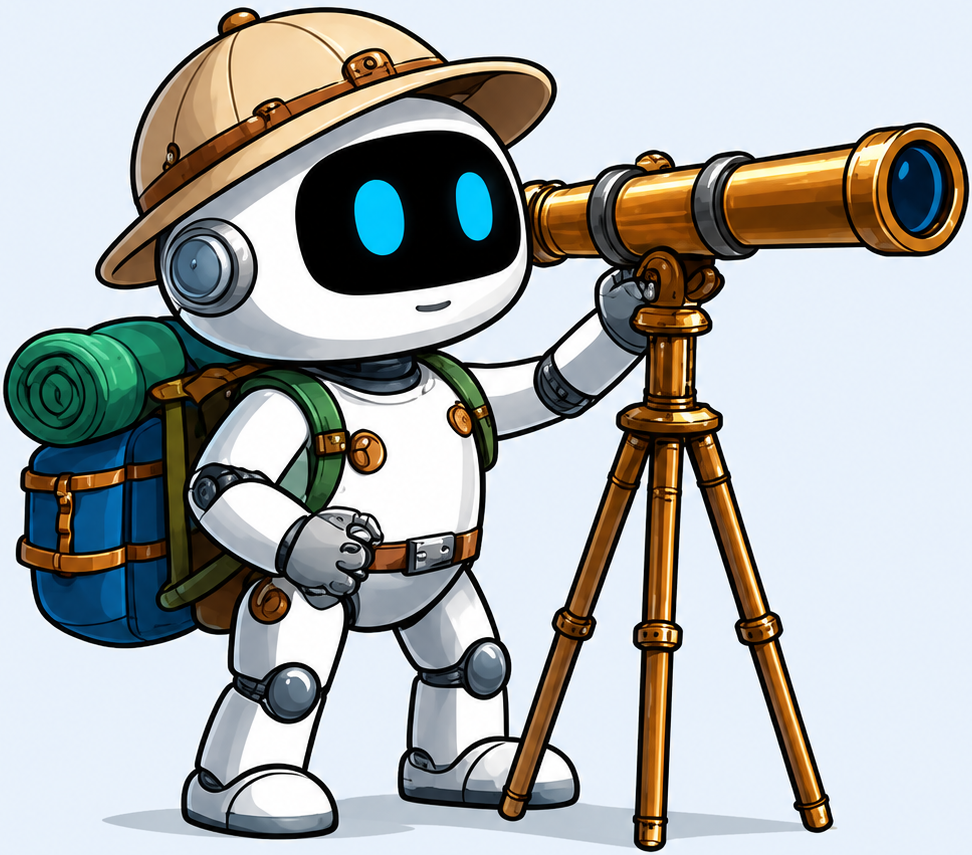
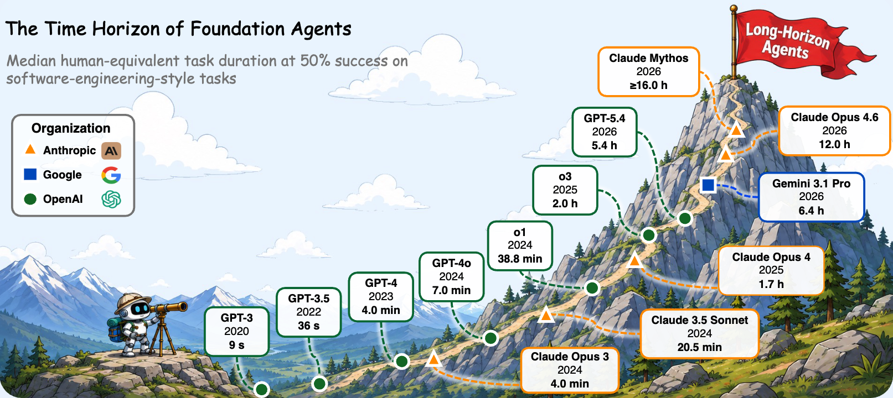
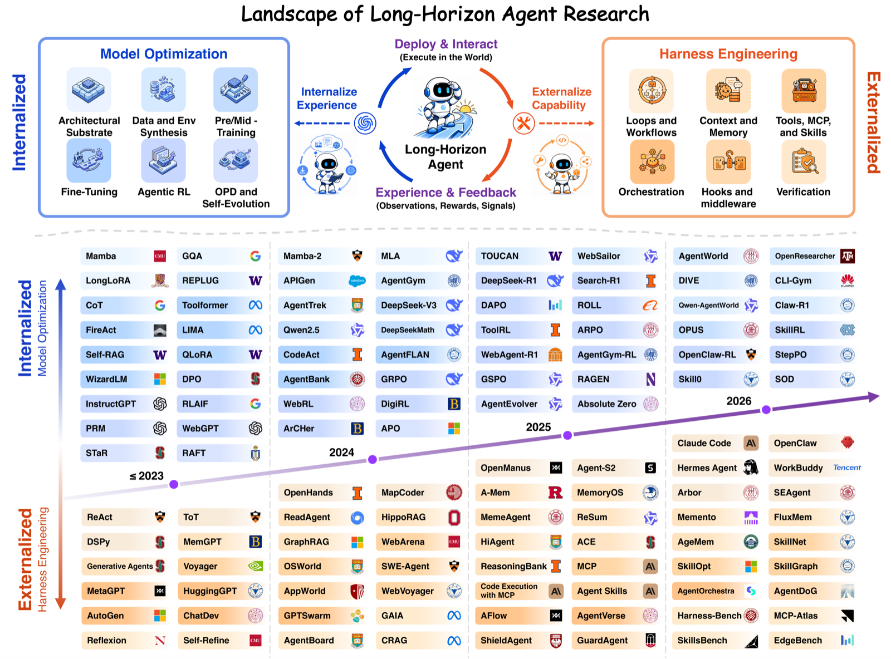
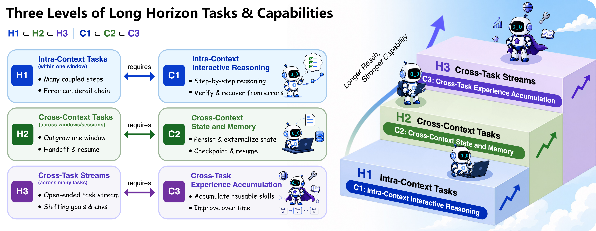
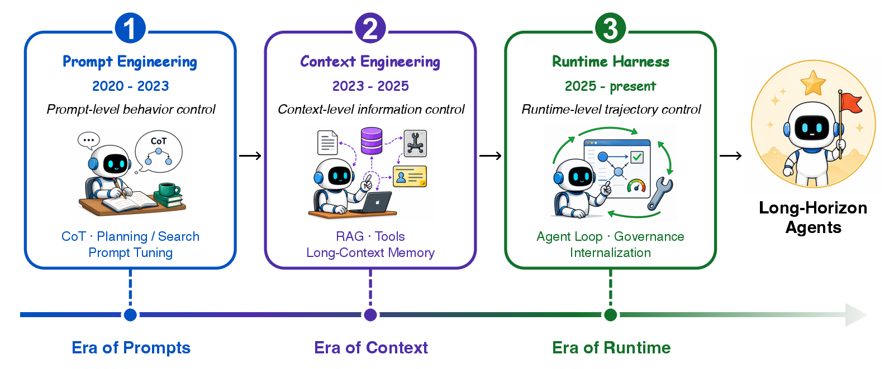
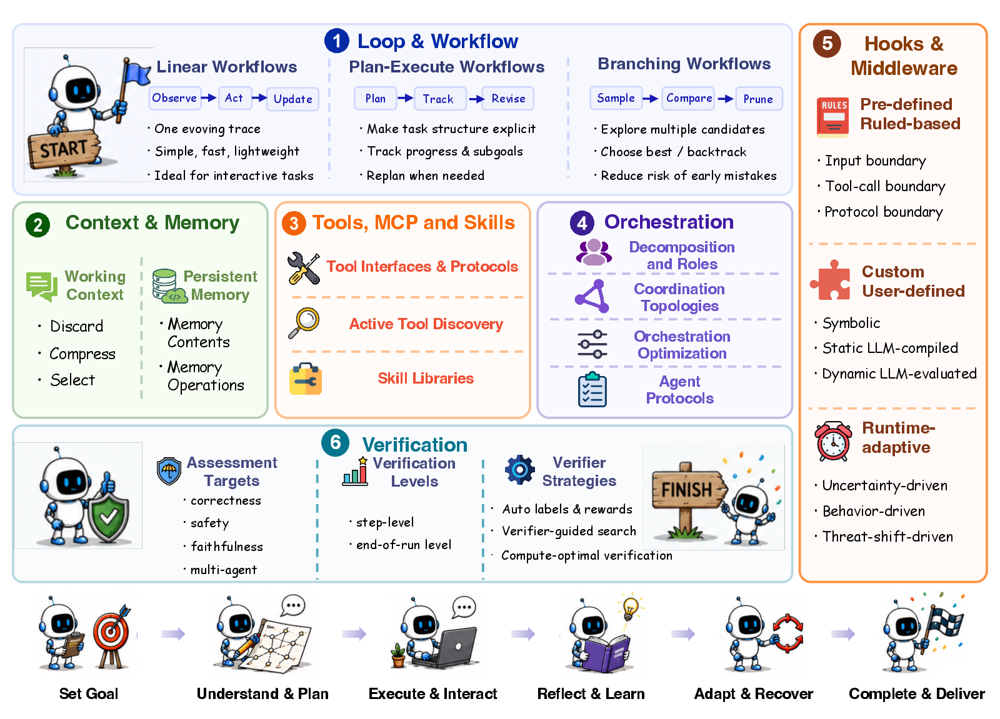
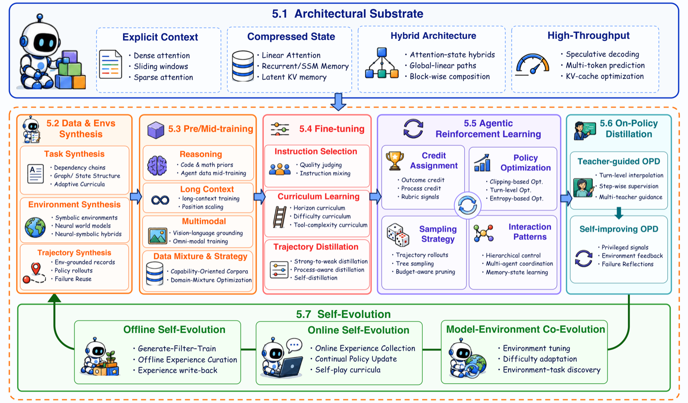
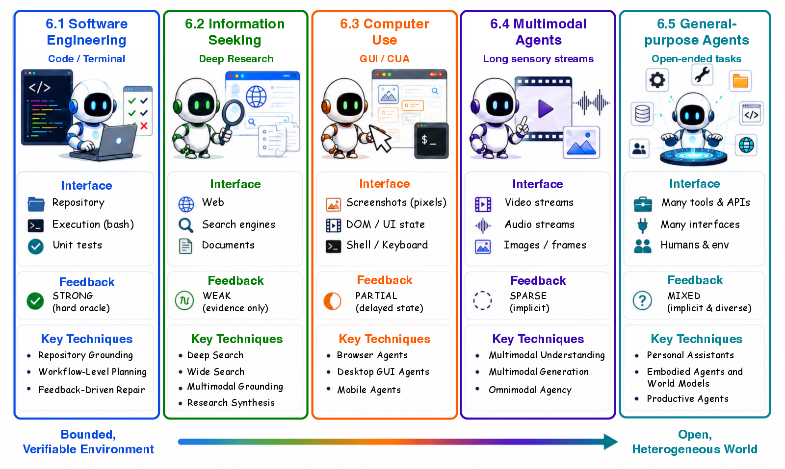

<div align="center">




# Toward Long-Horizon AI Agents: A Survey

### Foundations, Evolution, Harnesses, Optimization, Applications, and Frontiers

[](https://github.com/RUC-NLPIR/Awesome-Long-Horizon-Agents)
[](https://github.com/RUC-NLPIR/Awesome-Long-Horizon-Agents)
[](https://github.com/RUC-NLPIR/Awesome-Long-Horizon-Agents/pulls)
[](https://github.com/RUC-NLPIR/Awesome-Long-Horizon-Agents)
[](LICENSE)

*A curated, continuously-updated reading list accompanying our survey on **long-horizon AI agents**.*

<div align="center">

<br>
<em><b>Figure 1.</b> The <b>time horizon</b> of frontier AI agents — the length of tasks (measured by human completion time) they can finish autonomously — has been growing exponentially, roughly doubling every few months. This steady expansion is pushing agents from short, single-step responses toward genuinely long-horizon autonomy.</em>
</div>


</div>

---

> **TL;DR** — We frame **long-horizon agency** as the *co-evolution* of an **externalized harness** and an **internalized optimization** of the policy. The survey (and this list) is organized around six connected perspectives: **Foundations → Evolution → Harnesses → Optimization → Applications → Frontiers.**

---

## 📢 News

- **[2026/07]** 🚀 We released the paper list for **Toward Long-Horizon AI Agents: A Survey**, restructured to mirror the paper chapter-by-chapter.
- **[2026/07]** 📄 Our survey **Toward Long-Horizon AI Agents** is available (arXiv link coming soon).
- **[2026/07]** 🙌 Contributions are welcome — open a PR to add a missing work (please keep the `[Venue Year] Title. [paper] [code]` format).

---

## 👋 Introduction

<div align="center">

<br>
<em><b>Figure 2.</b> The landscape of long-horizon agent research. A co-evolutionary view organized around externalized <b>harness</b> engineering (bottom) and internalized model <b>optimization</b> (top), spanning foundations, evolution, harnesses, optimization, applications, and frontiers.</em>
</div>


<br>

Over the past few years, large language models have moved from single-turn chatbots to the decision-making core of autonomous agents across software engineering, information seeking, computer use, and scientific discovery. As Figure 1 illustrates, the time horizon of tasks these agents can complete on their own is expanding at an exponential pace. This trend crystallizes one decisive requirement we call **long horizon**: persistent iteration across reasoning, tool use, observation, and revision over many interdependent steps — from tasks completable within a single context window to those spanning windows, sessions, or open-ended task streams.

Our survey frames **long-horizon agency** as a system-level capability jointly shaped by two forces:

- **Externalized harness engineering**: loops and workflows, context and memory, tools and skills, orchestration, hooks, and verification.
- **Internalized model optimization**: architecture, data and environment synthesis, pre-/mid-training, fine-tuning, agentic reinforcement learning, on-policy distillation, and self-evolution.

The two sides co-evolve through experience and feedback: capabilities first implemented explicitly in the harness may later be internalized into the model policy, while stronger policies in turn enable more capable harnesses. Figure 2 lays out this co-evolutionary landscape end to end.


---

## 📑 Table of Contents

- [Foundations: Formalizing Long-Horizon Agents](#foundations-formalizing-long-horizon-agents)
- [Evolution: From Prompting to Runtime](#evolution-from-prompting-to-runtime)
  - [Stage I — Prompt Engineering (2020–2022)](#stage-i--prompt-engineering-20202022)
  - [Stage II — Context Engineering (2023–2024)](#stage-ii--context-engineering-20232024)
  - [Stage III — Runtime Harnesses (2024–2026)](#stage-iii--runtime-harnesses-20242026)
- [Harnesses: Externalizing Long-Horizon Capability (Pillar I)](#harnesses-externalizing-long-horizon-capability-pillar-i)
  - [Loops and Workflows](#loops-and-workflows)
  - [Context and Memory](#context-and-memory)
  - [Tools, MCP, and Skills](#tools-mcp-and-skills)
  - [Orchestration](#orchestration)
  - [Hooks and Middleware](#hooks-and-middleware)
  - [Verification](#verification)
- [Optimization: Internalizing Long-Horizon Capability (Pillar II)](#optimization-internalizing-long-horizon-capability-pillar-ii)
  - [Architectural Substrate](#architectural-substrate)
  - [Data and Environment Synthesis](#data-and-environment-synthesis)
  - [Pre-training and Mid-training](#pre-training-and-mid-training)
  - [Fine-tuning](#fine-tuning)
  - [Agentic Reinforcement Learning](#agentic-reinforcement-learning)
  - [On-Policy Distillation](#on-policy-distillation)
  - [Self-Evolution](#self-evolution)
- [Applications: Long-Horizon Agents in Practice](#applications-long-horizon-agents-in-practice)
  - [Software Engineering](#software-engineering)
  - [Information Seeking](#information-seeking)
  - [Computer Use](#computer-use)
  - [Multimodal Agents](#multimodal-agents)
  - [General-Purpose Agents](#general-purpose-agents)
- [Benchmarks and Resources](#benchmarks-and-resources)
- [Frontiers: Open Problems](#frontiers-open-problems)
- [Citation](#citation)
- [Contributing](#contributing)

---

## Foundations: Formalizing Long-Horizon Agents

<div align="center">

<br>
<em><b>Section figure.</b> Three levels of long-horizon tasks (H1 ⊂ H2 ⊂ H3) and the capabilities they demand (C1 ⊂ C2 ⊂ C3).</em>
</div>

<br>

We formalize a long-horizon agent as a base policy coupled to a surrounding harness, $\mathrm{Agent}=\pi_\theta\oplus\mathcal{H}$, and organize long-horizon difficulty into **three nested levels (H1 ⊂ H2 ⊂ H3)**, each paired with the capability it demands (C1 ⊂ C2 ⊂ C3):

| Level | Task horizon | Demanded capability |
|:---:|:---|:---|
| **H1** | Intra-context, within one window (~minutes) | **C1** — Intra-context interactive reasoning |
| **H2** | Cross-context, across windows/sessions (~hours–days) | **C2** — Cross-context state & memory |
| **H3** | Cross-task, open-ended task stream | **C3** — Cross-task experience accumulation |

To make the notion of "horizon" concrete, [METR](https://arxiv.org/abs/2503.14499) measures capability as the length of tasks an agent can complete at a fixed success rate (e.g., the 50%-task-completion time horizon), giving an empirical yardstick that separates long-horizon agency from adjacent notions such as long-running execution, autonomy, and self-evolution.

---

## Evolution: From Prompting to Runtime

<div align="center">

<br>
<em><b>Section figure.</b> The co-evolution of long-horizon agents across three stages: control widens from the <b>language</b> of a single prompt, to the <b>information</b> conditioning each call, to the whole <b>trajectory</b> sustained by a runtime harness.</em>
</div>

### Stage I — Prompt Engineering (2020–2022)

- [NeurIPS 2020] Language Models are Few-Shot Learners (GPT-3). [[paper](https://arxiv.org/abs/2005.14165)]
- [NeurIPS 2022] Chain-of-Thought Prompting Elicits Reasoning in Large Language Models. [[paper](https://arxiv.org/abs/2201.11903)]
- [NeurIPS 2022] Large Language Models are Zero-Shot Reasoners. [[paper](https://arxiv.org/abs/2205.11916)]
- [ICLR 2023] Self-Consistency Improves Chain-of-Thought Reasoning. [[paper](https://arxiv.org/abs/2203.11171)]
- [ICLR 2023] Least-to-Most Prompting Enables Complex Reasoning in LLMs. [[paper](https://arxiv.org/abs/2205.10625)]
- [ICLR 2023] ReAct: Synergizing Reasoning and Acting in Language Models. [[paper](https://arxiv.org/abs/2210.03629)] [[code](https://github.com/ysymyth/ReAct)]
- [ICML 2023] PAL: Program-aided Language Models. [[paper](https://arxiv.org/abs/2211.10435)] [[code](https://github.com/reasoning-machines/pal)]
- [TMLR 2023] Program of Thoughts Prompting. [[paper](https://arxiv.org/abs/2211.12588)] [[code](https://github.com/TIGER-AI-Lab/Program-of-Thoughts)]
- [NeurIPS 2023] Tree of Thoughts: Deliberate Problem Solving with LLMs. [[paper](https://arxiv.org/abs/2305.10601)] [[code](https://github.com/princeton-nlp/tree-of-thought-llm)]
- [CoRL 2022] Do As I Can, Not As I Say (SayCan). [[paper](https://arxiv.org/abs/2204.01691)] [[code](https://github.com/google-research/google-research/tree/master/saycan)]
- [NeurIPS 2022] Training Language Models to Follow Instructions with Human Feedback (InstructGPT). [[paper](https://arxiv.org/abs/2203.02155)]
- [ICLR 2023] Large Language Models Are Human-Level Prompt Engineers (APE). [[paper](https://arxiv.org/abs/2211.01910)] [[code](https://github.com/keirp/automatic_prompt_engineer)]
- [EMNLP 2023] Automatic Prompt Optimization with "Gradient Descent" and Beam Search (APO). [[paper](https://arxiv.org/abs/2305.03495)]

### Stage II — Context Engineering (2023–2024)

**Retrieval-Augmented Generation**
- [NeurIPS 2020] Retrieval-Augmented Generation for Knowledge-Intensive NLP Tasks. [[paper](https://arxiv.org/abs/2005.11401)]
- [ACL 2023] Precise Zero-Shot Dense Retrieval without Relevance Labels (HyDE). [[paper](https://arxiv.org/abs/2212.10496)]
- [ICLR 2024] RAPTOR: Recursive Abstractive Processing for Tree-Organized Retrieval. [[paper](https://arxiv.org/abs/2401.18059)] [[code](https://github.com/parthsarthi03/raptor)]
- [ICLR 2024] Self-RAG: Learning to Retrieve, Generate, and Critique through Self-Reflection. [[paper](https://arxiv.org/abs/2310.11511)] [[code](https://github.com/AkariAsai/self-rag)]

**Tool Use and Function Calling**
- [NeurIPS 2023] Toolformer: Language Models Can Teach Themselves to Use Tools. [[paper](https://arxiv.org/abs/2302.04761)]
- [NeurIPS 2024] Gorilla: Large Language Model Connected with Massive APIs. [[paper](https://arxiv.org/abs/2305.15334)] [[code](https://github.com/ShishirPatil/gorilla)]
- [ICLR 2024] ToolLLM: Facilitating LLMs to Master 16000+ Real-world APIs. [[paper](https://arxiv.org/abs/2307.16789)] [[code](https://github.com/OpenBMB/ToolBench)]
- [arXiv 2021] WebGPT: Browser-assisted Question-answering with Human Feedback. [[paper](https://arxiv.org/abs/2112.09332)]
- [NeurIPS 2023] HuggingGPT: Solving AI Tasks with ChatGPT and its Friends in Hugging Face. [[paper](https://arxiv.org/abs/2303.17580)] [[code](https://github.com/microsoft/JARVIS)]

**Long Context, Memory, and Context Engineering**
- [NeurIPS 2022] FlashAttention: Fast and Memory-Efficient Exact Attention. [[paper](https://arxiv.org/abs/2205.14135)] [[code](https://github.com/Dao-AILab/flash-attention)]
- [TACL 2024] Lost in the Middle: How Language Models Use Long Contexts. [[paper](https://arxiv.org/abs/2307.03172)]
- [arXiv 2023] MemGPT: Towards LLMs as Operating Systems. [[paper](https://arxiv.org/abs/2310.08560)] [[code](https://github.com/letta-ai/letta)]
- [UIST 2023] Generative Agents: Interactive Simulacra of Human Behavior. [[paper](https://arxiv.org/abs/2304.03442)] [[code](https://github.com/joonspk-research/generative_agents)]
- [EMNLP 2023] LLMLingua: Compressing Prompts for Accelerated Inference of LLMs. [[paper](https://arxiv.org/abs/2310.05736)] [[code](https://github.com/microsoft/LLMLingua)]

### Stage III — Runtime Harnesses (2024–2026)

- [NeurIPS 2023] Reflexion: Language Agents with Verbal Reinforcement Learning. [[paper](https://arxiv.org/abs/2303.11366)] [[code](https://github.com/noahshinn/reflexion)]
- [NeurIPS 2023] Self-Refine: Iterative Refinement with Self-Feedback. [[paper](https://arxiv.org/abs/2303.17651)] [[code](https://github.com/madaan/self-refine)]
- [ICML 2024] Executable Code Actions Elicit Better LLM Agents (CodeAct). [[paper](https://arxiv.org/abs/2402.01030)] [[code](https://github.com/xingyaoww/code-act)]
- [ICLR 2024] MetaGPT: Meta Programming for Multi-Agent Collaborative Framework. [[paper](https://arxiv.org/abs/2308.00352)] [[code](https://github.com/FoundationAgents/MetaGPT)]
- [COLM 2024] AutoGen: Enabling Next-Gen LLM Applications via Multi-Agent Conversation. [[paper](https://arxiv.org/abs/2308.08155)] [[code](https://github.com/microsoft/autogen)]
- [ACL 2024] ChatDev: Communicative Agents for Software Development. [[paper](https://arxiv.org/abs/2307.07924)] [[code](https://github.com/OpenBMB/ChatDev)]
- [arXiv 2024] Magentic-One: A Generalist Multi-Agent System. [[paper](https://arxiv.org/abs/2411.04468)] [[code](https://github.com/microsoft/autogen)]
- [arXiv 2024] LangGraph: Building Stateful, Multi-Actor Applications with LLMs. [[code](https://github.com/langchain-ai/langgraph)]
- [2025] Model Context Protocol (MCP). [[paper](https://modelcontextprotocol.io/)] [[code](https://github.com/modelcontextprotocol)]
- [ICLR 2025] OpenHands: An Open Platform for AI Software Developers as Generalist Agents. [[paper](https://arxiv.org/abs/2407.16741)] [[code](https://github.com/All-Hands-AI/OpenHands)]
- [NeurIPS 2024] SWE-agent: Agent-Computer Interfaces Enable Automated Software Engineering. [[paper](https://arxiv.org/abs/2405.15793)] [[code](https://github.com/SWE-agent/SWE-agent)]
- [arXiv 2025] Darwin Gödel Machine: Open-Ended Evolution of Self-Improving Agents. [[paper](https://arxiv.org/abs/2505.22954)]
- [arXiv 2025] Search-R1: Training LLMs to Reason and Leverage Search Engines with RL. [[paper](https://arxiv.org/abs/2503.09516)] [[code](https://github.com/PeterGriffinJin/Search-R1)]

---

## Harnesses: Externalizing Long-Horizon Capability (Pillar I)

<div align="center">

<br>
<em><b>Section figure.</b> An agent harness in action — the six components (loop & workflow, context & memory, tools & environments, orchestration, hooks, verification) together sustain a single goal across many dependent steps.</em>
</div>

### Loops and Workflows

- [ICLR 2023] ReAct: Synergizing Reasoning and Acting (linear/reactive loop). [[paper](https://arxiv.org/abs/2210.03629)] [[code](https://github.com/ysymyth/ReAct)]
- [arXiv 2023] ReWOO: Decoupling Reasoning from Observations for Efficient Augmented LMs. [[paper](https://arxiv.org/abs/2305.18323)] [[code](https://github.com/billxbf/ReWOO)]
- [ACL 2023] Plan-and-Solve Prompting. [[paper](https://arxiv.org/abs/2305.04091)] [[code](https://github.com/AGI-Edgerunners/Plan-and-Solve-Prompting)]
- [ICML 2024] Language Agent Tree Search (LATS). [[paper](https://arxiv.org/abs/2310.04406)] [[code](https://github.com/lapisrocks/LanguageAgentTreeSearch)]
- [ICLR 2024] CRITIC: LLMs Can Self-Correct with Tool-Interactive Critiquing. [[paper](https://arxiv.org/abs/2305.11738)] [[code](https://github.com/microsoft/ProphetNet/tree/master/CRITIC)]
- [arXiv 2026] Arbor: Autonomous Research via Persistent Hypothesis Trees. [[paper](https://github.com/RUC-NLPIR/Awesome-Long-Horizon-Agents)]

### Context and Memory

**Working Context (discard / compress / select)**
- [Anthropic Blog 2025] Effective Context Engineering for AI Agents (Anthropic). [[paper](https://www.anthropic.com/engineering/effective-context-engineering-for-ai-agents)]
- [arXiv 2025] ReSum: Unlocking Long-Horizon Search Intelligence via Context Summarization. [[paper](https://arxiv.org/abs/2509.13313)] [[code](https://github.com/Alibaba-NLP/DeepResearch)]
- [arXiv 2025] MemAgent: Reshaping Long-Context LLM with Multi-Conv RL Memory. [[paper](https://arxiv.org/abs/2507.02259)] [[code](https://github.com/BytedTsinghua-SIA/MemAgent)]
- [arXiv 2025] MEM1: Learning to Synergize Memory and Reasoning. [[paper](https://arxiv.org/abs/2506.15841)] [[code](https://github.com/MIT-MI/MEM1)]
- [ACL 2025] HiAgent: Hierarchical Working Memory Management for LLM Agents. [[paper](https://arxiv.org/abs/2408.09559)] [[code](https://github.com/HiAgent2024/HiAgent)]
- [arXiv 2025] ACE: Agentic Context Engineering. [[paper](https://arxiv.org/abs/2510.04618)]
- [arXiv 2025] Memory-as-Action: Autonomous Context Curation for Long-Horizon Agentic Tasks. [[paper](https://arxiv.org/abs/2510.12635)]

**Persistent Memory (factual / experiential)**
- [Spec 2024] AGENTS.md / Project-rule files (CLAUDE.md, Cursor Rules). [[paper](https://agents.md/)]
- [arXiv 2025] Mem0: Building Production-Ready AI Agents with Scalable Long-Term Memory. [[paper](https://arxiv.org/abs/2504.19413)] [[code](https://github.com/mem0ai/mem0)]
- [NeurIPS 2024] HippoRAG: Neurobiologically Inspired Long-Term Memory for LLMs. [[paper](https://arxiv.org/abs/2405.14831)] [[code](https://github.com/OSU-NLP-Group/HippoRAG)]
- [arXiv 2025] A-MEM: Agentic Memory for LLM Agents. [[paper](https://arxiv.org/abs/2502.12110)] [[code](https://github.com/agiresearch/A-mem)]
- [arXiv 2025] MemoryOS: Memory OS of AI Agent. [[paper](https://arxiv.org/abs/2506.06326)] [[code](https://github.com/BAI-LAB/MemoryOS)]
- [AAAI 2024] ExpeL: LLM Agents Are Experiential Learners. [[paper](https://arxiv.org/abs/2308.10144)] [[code](https://github.com/LeapLabTHU/ExpeL)]
- [ICML 2025] Agent Workflow Memory (AWM). [[paper](https://arxiv.org/abs/2409.07429)] [[code](https://github.com/zorazrw/agent-workflow-memory)]
- [arXiv 2025] ReasoningBank: Scaling Agent Self-Evolving with Reasoning Memory. [[paper](https://arxiv.org/abs/2509.25140)]
- [TMLR 2024] Voyager: An Open-Ended Embodied Agent with LLMs (skill memory). [[paper](https://arxiv.org/abs/2305.16291)] [[code](https://github.com/MineDojo/Voyager)]

### Tools, MCP, and Skills

**Tool interfaces & protocols**
- [2025] Model Context Protocol (MCP) Specification. [[paper](https://modelcontextprotocol.io/)] [[code](https://github.com/modelcontextprotocol)]
- [ICML 2025] Berkeley Function-Calling Leaderboard (BFCL). [[paper](https://gorilla.cs.berkeley.edu/leaderboard.html)] [[code](https://github.com/ShishirPatil/gorilla)]
- [ICLR 2025] τ-bench: A Benchmark for Tool-Agent-User Interaction. [[paper](https://arxiv.org/abs/2406.12045)] [[code](https://github.com/sierra-research/tau-bench)]
- [arXiv 2025] MCP-Universe: Benchmarking LLMs with Real-World MCP Servers. [[paper](https://arxiv.org/abs/2508.14704)] [[code](https://github.com/SalesforceAIResearch/MCP-Universe)]

**Active tool discovery**
- [arXiv 2025] RAG-MCP: Mitigating Prompt Bloat via Retrieval over MCP Tools. [[paper](https://arxiv.org/abs/2505.03275)]
- [ICML 2024] AnyTool: Self-Reflective, Hierarchical Agents for Large-Scale API Calls. [[paper](https://arxiv.org/abs/2402.04253)] [[code](https://github.com/dyabel/AnyTool)]
- [arXiv 2025] MCP-Zero: Active Tool Discovery for Autonomous LLM Agents. [[paper](https://arxiv.org/abs/2506.01056)]
- [ICLR 2025] ToolGen: Unified Tool Retrieval and Calling via Generation. [[paper](https://arxiv.org/abs/2410.03439)] [[code](https://github.com/Reason-Wang/ToolGen)]
- [arXiv 2025] DeepAgent: A General Reasoning Agent with Scalable Toolsets. [[paper](https://github.com/RUC-NLPIR/Awesome-Long-Horizon-Agents)]

**Skill libraries**
- [TMLR 2024] Voyager: Reusable Executable Skill Library. [[paper](https://arxiv.org/abs/2305.16291)] [[code](https://github.com/MineDojo/Voyager)]
- [2025] Agent Skills (Anthropic). [[paper](https://www.anthropic.com/news/agent-skills)]
- [arXiv 2026] SkillNet / SkillGraph: Relational Skill Graphs for Agents. [[paper](https://github.com/RUC-NLPIR/Awesome-Long-Horizon-Agents)]
- [arXiv 2026] Skill0: Internalizing Skill Libraries via In-Context Agentic RL. [[paper](https://github.com/RUC-NLPIR/Awesome-Long-Horizon-Agents)]
- [arXiv 2025] Alita: Generalist Agent Enabling Scalable Agentic Reasoning with Minimal Predefinition and Maximal Self-Evolution. [[paper](https://arxiv.org/abs/2505.20286)]

### Orchestration

**Decomposition & roles**
- [ICLR 2024] MetaGPT: Meta Programming for Multi-Agent Collaboration. [[paper](https://arxiv.org/abs/2308.00352)] [[code](https://github.com/FoundationAgents/MetaGPT)]
- [NeurIPS 2023] CAMEL: Communicative Agents for "Mind" Exploration. [[paper](https://arxiv.org/abs/2303.17760)] [[code](https://github.com/camel-ai/camel)]
- [Neural Networks 2025] TDAG: A Multi-Agent Framework based on Dynamic Task Decomposition. [[paper](https://arxiv.org/abs/2402.10178)]
- [ICLR 2025] Agent-Oriented Planning in Multi-Agent Systems. [[paper](https://arxiv.org/abs/2410.02189)]

**Coordination topologies & optimization**
- [arXiv 2024] Magentic-One: A Generalist Multi-Agent System. [[paper](https://arxiv.org/abs/2411.04468)] [[code](https://github.com/microsoft/autogen)]
- [ICLR 2024] AgentVerse: Facilitating Multi-Agent Collaboration. [[paper](https://arxiv.org/abs/2308.10848)] [[code](https://github.com/OpenBMB/AgentVerse)]
- [ICML 2024] GPTSwarm: Language Agents as Optimizable Graphs. [[paper](https://arxiv.org/abs/2402.16823)] [[code](https://github.com/metauto-ai/gptswarm)]
- [ICLR 2025] AFlow: Automating Agentic Workflow Generation. [[paper](https://arxiv.org/abs/2410.10762)] [[code](https://github.com/FoundationAgents/AFlow)]
- [ACL 2025] MasRouter: Learning to Route LLMs for Multi-Agent Systems. [[paper](https://arxiv.org/abs/2502.11133)] [[code](https://github.com/yanweiyue/masrouter)]

**Agent protocols**
- [2025] A2A: Agent-to-Agent Protocol. [[code](https://github.com/a2aproject/A2A)]
- [arXiv 2025] A Survey of AI Agent Protocols. [[paper](https://arxiv.org/abs/2504.16736)]

### Hooks and Middleware

- [arXiv 2025] AEGIS: Policy-Engine Guardrails on Every Tool Call. [[paper](https://github.com/RUC-NLPIR/Awesome-Long-Horizon-Agents)]
- [ICSE 2026] AgentSpec: Customizable Runtime Enforcement for Safe and Reliable LLM Agents. [[paper](https://arxiv.org/abs/2503.18666)]
- [ICML 2025] GuardAgent: Safeguard LLM Agents via Knowledge-Enabled Reasoning. [[paper](https://arxiv.org/abs/2406.09187)]
- [ICML 2025] ShieldAgent: Shielding Agents via Verifiable Safety Policy Reasoning. [[paper](https://arxiv.org/abs/2503.22738)]
- [arXiv 2023] Llama Guard: LLM-based Input-Output Safeguard. [[paper](https://arxiv.org/abs/2312.06674)] [[code](https://github.com/meta-llama/PurpleLlama)]
- [ACL 2025] AGrail: A Lifelong Agent Guardrail with Effective and Adaptive Safety Detection. [[paper](https://arxiv.org/abs/2502.11448)]
- [arXiv 2024] Agent-SafetyBench: Evaluating the Safety of LLM Agents. [[paper](https://arxiv.org/abs/2412.14470)] [[code](https://github.com/thu-coai/Agent-SafetyBench)]

### Verification

- [ICLR 2024] Let's Verify Step by Step (Process Reward Models). [[paper](https://arxiv.org/abs/2305.20050)] [[code](https://github.com/openai/prm800k)]
- [ACL 2024] Math-Shepherd: Verify and Reinforce LLMs Step-by-step. [[paper](https://arxiv.org/abs/2312.08935)]
- [EMNLP 2023] SelfCheckGPT: Zero-Resource Hallucination Detection. [[paper](https://arxiv.org/abs/2303.08896)] [[code](https://github.com/potsawee/selfcheckgpt)]
- [ICML 2024] Improving Factuality and Reasoning via Multiagent Debate. [[paper](https://arxiv.org/abs/2305.14325)] [[code](https://github.com/composable-models/llm_multiagent_debate)]
- [NeurIPS 2023] Judging LLM-as-a-Judge with MT-Bench. [[paper](https://arxiv.org/abs/2306.05685)] [[code](https://github.com/lm-sys/FastChat)]
- [ICML 2025] Agent-as-a-Judge: Evaluating Agents with Agents. [[paper](https://arxiv.org/abs/2410.10934)] [[code](https://github.com/metauto-ai/agent-as-a-judge)]
- [arXiv 2026] AgentDoG: Trajectory-Level Moderation with Root-Cause Diagnosis. [[paper](https://github.com/RUC-NLPIR/Awesome-Long-Horizon-Agents)]
- [arXiv 2026] ToolSafe: RL-Trained Step-Level Tool-Invocation Guardrail. [[paper](https://github.com/RUC-NLPIR/Awesome-Long-Horizon-Agents)]
- [NeurIPS 2025] Web-Shepherd: Advancing PRMs for Reinforcing Web Agents. [[paper](https://arxiv.org/abs/2505.15277)]

---

## Optimization: Internalizing Long-Horizon Capability (Pillar II)

<div align="center">

<br>
<em><b>Section figure.</b> The agentic training pipeline for internalizing long-horizon capability — an architectural substrate plus six training stages (data & environment synthesis, pre/mid-training, fine-tuning, RL, on-policy distillation, self-evolution).</em>
</div>

### Architectural Substrate

- [arXiv 2020] Longformer: The Long-Document Transformer. [[paper](https://arxiv.org/abs/2004.05150)] [[code](https://github.com/allenai/longformer)]
- [NeurIPS 2020] Big Bird: Transformers for Longer Sequences. [[paper](https://arxiv.org/abs/2007.14062)]
- [COLM 2024] Mamba: Linear-Time Sequence Modeling with Selective State Spaces. [[paper](https://arxiv.org/abs/2312.00752)] [[code](https://github.com/state-spaces/mamba)]
- [ICML 2024] Mamba-2: Transformers are SSMs. [[paper](https://arxiv.org/abs/2405.21060)] [[code](https://github.com/state-spaces/mamba)]
- [EMNLP 2023] GQA: Training Generalized Multi-Query Transformer Models. [[paper](https://arxiv.org/abs/2305.13245)]
- [arXiv 2024] DeepSeek-V3 Technical Report (MLA / MoE). [[paper](https://arxiv.org/abs/2412.19437)] [[code](https://github.com/deepseek-ai/DeepSeek-V3)]
- [ICLR 2025] Jamba: A Hybrid Transformer-Mamba Language Model. [[paper](https://arxiv.org/abs/2403.19887)]
- [arXiv 2025] Kimi Linear: Hybrid Linear Attention Architecture. [[paper](https://arxiv.org/abs/2510.26692)]
- [ICML 2024] EAGLE: Speculative Sampling Requires Rethinking Feature Uncertainty. [[paper](https://arxiv.org/abs/2401.15077)] [[code](https://github.com/SafeAILab/EAGLE)]
- [ICML 2023] Fast Inference from Transformers via Speculative Decoding. [[paper](https://arxiv.org/abs/2211.17192)]

### Data and Environment Synthesis

- [ICLR 2026] TaskCraft: Automated Generation of Agentic Tasks. [[paper](https://arxiv.org/abs/2506.10055)] [[code](https://github.com/OPPO-PersonalAI/TaskCraft)]
- [arXiv 2025] WebShaper: Agentically Data Synthesizing via Information-Seeking Formalization. [[paper](https://arxiv.org/abs/2507.15061)] [[code](https://github.com/Alibaba-NLP/DeepResearch)]
- [arXiv 2025] AgentFrontier: Expanding the Capability Frontier of LLM Agents. [[paper](https://github.com/RUC-NLPIR/Awesome-Long-Horizon-Agents)]
- [ICML 2025] SWE-Gym: Training Software Engineering Agents and Verifiers. [[paper](https://arxiv.org/abs/2412.21139)] [[code](https://github.com/SWE-Gym/SWE-Gym)]
- [ICLR 2024] WebArena: A Realistic Web Environment for Building Autonomous Agents. [[paper](https://arxiv.org/abs/2307.13854)] [[code](https://github.com/web-arena-x/webarena)]
- [NeurIPS 2024] OSWorld: Benchmarking Multimodal Agents for Open-Ended Tasks. [[paper](https://arxiv.org/abs/2404.07972)] [[code](https://github.com/xlang-ai/OSWorld)]
- [TMLR 2025] Is Your LLM Secretly a World Model of the Internet? Model-Based Planning for Web Agents (WebDreamer). [[paper](https://arxiv.org/abs/2411.06559)] [[code](https://github.com/OSU-NLP-Group/WebDreamer)]
- [arXiv 2025] TOUCAN: Synthesizing 1.5M Tool-Agentic Trajectories from Real MCP Environments. [[paper](https://arxiv.org/abs/2510.01179)]
- [ICLR 2026] AgentGym-RL: Training LLM Agents for Long-Horizon Decision Making. [[paper](https://arxiv.org/abs/2509.08755)] [[code](https://github.com/WooooDyy/AgentGym-RL)]
- [arXiv 2026] Agent-World: Discovering Environment–Task Pairs for Self-Evolving Training. [[paper](https://github.com/RUC-NLPIR/Awesome-Long-Horizon-Agents)]

### Pre-training and Mid-training

- [arXiv 2024] Qwen2.5 Technical Report. [[paper](https://arxiv.org/abs/2412.15115)] [[code](https://github.com/QwenLM/Qwen2.5)]
- [arXiv 2024] DeepSeek-V3 Technical Report. [[paper](https://arxiv.org/abs/2412.19437)] [[code](https://github.com/deepseek-ai/DeepSeek-V3)]
- [arXiv 2025] Kimi K2: Open Agentic Intelligence. [[paper](https://arxiv.org/abs/2507.20534)] [[code](https://github.com/MoonshotAI/Kimi-K2)]
- [ICLR 2024] YaRN: Efficient Context Window Extension of Large Language Models. [[paper](https://arxiv.org/abs/2309.00071)] [[code](https://github.com/jquesnelle/yarn)]
- [ICLR 2024] LongLoRA: Efficient Fine-tuning of Long-Context LLMs. [[paper](https://arxiv.org/abs/2309.12307)] [[code](https://github.com/dvlab-research/LongLoRA)]
- [arXiv 2024] How to Train Long-Context Language Models (ProLong). [[paper](https://arxiv.org/abs/2410.02660)] [[code](https://github.com/princeton-nlp/ProLong)]
- [arXiv 2024] Qwen2-VL: Enhancing Vision-Language Model's Perception. [[paper](https://arxiv.org/abs/2409.12191)] [[code](https://github.com/QwenLM/Qwen2-VL)]
- [arXiv 2025] InternVL3: Advanced Open Multimodal Foundation Models. [[paper](https://arxiv.org/abs/2504.10479)] [[code](https://github.com/OpenGVLab/InternVL)]
- [NeurIPS 2023] DoReMi: Optimizing Data Mixtures Speeds Up Pretraining. [[paper](https://arxiv.org/abs/2305.10429)]
- [arXiv 2026] OPUS: Optimizer-Aware Data Selection for Pre-training. [[paper](https://github.com/RUC-NLPIR/Awesome-Long-Horizon-Agents)]

### Fine-tuning

- [arXiv 2023] AgentTuning: Enabling Generalized Agent Abilities for LLMs. [[paper](https://arxiv.org/abs/2310.12823)] [[code](https://github.com/THUDM/AgentTuning)]
- [arXiv 2025] LIMI: Less is More for Agency. [[paper](https://arxiv.org/abs/2509.17567)] [[code](https://github.com/GAIR-NLP/LIMI)]
- [arXiv 2025] ATLaS: Agent Tuning via Learning Critical Steps. [[paper](https://arxiv.org/abs/2503.02197)]
- [arXiv 2025] LIMO: Less is More for Reasoning. [[paper](https://arxiv.org/abs/2502.03387)] [[code](https://github.com/GAIR-NLP/LIMO)]
- [arXiv 2025] s1: Simple Test-Time Scaling. [[paper](https://arxiv.org/abs/2501.19393)] [[code](https://github.com/simplescaling/s1)]
- [ICML 2024] Executable Code Actions Elicit Better LLM Agents (CodeAct). [[paper](https://arxiv.org/abs/2402.01030)] [[code](https://github.com/xingyaoww/code-act)]
- [NeurIPS 2024] APIGen: Automated Pipeline for Generating Function-Calling Datasets. [[paper](https://arxiv.org/abs/2406.18518)] [[code](https://github.com/SalesforceAIResearch/xLAM)]
- [arXiv 2025] Agent Data Protocol (ADP): Unifying Datasets for Agent Tuning. [[paper](https://github.com/RUC-NLPIR/Awesome-Long-Horizon-Agents)]
- [arXiv 2025] Agent-R: Training Language Agents to Reflect via Iterative Self-Training. [[paper](https://arxiv.org/abs/2501.11425)] [[code](https://github.com/bytedance/Agent-R)]
- [arXiv 2025] Distilling LLM Agent into Small Models with Retrieval and Code Tools. [[paper](https://arxiv.org/abs/2505.17612)]

### Agentic Reinforcement Learning

*Credit assignment · policy optimization · sampling strategy · interaction patterns. GitHub links follow the paper's Table (Agentic RL).*

**Credit Assignment**
- [arXiv 2024] DeepSeekMath: Pushing the Limits of Mathematical Reasoning (GRPO). [[paper](https://arxiv.org/abs/2402.03300)] [[code](https://github.com/deepseek-ai/DeepSeek-Math)]
- [arXiv 2025] Search-R1: RL for Search-Integrated Reasoning. [[paper](https://arxiv.org/abs/2503.09516)] [[code](https://github.com/PeterGriffinJin/Search-R1)]
- [arXiv 2025] DeepRetrieval: RL for Retrieval-Metric Rewards. [[paper](https://arxiv.org/abs/2503.00223)] [[code](https://github.com/pat-jj/DeepRetrieval)]
- [arXiv 2025] ToolRL: Reward is All Tool Learning Needs. [[paper](https://arxiv.org/abs/2504.13958)] [[code](https://github.com/qiancheng0/ToolRL)]
- [arXiv 2025] Tool-Star: Empowering Multi-Tool Reasoning via RL. [[paper](https://arxiv.org/abs/2505.16410)] [[code](https://github.com/RUC-NLPIR/Tool-Star)]
- [arXiv 2025] RuscaRL: Rubric-Scaffolded Reinforcement Learning. [[paper](https://arxiv.org/abs/2508.16949)] [[code](https://github.com/IANNXANG/RuscaRL)]
- [arXiv 2025] DR Tulu: Co-evolving Rubrics in Deep Research. [[code](https://github.com/rlresearch/dr-tulu)]

**Policy Optimization**
- [arXiv 2025] REINFORCE++: A Simple and Efficient Approach for Aligning LLMs. [[paper](https://arxiv.org/abs/2501.03262)] [[code](https://github.com/OpenRLHF/OpenRLHF)]
- [arXiv 2025] DAPO: An Open-Source LLM Reinforcement Learning System at Scale. [[paper](https://arxiv.org/abs/2503.14476)] [[code](https://github.com/BytedTsinghua-SIA/DAPO)]
- [arXiv 2025] Understanding R1-Zero-Like Training (Dr.GRPO). [[paper](https://arxiv.org/abs/2503.20783)] [[code](https://github.com/sail-sg/understand-r1-zero)]
- [arXiv 2025] GSPO: Group Sequence Policy Optimization. [[paper](https://arxiv.org/abs/2507.18071)]
- [arXiv 2025] GiGPO: Group-in-Group Policy Optimization for Agents. [[paper](https://arxiv.org/abs/2505.10978)] [[code](https://github.com/langfengQ/verl-agent)]
- [arXiv 2025] CURE: Critical-Token-Guided Re-concatenation for Entropy-collapse Prevention. [[code](https://github.com/bytedance/CURE)]
- [arXiv 2025] EPO: Entropy-Regularized Policy Optimization for Multi-Turn Agents. [[code](https://github.com/WujiangXu/EPO)]

**Sampling Strategy**
- [NeurIPS 2025] WebDancer: Towards Autonomous Information Seeking Agency. [[paper](https://arxiv.org/abs/2505.22648)] [[code](https://github.com/Alibaba-NLP/DeepResearch)]
- [ICLR 2025] WebRL: Training Web Agents via Self-Evolving Online Curriculum RL. [[paper](https://arxiv.org/abs/2411.02337)] [[code](https://github.com/THUDM/WebRL)]
- [arXiv 2025] Tree-GRPO: Tree-Based Group Relative Policy Optimization. [[paper](https://github.com/RUC-NLPIR/Awesome-Long-Horizon-Agents)]
- [arXiv 2025] TreePO: Reusing Inference Compute Across Tree Paths. [[code](https://github.com/multimodal-art-projection/TreePO)]
- [arXiv 2025] TCOD: Trajectory-Depth Curriculum for Agent RL. [[code](https://github.com/kokolerk/TCOD)]

**Interaction Patterns**
- [ICML 2025] GLIDER: Grounding LLMs as Decision-Making Agents. [[code](https://github.com/NJU-RL/GLIDER)]
- [arXiv 2026] SkillRL: Evolving a Skill Library from Failures via RL. [[code](https://github.com/aiming-lab/SkillRL)]
- [arXiv 2025] MATPO: Multi-Agent Tool-Integrated Policy Optimization. [[code](https://github.com/mzf666/MATPO)]
- [arXiv 2025] Memory-R1: Managing and Utilizing Memory via RL. [[paper](https://arxiv.org/abs/2508.19828)] [[code](https://github.com/yansikuan/memory-r1)]
- [arXiv 2025] Agent Lightning: Train ANY AI Agents with Reinforcement Learning. [[paper](https://arxiv.org/abs/2508.03680)] [[code](https://github.com/microsoft/agent-lightning)]

### On-Policy Distillation

- [ICLR 2024] GKD: On-Policy Distillation of Language Models. [[paper](https://arxiv.org/abs/2306.13649)]
- [arXiv 2026] DAgger-LLM: Turn-Level Interpolation for On-Policy Distillation. [[paper](https://github.com/RUC-NLPIR/Awesome-Long-Horizon-Agents)]
- [arXiv 2026] MAD-OPD: Multi-Agent Distillation for On-Policy Supervision. [[paper](https://github.com/RUC-NLPIR/Awesome-Long-Horizon-Agents)]
- [arXiv 2026] KAT-Coder-V2: Distilling Specialist Agents into a Unified Policy. [[paper](https://github.com/RUC-NLPIR/Awesome-Long-Horizon-Agents)]
- [arXiv 2026] LiteGUI: Retrieval-Augmented On-Policy Distillation for GUI Agents. [[paper](https://github.com/RUC-NLPIR/Awesome-Long-Horizon-Agents)]

### Self-Evolution

- [NeurIPS 2022] STaR: Bootstrapping Reasoning with Reasoning. [[paper](https://arxiv.org/abs/2203.14465)] [[code](https://github.com/ezelikman/STaR)]
- [ICML 2025] SOAR: Self-improving Program Synthesis with Search and Hindsight Learning. [[paper](https://arxiv.org/abs/2507.14172)] [[code](https://github.com/flowersteam/SOAR)]
- [arXiv 2025] SAMULE: Multi-Level Reflection Synthesis from Failures. [[paper](https://github.com/RUC-NLPIR/Awesome-Long-Horizon-Agents)]
- [ICML 2025] rStar-Math: Small LLMs Master Math Reasoning via Self-Evolved Deep Thinking. [[paper](https://arxiv.org/abs/2501.04519)] [[code](https://github.com/microsoft/rStar)]
- [arXiv 2025] R-Zero: Self-Evolving Reasoning LLM from Zero Data. [[paper](https://arxiv.org/abs/2508.05004)] [[code](https://github.com/Chengsong-Huang/R-Zero)]
- [arXiv 2025] Absolute Zero: Reinforced Self-play Reasoning with Zero Data. [[paper](https://arxiv.org/abs/2505.03335)] [[code](https://github.com/LeapLabTHU/Absolute-Zero-Reasoner)]
- [arXiv 2025] Agent0: Co-evolving Curriculum and Executor with Zero External Data. [[paper](https://github.com/RUC-NLPIR/Awesome-Long-Horizon-Agents)]
- [arXiv 2025] Environment Tuning for Multi-Turn Tool-Use Agents. [[paper](https://github.com/RUC-NLPIR/Awesome-Long-Horizon-Agents)]
- [arXiv 2025] CoMAS: Co-Evolving Multi-Agent Systems via Interaction Rewards. [[paper](https://github.com/RUC-NLPIR/Awesome-Long-Horizon-Agents)]

---

## Applications: Long-Horizon Agents in Practice

<div align="center">

<br>
<em><b>Section figure.</b> Representative long-horizon agent applications grouped by the structure of the agent–environment interface. Different interfaces expose different forms of observation, action, state, and feedback.</em>
</div>

### Software Engineering

- [ICLR 2024] SWE-bench: Can Language Models Resolve Real-World GitHub Issues? [[paper](https://arxiv.org/abs/2310.06770)] [[code](https://github.com/SWE-bench/SWE-bench)]
- [NeurIPS 2024] SWE-agent: Agent-Computer Interfaces Enable Automated Software Engineering. [[paper](https://arxiv.org/abs/2405.15793)] [[code](https://github.com/SWE-agent/SWE-agent)]
- [ICLR 2025] OpenHands: An Open Platform for AI Software Developers as Generalist Agents. [[paper](https://arxiv.org/abs/2407.16741)] [[code](https://github.com/All-Hands-AI/OpenHands)]
- [ISSTA 2024] AutoCodeRover: Autonomous Program Improvement. [[paper](https://arxiv.org/abs/2404.05427)] [[code](https://github.com/AutoCodeRoverSG/auto-code-rover)]
- [ICML 2025] SWE-Gym: Training Software Engineering Agents and Verifiers. [[paper](https://arxiv.org/abs/2412.21139)] [[code](https://github.com/SWE-Gym/SWE-Gym)]
- [NeurIPS 2025] SWE-smith: Scaling Data for Software Engineering Agents. [[paper](https://arxiv.org/abs/2504.21798)] [[code](https://github.com/SWE-bench/SWE-smith)]
- [arXiv 2024] Agentless: Demystifying LLM-based Software Engineering Agents. [[paper](https://arxiv.org/abs/2407.01489)] [[code](https://github.com/OpenAutoCoder/Agentless)]
- [2023] Aider: AI Pair Programming in Your Terminal. [[code](https://github.com/Aider-AI/aider)]
- [2025] Claude Code. [[code](https://github.com/anthropics/claude-code)]
- [2025] Deep Agents: A Subagent Harness for Long-Horizon Coding. [[code](https://github.com/langchain-ai/deepagents)]

### Information Seeking

- [EMNLP 2024] AssistantBench: Can Web Agents Solve Realistic and Time-Consuming Tasks? [[paper](https://arxiv.org/abs/2407.15711)] [[code](https://github.com/oriyor/assistantbench)]
- [arXiv 2025] BrowseComp: A Simple Yet Challenging Benchmark for Browsing Agents. [[paper](https://arxiv.org/abs/2504.12516)] [[code](https://github.com/openai/simple-evals)]
- [arXiv 2025] Search-o1: Agentic Search-Enhanced Large Reasoning Models. [[paper](https://arxiv.org/abs/2501.05366)] [[code](https://github.com/sunnynexus/Search-o1)]
- [NeurIPS 2025] WebDancer: Towards Autonomous Information Seeking Agency. [[paper](https://arxiv.org/abs/2505.22648)] [[code](https://github.com/Alibaba-NLP/DeepResearch)]
- [arXiv 2025] WebSeer: Training Deeper Search Agents through Reinforcement Learning with Self-Reflection. [[paper](https://arxiv.org/abs/2510.18798)] [[code](https://github.com/99hgz/WebSeer)]
- [arXiv 2025] WideSearch: Benchmarking Agentic Broad Info-Seeking. [[paper](https://arxiv.org/abs/2508.07999)] [[code](https://github.com/ByteDance-Seed/WideSearch)]
- [2025] Open Deep Research: An Open Deep-Research Agent. [[code](https://github.com/langchain-ai/open_deep_research)]
- [arXiv 2025] WebWeaver: Structuring Web-Scale Evidence with Dynamic Outlines for Open-Ended Deep Research. [[paper](https://arxiv.org/abs/2509.13312)] [[code](https://github.com/Alibaba-NLP/DeepResearch)]
- [arXiv 2025] WebThinker: Empowering Large Reasoning Models with Deep Research. [[paper](https://arxiv.org/abs/2504.21776)] [[code](https://github.com/RUC-NLPIR/WebThinker)]

### Computer Use

- [ICLR 2024] WebArena: A Realistic Web Environment for Autonomous Agents. [[paper](https://arxiv.org/abs/2307.13854)] [[code](https://github.com/web-arena-x/webarena)]
- [NeurIPS 2023] Mind2Web: Towards a Generalist Agent for the Web. [[paper](https://arxiv.org/abs/2306.06070)] [[code](https://github.com/OSU-NLP-Group/Mind2Web)]
- [2024] browser-use: Make Websites Accessible for AI Agents. [[code](https://github.com/browser-use/browser-use)]
- [NeurIPS 2024] OSWorld: Benchmarking Multimodal Agents for Computer Use. [[paper](https://arxiv.org/abs/2404.07972)] [[code](https://github.com/xlang-ai/OSWorld)]
- [arXiv 2025] UI-TARS: Pioneering Automated GUI Interaction with Native Agents. [[paper](https://arxiv.org/abs/2501.12326)] [[code](https://github.com/bytedance/UI-TARS)]
- [2024] Anthropic Computer Use (Quickstarts). [[code](https://github.com/anthropics/anthropic-quickstarts)]
- [ICLR 2025] AndroidWorld: A Dynamic Benchmarking Environment for Autonomous Agents. [[paper](https://arxiv.org/abs/2405.14573)] [[code](https://github.com/google-research/android_world)]
- [arXiv 2024] Mobile-Agent: Autonomous Multi-Modal Mobile Device Agent. [[paper](https://arxiv.org/abs/2401.16158)] [[code](https://github.com/X-PLUG/MobileAgent)]

### Multimodal Agents

- [ECCV 2024] VideoAgent: Long-Form Video Understanding with LLM as Agent. [[paper](https://arxiv.org/abs/2403.10517)] [[code](https://github.com/wxh1996/VideoAgent)]
- [NeurIPS 2025] DVD (Deep Video Discovery): Agentic Search over Long Videos. [[code](https://github.com/microsoft/DeepVideoDiscovery)]
- [CVPR 2025] Video-MME: Comprehensive Evaluation of Multimodal LLMs in Video. [[paper](https://arxiv.org/abs/2405.21075)] [[code](https://github.com/BradyFU/Video-MME)]
- [CVPR 2024 Workshop] GenAI-Bench: Evaluating and Improving Compositional Text-to-Visual Generation. [[paper](https://arxiv.org/abs/2406.13743)] [[code](https://github.com/TIGER-AI-Lab/GenAI-Bench)]
- [arXiv 2025] MM-StoryAgent: Multimodal Story Generation. [[code](https://github.com/X-PLUG/MM_StoryAgent)]
- [arXiv 2026] OmniGAIA: Benchmarking Omnimodal Tool-Use Agents. [[code](https://github.com/RUC-NLPIR/OmniGAIA)]
- [arXiv 2025] Agent-Omni: Omnimodal Reasoning Agent. [[code](https://github.com/huawei-lin/Agent-Omni)]
- [arXiv 2025] Qwen3-Omni Technical Report. [[paper](https://arxiv.org/abs/2509.17765)] [[code](https://github.com/QwenLM/Qwen3-Omni)]

### General-Purpose Agents

- [ICLR 2025] τ-bench: Tool-Agent-User Interaction. [[paper](https://arxiv.org/abs/2406.12045)] [[code](https://github.com/sierra-research/tau-bench)]
- [ACL 2024] AppWorld: A Controllable World of Apps and People. [[paper](https://arxiv.org/abs/2407.18901)] [[code](https://github.com/StonyBrookNLP/appworld)]
- [2023] Open Interpreter: Natural-Language Interface for Computers. [[code](https://github.com/OpenInterpreter/open-interpreter)]
- [2025] OpenManus: An Open General-Purpose Agent Framework. [[code](https://github.com/FoundationAgents/OpenManus)]
- [ICML 2025] EmbodiedBench: Comprehensive Benchmark for Vision-Driven Embodied Agents. [[paper](https://arxiv.org/abs/2502.09560)] [[code](https://github.com/EmbodiedBench/EmbodiedBench)]
- [CoRL 2024] OpenVLA: An Open-Source Vision-Language-Action Model. [[paper](https://arxiv.org/abs/2406.09246)] [[code](https://github.com/openvla/openvla)]
- [arXiv 2025] V-JEPA 2: Self-Supervised Video World Models. [[paper](https://arxiv.org/abs/2506.09985)] [[code](https://github.com/facebookresearch/vjepa2)]
- [ICML 2025] DINO-WM: World Models on Pre-trained Visual Features. [[paper](https://arxiv.org/abs/2411.04983)] [[code](https://github.com/gaoyuezhou/dino_wm)]
- [arXiv 2024] The AI Scientist: Towards Fully Automated Open-Ended Scientific Discovery. [[paper](https://arxiv.org/abs/2408.06292)] [[code](https://github.com/SakanaAI/AI-Scientist)]
- [arXiv 2025] MedAgentBench: A Benchmark for Medical LLM Agents. [[paper](https://arxiv.org/abs/2501.14654)] [[code](https://github.com/stanfordmlgroup/MedAgentBench)]

---

## Benchmarks and Resources

*A consolidated set of open-source benchmarks and reusable systems, organized by application domain (matching the paper's resource table). Links point to public code repositories.*

### Software Engineering
- [OpenAI 2024] SWE-bench Verified — repository issue resolution. [[code](https://github.com/SWE-bench/SWE-bench)]
- [arXiv 2025] SWE-bench Pro — enterprise software engineering. [[code](https://github.com/scaleapi/SWE-bench_Pro-os)]
- [arXiv 2025] Terminal-Bench 2.0 — isolated terminal environments. [[code](https://github.com/laude-institute/terminal-bench)]
- [arXiv 2026] OctoBench — scaffold-aware coding-agent evaluation. [[code](https://github.com/MiniMax-AI/mini-vela)]
- [ACL Findings 2024] DebugBench — multi-language bug diagnosis. [[code](https://github.com/thunlp/DebugBench)]

### Information Seeking
- [EMNLP 2024] AssistantBench — realistic web research tasks. [[code](https://github.com/oriyor/assistantbench)]
- [arXiv 2025] BrowseComp — persistent web browsing. [[code](https://github.com/openai/simple-evals)]
- [arXiv 2025] WideSearch — structured information collection. [[code](https://github.com/ByteDance-Seed/WideSearch)]
- [arXiv 2025] DeepResearch Bench — research-report quality. [[code](https://github.com/Ayanami0730/deep_research_bench)]

### Computer Use
- [ICLR 2024] WebArena — realistic interactive websites. [[code](https://github.com/web-arena-x/webarena)]
- [NeurIPS 2024] OSWorld — desktop task environment. [[code](https://github.com/xlang-ai/OSWorld)]
- [ACL 2024] ScreenSpot / SeeClick — cross-platform GUI grounding. [[code](https://github.com/njucckevin/SeeClick)]
- [ICLR 2025] AndroidWorld — dynamic Android environment. [[code](https://github.com/google-research/android_world)]
- [ACL 2025] Android-Lab — Android agent training framework. [[code](https://github.com/THUDM/Android-Lab)]

### Multimodal Agents
- [CVPR 2025] Video-MME — long-video understanding. [[code](https://github.com/BradyFU/Video-MME)]
- [NeurIPS 2024] LongVideoBench — long-video & text understanding. [[code](https://github.com/longvideobench/LongVideoBench)]
- [NeurIPS 2023] EgoSchema — egocentric video QA. [[code](https://github.com/egoschema/EgoSchema)]
- [arXiv 2024] GenAI-Bench — text-to-visual generation evaluation. [[code](https://github.com/TIGER-AI-Lab/GenAI-Bench)]
- [arXiv 2026] OmniGAIA — cross-modal reasoning. [[code](https://github.com/RUC-NLPIR/OmniGAIA)]

### General-Purpose Agents
- [ICLR 2025] τ-bench — tool–agent–user interaction. [[code](https://github.com/sierra-research/tau-bench)]
- [ACL 2024] AppWorld — cross-application tasks. [[code](https://github.com/StonyBrookNLP/appworld)]
- [ICML 2025] EmbodiedBench — embodied task evaluation suite. [[code](https://github.com/EmbodiedBench/EmbodiedBench)]
- [arXiv 2025] WorldModelBench — physical-consistency evaluation. [[code](https://github.com/WorldModelBench-Team/WorldModelBench)]
- [ACL 2025] LegalAgentBench — multi-step legal tasks. [[code](https://github.com/CSHaitao/LegalAgentBench)]
- [arXiv 2025] MedAgentBench — clinical EHR workflows. [[code](https://github.com/stanfordmlgroup/MedAgentBench)]

> Additional autonomy-stressing suites: **MLE-bench** (ML engineering) [[code](https://github.com/openai/mle-bench)], **PaperBench** (paper replication) [[code](https://github.com/openai/preparedness)], and the **METR time-horizon** measurements [[code](https://github.com/METR/eval-analysis-public)].

---

## Frontiers: Open Problems

We group open problems into **four axes** spanning nine concrete directions. A recurring thread: the *harness*, not the model alone, is where much of the next advance must happen.

| Axis | Frontier | Core open challenge |
|:---|:---|:---|
| **I. Evolution** | Self-evolving harness & agents | Objective is a hand-set metric; gains stay in-distribution; long runs overfit/drift |
| | Harness transferability | Models bind to one harness; rankings swing across providers; no standard protocol |
| | Continual & lifelong learning | External memory is shallow; internal updates risk forgetting |
| **II. Effectiveness** | Real-world environment interaction | No direct training in live systems; synthesis & world-models face a fidelity test |
| | From digital to embodied agents | Timescale conflict; physics/dimensionality gap; coarse-vs-fine feedback |
| **III. Efficiency** | Cost- & budget-aware agency | Budget-blind; no calibrated cost sense; no runtime ceilings; no budget↔success law |
| | Multimodal & omni harness | Multimodality bolted on; heuristic visual-token budgeting; unreliable cross-modal verification |
| **IV. Trustworthiness** | Reflection & error robustness | Late failure detection; unreliable intrinsic self-correction; errors compound into goal drift |
| | Safety & governance | Injected error/hazardous experience reuse; no unified safety standard; self-evolution erodes invariants |

Representative references for the frontiers:
- [ICLR 2024] Large Language Models Cannot Self-Correct Reasoning Yet. [[paper](https://arxiv.org/abs/2310.01798)]
- [ICLR 2025] Scaling LLM Test-Time Compute Optimally. [[paper](https://arxiv.org/abs/2408.03314)]
- [ICLR 2025] RouteLLM: Learning to Route LLMs with Preference Data. [[paper](https://arxiv.org/abs/2406.18665)] [[code](https://github.com/lm-sys/RouteLLM)]
- [NeurIPS 2025] TheAgentCompany: Benchmarking LLM Agents on Consequential Real-World Tasks. [[paper](https://arxiv.org/abs/2412.14161)] [[code](https://github.com/TheAgentCompany/TheAgentCompany)]
- [arXiv 2025] Darwin Gödel Machine: Open-Ended Evolution of Self-Improving Agents. [[paper](https://arxiv.org/abs/2505.22954)]

---

## Citation

If you find this survey and repository useful for your research, please consider citing:

```bibtex
@article{dong2026longhorizon,
  title   = {Toward Long-Horizon AI Agents: A Survey},
  author  = {Dong, Guanting and Song, Xiaoshuai and Hu, Yuyang and Jin, Jiajie and
             Zhang, Chenghao and Chen, Yifei and Li, Xiaoxi and Yuan, Huaying and
             Yang, Xinyu and Wen, Tongyu and Tan, Jiejun and Qian, Hongjin and
             Huang, Shijue and Lu, Junting and Li, Zhenyu and Zhong, Wanjun and
             Zhu, Yutao and Chua, Tat-Seng and Dou, Zhicheng and Wen, Ji-Rong},
  journal = {arXiv preprint},
  year    = {2026}
}
```

---

## Contributing

Contributions are very welcome! Please open a Pull Request to add a missing paper or fix a link. When adding a work, keep the per-line format consistent:

```
- [Venue Year] Title. [[paper](URL)] [[code](URL)]
```

Guidelines:
- Prefer the **acceptance venue** (e.g., `ICML 2024`, `NeurIPS 2023`, `ICLR 2025`); use `arXiv YYYY` only when a work has no conference venue.
- Place each paper under the subsection that best matches its **primary** contribution.
- Prioritize representative, high-impact works to keep each list readable.

---

<div align="center">

**Toward Long-Horizon AI Agents** — maintained by the RUC-NLPIR group and collaborators.

⭐ Star us if you find this useful!

</div>
